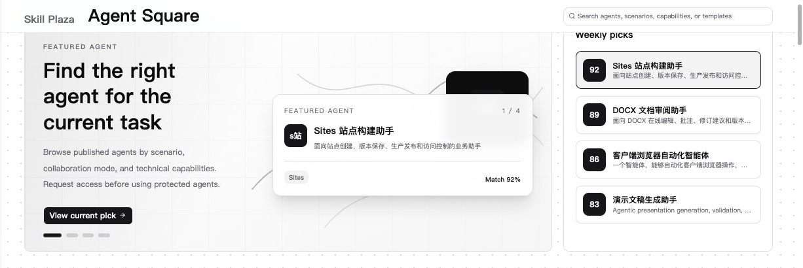
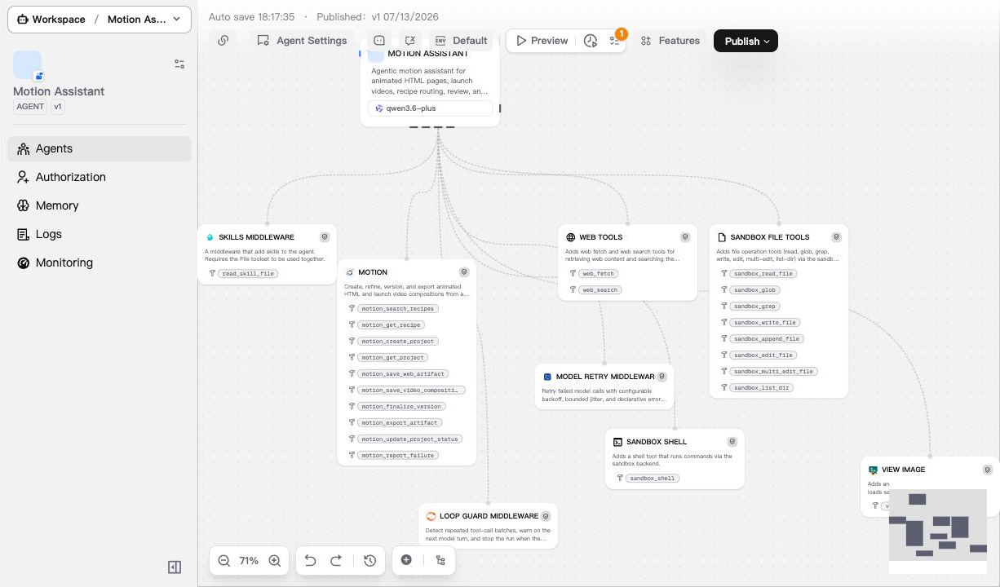

English | [简体中文](./README_zh.md)

<p align="center">
  <a href="https://xpertai.cn/en/">
    
  </a>
</p>

<h1 align="center">Build governed AI systems that can reason, act, and be reviewed</h1>

<p align="center">
  Open-source enterprise Agent platform for multi-agent orchestration, deterministic workflows,<br>
  governed data execution, human-in-the-loop workbenches, and embeddable assistants.
</p>

<p align="center">
  <a href="https://app.xpertai.cn/"><strong>Try XpertAI Cloud</strong></a> ·
  <a href="https://docs.xpertai.cn/en/ai/getting-started/community"><strong>Self-host Xpert</strong></a> ·
  <a href="https://docs.xpertai.cn/en/">Documentation</a> ·
  <a href="https://xpertai.cn/en/">Website</a>
</p>

<p align="center">
  <a href="https://github.com/xpert-ai/xpert">
    
  </a>
  <a href="https://www.npmjs.com/package/@xpert-ai/contracts">
    
  </a>
  <a href="LICENSES.md">
    
  </a>
</p>



Xpert AI gives teams one place to design digital experts, connect enterprise knowledge and tools, expose reviewable workbench experiences, and embed assistants into existing products. Agents can reason freely where it helps, follow deterministic workflows where consistency matters, and pause for human approval before sensitive actions.

| Design and orchestrate                                                                           | Connect and ground                                                                                         | Review and ship                                                                                           |
| ------------------------------------------------------------------------------------------------ | ---------------------------------------------------------------------------------------------------------- | --------------------------------------------------------------------------------------------------------- |
| Build single-agent, supervisor, hierarchical, swarm, and hybrid Agent/Workflow systems visually. | Connect files, knowledge bases, Skills, MCP tools, semantic models, databases, APIs, and business systems. | Deliver Workbench views, approval steps, plugins, Agentic Apps, and ChatKit-powered embedded experiences. |

## See Xpert in action



This is a live Agent Studio configuration for **Motion Assistant**. One agent is connected to Skills, web tools, sandbox capabilities, retry and loop-guard middleware, and operational controls. The same visual model can combine multiple agents with deterministic Workflow nodes when a process needs stricter control.

## Why Xpert

- **Agent and Workflow hybrid architecture** — use agents for flexible reasoning and workflows for stable, inspectable control paths.
- **Governed enterprise execution** — expose data and business actions through typed tools, semantic objects, policies, approvals, and audit trails instead of handing models raw access.
- **Human-reviewable workbenches** — let tool calls open focused UI views where users can inspect, correct, approve, or submit results.
- **An extensible application runtime** — package models, integrations, middleware, Skills, MCP tools, Remote Components, Workbench views, and Assistant templates as plugins.

## Official Apps

Explore Xpert's first-party Agentic Apps in the [official App catalog](https://xpertai.cn/apps/):

- [Presentation Studio](https://xpertai.cn/showcase/presentation-studio/)
- [Sites](https://xpertai.cn/showcase/sites/)
- [DOCX Editor](https://xpertai.cn/showcase/docx-editor/)
- [Canvas](https://xpertai.cn/showcase/canvas/)
- [Pencil](https://xpertai.cn/showcase/pencil/)
- [draw.io](https://xpertai.cn/showcase/drawio/)
- [Excalidraw](https://xpertai.cn/showcase/excalidraw/)
- [Lucidchart](https://xpertai.cn/showcase/lucidchart/)

## Quick Start

The Docker path requires at least **2 CPU cores**, **4 GiB RAM**, Docker, and Docker Compose.

```bash
git clone https://github.com/xpert-ai/xpert.git
cd xpert/docker
cp env.example .env
docker compose up -d
```

Open [http://localhost/](http://localhost/) and complete the initialization flow.

For deployment options, environment configuration, and upgrades, follow the [self-hosting documentation](https://docs.xpertai.cn/en/ai/getting-started/community). For source development, use a supported Node.js LTS release and the repository-pinned pnpm version through Corepack.

## Platform Map

| Area                                 | What it enables                                                                                                                               |
| ------------------------------------ | --------------------------------------------------------------------------------------------------------------------------------------------- |
| **Agent Studio**                     | Visual authoring for digital experts, multi-agent collaboration, Workflow nodes, toolsets, knowledge, Skills, and Agent Middleware.           |
| **File and Knowledge Understanding** | Parsed file assets, chunks, page images, citation anchors, retrieval, GraphRAG-style evidence, and workspace files.                           |
| **Agentic BI and Data Xpert**        | Semantic models, indicators, natural-language analysis, and governed object-semantic tools for enterprise data queries and actions.           |
| **Agentic Apps and Workbench**       | Plugin-delivered business applications with Assistant tools, review views, Remote Components, configuration, and lifecycle hooks.             |
| **MCP, Skills, and Plugins**         | Reusable integrations, model providers, tools, middleware, managed runtimes, and installable capability packages.                             |
| **ChatKit and Embedding**            | Streaming assistants for React, Vue, Angular, SAP UI5, Web Components, and vanilla JavaScript, with files, threads, tools, widgets, and i18n. |
| **Operations**                       | Conversation and task state, tool-call events, usage reporting, logs, metrics, retention controls, and runtime monitoring.                    |

## Architecture

Xpert follows an **Agent-Workflow Hybrid Architecture**. Agents decide how to solve open-ended tasks; workflows make critical paths repeatable and reviewable. Tools, knowledge, data resources, and plugin surfaces remain behind explicit contracts and governance boundaries.


[Read the architecture article](https://xpertai.cn/en/blog/agent-workflow-hybrid-architecture).

## Ecosystem

| Repository                                                   | Purpose                                                                                            |
| ------------------------------------------------------------ | -------------------------------------------------------------------------------------------------- |
| [`xpert-plugins`](https://github.com/xpert-ai/xpert-plugins) | Official and community integrations, model providers, middleware, tools, Skills, and Agentic Apps. |
| [`chatkit-js`](https://github.com/xpert-ai/chatkit-js)       | Embeddable ChatKit packages, widgets, and examples for multiple frontend frameworks.               |
| [`xpert-sdk-js`](https://github.com/xpert-ai/xpert-sdk-js)   | TypeScript SDK packages and examples for calling Xpert APIs.                                       |
| [`xpert-skills`](https://github.com/xpert-ai/xpert-skills)   | Public Skill examples, templates, and the Agent Skills specification.                              |
| [`docs`](https://github.com/xpert-ai/docs)                   | Product, AI, plugin, data, BI, deployment, and tutorial documentation.                             |

## Repository Map

Xpert is an Nx monorepo built with Angular, NestJS, TypeORM, LangChain, and shared TypeScript contracts.

| Path                                               | Purpose                                                                                                |
| -------------------------------------------------- | ------------------------------------------------------------------------------------------------------ |
| `apps/api`                                         | Main NestJS API application and platform bootstrap.                                                    |
| `apps/cloud`                                       | Angular application for Cloud UI, Agent Studio, workspaces, settings, ChatKit, and Workbench surfaces. |
| `packages/server-ai`                               | Agent execution, chat, models, toolsets, MCP, knowledge, handoff, and AI runtime services.             |
| `packages/server`                                  | Core server modules shared across the platform.                                                        |
| `packages/contracts`                               | Shared contracts used by the frontend, backend, SDKs, and plugins.                                     |
| `packages/plugin-sdk`                              | SDK for plugin configuration, permissions, view extensions, and Remote Components.                     |
| `packages/plugins`                                 | Built-in plugins shipped with the host.                                                                |
| `packages/core`, `packages/angular`, `packages/ui` | Core data/analytics libraries and reusable UI packages.                                                |
| `docker`                                           | Docker Compose deployment files and environment templates.                                             |

See the [development Wiki](https://github.com/xpert-ai/xpert/wiki/Development) for local development guidance.

## Current Focus

- Project workspaces for planning, files, teams, and task execution.
- Stronger governance, approval, audit, and role-based access controls.
- Deeper trace and evaluation across Agent runs, workflows, tools, and context usage.
- Monitoring, retention, runtime controls, and production hardening for self-hosted deployments.

## Community

- Report bugs or request features in [GitHub Issues](https://github.com/xpert-ai/xpert/issues).
- Read the [contributing guide](.github/CONTRIBUTING.md) before opening a pull request. Contributions should target the `develop` branch.
- Business inquiries: [service@xpertai.cn](mailto:service@xpertai.cn)

<a href="https://github.com/xpert-ai/xpert/graphs/contributors">
  
</a>

If Xpert is useful to you, please consider giving the repository a star.

## License

The Xpert AI Platform Community Edition is licensed under the [GNU Affero General Public License v3.0](LICENSES.md#xpert-ai-platform-community-edition-license). Small Business and Enterprise commercial licenses are also available. See [LICENSES.md](LICENSES.md) for the complete terms.
