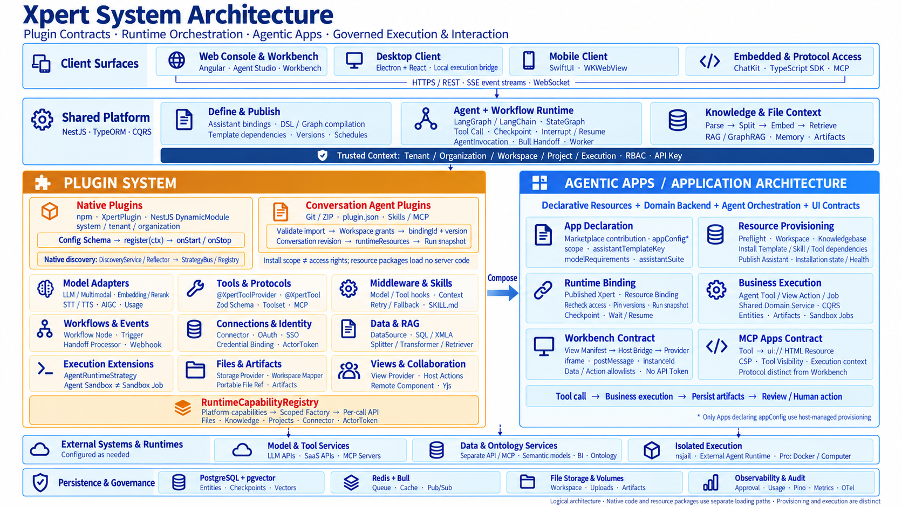

English | [简体中文](./README_zh.md)

<p align="center">
  <a href="https://xpertai.cn/en/">
    
  </a>
</p>

<h1 align="center">Xpert Platform &amp; Xpert Bosi</h1>

<p align="center">
  Xpert is the open-source platform for building and governing AI teams.<br>
  Xpert Bosi is its desktop app — your AI team leader.
</p>

<p align="center">
  <a href="apps/desktop/README.md"><strong>Get Started with Bosi</strong></a> ·
  <a href="https://app.xpertai.cn/plugins/marketplace"><strong>Explore the Marketplace</strong></a> ·
  <a href="https://docs.xpertai.cn/en/ai/getting-started/community"><strong>Self-host Xpert</strong></a> ·
  <a href="https://docs.xpertai.cn/en/">Documentation</a>
</p>

<p align="center">
  <a href="https://github.com/xpert-ai/xpert">
    
  </a>
  <a href="https://www.npmjs.com/package/@xpert-ai/contracts">
    
  </a>
  <a href="LICENSES.md">
    
  </a>
</p>

## Xpert Bosi — your AI team leader

**You set the goal. Bosi leads the team.**

**Bosi** brings Xpert's digital experts, plugins, and applications together on your desktop. Sign in with your Xpert account and work within your organization's permissions.

- **Assemble your team:** discover experts, request access, or create Assistants from templates and apps.
- **Work in one place:** combine conversations, files, and app Workbench views; add workspace plugins and select them for each conversation.
- **Put plans into action:** use configured Assistants to operate a cloud computer or run local Shell commands on macOS, with per-command approval by default.

Bosi connects to hosted or self-hosted Xpert. The platform runs the Agents and manages shared resources; Bosi provides the desktop experience and authorized local execution. See the [Desktop guide](apps/desktop/README.md) for setup and builds.

## Xpert Platform — everything is a plugin

Build and publish the AI teams used in Bosi, Xpert Web, or your own product. Xpert provides the runtime, permissions, approvals, and audit trails; plugins deliver capabilities from model providers and tools to complete Agentic Apps.

- **One plugin lifecycle:** install, configure, and evolve models, integrations, Skills, middleware, MCP Apps, and business applications.
- **Agent + Workflow:** combine flexible reasoning with deterministic, inspectable business processes.
- **Governed execution:** expose data and actions through typed tools, semantic objects, policies, and approvals.
- **Reviewable work:** inspect, correct, approve, and submit results in dedicated Workbench views.

## Official Apps

Discover applications for your AI team in the [official App catalog](https://xpertai.cn/apps/):

- [Presentation Studio](https://xpertai.cn/showcase/presentation-studio/)
- [Sites](https://xpertai.cn/showcase/sites/)
- [DOCX Editor](https://xpertai.cn/showcase/docx-editor/)
- [Canvas](https://xpertai.cn/showcase/canvas/)
- [Pencil](https://xpertai.cn/showcase/pencil/)
- [draw.io](https://xpertai.cn/showcase/drawio/)
- [Excalidraw](https://xpertai.cn/showcase/excalidraw/)
- [Lucidchart](https://xpertai.cn/showcase/lucidchart/)

## Quick Start

**Use Bosi:** follow the [Desktop guide](apps/desktop/README.md), sign in, choose an organization, and open **Discover & add** to find experts, apps, plugins, and templates. Self-hosted users can change the server in Connection settings.

**Host Xpert:** requires **2 CPU cores**, **4 GiB RAM**, Docker, and Docker Compose.

```bash
git clone https://github.com/xpert-ai/xpert.git
cd xpert/docker
cp env.example .env
docker compose up -d
```

Open [http://localhost/](http://localhost/) and complete initialization before connecting Bosi.

See [deployment and upgrades](https://docs.xpertai.cn/en/ai/getting-started/community). Source development requires a supported Node.js LTS and the repository-pinned pnpm via Corepack.

## Platform Map

| Area                           | What it enables                                                                                     |
| ------------------------------ | --------------------------------------------------------------------------------------------------- |
| **Agent Studio**               | Author digital experts, multi-agent workflows, tools, knowledge, and middleware.                    |
| **Files and Knowledge**        | Parse files, retrieve evidence with RAG and GraphRAG, and cite sources.                             |
| **Agentic BI and Data Xpert**  | Query and act on enterprise data through semantic models and governed tools.                        |
| **Agentic Apps and Workbench** | Deliver business applications with Assistant tools and interactive review views.                    |
| **MCP, Skills, and Plugins**   | Extend models, integrations, tools, middleware, and managed runtimes.                               |
| **ChatKit and Embedding**      | Embed streaming chat, files, tools, and widgets in React, Vue, Angular, SAP UI5, or Web Components. |
| **Operations**                 | Track tasks, tool calls, usage, logs, metrics, and retention.                                       |

## Architecture

Xpert is a **plugin-first, modular NestJS platform**. A shared **Agent + Workflow runtime** powers AI teams, while **Agentic Apps** combine domain tools, Assistant templates, business services, and interactive Workbench views into complete applications.

[](docs/images/readme/xpert-architecture-technical-en.png)

- **Plugin system:** native npm plugins register NestJS modules, providers, configuration, and lifecycle hooks. Extension points cover models, tools/MCP, middleware, Skills/templates, workflows, integrations, connectors, data/RAG, execution, storage, views, and collaboration.
- **Conversation resources:** standard Agent Plugin packages supply Skills/MCP resources via Git/ZIP import. Workspace grants, versioned bindings, and per-run resource snapshots control their use; they do not load server code.
- **Agentic Apps:** Marketplace contributions connect tools, templates, business services, and review views. Apps declaring `appConfig` use host-managed preflight, dedicated workspaces, knowledgebases, published Assistants or role suites, and installation health tracking.
- **Shared runtime & UI contracts:** LangGraph / LangChain, CQRS, Bull handoff, checkpoints, and interrupt/resume underpin execution. Workbench uses View Manifests, View Providers, and an iframe bridge; MCP Apps use tool-linked UI resources.
- **Governed infrastructure:** scoped identities, approvals, audit, and usage span API, workers, and plugins. PostgreSQL + pgvector, Redis, and storage providers persist state. Data Xpert is a separate API/MCP-connected service; Pro execution providers are marked explicitly.

Open the diagram for full resolution. [Architecture analysis and extension-point catalog](docs/architecture/README.md) · [Agent–Workflow architecture article](https://xpertai.cn/en/blog/agent-workflow-hybrid-architecture)

## Ecosystem

| Repository                                                   | Purpose                                                                                            |
| ------------------------------------------------------------ | -------------------------------------------------------------------------------------------------- |
| [`xpert-plugins`](https://github.com/xpert-ai/xpert-plugins) | Official and community integrations, model providers, middleware, tools, Skills, and Agentic Apps. |
| [`chatkit-js`](https://github.com/xpert-ai/chatkit-js)       | Embeddable ChatKit packages, widgets, and examples for multiple frontend frameworks.               |
| [`xpert-sdk-js`](https://github.com/xpert-ai/xpert-sdk-js)   | TypeScript SDK packages and examples for calling Xpert APIs.                                       |
| [`xpert-skills`](https://github.com/xpert-ai/xpert-skills)   | Agent Skills for setting up Xpert and developing plugins, Agentic Apps, Assistants, and pipelines. |
| [`docs`](https://github.com/xpert-ai/docs)                   | Product, AI, plugin, data, BI, deployment, and tutorial documentation.                             |

## Local Development with Agent Skills

Install these [`xpert-skills`](https://github.com/xpert-ai/xpert-skills) for Codex to set up Xpert and build apps. Remove `--global` for a project-only installation; replace `codex` for another supported agent.

```bash
npx skills add xpert-ai/xpert-skills \
  --skill xpert-platform-local-environment \
  --agent codex \
  --global

npx skills add xpert-ai/xpert-skills \
  --skill xpert-agentic-app-developer \
  --agent codex \
  --global

npx skills add xpert-ai/xpert-skills \
  --skill xpert-plugin-development \
  --agent codex \
  --global
```

Start a new agent session, then ask:

1. **Set up and verify Xpert**

   > Use `$xpert-platform-local-environment` to set up Xpert at `<path>` in source-hybrid mode and verify it is ready for plugin testing.

2. **Build the Agentic App**

   > Use `$xpert-agentic-app-developer` to build, deploy, and verify `<app description>` as an independent plugin on that instance.

The environment skill runs Docker infrastructure with the API and Web UI from source. The app skill covers tools, views, templates, and acceptance; `xpert-plugin-development` handles packaging and deployment.

## ROADMAP

- Project workspaces for planning, files, teams, and task execution.
- Stronger governance, approval, audit, and role-based access controls.
- Deeper trace and evaluation across Agent runs, workflows, tools, and context usage.
- Monitoring, retention, runtime controls, and production hardening for self-hosted deployments.

## Community

- Report bugs or request features in [GitHub Issues](https://github.com/xpert-ai/xpert/issues).
- Read the [contributing guide](.github/CONTRIBUTING.md) before opening a pull request. Contributions should target the `develop` branch.
- Business inquiries: [service@xpertai.cn](mailto:service@xpertai.cn)

<a href="https://github.com/xpert-ai/xpert/graphs/contributors">
  
</a>

If Xpert is useful to you, please consider giving the repository a star.

## License

The Xpert AI Platform Community Edition is licensed under the [GNU Affero General Public License v3.0](LICENSES.md#xpert-ai-platform-community-edition-license). Small Business and Enterprise commercial licenses are also available. See [LICENSES.md](LICENSES.md) for the complete terms.
