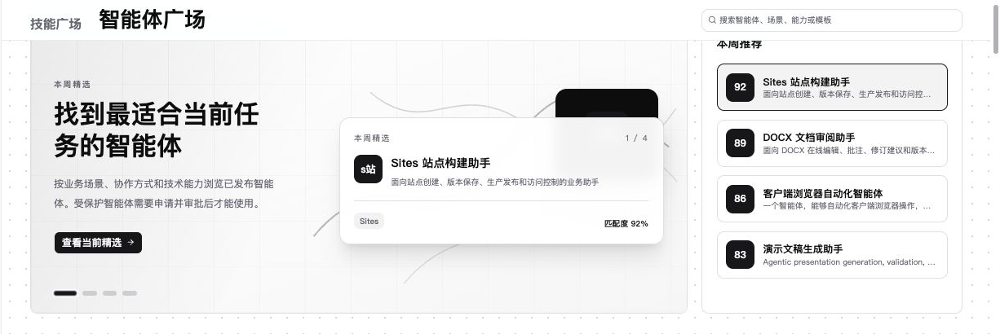
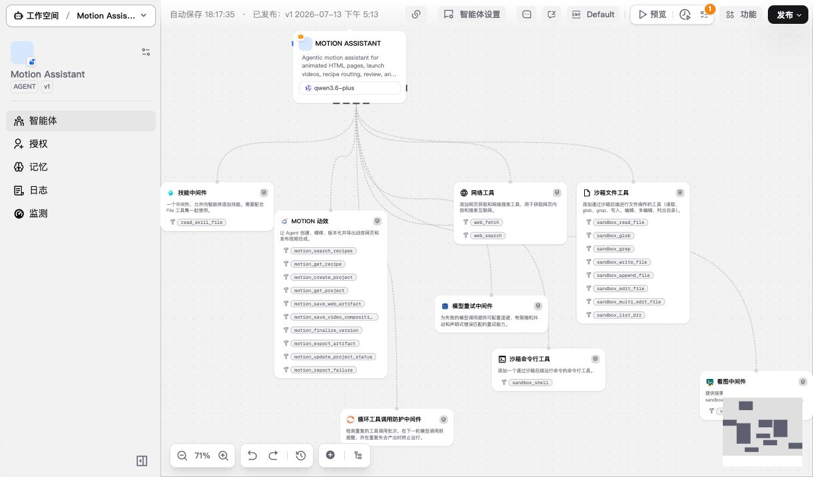

[English](./README.md) | 简体中文

<p align="center">
  <a href="https://xpertai.cn/">
    
  </a>
</p>

<h1 align="center">构建能推理、能执行、可复核的企业级 AI 系统</h1>

<p align="center">
  面向企业的开源智能体平台，覆盖多智能体编排、确定性工作流、<br>
  可治理数据执行、人在回路工作台，以及可嵌入式智能助手。
</p>

<p align="center">
  <a href="https://app.xpertai.cn/"><strong>体验 XpertAI 云服务</strong></a> ·
  <a href="https://docs.xpertai.cn/zh-Hans/ai/getting-started/community"><strong>自托管 Xpert</strong></a> ·
  <a href="https://docs.xpertai.cn/zh-Hans/">文档</a> ·
  <a href="https://xpertai.cn/">官网</a>
</p>

<p align="center">
  <a href="https://github.com/xpert-ai/xpert">
    
  </a>
  <a href="https://www.npmjs.com/package/@xpert-ai/contracts">
    
  </a>
  <a href="LICENSES.md">
    
  </a>
</p>



Xpert AI 让团队可以在同一平台中设计数字专家、连接企业知识与工具、提供可复核的工作台，并把智能助手嵌入现有产品。Agent 可以在适合的场景中自由推理，在强调一致性的环节遵循确定性工作流，并在敏感操作前暂停等待人工审批。

| 设计与编排                                                                      | 连接与知识增强                                                         | 复核与交付                                                                      |
| ------------------------------------------------------------------------------- | ---------------------------------------------------------------------- | ------------------------------------------------------------------------------- |
| 可视化构建单 Agent、Supervisor、层级型、Swarm，以及 Agent / Workflow 混合系统。 | 连接文件、知识库、Skills、MCP 工具、语义模型、数据库、API 和业务系统。 | 交付 Workbench 视图、审批步骤、插件、Agentic Apps 和基于 ChatKit 的嵌入式体验。 |

## 产品实景



上图是 **Motion Assistant** 在 Agent Studio 中的真实配置。一个 Agent 同时连接了 Skills、网络工具、沙箱能力、模型重试与循环防护中间件，以及运行控制。对于需要更严格流程控制的业务，同一套可视化模型也可以组合多个 Agent 和确定性 Workflow 节点。

## 为什么选择 Xpert

- **Agent 与 Workflow 混合架构**：用 Agent 处理灵活推理，用 Workflow 提供稳定、可检查的控制路径。
- **可治理的企业执行**：通过类型化工具、语义对象、策略、审批和审计轨迹开放数据与业务动作，而不是把裸权限交给模型。
- **可人工复核的工作台**：工具调用可以打开聚焦的 UI 视图，让用户检查、修正、审批或提交结果。
- **可扩展的应用运行时**：把模型、集成、中间件、Skills、MCP 工具、Remote Component、Workbench 视图和 Assistant 模板封装为插件。

## 官方应用

在[官方 App 目录](https://xpertai.cn/zh-CN/apps/)中探索 Xpert 的官方 Agentic Apps：

- [Presentation Studio](https://xpertai.cn/showcase/presentation-studio/)
- [Sites](https://xpertai.cn/showcase/sites/)
- [DOCX Editor](https://xpertai.cn/showcase/docx-editor/)
- [Canvas](https://xpertai.cn/showcase/canvas/)
- [Pencil](https://xpertai.cn/showcase/pencil/)
- [draw.io](https://xpertai.cn/showcase/drawio/)
- [Excalidraw](https://xpertai.cn/showcase/excalidraw/)
- [Lucidchart](https://xpertai.cn/showcase/lucidchart/)

## 快速开始

Docker 部署至少需要 **2 核 CPU**、**4 GiB 内存**，并安装 Docker 与 Docker Compose。

```bash
git clone https://github.com/xpert-ai/xpert.git
cd xpert/docker
cp env.example .env
docker compose up -d
```

打开 [http://localhost/](http://localhost/)，完成初始化流程。

部署方式、环境配置和升级说明请参阅[自托管文档](https://docs.xpertai.cn/zh-Hans/ai/getting-started/community)。如果从源码开发，请使用受支持的 Node.js LTS 版本，并通过 Corepack 使用仓库锁定的 pnpm 版本。

## 平台能力图谱

| 领域                          | 能够实现什么                                                                                                           |
| ----------------------------- | ---------------------------------------------------------------------------------------------------------------------- |
| **Agent Studio**              | 可视化编写数字专家、多智能体协作、Workflow 节点、工具集、知识、Skills 和 Agent Middleware。                            |
| **文件与知识理解**            | 解析 FileAsset、chunks、page images、citation anchors、检索、GraphRAG 风格证据和 workspace files。                     |
| **Agentic BI 与 Data Xpert**  | 提供语义模型、业务指标、自然语言分析，以及面向企业数据查询和动作的可治理对象语义工具。                                 |
| **Agentic Apps 与 Workbench** | 用插件交付业务应用，包含 Assistant 工具、复核视图、Remote Component、配置和生命周期。                                  |
| **MCP、Skills 与插件**        | 提供可复用集成、模型供应商、工具、中间件、受管运行时和可安装能力包。                                                   |
| **ChatKit 与嵌入式体验**      | 面向 React、Vue、Angular、SAP UI5、Web Component 和原生 JavaScript 的流式助手，支持文件、线程、工具、widgets 和 i18n。 |
| **运行与观测**                | 管理会话和任务状态、工具调用事件、使用统计、日志、指标、保留策略和运行监测。                                           |

## 架构

Xpert 采用**智能体与工作流混合架构**。Agent 决定如何处理开放式任务，Workflow 让关键路径具备可重复和可复核能力。工具、知识、数据资源与插件界面始终位于明确契约和治理边界之后。


[阅读架构文章](https://xpertai.cn/blog/agent-workflow-hybrid-architecture)。

## 生态

| 仓库                                                         | 用途                                                               |
| ------------------------------------------------------------ | ------------------------------------------------------------------ |
| [`xpert-plugins`](https://github.com/xpert-ai/xpert-plugins) | 官方与社区集成、模型供应商、中间件、工具、Skills 和 Agentic Apps。 |
| [`chatkit-js`](https://github.com/xpert-ai/chatkit-js)       | 面向多种前端框架的 ChatKit 嵌入包、widgets 和示例。                |
| [`xpert-sdk-js`](https://github.com/xpert-ai/xpert-sdk-js)   | 用于调用 Xpert API 的 TypeScript SDK 包和示例。                    |
| [`xpert-skills`](https://github.com/xpert-ai/xpert-skills)   | 公共 Skill 示例、模板和 Agent Skills 规范。                        |
| [`docs`](https://github.com/xpert-ai/docs)                   | 产品、AI、插件、数据、BI、部署和教程文档。                         |

## 仓库导览

Xpert 是一个使用 Angular、NestJS、TypeORM、LangChain 和共享 TypeScript 契约构建的 Nx monorepo。

| 路径                                               | 用途                                                                                   |
| -------------------------------------------------- | -------------------------------------------------------------------------------------- |
| `apps/api`                                         | 主 NestJS API 应用和平台启动入口。                                                     |
| `apps/cloud`                                       | Angular 应用，包含 Cloud UI、Agent Studio、工作空间、设置、ChatKit 和 Workbench 界面。 |
| `packages/server-ai`                               | Agent 执行、聊天、模型、工具集、MCP、知识、handoff 和 AI runtime 服务。                |
| `packages/server`                                  | 平台共享的核心服务端模块。                                                             |
| `packages/contracts`                               | 前端、后端、SDK 和插件共享的契约。                                                     |
| `packages/plugin-sdk`                              | 面向插件配置、权限、视图扩展和 Remote Component 的 SDK。                               |
| `packages/plugins`                                 | 随宿主交付的内置插件。                                                                 |
| `packages/core`, `packages/angular`, `packages/ui` | 核心数据/分析库和可复用 UI 包。                                                        |
| `docker`                                           | Docker Compose 部署文件和环境变量模板。                                                |

本地开发说明请查看[开发 Wiki](https://github.com/xpert-ai/xpert/wiki/Development)。

## 当前重点

- 面向规划、文件、团队和任务执行的项目工作空间。
- 更完整的治理、审批、审计和基于角色的访问控制。
- 覆盖 Agent 运行、Workflow、工具和上下文使用量的 Trace 与 Evaluation。
- 面向自托管部署的监控、保留策略、运行控制和生产加固。

## 社区

- 通过 [GitHub Issues](https://github.com/xpert-ai/xpert/issues) 报告问题或提出功能需求。
- 提交 Pull Request 前请阅读[贡献指南](.github/CONTRIBUTING.md)，贡献应基于 `develop` 分支。
- 商务合作：[service@xpertai.cn](mailto:service@xpertai.cn)
- 微信：`xpertai`

<a href="https://github.com/xpert-ai/xpert/graphs/contributors">
  
</a>

如果 Xpert 对你有帮助，欢迎给仓库点一个 Star。

## 许可证

Xpert AI 平台社区版采用 [GNU Affero General Public License v3.0](LICENSES.md#xpert-ai-platform-community-edition-license)。同时提供小型企业版和企业版商业许可，完整条款请参阅 [LICENSES.md](LICENSES.md)。
