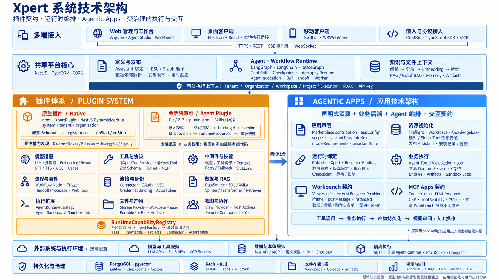

[English](./README.md) | 简体中文

<p align="center">
  <a href="https://xpertai.cn/">
    
  </a>
</p>

<h1 align="center">Xpert 平台与 Xpert Bosi</h1>

<p align="center">
  Xpert 是构建与治理 AI 团队的开源智能体平台。<br>
  Xpert Bosi 是它的桌面应用，也是你的 AI 小队长。
</p>

<p align="center">
  <a href="apps/desktop/README.md"><strong>开始使用 Bosi</strong></a> ·
  <a href="https://app.xpertai.cn/plugins/marketplace"><strong>探索市场</strong></a> ·
  <a href="https://docs.xpertai.cn/zh-Hans/ai/getting-started/community"><strong>自托管 Xpert</strong></a> ·
  <a href="https://docs.xpertai.cn/zh-Hans/">文档</a>
</p>

<p align="center">
  <a href="https://github.com/xpert-ai/xpert">
    
  </a>
  <a href="https://www.npmjs.com/package/@xpert-ai/contracts">
    
  </a>
  <a href="LICENSES.md">
    
  </a>
</p>

## Xpert Bosi：你的 AI 小队长

**你定目标，Bosi 带队。**

**Bosi** 将 Xpert 的数字专家、插件与应用带到桌面。使用 Xpert 账号登录，按组织权限调用团队能力。

- **组建 AI 小队**：发现数字专家、申请使用权限，或从模板与应用创建助手。
- **在一处完成工作**：集中呈现对话、文件与应用工作台；为工作空间添加插件，在会话中选择使用。
- **让计划变成行动**：通过已配置的专家操作云电脑，或在 macOS 运行本机 Shell 命令，默认逐条审批。

Bosi 可连接官方服务或自托管 Xpert。平台负责运行智能体、管理共享资源，Bosi 提供桌面交互与经授权的本机执行。配置与构建见[桌面应用指南](apps/desktop/README.md)。

## Xpert 平台：一切皆插件

构建并发布 AI 团队，供 Bosi、Xpert Web 或自有产品使用。Xpert 提供运行时、权限、审批与审计；插件交付从模型、工具到完整 Agentic App 的能力。

- **统一插件生命周期**：安装、配置和演进模型、集成、Skills、中间件、MCP Apps 与业务应用。
- **Agent + Workflow**：将灵活推理与确定、可检查的业务流程组合。
- **可治理的执行**：通过类型化工具、语义对象、策略与审批开放数据和业务动作。
- **可复核的工作台**：在专属视图中检查、修正、审批和提交结果。

## 官方应用

在[官方 App 目录](https://xpertai.cn/zh-CN/apps/)中为 AI 团队发现应用：

- [Presentation Studio](https://xpertai.cn/showcase/presentation-studio/)
- [Sites](https://xpertai.cn/showcase/sites/)
- [DOCX Editor](https://xpertai.cn/showcase/docx-editor/)
- [Canvas](https://xpertai.cn/showcase/canvas/)
- [Pencil](https://xpertai.cn/showcase/pencil/)
- [draw.io](https://xpertai.cn/showcase/drawio/)
- [Excalidraw](https://xpertai.cn/showcase/excalidraw/)
- [Lucidchart](https://xpertai.cn/showcase/lucidchart/)

## 快速开始

**使用 Bosi**：按[桌面应用指南](apps/desktop/README.md)启动，登录并选择组织，通过「发现与添加」使用专家、应用、插件与模板。自托管用户可在连接设置中更换服务地址。

**部署 Xpert**：至少需要 **2 核 CPU**、**4 GiB 内存**、Docker 与 Docker Compose。

```bash
git clone https://github.com/xpert-ai/xpert.git
cd xpert/docker
cp env.example .env
docker compose up -d
```

打开 [http://localhost/](http://localhost/)，完成初始化后即可连接 Bosi。

部署与升级见[自托管文档](https://docs.xpertai.cn/zh-Hans/ai/getting-started/community)。源码开发需使用受支持的 Node.js LTS 和 Corepack 管理的仓库锁定 pnpm。

## 平台能力图谱

| 领域                          | 能够实现什么                                                                             |
| ----------------------------- | ---------------------------------------------------------------------------------------- |
| **Agent Studio**              | 编写数字专家、多智能体工作流、工具、知识与中间件。                                       |
| **文件与知识理解**            | 解析文件，通过 RAG、GraphRAG 检索证据并引用来源。                                        |
| **Agentic BI 与 Data Xpert**  | 通过语义模型与受治理工具查询企业数据、执行业务动作。                                     |
| **Agentic Apps 与 Workbench** | 交付包含 Assistant 工具与交互复核视图的业务应用。                                        |
| **MCP、Skills 与插件**        | 扩展模型、集成、工具、中间件与受管运行时。                                               |
| **ChatKit 与嵌入式体验**      | 在 React、Vue、Angular、SAP UI5 或 Web Components 中嵌入流式对话、文件、工具与 widgets。 |
| **运行与观测**                | 跟踪任务、工具调用、用量、日志、指标与保留策略。                                         |

## 架构

Xpert 是**以插件为核心的 NestJS 模块化平台**。统一的 **Agent + Workflow 运行时**承载 AI 团队，**Agentic Apps** 将领域工具、Assistant 模板、业务服务与交互式 Workbench 组合成完整应用。

[](docs/images/readme/xpert-architecture-technical-zh.png)

- **插件体系：** 原生 npm 插件注册 NestJS 模块、Provider、配置与生命周期钩子，覆盖模型、工具/MCP、中间件、Skills/模板、工作流、集成、连接器、数据/RAG、执行、存储、视图与协作。
- **会话资源：** 标准 Agent Plugin 通过 Git/ZIP 导入 Skills/MCP 等资源，使用工作空间授权、版本化绑定与单次执行快照控制访问，不加载服务器代码。
- **Agentic Apps：** 市场声明关联工具、模板、业务服务与审阅界面。声明 `appConfig` 的应用由宿主完成预检、专用工作空间与知识库准备、Assistant/多角色套件发布，以及安装健康状态跟踪。
- **统一运行与交互契约：** LangGraph / LangChain、CQRS、Bull Handoff、检查点与中断恢复支撑执行；Workbench 通过 View Manifest、View Provider 与 iframe 桥接交互，MCP Apps 使用工具关联的 UI 资源。
- **治理与基础设施：** 作用域身份、审批、审计和用量贯穿 API、Worker 与插件。PostgreSQL + pgvector、Redis 和存储 Provider 持久化状态；Data Xpert 是通过 API/MCP 接入的独立服务，Pro 执行能力单独标记。

点击图片可查看原尺寸。[架构分析与完整扩展点目录](docs/architecture/README.md) · [智能体与工作流架构文章](https://xpertai.cn/blog/agent-workflow-hybrid-architecture)

## 生态

| 仓库                                                         | 用途                                                                          |
| ------------------------------------------------------------ | ----------------------------------------------------------------------------- |
| [`xpert-plugins`](https://github.com/xpert-ai/xpert-plugins) | 官方与社区集成、模型供应商、中间件、工具、Skills 和 Agentic Apps。            |
| [`chatkit-js`](https://github.com/xpert-ai/chatkit-js)       | 面向多种前端框架的 ChatKit 嵌入包、widgets 和示例。                           |
| [`xpert-sdk-js`](https://github.com/xpert-ai/xpert-sdk-js)   | 用于调用 Xpert API 的 TypeScript SDK 包和示例。                               |
| [`xpert-skills`](https://github.com/xpert-ai/xpert-skills)   | 用于搭建 Xpert 及开发插件、Agentic Apps、Assistants 和流水线的 Agent Skills。 |
| [`docs`](https://github.com/xpert-ai/docs)                   | 产品、AI、插件、数据、BI、部署和教程文档。                                    |

## 使用 Agent Skills 进行本地开发

为 Codex 安装这些 [`xpert-skills`](https://github.com/xpert-ai/xpert-skills)，以搭建平台和开发应用。移除 `--global` 可仅安装到当前项目；`codex` 可替换为其他受支持的智能体。

```bash
npx skills add xpert-ai/xpert-skills \
  --skill xpert-platform-local-environment \
  --agent codex \
  --global

npx skills add xpert-ai/xpert-skills \
  --skill xpert-agentic-app-developer \
  --agent codex \
  --global

npx skills add xpert-ai/xpert-skills \
  --skill xpert-plugin-development \
  --agent codex \
  --global
```

新建智能体会话，依次执行：

1. **搭建并验证 Xpert**

   > 使用 `$xpert-platform-local-environment`，在 `<path>` 以 source-hybrid 模式搭建 Xpert，验证环境可用于插件测试。

2. **开发 Agentic App**

   > 使用 `$xpert-agentic-app-developer`，在该实例上将 `<应用描述>` 开发、部署并验收为独立插件。

环境技能使用 Docker 基础设施和源码 API、Web UI；应用技能覆盖工具、视图、模板与验收，`xpert-plugin-development` 负责打包部署。

## ROADMAP

- 面向规划、文件、团队和任务执行的项目工作空间。
- 更完整的治理、审批、审计和基于角色的访问控制。
- 覆盖 Agent 运行、Workflow、工具和上下文使用量的 Trace 与 Evaluation。
- 面向自托管部署的监控、保留策略、运行控制和生产加固。

## 社区

- 通过 [GitHub Issues](https://github.com/xpert-ai/xpert/issues) 报告问题或提出功能需求。
- 提交 Pull Request 前请阅读[贡献指南](.github/CONTRIBUTING.md)，贡献应基于 `develop` 分支。
- 商务合作：[service@xpertai.cn](mailto:service@xpertai.cn)
- 微信：`xpertai`

<a href="https://github.com/xpert-ai/xpert/graphs/contributors">
  
</a>

如果 Xpert 对你有帮助，欢迎给仓库点一个 Star。

## 许可证

Xpert AI 平台社区版采用 [GNU Affero General Public License v3.0](LICENSES.md#xpert-ai-platform-community-edition-license)。同时提供小型企业版和企业版商业许可，完整条款请参阅 [LICENSES.md](LICENSES.md)。
