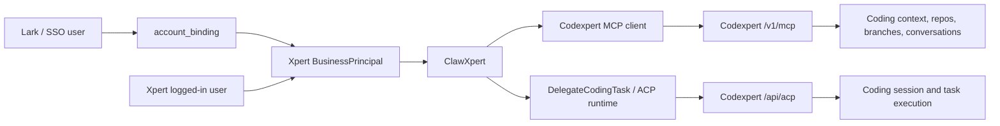

# Xpert to Codexpert Remote ACP Practice

This document summarizes the current engineering practice for calling Codexpert from Xpert through ClawXpert.

The target chain is:

```text
Third-party user -> account binding -> Xpert business principal -> Codexpert MCP/ACP
```

For the Lark path, the intended concrete chain is:

```text
Lark union_id -> account_binding -> Xpert user -> BusinessPrincipal -> Codexpert headers
```

## Scope

This practice covers:

- ClawXpert running inside Xpert.
- Codexpert context tools exposed through MCP.
- Codexpert coding task execution exposed through remote ACP.
- A hard identity boundary using `tenantId`, `organizationId`, and `userId`.

This does not try to make a generic ACP platform, a generic MCP identity framework, or a generic third-party identity broker.

## Architecture



## Code Map

Xpert host:

- `packages/server-ai/src/shared/identity/business-principal.ts`
  - Builds one complete `BusinessPrincipal`.
  - Uses either API principal fields as a complete source or ordinary request context as a complete source.
  - Does not mix `requestedUserId` with fallback `currentUserId`.
- `packages/server-ai/src/codexpert/codexpert-identity-headers.ts`
  - Maps `BusinessPrincipal` to Codexpert headers.
  - Does not read RequestContext, Lark payloads, or ACP sessions.
- `packages/server-ai/src/xpert-toolset/provider/mcp/types.ts`
  - Creates the MCP client.
  - Injects Codexpert identity only for server name `codexpert-context`.
  - Keeps `Authorization` from schema/env.
- `packages/server-ai/src/xpert-toolset/commands/handlers/get-tools.handler.ts`
  - Resolves `BusinessPrincipal` when a requested toolset includes `codexpert-context`.
- `packages/server-ai/src/xpert-tool/commands/handlers/tool-invoke.handler.ts`
  - Resolves `BusinessPrincipal` for direct MCP tool invocation.
- `packages/server-ai/src/codexpert/codexpert-context-mcp.middleware.ts`
  - Exposes Codexpert MCP tools as agent middleware.
  - Reads MCP URL and service token from options/env.
- `packages/server-ai/src/acp-runtime/delegate-coding-task.middleware.ts`
  - Exposes the `delegate_coding_task` tool.
  - Creates delegated ACP sessions and streams progress back to chat.
- `packages/server-ai/src/acp-runtime/acp-runtime.service.ts`
  - Resolves the current `BusinessPrincipal` once when creating a delegated session.
  - Stores it on `session.metadata.businessPrincipal`.
- `packages/server-ai/src/acp-runtime/backends/remote-xpert-acp.backend.ts`
  - Sends remote ACP requests to Codexpert.
  - Builds identity headers only from `session.metadata.businessPrincipal`.
- `packages/contracts/src/ai/acp-session.model.ts`
  - Defines the stable ACP session metadata field `businessPrincipal`.

Codexpert API:

- `apps/api/src/features/acp/acp.controller.ts`
  - Exposes remote ACP endpoints.
- `apps/api/src/features/acp/acp.service.ts`
  - Resolves caller identity from `tenant-id`, `organization-id`, and `x-principal-user-id`.
  - Turns ACP prompts into Codexpert coding tasks and streams events.
- `apps/api/src/features/mcp/mcp.controller.ts`
  - Exposes MCP streamable HTTP and legacy SSE endpoints.
- `apps/api/src/features/mcp/mcp-coding-context.service.ts`
  - Requires the same three identity headers for coding context tools.
- `apps/api/src/lib/principal-context.ts`
  - Normalizes requested and effective principal context.

Lark plugin:

- `xpertai/integrations/lark/src/lib/lark-inbound-identity.service.ts`
  - Resolves `union_id` through `account_binding`.
- `xpertai/integrations/lark/src/lib/workflow/lark-trigger.strategy.ts`
  - The Codexpert/Claw path should not fall back to integration creator when mapped-user execution is required.

## Identity Rules

The integration uses a hard business identity:

```ts
type BusinessPrincipal = {
  tenantId: string
  organizationId: string
  userId: string
}
```

Allowed sources:

- API principal source:
  - `requestedUserId`
  - `requestedOrganizationId`
  - `currentTenantId`
- Ordinary request context source:
  - `currentUserId`
  - `currentTenantId`
  - `getOrganizationId`

The resolver must use one complete source. It should not assemble a principal by mixing an API requested user with fallback request-context organization or user fields.

Codexpert receives:

```http
tenant-id: <tenantId>
organization-id: <organizationId>
x-principal-user-id: <userId>
Authorization: Bearer <service-token>
```

## MCP Flow

1. ClawXpert asks for Codexpert context.
2. `ToolsetGetToolsHandler` or `ToolInvokeHandler` detects `codexpert-context`.
3. Xpert resolves `BusinessPrincipal`.
4. `MCPToolset` passes the principal into `createMCPClient`.
5. `createMCPClient` renders configured headers, then overwrites the three business identity headers for `codexpert-context`.
6. Codexpert MCP validates headers and serves context tools.

Important invariant:

- MCP schema may own connection auth such as `Authorization`.
- MCP schema must not own business identity headers.

## ACP Flow

1. ClawXpert calls `delegate_coding_task`.
2. `DelegateCodingTaskMiddleware` validates sandbox, execution, conversation, and target policy.
3. `AcpRuntimeService.ensureDelegatedSession()` resolves `BusinessPrincipal` once.
4. The principal is written to `session.metadata.businessPrincipal`.
5. `RemoteXpertAcpBackend` reads only that field to build Codexpert headers.
6. Codexpert creates or loads a coding session.
7. Xpert starts a prompt stream through `AcpSessionBridgeService`.
8. ACP events and visible text stream back into the ClawXpert conversation.
9. Missing terminal stream events are treated as errors instead of success.

Important invariant:

- Remote Codexpert ACP failures should not fall back to local CLI.
- Missing `businessPrincipal` should fail before any outbound Codexpert request.

## Why ACP and MCP Both Need the Same Principal

MCP decides what the user can see and select:

- coding assistants,
- Git connections,
- repositories,
- branches,
- existing Codexpert conversations,
- resumable context.

ACP performs the actual code-changing task. If MCP and ACP use different users, ClawXpert may select context under one user but execute code under another. That is why both paths must consume the same `BusinessPrincipal`.

## Failure Boundaries

Hard failures are preferred over invisible fallbacks:

- No account binding for a Lark user in a Codexpert execution path.
- Missing tenant, organization, or user.
- `codexpert-context` MCP without a principal.
- ACP session without `metadata.businessPrincipal`.
- Codexpert stream closes without a terminal `done` or `error` event.
- Remote Codexpert target fails authentication or endpoint resolution.

The system should report these failures near the source rather than turning them into a local CLI execution, creator fallback, or apparent success.

## Local Verification Checklist

Use this checklist when validating a local chain:

1. Codexpert API is running.
2. Xpert API is running.
3. Codexpert has `ACP_SERVICE_TOKEN` or `CODEXPERT_ACP_SERVICE_TOKEN`.
4. Codexpert has `MCP_SERVER_TOKEN` or `MCP_SERVER_TOKENS`.
5. Xpert has `CODEXPERT_ACP_BASE_URL`.
6. Xpert has `CODEXPERT_ACP_SERVICE_TOKEN`.
7. Xpert has `CODEXPERT_MCP_BASE_URL`.
8. Xpert has `CODEXPERT_MCP_SERVICE_TOKEN`.
9. ClawXpert has `DelegateCodingTask` enabled with `remote_xpert_acp`.
10. ClawXpert has Codexpert MCP exposed through `CodexpertContextMcp` or an MCP toolset named `codexpert-context`.
11. The current request context resolves a complete `BusinessPrincipal`.
12. Codexpert MCP tools such as `listCodingAssistants` and `listGitConnections` do not fail with missing headers.
13. ACP `delegate_coding_task` creates a remote Codexpert session.
14. The ACP stream reaches `done` or `error`.

## Production Verification Checklist

Use this checklist before enabling the integration for real users:

1. Codexpert production secrets include `ACP_SERVICE_TOKEN` or `CODEXPERT_ACP_SERVICE_TOKEN`.
2. Codexpert production secrets include `MCP_SERVER_TOKEN` or `MCP_SERVER_TOKENS`.
3. Xpert production secrets include `CODEXPERT_ACP_BASE_URL` pointing to the real Codexpert ACP route.
4. Xpert production secrets include `CODEXPERT_ACP_SERVICE_TOKEN`, matching Codexpert ACP.
5. Xpert production secrets include `CODEXPERT_MCP_BASE_URL` pointing to the real Codexpert `/v1/mcp` route.
6. Xpert production secrets include `CODEXPERT_MCP_SERVICE_TOKEN`, matching Codexpert MCP.
7. The published ClawXpert configuration enables `DelegateCodingTask` with `remote_xpert_acp`.
8. The published ClawXpert configuration exposes Codexpert MCP through `CodexpertContextMcp` or a `codexpert-context` MCP toolset.
9. The MCP schema does not contain static `tenant-id`, `organization-id`, or `x-principal-user-id`.
10. Browser users resolve a complete Xpert `BusinessPrincipal`.
11. Lark users entering the Codexpert path resolve through `account_binding(provider = lark)`.
12. Unbound third-party users receive a binding error or binding link rather than a creator fallback.
13. Remote Codexpert failures are observable and do not fall back to local CLI.

## Design Boundary

This practice keeps responsibilities separated:

- Plugins identify third-party users and use platform capabilities such as `account_binding`.
- Xpert host resolves platform business identity and converts it to Codexpert headers through a Codexpert adapter.
- Codexpert validates the three identity headers and runs context/task logic.

Future SSO providers such as WeChat Work or DingTalk should follow the same pattern:

```text
provider subject id -> account_binding -> Xpert user -> BusinessPrincipal -> downstream adapter headers
```

They should not learn Codexpert-specific headers.
