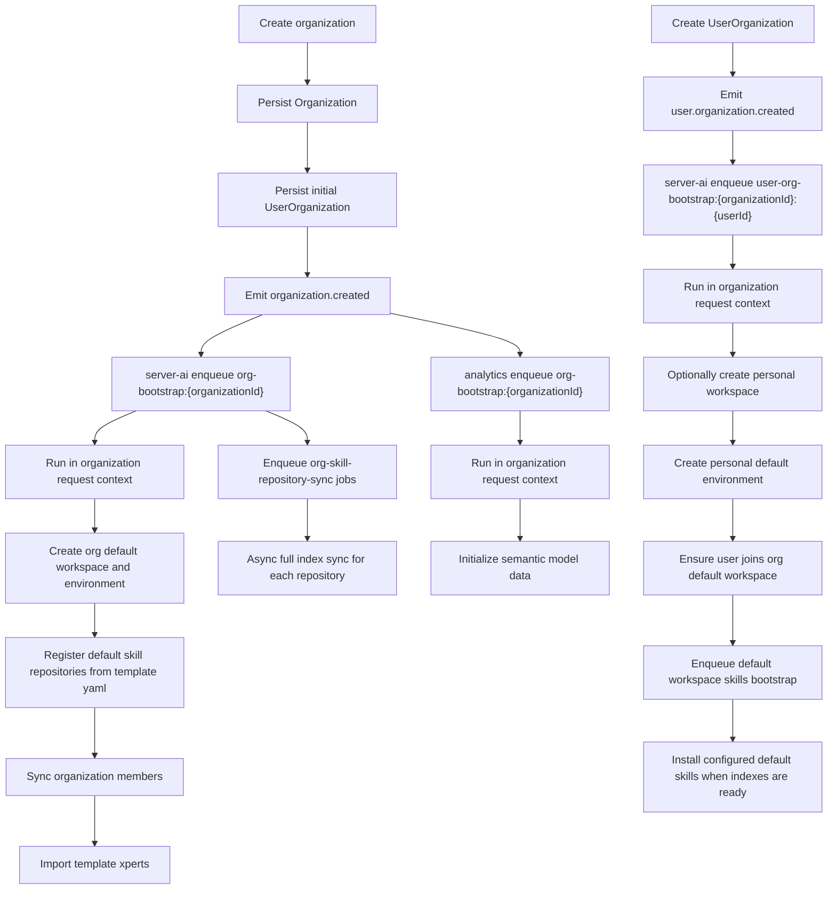

# Organization And User Bootstrap Architecture

This guide explains how Xpert initializes newly created organizations and users joining organizations, including trigger points, async execution, idempotency, and configuration.

## Goals

This bootstrap architecture solves four problems:

- Create a default workspace for every new organization
- Create a per-user workspace when a user joins an organization
- Initialize semantic-model prerequisites for analytics
- Keep the whole process async, retryable, and safe under duplicate event delivery

## Core principles

### 1. User bootstrap is not triggered by bare `user.created`

The system uses a “one workspace per user inside each organization” model, so AI bootstrap should not run when a `User` record is created without an organization.

That means:

- Creating only a `User` does not create any AI workspace
- Bootstrap starts only after a `UserOrganization` relation is actually created

The internal event is:

- `user.organization.created`

### 2. Organization bootstrap runs only after initial membership is persisted

Organization bootstrap depends on both the organization owner and current organization members, so `organization.created` must be emitted only after:

- `Organization` is persisted
- the initial `UserOrganization` relation is persisted

This guarantees stable owner resolution and member synchronization later.

### 3. All bootstrap work is async

The main organization creation flow and the “user joins organization” flow do not wait for bootstrap to finish.

After events are emitted:

- `server-ai` listens and enqueues jobs
- `analytics` listens to organization creation and enqueues jobs
- processors consume the jobs in the background

This keeps the business path short and prevents bootstrap failures from rolling back the main flow.

### 4. All organization-aware writes must run inside request context

Many services in the codebase are organization-aware.

If async jobs write directly without explicitly setting organization context, `organizationId` may be resolved as `null`.

Because of that, all bootstrap writes must be wrapped in:

```ts
runWithRequestContext(
  {
    user,
    headers: {
      'organization-id': organizationId
    }
  },
  () => {
    // bootstrap writes
  }
)
```

## Event model

The implementation introduces two internal events.

### `organization.created`

```ts
{
  tenantId: string
  organizationId: string
  ownerUserId?: string | null
}
```

Emission point:

- after the organization is created
- after the initial organization membership is created

### `user.organization.created`

```ts
{
  tenantId: string
  organizationId: string
  userId: string
  bootstrapPersonalWorkspace: boolean
}
```

Emission point:

- after a `UserOrganization` relation is created for the first time

Notes:

- the event is emitted from the unified “add user to organization” write path, not only from signup
- this allows existing users joining another organization to get their own workspace there
- `bootstrapPersonalWorkspace=false` is used when organization creation auto-adds tenant super admins but should not create personal workspaces for them

## End-to-end flow



## `server-ai` responsibilities

`server-ai` handles two kinds of jobs: organization bootstrap and user bootstrap.

### Organization bootstrap

Responsibilities:

- idempotently create the organization default workspace
- idempotently create the default environment for that workspace
- idempotently register default skill repositories from template assets
- enqueue async full index sync jobs for those repositories
- add current organization members into the default workspace
- import default template xperts based on environment configuration

Default names:

- organization default workspace: `Default Workspace`
- default environment: `Default`

The organization workspace is marked with:

```ts
workspace.settings.system.kind = 'org-default'
```

### Default skill repositories

Organization bootstrap seeds tenant-level skill repositories from:

```text
${XPERT_TEMPLATE_DIR}/skill-repositories.yaml
```

Current YAML shape:

```yaml
repositories:
  - name: anthropics/skills
    provider: github
    options:
      url: https://github.com/anthropics/skills
      branch: main
      path: skills
  - name: clawhub/official
    provider: clawhub
    options:
      registryUrl: https://clawhub.ai
      officialOnly: true
      maxSkills: 500
```

Notes:

- this file is seeded into `XPERT_TEMPLATE_DIR`
- if every referenced skill is provided by `skill-packages/*/`, this file can stay empty
- each entry supports repository fields such as `name`, `provider`, `options`, and `credentials`
- bootstrap matches existing repositories by `name + provider`
- when a match exists, bootstrap updates that repository instead of creating a duplicate
- repositories removed from the template config are not deleted from existing organizations

After registration, bootstrap enqueues a separate async sync job per repository, and each job calls a full repository index sync. That keeps organization creation fast while still making new skills discoverable shortly after bootstrap.

### User bootstrap

When a user joins an organization, `server-ai`:

- idempotently creates the personal workspace when `bootstrapPersonalWorkspace=true`
- idempotently creates the personal default environment
- idempotently adds the user into the organization default workspace
- asynchronously installs configured default skills into the personal workspace when that workspace is newly created

The personal workspace is marked with:

```ts
settings.system.kind = 'user-default'
settings.system.userId = userId
```

The personal workspace name is:

```ts
${displayName || email} Workspace
```

Default workspace skills are configured from the external template asset directory:

```text
${XPERT_TEMPLATE_DIR}/workspace-defaults.yaml
```

Current YAML shape:

```yaml
userDefault:
  skills: []
```

Notes:

- this file is seeded into `XPERT_TEMPLATE_DIR` alongside `skills-market.yaml` and `skill-repositories.yaml`
- refs use machine fields only: `provider`, `repositoryName`, and `skillId`
- only refs that also exist in `skills-market.yaml` are eligible for default installation
- existing personal workspaces are not backfilled automatically; the default install job only runs for newly created `user-default` workspaces
- local bundled skills are loaded from `skill-packages/*/bundle.yaml`, with `SKILL.md` and resources in the same folder
- user bootstrap enqueues a separate async job for these installs, so workspace creation is not blocked by repository sync timing
- unresolved refs are retried until repository indexes are available, and repeated installs are idempotent per `workspaceId + skillIndexId`

### Why `ensureMember` exists

Organization default workspace membership is updated in two places:

- during organization bootstrap, which syncs current members
- during user bootstrap, which incrementally adds the new user

Replacing the full `members` list would be vulnerable to concurrent overwrite.

To avoid that, the implementation uses an incremental helper:

- `ensureMember(workspaceId, userId)`

It only ensures presence and does not rewrite the whole member list.

## Membership-Driven Copilot Access Semantics

Copilot model availability is determined by the effective membership plan scope of the current user, or billable user, instead of directly checking whether the current organization scope has configured copilot models.

Core rules:

- Tenant-scope requests use only tenant-scope membership.
- Organization-scope requests prefer membership in the current organization scope.
- Tenant-scope membership is used as fallback only when the current organization has no active membership plan.
- As soon as the current organization has any active membership plan, it enters organization-managed mode; even if it currently has no enabled local copilots, it does not fall back to tenant models.
- Tenant copilots can only be used, limited, and recorded by tenant membership.
- Organization copilots can only be used, limited, and recorded by membership in the same organization.
- `includedPoints = null` means an unlimited plan: total point-limit checks are skipped, but usage ledger entries are still written and explicit `rateLimits` still apply.

### Organization membership initialization

Organization membership initialization is idempotent. The initialization entry point ensures the current organization has an active default plan and assigns active `UserMembership` records to all active `UserOrganization` members.

The default plan is:

```ts
{
  code: 'default-unlimited',
  name: 'Default Unlimited',
  includedPoints: null,
  tokensPerPoint: 1000,
  isDefault: true,
  status: 'active'
}
```

Initialization behavior:

- If an active default plan already exists, use it.
- If active plans exist but none is default, mark the first active plan as default.
- If only an archived `default-unlimited` exists, reactivate it and make it default.
- If no usable plan exists, create a new `default-unlimited` plan.
- Member assignment only creates memberships for active organization members without an active membership; existing active memberships are not overwritten.
- Unlimited assignment ledger entries use `pointsDelta = 0`.

### Runtime self-healing

To support legacy data, runtime allows one idempotent repair path:

- If an organization scope has enabled local copilots but no organization membership plan, available-model lookup initializes organization membership first and then returns only organization local models.
- If a user directly calls an organization local copilot, `assertCanUse` / `recordUsage` detects `copilotOrganizationId === request organizationId` and missing organization membership, initializes organization membership, and validates again.
- If the requested copilot is tenant-scoped but the effective membership is organization-scoped, usage is rejected.
- If the requested copilot is organization-scoped but the effective membership is tenant-scoped, usage is rejected unless the copilot belongs to the current organization and triggers the self-healing path above.

With this rule, when an organization admin removes the tenant membership plan during onboarding or settings and enables organization-owned copilot models, the system automatically enters organization-managed membership mode. Chat usage and ledger records are then written in organization scope.

### Scope status and management entry points

The backend exposes two scope management APIs:

- `GET /api/membership/scope/status`
- `POST /api/membership/scope/initialize`

Both use the current request scope and require `AIPermissionsEnum.MEMBERSHIP_EDIT`.

`/settings/membership` is a dual-scope page:

- Tenant scope: shows tenant plan status and the plan catalog.
- Organization scope: shows organization-managed status, default plan, active members, assigned members, and local copilot model count.
- If the organization is not initialized, the page shows “Initialize organization membership”.
- If plans exist but member assignment is incomplete, the page shows “Repair assignments”.

Organization local admins can access the organization-scope membership page as long as they have `MEMBERSHIP_EDIT`.

### User-join repair

User bootstrap also calls membership repair:

- If the organization already has an active membership plan, the newly joined user receives an active membership.
- If the organization has no active plan, no plan is created and the organization is not accidentally switched into organization-managed membership mode.

## Workspace Access Semantics

Xpert workspace access is split into two purposes:

- **Runtime / usage access**: used by chat, ClawXpert, assistant binding, and published Xpert read/run flows. Organization-scope users can still read and run published Xperts from tenant-shared workspaces.
- **Authoring / editing access**: used by `/xpert/w`, workspace selectors, Xpert creation, skill or plugin resource installation, workspace resource editing, and default-workspace selection. Organization-scope users only see and operate on owner/member workspaces in the current organization; tenant-shared workspaces are excluded.

Backend API contract:

- `GET /api/xpert-workspace/my` defaults to `purpose=runtime` for backward compatibility.
- `GET /api/xpert-workspace/my?purpose=authoring` returns only workspaces that can be used as editing/write targets.
- `GET /api/xpert-workspace/my/default?purpose=authoring` ignores an existing tenant-shared default workspace and falls back to an editable workspace.
- `POST /api/xpert-workspace/:id/default` requires authoring/write access; organization-scope users cannot set a tenant-shared workspace as their default.
- Workspace resource list and install endpoints, including xperts, toolsets, knowledgebases, skills, prompt workflows, plugin resources, and template install, validate the target workspace with authoring semantics.

Capability results stay split:

- Organization-scope users still get `canRead=true` and `canRun=true` for tenant-shared workspaces.
- The same users get `canWrite=false` and `canManage=false` for tenant-shared workspaces in organization scope.
- Tenant-scope owners/admins can still manage tenant-shared workspaces.

Because of this split, `/api/assistant-binding/xperts`, published Xpert runtime access, and `assertCanRun` flows are not affected by workspace authoring restrictions. If organization users need a browsing surface for tenant-shared public resources later, that should be a separate entry point instead of reusing the `/xpert/w` authoring pages.

## Template xpert import

Default organization xperts are configured through:

```bash
ORG_DEFAULT_XPERT_TEMPLATE_KEYS=id1,id2,id3
```

The import flow:

- loads template details
- parses template YAML
- rewrites the target workspace to the organization default workspace
- writes bootstrap metadata into the imported draft

The idempotency marker is:

```ts
options.bootstrap = {
  source: 'template',
  templateKey: string,
  workspaceKind: 'org-default'
}
```

Before import, the system checks for an existing xpert using:

- `workspaceId`
- `options.bootstrap.templateKey`
- `options.bootstrap.workspaceKind = 'org-default'`
- `latest = true`
- `deletedAt IS NULL`

If one exists, the import overwrites that xpert. Otherwise it creates a new one.

### Duplicate template names

Published xpert naming is still close to globally unique, so organization bootstrap uses a deterministic fallback sequence:

1. original template name
2. `template name (organization name)`
3. `template name (organization name organizationId-prefix)`

## `analytics` responsibilities

`analytics` currently listens only to organization creation.

It reuses the existing seed logic, but exposes it through a reusable organization bootstrap entry point.

Default mode:

- `semantic-only`

Optional mode:

- `full-demo`

Configured through:

```bash
ORG_ANALYTICS_BOOTSTRAP_MODE=semantic-only
```

### What `semantic-only` creates

This mode creates only semantic-model prerequisites:

- data source
- business area
- business-area-user
- semantic model
- semantic model roles
- catalog update

### What `full-demo` adds

On top of `semantic-only`, it also imports:

- demo indicators
- demo story

## Idempotency and retry

Bootstrap is designed with “events may be delivered more than once” as a default assumption.

Because of that, idempotency exists at several layers.

### Queue job ids

- organization bootstrap: `org-bootstrap:${organizationId}`
- organization skill repository sync: `org-skill-repository-sync:${organizationId}:${repositoryId}`
- user bootstrap: `user-org-bootstrap:${organizationId}:${userId}`

### Record-level markers

- org default workspace: `settings.system.kind = 'org-default'`
- user default workspace: `settings.system.kind = 'user-default'` plus `settings.system.userId`
- imported template xpert: `options.bootstrap.templateKey` plus `options.bootstrap.workspaceKind`

### Behavioral idempotency

- environments are created only after checking for the existing default one
- default skill repositories are upserted by `name + provider`
- workspace membership uses `ensureMember`
- analytics seed logic de-duplicates by organization scope

## Failure semantics

Bootstrap failure does not roll back organization creation or user membership creation.

Current failure behavior:

- the main business flow returns once it succeeds
- bootstrap retries in the background
- failures are logged in structured form
- later duplicate deliveries can still converge to the target state

## Extension boundaries

If you want to extend this bootstrap system, these are the recommended boundaries.

### Good candidates for organization bootstrap

- organization default workspace setup
- organization default environment setup
- organization template xpert import
- organization analytics semantic-model setup

### Good candidates for user bootstrap

- personal workspace setup inside an organization
- default environment setup
- automatically joining shared organization workspaces
- future user preference or assistant binding setup

### What should not be forced into this path

- global slug-scope refactors for published xperts
- large sync jobs that depend heavily on external systems
- long write chains that require strict transactional consistency

Those are better handled as separate projects instead of being tightly coupled to bootstrap.

## Recommended deployment config

For analytics-heavy organizations, a practical starting point is:

```bash
ORG_DEFAULT_XPERT_TEMPLATE_KEYS=af7133cb-32b3-47ff-90c1-b144c4d4887e,af7133cb-32b3-47ff-90c1-b144c4d48872
ORG_ANALYTICS_BOOTSTRAP_MODE=semantic-only
```

Those two template ids currently map to:

- `ChatBI with Sales Analysis Expert`
- `Text2SQL-ChatDB`

## Summary

At a high level, this bootstrap architecture is:

`business flow emits events -> AI and analytics enqueue async jobs -> workers converge idempotently inside organization context`

That gives Xpert automatic organization and user initialization without forcing the main request path to wait on heavier background writes.
