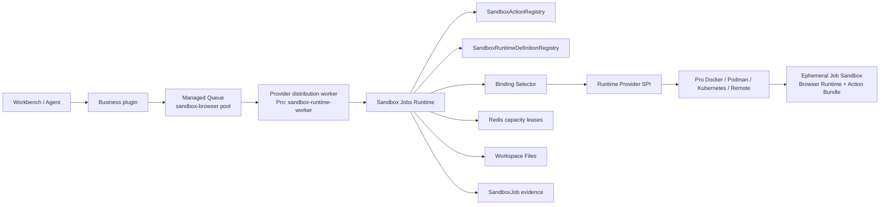

# Sandbox Runtime and Sandbox Jobs Architecture

Xpert separates task orchestration, runtime definitions, runtime implementations, and plugin behavior. OSS Core owns generic Job semantics and the Provider SPI; Runtime Suite publishes provider-neutral Definitions and artifacts; system plugins own reviewable Action Bundles; Pro or another distribution supplies concrete Runtime Bindings and Providers.

The first implementation is Browser Runtime for Presentation Studio PDF/PPTX export. It does not reuse an interactive agent sandbox and works without an active conversation.

## Concepts and ownership

| Concept               | Owner             | Contents                                                                                                                                     |
| --------------------- | ----------------- | -------------------------------------------------------------------------------------------------------------------------------------------- |
| Sandbox Runtime Suite | Platform          | Suite version, image Catalog, build, verification, and release tooling                                                                       |
| Browser Runtime       | Platform          | Node, `playwright-core`, matching Chromium, fonts, and generic Runner Host                                                                   |
| Runtime Definition    | OSS Runtime Suite | Stable profile name, fixed Runner argv, contract/runtime version, resources, security requirements, and expected manifest; no provider/image |
| Runtime Binding       | Runtime Provider  | Maps a Definition to a Provider and immutable artifact with deterministic priority                                                           |
| Runtime Provider SPI  | OSS Plugin SDK    | Minimal binding/health/create/destroy and Runtime instance file/execution contract                                                           |
| Sandbox Action Bundle | System plugin     | Action identity, Runtime compatibility, entrypoint, files, and deterministic bundle hash                                                     |

Runtime Definitions contain no Docker, plugin, Presentation, or Dashi identifiers. Actions cannot choose an image, provider, command, environment, or Docker option.

## Architecture



The Provider distribution worker is a dedicated queue-consumer process, not a second orchestration layer. Idempotency, capacity, containers, I/O, validation, and cleanup remain in Sandbox Jobs Runtime. API processes never consume the browser pool or initialize Runtime Providers. OSS keeps the generic `bootstrapWorker()` extension entrypoint but deliberately does not deploy this process; a concrete Provider distribution owns its worker service.

## Runtime Suite package and release

The private `@xpert-ai/sandbox-runtime` package under `packages/sandbox-runtime` owns OCI image assets only. `images/catalog.json` is the sole workflow matrix source, allowing future Agent, Office, Python, and GPU families without copied workflows.

Browser Runtime uses profile `browser/playwright-1.61/v1` and currently contains Node.js `20.20.2`, `playwright-core@1.61.0`, its matching Chromium, Noto CJK/Color Emoji, and the generic Runner Host. Its manifest records suite version, family, contract, dependency versions, browser revision, and Runner Host SHA-256.

The suite has an independent private-package SemVer release train. A version release builds locally and runs hardened manifest/non-root/read-only/no-network/font/Chromium/PDF smoke before any release tag is pushed to GHCR, Docker Hub, and ACR. It then generates a provider-neutral Runtime Definition Catalog and per-registry digest-pinned Runtime Artifact Catalogs. Develop builds only changed families; Xpert platform tags create aliases of an already verified suite without rebuilding. Production Providers always select `@sha256:`.

## Definition, Binding, Provider, and Action registries

`SandboxRuntimeDefinitionRegistry` loads generic `browser/playwright-1.61/v1` from `@xpert-ai/sandbox-runtime`. Its Runner Host, versions, resources, deadlines, network, security policy, and expected manifest are provider-neutral defaults. It contains no image, Provider, host path, or plugin identity and requires no user profile configuration.

`SandboxRuntimeProviderRegistry` accepts built-ins or `level=system` plugins only. Providers declare Bindings and capabilities through the small `ISandboxRuntimeProvider` SPI. `SandboxRuntimeBindingSelector` filters compatibility and immutable artifacts, probes health, orders candidates deterministically, and permits a new attempt to fail over. Interactive Agent Sandbox backends and `LocalShellSandboxProvider` are never Job candidates. Workspace mapping is separately extensible through `SandboxWorkspaceMapperRegistry`; OSS Core has no Docker string branch.

`SandboxActionRegistry` resolves `sandboxActions` from loaded system-level plugin manifests. It rejects organization-level execution in v1, unsafe or traversing paths, null bytes, symlinks, hard links, and non-regular entries. Bundles default to 256 MiB and 20,000 files. Per-file integrity and a deterministic tree hash are verified before immutable content is cached by `bundleSha256` and materialized into `/workspace/runtime/action` for each Job. Plugin installation directories and host `node_modules` are never mounted.

## Action-oriented SDK

```ts
const health = await sandboxJobs.getActionHealth({
  pluginName: MY_PLUGIN,
  action: 'report.export',
  actionVersion: '1.0.0'
})

const result = await sandboxJobs.run({
  action: 'report.export',
  actionVersion: '1.0.0',
  idempotencyKey,
  scope,
  payload,
  files,
  outputs,
  timeoutMs: 300_000
})
```

There is no caller-supplied profile, image, command, entrypoint, environment, or Docker configuration. The platform resolves `pluginName + action + actionVersion`, validates bundle and Runtime compatibility, and then resolves the Action's Runtime Profile.

## Key code contracts

Use the exported contracts as the boundary between plugins, Runtime Providers, and Core. Plugins and Provider distributions import them from `@xpert-ai/contracts` or `@xpert-ai/plugin-sdk`; they must not import `server-ai` internals.

| Public contract                                              | Responsibility and invariant                                                                                                                                                             |
| ------------------------------------------------------------ | ---------------------------------------------------------------------------------------------------------------------------------------------------------------------------------------- |
| `XpertPluginSandboxActionDefinition`                         | Declares Action identity, Runtime compatibility, bundle root, entrypoint, and deterministic tree hash. Only a system-level plugin may register it.                                       |
| `SandboxJobsApi`, `SandboxJobRunInput`                       | Starts, cancels, and inspects Action-oriented Jobs. `run()` accepts structured payloads and portable file references, never execution-engine parameters.                                 |
| `SandboxJobSnapshot`                                         | Returns durable attempt, Provider/Binding, opaque `runtimeRef`, artifact digest, error, and output evidence without exposing a live engine client.                                       |
| `SandboxJobRuntimeError`, `isSandboxJobRuntimeError()`       | Carry a stable error code, retryability, and optional Job id so the Managed Queue retries only transient Runtime failures.                                                               |
| `SandboxRuntimeDefinition`                                   | Defines the provider-neutral fixed Runner argv, contract/version, defaults, and required security capabilities. It contains no image, Provider, or plugin identity.                      |
| `SandboxRuntimeBinding`, `SandboxRuntimeArtifact`            | Let a Provider map one Definition to a compatible immutable artifact. The selected values are persisted for each actual attempt.                                                         |
| `SandboxRuntimeInstance`, `ISandboxRuntimeProvider`          | Expose Job-scoped workspace I/O, fixed-argv execution, termination, Binding health, create/reattach, and idempotent destroy through an SPI independent of the interactive Agent Sandbox. |
| `SandboxWorkspaceMapper`, `SandboxWorkspaceMapperStrategy()` | Isolate execution-engine path translation from OSS Workspace and Volume code.                                                                                                            |

The main Core classes preserve those boundaries:

| Core class                           | Role                                                                                                                                                                     |
| ------------------------------------ | ------------------------------------------------------------------------------------------------------------------------------------------------------------------------ |
| `SandboxActionRegistry`              | Authorizes system Actions and verifies safe paths, file limits, links, checksums, and the bundle tree hash.                                                              |
| `SandboxRuntimeDefinitionRegistry`   | Loads provider-neutral Runtime Definitions from the Runtime Suite.                                                                                                       |
| `SandboxRuntimeBindingSelector`      | Filters required capabilities and immutable artifacts, checks health, and chooses deterministically by priority.                                                         |
| `SandboxRuntimeHealthService`        | Lets workers probe/publish expiring Runtime health while APIs only aggregate Redis heartbeats.                                                                           |
| `SandboxJobRuntimeCapabilityService` | Owns idempotency, capacity, materialization, execution, output validation, runtime evidence, cancellation, and cleanup. Only worker execution creates Runtime instances. |
| `SandboxJobCapacityService`          | Acquires expiring global/tenant/user leases before Runtime creation and releases them idempotently.                                                                      |
| `bootstrapWorker()`                  | Assembles a no-HTTP worker in `@xpert-ai/xpert-api`; OSS does not deploy one, while a Provider distribution owns its worker service.                                     |

## Job, data, and security model

Every execution uses `workFor: { type: 'job', id }`. `SandboxJob` records Runtime Profile/suite, Action/version, tenant and caller scope, business resource, attempt, Provider, Binding, immutable artifact digest, `runtimeRef`, portable outputs, timestamps, cleanup state, and standardized error evidence. `containerRef` remains read-only compatibility for one release.

Uniqueness on `(tenantId, idempotencyKey)` returns prior successful outputs, reattaches to active work, and lets a later Managed Queue attempt create a new container for failed/lost work. Capacity leases default to 20 global, 4 per tenant, and 2 per user; quota saturation remains `waiting` without creating a container or spending a business retry.

Inputs are Workspace Files portable references with declared size and SHA-256. The platform rejects cross-tenant references and unsafe paths, materializes request and Action under the Job-only `/workspace`, runs only the Profile's fixed Runner Host, validates outputs, persists them to declared Workspace destinations, and returns portable references. Current aggregate input and output limits are 350 MiB each.

Containers enforce non-root execution, read-only root, no-new-privileges, dropped Linux capabilities, job-only writable paths, no public network by default, bounded CPU/memory/shared memory/temp storage, a 300-second action timeout, and 360-second hard deadline. Completion, failure, cancellation, and orphan cleanup reclaim containers and Job volumes.

## Presentation Studio integration

Presentation Studio publishes `dist/sandbox-actions/presentation-export`, not an image. Its build bundles the Runner and pinned Dashi render/export runtime, copies themes/templates/static resources, externalizes `playwright-core`, and produces `action.json` plus a deterministic tree hash. `.xpertai-plugin/plugin.json` declares this manifest through `sandboxActions`.

The export handler loads the immutable deck snapshot and persisted asset references, then calls `presentation.export@1.0.0`. Browser Runtime supplies Playwright/Chromium, the Action supplies Presentation behavior, and the platform writes validated PDF/PPTX output to Workspace Files. HTML stays on the browser-free path. Production forces `sandbox-job`; local Chromium compatibility is development/test only. PDF/PPTX are enabled by default: a missing Action, Definition, Binding, Provider artifact, or browser-pool worker is reported as a capability warning instead of requiring a rollout switch.

## Health, OSS/Pro boundary, and deployment

Deterministic Action/Profile/version/input/output errors are not retryable. Capacity-service, provider startup, browser launch, timeout, and OOM errors are retryable. Plugins persist user-facing business state and only rethrow runtime errors marked retryable.

Workers probe all Runtime Definitions immediately and every 15 seconds, publishing Redis heartbeats with a 45-second TTL. APIs read heartbeats and never need Docker socket access; the Worker selects and validates a local Binding again immediately before execution. A live Worker without a Binding reports `RUNTIME_UNBOUND`; no live heartbeat reports `PROVIDER_UNAVAILABLE`.

The no-HTTP `bootstrapWorker()` entrypoint is owned by `@xpert-ai/xpert-api`, which composes plugins, queues, and domain modules. Analytics is a loaded domain module; it does not choose the process role or own Worker startup.

The OSS Compose files deploy no Sandbox Runtime worker, mount no Docker socket, and pull no Runtime artifact. They still ship `bootstrapWorker()` so community Provider distributions can assemble a worker without forking API bootstrap code. With no fresh heartbeat, health reports `PROVIDER_UNAVAILABLE`; if the action/runtime health is valid but the browser execution pool has no consumer, it reports `WORKER_UNAVAILABLE`. Presentation Studio does not enqueue PDF/PPTX work in either state, shows an actionable warning, and keeps HTML available.

The private Docker Provider owns the Pro deployment overlay. It starts the `sandbox-runtime-worker` service with the current internal role below; queue selection, concurrency, capacity, Provider registration, and immutable Runtime artifact selection come from packaged defaults:

```text
XPERT_PROCESS_ROLE=sandbox-browser-worker
```

The Pro overlay defaults to two workers with local concurrency five. Workers use the API image to load plugin handlers and the platform Runtime graph but contain no Chromium; only ephemeral Browser Runtime containers contain the browser. Only this Pro worker gets the Docker socket; API containers and all OSS base services do not. Provider CI creates `runtime-suite.lock.json` from Runtime Artifact release catalogs and rejects missing or mutable production artifacts. Pro users configure no worker switch, image, profile, Provider selector, or `CHROME_PATH`; Provider development automatically uses `xpert-sandbox-browser:local` and reports a build hint when missing.

The open-source distribution includes Jobs Core, Definition and Action registries, Provider/mapper SPI, heartbeat contracts, and Fake Provider tests, but no production Provider or worker service. Community implementations can provide Podman, Kubernetes, or remote execution through the public SPI and must package their own worker deployment. `RUNTIME_UNBOUND` is reserved for a live worker that cannot bind a compatible Runtime Definition. The Docker implementation and its deployment overlays currently live as private system plugin `xpertai/providers/sandbox-docker` and can later move intact to the Pro repository.

Release in this order: platform contracts/SDK/Core, Runtime Suite, Provider lock and workers, then the plugin Action Bundle. Roll back to the previous Runtime artifact digest first; if browser capability is unavailable, the platform warns and keeps HTML available.
