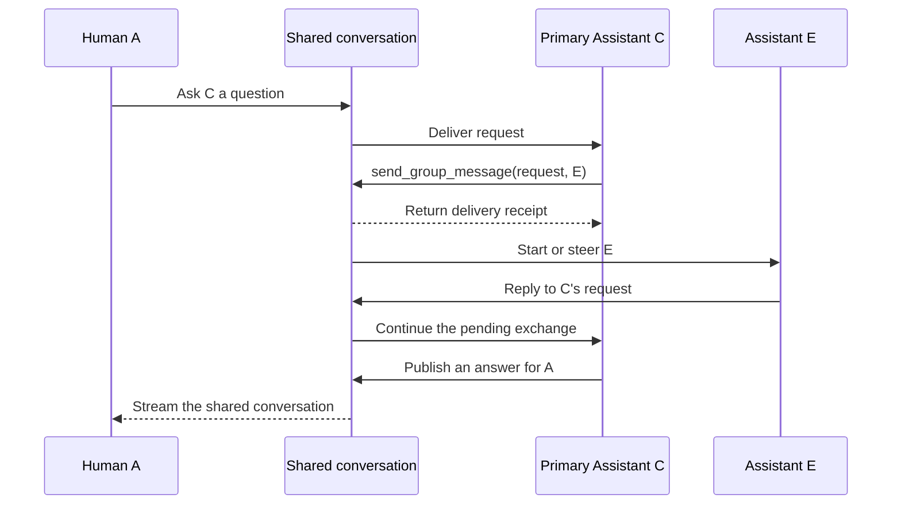
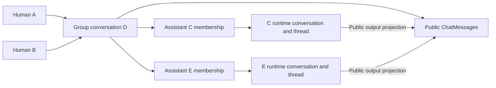

# Group Chat

Group Chat lets multiple human users and digital experts (Assistants in the API) collaborate in one shared conversation. Everyone sees the same public message history, while each Assistant keeps an independent model context and execution thread. Cloud and Desktop use the existing ChatKit Chat, Composer, Header, and Workbench.

This document describes the implementation in `develop`, reviewed on October 10, 2026. It is the canonical feature reference, including the historical acceptance evidence and its limits.

## Using a group

1. Create a group from the host application's conversation menu, enter a title, and select its primary digital expert. The signed-in user becomes the owner.
2. Open the group members Dialog to invite users or additional digital experts. The two member types have separate tabs and searchable selection controls. Candidate lists and avatars come from authorized user and Xpert profiles.
3. Send a message without an @ mention to ask the primary digital expert. Select a member through the Composer's @ picker to address that member instead. Multiple selected members can receive the same public question.
4. Open the same group in another signed-in member's client to follow messages and Assistant output in real time. Closing a client does not stop an accepted Assistant execution.
5. Select a digital expert's name on a message with an execution link to open that execution in the existing external-Assistant Workbench view, subject to additional resource permissions.

Groups share the conversation list with ordinary Assistants and are identified by `purpose: 'group'`. A composite member avatar identifies a group; it is not a separate fixed sidebar category. Read position, pinning, and archiving are personal preferences and do not change another member's list.

The human group owner manages membership. The primary Assistant is a separate concept: it is the Xpert referenced by `ChatConversation.xpertId`. Additional Assistant members have their own Xpert IDs and runtime bindings. Neither the owner nor the primary Assistant can be removed through member removal. Removed memberships remain available for historical attribution; rejoining restores the existing membership and runtime binding.

All group messages are public to authorized group members, including messages directed at one person. An @ mention is routing, not a private-message boundary. Invited members can read existing public group history. Group membership does not expose anyone's other conversations or private execution state.

## Message routing and conversations between members

| Scenario                         | Routing and behavior                                                                                                     |
| -------------------------------- | ------------------------------------------------------------------------------------------------------------------------ |
| Human sends a message without @  | The primary Assistant receives the request.                                                                              |
| Human addresses an Assistant     | Only that Assistant receives the request; the primary Assistant is not added implicitly.                                 |
| Human addresses another human    | The addressed person receives the public message; no Assistant is started.                                               |
| Human addresses multiple members | One public message has an independent receipt for each recipient. Each addressed Assistant can run independently.        |
| Assistant asks another Assistant | `send_group_message` publishes a structured `request`; the target receives it under its own runtime.                     |
| Assistant answers an Assistant   | A correlated `reply` completes the original recipient's pending request and can continue the requesting Assistant.       |
| Assistant asks a human           | The question is public. A valid correlated human reply can continue the requesting Assistant.                            |
| Assistant answers a human        | The answer is public and attributed to that Assistant; it does not start another Assistant merely because it is visible. |
| Assistant publishes progress     | The `message` intent publishes information without waking addressed Assistants.                                          |

Communication intent and execution input mode are independent. The internal protocol has `request`, `reply`, and `message` intents; active Assistant input uses `steer`. The human Composer does not offer a queue/steer switch or a separate broadcast mode: human input without mentions goes to the primary Assistant.

### Human @ mentions

The public send API accepts text, a client-generated message UUID, optional mention spans, optional reply metadata, and optional Composer selections. It does not accept a client-supplied author, communication intent, or recipient list.

Each mention binds a group participant ID to an exact `@name` span. Offsets use JavaScript UTF-16 indices, with an inclusive start and exclusive end. The server validates the active member, displayed name, boundaries, and non-overlapping spans. Unbound @ syntax is rejected rather than resolved by name.

For example, after selecting an authorized member from the group snapshot:

```ts
const mention = `@${member.name}`
const input = {
  clientMessageId: crypto.randomUUID(),
  text: `${mention} Please confirm the delivery date.`,
  mentions: [{ participantId: member.id, start: 0, end: mention.length }]
}
```

Send this body to `POST /api/ai/groups/:groupId/messages`. `member.id` is the group membership ID, not the underlying User Account or Xpert ID. Reuse `clientMessageId` when retrying the same submission.

`replyToMessageId` does not override mention routing. A human reply is treated as a protocol reply only when the resolved single recipient is the original sender; otherwise it remains a new request to the resolved recipient or primary Assistant. The referenced request and responding member must also pass the pending-request checks.

### Assistant requests and replies

The runtime injects `send_group_message` with these intents:

- `request`: supply `text` and `recipientIds` to ask active members to respond.
- `reply`: supply `text` and `replyToMessageId`; the server derives the recipient from the original request.
- `message`: supply `text` and optional `recipientIds` to publish progress without starting another Assistant.

The tool is bound to the current Assistant membership and execution. Its arguments cannot choose the author or initiating user. Plain `@name` text in generated output is presentation only and does not dispatch a request.

Requests are asynchronous. The tool returns a persisted message ID and delivery receipts; it does not wait for another member. The requesting Assistant can finish its turn and resume through a valid reply later. Progress does not fulfill a request, and duplicate replies cannot complete the same pending recipient twice.



Causal metadata preserves `rootMessageId`, `rootUserId`, and `hop`. The server rejects self-targeting, caps causal depth at eight, and limits a chain to 32 public messages. A reply does not implicitly create a new reciprocal request.

## Conversation and persistence model

The group itself is an existing `ChatConversation` with `purpose='group'`; there is no separate GroupConversation entity. Its public messages are ordinary `ChatMessage` records with group communication metadata.

Each Assistant member has an independent `ChatConversation(purpose='group_assistant_runtime')` and `ChatConversationThread`. These store that Assistant's model history, checkpoints, and executions. They are excluded from ordinary conversation entry points and are not user-selectable branches of the public group thread.



Three supporting entities implement shared persistence interfaces:

| Entity                                             | Responsibility                                                                                                                                                                  |
| -------------------------------------------------- | ------------------------------------------------------------------------------------------------------------------------------------------------------------------------------- |
| `GroupParticipant` / `IGroupParticipant`           | Human or Assistant membership, `owner`/`member` role, active state, Assistant runtime binding, context/read positions, and personal list preferences.                           |
| `GroupMessageRecipient` / `IGroupMessageRecipient` | Delivery and consumption for one public message and recipient, execution/input references, retries, leases, and reply completion. It is a receipt, not another execution queue. |
| `GroupInteraction` / `IGroupInteraction`           | A designated human's approval or client-tool interaction and its claim/response lifecycle.                                                                                      |

Public DTOs omit technical principals and private runtime bindings. Participant `id` identifies a membership in one group; `subjectId` identifies a User Account or Xpert, selected by `kind`. Display names never determine identity or authorization.

### Ordering and state versions

- `ChatMessage.sequence` defines public transcript order and remains stable when an existing publication is updated.
- `ChatConversation.lastMessageSequence` allocates the next sequence under a short group-row transaction lock.
- `ChatConversation.revision` versions the public snapshot, including membership and delivery changes that do not create another message.
- A member's `contextSequence` records model-context progress; `readSequence` records that human's reading position.
- SSE event IDs are opaque replay cursors and are not interchangeable with any of these values.

The implementation uses these final field names directly. The early draft's separate default-Assistant field and prefixed sequence/revision column names are not part of the feature contract.

## Assistant context and execution ownership

Each Assistant receives its own system configuration, a member directory, a bounded projection of public group background, and the addressed input. Other members remain independent authors even when their text is passed to the model as human input. Their content is not promoted to system instructions or inserted as this Assistant's own output or tool results.

The current projection reads up to 40 newer public messages after the member's context position. It excludes the current input, the recipient Assistant's own messages, and messages addressed to that Assistant, which keep independent delivery receipts. Background excerpts are limited to 4,000 characters each. This is a bounded context projection, not automatic access to every historical token. Seeing a message as background does not consume its pending request.

Only public answer text is projected into the shared transcript and live stream. Tool payloads, system prompts, credentials, checkpoints, and hidden reasoning remain outside the public group stream. Personal memory and private resource contexts are not implicitly shared between members.

Execution audit records belong to the real human who caused the execution:

- A new human request uses its authenticated User Account.
- Assistant-to-Assistant handoffs and continuations retain the causal human initiator.
- A human reply uses the actual responding human when dispatching that input.
- A steer message preserves its own sender without rewriting the creator of an already-running execution.

Runtime conversations and threads are initially allocated under the creating/inviting human and bound to the first initiating human at first execution. Later executions record their own initiators. The Assistant's technical principal identifies its public authored messages; it is not the creator of the human-initiated execution.

## Delivery, steer, and recovery

Group delivery reuses the existing Handoff message queue, dispatch processor, run admission, and persisted follow-up mechanism. There is no group-specific Bull queue or browser-owned queue drain.

```text
Public message + recipient receipts committed together
  -> GroupOutboxService / existing Handoff outbox adapters
  -> agent.group_message.v1
  -> agent.chat_dispatch.v1
  -> authorized member runtime: send, steer, or explicit resume
  -> public output projection and receipt reconciliation
```

Short dispatch and busy-runtime input use the existing realtime queue; long execution uses the existing Handoff path. Lifecycle callbacks reconcile completion without turning each text token into a queue job. Tokens continue through the existing Redis run streams.

Admission is independent for each Assistant runtime. Different Assistants can run concurrently; multiple inputs for one Assistant share the existing single-writer boundary. An idle target starts a run, and a busy target receives a persisted steer. If a run ends naturally before consuming that steer, the same receipt can be dispatched as the next send. Pause, interruption, cancellation, and authorization checks remain explicit control boundaries.

Per-recipient statuses are `pending`, `starting`, `steering`, `consumed`, `blocked`, `canceled`, and `failed`. `consumed` means the runtime consumed the input, not that an answer has already appeared or every human has read it. These statuses are distinct from thread/run status and interaction status.

Publications and receipts are committed before transport delivery. Human submissions deduplicate by group, sender, and client message ID; Assistant publications use host-generated execution/output or tool-call keys. A conflicting retry is rejected. Leases and the existing outbox scan retry committed work without creating duplicate public messages. Recovery reconciles known execution facts; ambiguous worker loss is blocked rather than blindly replaying model or tool side effects.

`steer` is not a promise to interrupt the model's current token generation immediately. Consumption depends on runtime boundaries, and continuation after natural completion can incur recovery latency. Historical measurements are recorded below.

## Authorization and ChatKit sessions

Group access requires an authenticated real user, the correct tenant and organization context, and active membership. Only the owner manages members. Assistant invocation additionally uses published-Xpert access checks under the initiating human's authorized scope. Being in a group does not grant workspace authoring, project access, or permission to use every Assistant.

Embedded ChatKit uses the existing session endpoint with conversation scope:

```http
POST /api/ai/v1/chatkit/sessions
Content-Type: application/json

{
  "scope": {
    "kind": "conversation",
    "conversationId": "<group-conversation-uuid>"
  }
}
```

The host sends this request using its existing login and tenant/organization headers, then returns `client_secret` through ChatKit's `api.getClientSecret`. Conversation scope cannot be combined with the session request's Assistant, project, delegated-conversation, or user overrides.

The grant uses `USER_CONVERSATION` and `IApiPrincipal.resourceScope = { kind: 'conversation', conversationId }`. It binds the real user and the exact tenant, organization, conversation, and expiry. Existing Assistant-scoped secrets cannot be widened to access a group. Group business entry points and stream refreshes recheck live membership and expiry; private runtime and file access have additional checks.

There is no separate group credential header or `GroupsClient.createSession` endpoint. Use the unified ChatKit session mechanism for issuance and refresh. The host integration uses published ChatKit 0.13.0 and Xpert SDK 0.9.1; local SDK linking scripts are not required.

Removing a member revokes affected pending work and interactions before canceling affected runs through existing control commands. It does not erase historical messages. A plain group reply such as "approved" never approves a tool operation.

### Human approvals and client tools

A runtime interruption creates a `GroupInteraction` assigned to a real User Account. The designated human must claim it with a client claim ID before obtaining actionable requests and responding. Concurrent windows cannot independently execute the same claimed interaction. Group observers see status; subscribing or replaying a stream does not claim or execute a client tool.

Run controls carry an exact `runId` to prevent stale UI actions from controlling a newer run. Delivery cancellation affects pending handling and cannot undo external actions already performed.

## Live updates and Workbench

Each client opens a group SSE connection that combines public snapshots with text deltas from the members' existing runtime streams. Multiple humans can observe the same executions independently. Disconnecting disposes readers, not model executions.

The public event union contains `snapshot`, `text`, and `resync`. Snapshots contain a page of persisted messages, members, delivery states, runs, and public interaction summaries. Text deltas identify the Assistant participant, run, and runtime output message; that output ID is not yet the persisted public group message ID.

Clients must merge history by message identity and reconcile streamed output with persisted publications. Pagination uses `before` sequence and returns messages in ascending sequence order. `Last-Event-ID` carries a bounded opaque cursor tied to the group and viewer, including independent run positions. Invalid cursors trigger resynchronization, and replay gaps require a fresh snapshot rather than trusting accumulated deltas.

An Assistant's message name opens the existing external-Assistant execution view. The server resolves the public publication or recipient receipt to its runtime conversation, run, and optional message anchor. It rechecks Assistant, workspace, and relevant project access; group membership alone is insufficient. The returned display projection replaces generated human context blocks with the public question and does not expose checkpoints or runtime configuration.

## Shared ChatKit presentation

Group mode upgrades the existing chat components and preserves Header actions, the Composer's project/file/plugin menus, and the Chat/Workbench split layout.

- The current human's messages appear on the right without an avatar. Other humans and all Assistants appear on the left.
- Consecutive messages from one author form a visual group. The name appears at the beginning and the avatar at the lower left of the final message. Nearby timestamps are consolidated rather than repeated between messages.
- @ mentions appear in the message body without a duplicate recipient heading. Reply correlation remains in the protocol without rendering an original-message quote block.
- Assistant activity indicators appear below the messages. Each Assistant has its own activity and delivery state.
- Group avatars combine member avatars. Avatar details follow the existing detail interaction; member management uses a Dialog with tabs and searchable member selection. Cloud's creation dialog uses Zard UI, and the ChatKit member dialog uses shadcn UI.
- Bubble and avatar corners derive from the existing ChatKit theme radius. Host and embedded colors use the existing theme variables and derivation rules rather than extra color tokens.

Composer resource selections are scoped to exactly one addressed Assistant. The server checks that `composer.participantId` matches the resolved recipient and validates project, file, resource, and capability access. Multi-target messages cannot mix private Composer contexts. The original menus become available again when there is one valid Assistant target.

Host navigation retains the embedded ChatKit frame and updates the conversation binding and credentials. Group mode does not require a new chat page or a separate Composer. When the Workbench has no suitable initial view, it uses the shared new-tab page.

## API and implementation reference

Routes below are relative to `/api/ai/groups`. HTTP adapters remain in `AIModule`; `ChatGroupModule` owns group policy, membership, message publication, delivery, runtime coordination, and projections.

| Method and path                                                       | Purpose                                                           |
| --------------------------------------------------------------------- | ----------------------------------------------------------------- |
| `GET /`                                                               | List the current user's groups.                                   |
| `GET /candidates`                                                     | Find authorized candidates before creating a group.               |
| `POST /`                                                              | Create a group with `title` and primary `assistantId`.            |
| `GET /:groupId`                                                       | Read a snapshot/history page using optional `before` and `limit`. |
| `GET /:groupId/candidates`                                            | Find invite candidates in this group's context.                   |
| `POST /:groupId/members`                                              | Invite a member using `kind` and `subjectId`.                     |
| `DELETE /:groupId/members/:participantId`                             | Remove an eligible member.                                        |
| `POST /:groupId/messages`                                             | Submit a human message with validated mentions.                   |
| `PATCH /:groupId/preferences`                                         | Update the viewer's read sequence, pin, or archive preference.    |
| `GET /:groupId/stream`                                                | Observe public group SSE events.                                  |
| `POST /:groupId/members/:participantId/control`                       | Pause, cancel, or resume the specified run.                       |
| `POST /:groupId/messages/:messageId/recipients/:participantId/cancel` | Cancel one recipient's pending delivery.                          |
| `POST /:groupId/interactions/:interactionId/claim`                    | Claim an assigned human interaction.                              |
| `POST /:groupId/interactions/:interactionId/respond`                  | Respond using the successful claim.                               |
| `GET /:groupId/messages/:messageId/runtime/:participantId`            | Resolve an authorized Workbench execution projection.             |

Composer adapters are under `/:groupId/members/:participantId/composer`; Workbench adapters are under `/:groupId/workbench`, including scoped workspace-file view sessions. They reuse existing resource services and authorization instead of opening management APIs to group credentials.

Current validators limit groups to 32 active members, messages to 32,000 UTF-16 code units, recipients to 16 distinct members, mention spans to 32, and history pages to 100 messages (default 50). The supported roles are `owner` and `member`; the early draft's admin/viewer roles are not implemented here.

The current feature does not expose conversion of a private conversation into a group, private directed messages, cross-organization human membership, public-message editing, or user-selected branches of Assistant runtimes. Ordinary chat branching remains a separate feature.

| Area                                         | Source                                                                                                                                                                                                                                                                                            |
| -------------------------------------------- | ------------------------------------------------------------------------------------------------------------------------------------------------------------------------------------------------------------------------------------------------------------------------------------------------- |
| Public protocol and persistence interfaces   | [chat-group.model.ts](../packages/contracts/src/ai/chat-group.model.ts), [chat-group-entity.model.ts](../packages/contracts/src/ai/chat-group-entity.model.ts)                                                                                                                                    |
| Existing conversation/message extensions     | [conversation.entity.ts](../packages/server-ai/src/chat-conversation/conversation.entity.ts), [chat-message.entity.ts](../packages/server-ai/src/chat-message/chat-message.entity.ts)                                                                                                             |
| Group entities and module                    | [group.entity.ts](../packages/server-ai/src/chat-group/group.entity.ts), [chat-group.module.ts](../packages/server-ai/src/chat-group/chat-group.module.ts)                                                                                                                                        |
| Access and membership                        | [group-access.service.ts](../packages/server-ai/src/chat-group/group-access.service.ts), [group-members.service.ts](../packages/server-ai/src/chat-group/group-members.service.ts)                                                                                                                |
| Messages and validation                      | [group-messages.service.ts](../packages/server-ai/src/chat-group/group-messages.service.ts), [group.schema.ts](../packages/server-ai/src/chat-group/group.schema.ts), [group-mentions.ts](../packages/server-ai/src/chat-group/group-mentions.ts)                                                 |
| Runtime and existing-queue adapter           | [group-runtime.service.ts](../packages/server-ai/src/chat-group/group-runtime.service.ts), [group-outbox.service.ts](../packages/server-ai/src/chat-group/group-outbox.service.ts)                                                                                                                |
| Model context and Assistant messaging        | [group-context.ts](../packages/server-ai/src/chat-group/group-context.ts), [group-tools.service.ts](../packages/server-ai/src/chat-group/group-tools.service.ts)                                                                                                                                  |
| Streaming, interactions, and execution views | [group-stream.service.ts](../packages/server-ai/src/chat-group/group-stream.service.ts), [group-interactions.service.ts](../packages/server-ai/src/chat-group/group-interactions.service.ts), [group-runtime-view.service.ts](../packages/server-ai/src/chat-group/group-runtime-view.service.ts) |
| HTTP entry points                            | [group.controller.ts](../packages/server-ai/src/ai/groups/group.controller.ts), [group-composer.controller.ts](../packages/server-ai/src/ai/groups/group-composer.controller.ts), [group-workbench.controller.ts](../packages/server-ai/src/ai/groups/group-workbench.controller.ts)              |
| Unified session input                        | [chatkit-session.schema.ts](../packages/server-ai/src/ai/chatkit-session.schema.ts)                                                                                                                                                                                                               |

Runtime capabilities remain in their owning [Xpert capability service](../packages/server-ai/src/xpert/runtime-capabilities/runtime-capabilities.service.ts), using explicit dependencies and typed CQRS operations across domains. They are not a second group runtime service.

## Verification record and limits

This section preserves historical evidence from October 9-10, 2026. Consolidating the documentation did not rerun model executions, multi-user browser acceptance, or deployment tests.

### Two humans and two Assistants

The October 9 local acceptance used existing group-chat worktrees and database services, API port 3310, ChatKit port 5310, and Desktop port 4391. It used two independently authenticated human accounts, A and B, and two dedicated published Assistants, C and E, configured with `qwen3.5-plus`, text answers, and the group messaging tool. It did not forge sender fields or modify existing business Assistants.

| Scenario                                                            | Historical result                                                                     |
| ------------------------------------------------------------------- | ------------------------------------------------------------------------------------- |
| Human-to-human question, correlated reply, and consecutive messages | Passed with distinct A/B identities.                                                  |
| A asks C while B asks E                                             | Both Assistants identified the correct human sender.                                  |
| C asks E, E replies, C summarizes for A                             | Passed through real `send_group_message` calls and request correlation.               |
| B sends steer while C answers A                                     | Input was eventually consumed and correctly attributed; see latency limitation below. |
| B asks C, C asks A, A replies, C answers B                          | Passed, including A's reply through the existing Composer.                            |
| One human question addresses C and E                                | Both Assistants answered.                                                             |
| Consecutive messages from B                                         | Displayed as one author group.                                                        |

The run produced 26 unique public messages with consecutive sequences 1-26: six from A, seven from B, ten from C, and three from E. At the final check all deliveries were consumed, with no failed, blocked, canceled, or residual active deliveries.

Two independently authenticated SSE observers each received 22 snapshots and 152 text deltas and converged on the same public history. Sampled time from message creation to the first observer snapshot was 52-993 ms; this is a local observation, not a latency guarantee.

The actual Desktop UI was inspected from A's perspective. Its six messages were right-aligned without avatars; the other 20 were left-aligned and formed 15 author groups with 15 avatars at the lower-left group ends. Composite group avatars, the member Dialog, and the shared Composer were also checked. B's full Desktop UI was not opened: B's identity, messages, and live updates were verified through a separate login, API calls, and SSE connection.

File and plugin menus were visible for a single Assistant target, disabled under the single-target context restriction for multiple Assistants, and restored when returning to one target. The run did not exercise file upload or plugin business operations.

### Steer and audit follow-up

In the busy-input sample, the model finished the original answer before consuming B's steer in a subsequent run. The supplementary answer appeared **31.757 seconds** after B's message was created. The observed delivery path used a 30-second retry interval. This verifies acceptance, retained identity, and eventual continuation; it does not verify immediate interruption of generation.

A later audit correction assigned runtime conversations and executions to real initiating humans rather than Assistant technical accounts. The recorded verification covered 12 suites and 96 tests, including temporary-PostgreSQL tests for alternating human initiators, Assistant handoffs/replies, human replies, steer, isolation, and historical attribution repair. A real C-to-E-to-C exchange created three consumed executions attributed to the authenticated human. Historical test-data repair was a local operation, not a deployment migration or a supported public repair endpoint.

Protected local receipts were stored under `.xpert-local-environment/group-chat/`, including `multi-actor-results.json`, `multi-actor-dom-results.json`, `multi-actor-receipt.json`, `multi-actor-environment.json`, and screenshots in `design-evidence/`. They are local evidence, not checked-in fixtures. Credentials and organization, workspace, account, group, and message identifiers are not included in this document.

The environment also had pre-existing default-skill bootstrap failures unrelated to the two dedicated Assistants. Successful group acceptance did not establish that every plugin or skill was ready.

### Package integration checks

The recorded ChatKit 0.13.0 host upgrade passed frozen checks for the root, API build, API production, Web, and Desktop lockfiles; 25 dependency checks; seven Desktop group/list tests; and Cloud/contracts type checks. Installation and embedded UI assets were verified. Earlier review recorded 382 ChatKit tests, a further 72 tests after switching to the published SDK 0.9.0, and 308 Desktop tests with associated type/build checks.

These historical checks cover different revisions and are not a combined test total for the final state. Neither dependency validation nor this document consolidation establishes that the complete two-human/two-Assistant scenario has been rerun after final integration.

For future regression acceptance, repeat the interaction matrix with both browser perspectives, concurrent inputs, reconnection/replay, member removal, run controls, interaction claim races, Composer resources, and runtime-view authorization. Keep new execution evidence separate from assertions based only on unit tests or code review.

## Related features

- [UserGroup authorization and workspace runtime access](plans/PLAN_xpert_user_groups_access.md) describes published-Assistant access groups, not chat membership.
- [Conversation branching](conversation-branching.md) describes ordinary conversation branches, not per-member group runtimes.
- [Conversation Map](conversation-map.md) describes Workbench conversation navigation.
- [Xpert Tag proposal](plans/tag.mdx) covers external IM channels and is a separate product proposal, not an implemented capability implied by this document.
