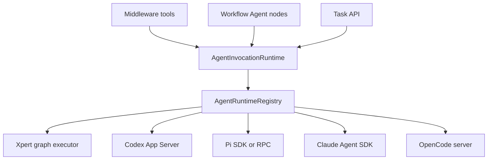

# Unified Agent Invocation

Status: core migration implemented in source; deployment and credential-backed provider acceptance remain separate. Updated 2026-09-22.

## Decision

Introduce an AgentInvocationRuntime and plugin SDK execution strategies. Middleware tools, workflow Agent nodes and background tasks are callers of the same runtime. They do not own another Agent's graph, process, session or protocol.

An Agent target is an executable entry plus its dependencies and version, not a bare node object. Local sub-agents and Collaborators remain authoring concepts; both resolve to an Xpert target. Codex, Pi, Claude Code and OpenCode use provider strategies supplied by native plugins in the xpert-plugins repository. Standard Agent Plugin packages may reference approved bindings but cannot load server code.



## Boundaries and contracts

- AgentBinding is an authorized logical target with presentation metadata, configuration revision, input/output contract and resource references.
- ResolvedAgentTarget fixes the provider source/version, target revision and runtime configuration for one invocation.
- AgentSession identifies the target's continuing context. Invocation identifies one logical caller operation. A run/attempt is an actual execution attempt. These identities must not be conflated.
- The SDK strategy contract contains portable inputs, results, events, handles and capability declarations. No StateGraph, Runnable, CommandBus or ORM types cross that boundary.
- AgentInvocationRuntimeCapability exposes host-governed invocation to plugins. AgentRuntimeRegistry discovers implementations using the existing scoped BaseStrategyRegistry.
- Resolve a provider once and pin its source. Removal or upgrade must never silently fall back to a different implementation during recovery.

## Native compatibility

An Xpert target contains the Assistant execution revision and entry agentKey. Collaborators use accessible published targets; same-Assistant calls retain their execution snapshot. The host-native graph adapter owns compilation, state mapping and checkpoint propagation. Subgraphs remain a valid internal implementation of the Xpert strategy.

Preserve tool names, interruptBefore, endNodes, parent/child execution lineage, cancellation signals, memory writes, project/workspace context and the existing state channel projections. Legacy shared-state behavior is an explicit native compatibility path. New portable targets receive explicit input/context and file references, not the entire parent graph state.

Replace middleware delegation symbols with ordinary callable tools only after equivalent graph interruption and output projection tests pass. Workflow calls use the same runtime without asking an LLM to invoke a tool. AssistantTask remains a compatible facade; its underlying executor must not call back into that facade and recurse.

## Lifecycle and reliability

1. Validate caller, organization, workspace/project, target and current resource permissions.
2. Persist an invocation and immutable target snapshot before dispatch. The idempotency key includes the parent execution and call site/toolCallId.
3. Persist provider handles and lifecycle events. A repeated parent call attaches to its original invocation.
4. Return results or pause at a durable wait boundary. Parent recovery reconnects to the same run.
5. Revalidate permissions before dispatch, recovery and interactive responses. Revocation prevents further controlled actions.

Statuses distinguish queued, running, waiting for input, cancel requested, succeeded, failed, cancelled and unknown. A disconnected observer does not cancel the run; cancellation requires provider confirmation. An ambiguous launch must be reconciled rather than automatically retried. Exactly-once remote side effects are not promised.

Declare recovery capabilities as checkpoint, session or none. A session continuation is not exact checkpoint recovery or filesystem rollback. Event replay, interaction and cancellation support are also explicit capabilities.

The graph adapter provides a generic wait/resume bridge. A long-running tool must not require an LLM polling loop. Background invocations return a task reference. Persistent provider sessions default to a single writer. Parallel coding tasks use isolated workspaces unless a sharing policy explicitly permits otherwise.

## Provider implementations

| Provider        | Interface                  | Notes                                                     |
| --------------- | -------------------------- | --------------------------------------------------------- |
| Xpert           | Host-native graph executor | Published revisions, state mapping and checkpoints        |
| Codex           | App Server stdio           | Thread/turn lifecycle, bidirectional approvals and events |
| Pi coding agent | SDK or RPC                 | Session lifecycle and streamed agent events               |
| Claude Code     | Claude Agent SDK           | Tool loop, permissions and session continuation           |
| OpenCode        | HTTP API and events        | Session, asynchronous prompt, permissions and abort       |

Use managed runtime profiles and credential references. Do not accept arbitrary commands, URLs or credentials from model arguments. Reuse managed queues and sandbox infrastructure where appropriate; bidirectional sessions require an explicit transport owner. Infrastructure plugin installation scope is independent of business binding scope.

## Migration

1. Add shared SDK contracts, registry, host invocation runtime, persistence and Xpert adapter. Route native sub-agent and Collaborator calls through this boundary with compatibility tests.
2. Unify callable tools, workflow calls and task facade; implement idempotent waiting, interactions, cancellation and recovery. Remove getMiddlewareDelegations when its callers have migrated.
3. Implement and validate external provider plugins in xpert-plugins. Establish the contract with Codex and Pi, then add Claude Code and OpenCode without provider branches in the Agent graph builder.

## Acceptance

- Local Agent and published expert calls retain result/state, end-node, interruption, authorization and cancellation behavior.
- Tool and workflow callers use the same invocation boundary.
- Concurrent/repeated dispatch cannot start duplicate children; checkpoint recovery preserves child identity.
- Target/provider revision changes and cross-scope access fail explicitly.
- Unknown launch outcome does not trigger blind retries.
- Provider interaction and cancellation are distinct from stream disconnection.
- A new provider is implemented in a plugin without editing Agent graph construction.
- Verify plugin build, protocol contracts and lifecycle loading. Report protocol fixtures separately from credential-backed live runs.

## Official interface references

- [Codex App Server](https://developers.openai.com/codex/app-server)
- [Pi RPC](https://github.com/earendil-works/pi/blob/main/packages/coding-agent/docs/rpc.md)
- [Claude Agent SDK](https://code.claude.com/docs/en/agent-sdk/overview)
- [OpenCode server](https://opencode.ai/docs/server/)

## Verification record

On 2026-09-22: server-ai TypeScript check passed; SDK/contracts build passed;
8 targeted host suites passed (121 tests); 7 provider protocol tests and the
dist-first plugin lifecycle check passed.

The targeted host suites cover native graph routing, Collaborators selection,
interruptBefore/endNodes, interrupts inside expert graphs, permission revocation,
Task compatibility, operation identity, concurrency, provider pinning, project
access, owner-scoped controls and checkpoint waiting. The external plugin suite
uses actual JSONL subprocess transport, a local HTTP service, and an injected
Claude SDK. These are protocol fixtures, not live model/account acceptance.

Validated commands:

```sh
# xpert
corepack pnpm exec tsc -p packages/server-ai/tsconfig.lib.json --noEmit
NX_DAEMON=false corepack pnpm nx build plugin-sdk --skipNxCache
# Targeted Jest suites under agent-invocation, collaborators, subgraph.handler,
# and middleware-runtime.service (use --runTestsByPath).

# xpert-plugins/xpertai, after building the host SDK and contracts
XPERT_PLATFORM_ROOT=/path/to/xpert NX_DAEMON=false corepack pnpm exec nx run agent-runtimes:verify
```

The plugin verifier builds from fresh dist packages in an isolated temporary
workspace, runs protocol tests and `plugin-dev-harness`, then removes its fixture.
It does not launch a real Codex/Pi/Claude agent, use third-party credentials,
apply a database migration, install the plugin into the running host or restart
services.

## Delivered source layout

| Layer              | Implementation                                                                                                                                     |
| ------------------ | -------------------------------------------------------------------------------------------------------------------------------------------------- |
| SDK                | `packages/plugin-sdk/src/lib/agent/runtime`: portable contracts, strategy decorator, scoped registry and capability                                |
| Host runtime       | `packages/server-ai/src/agent-invocation`: authorization, immutable target, atomic reservation, CAS revisions and transactional observation ledger |
| Native graph calls | `AgentInvocationGraphService`, `NativeAgentCompiler`, `native-graph-adapter`, `graph-tool`                                                         |
| Native Task calls  | `assistant-task-adapter` plus the existing `AssistantTaskRuntimeService` facade/private transport                                                  |
| Plugin consumer    | `AgentInvocationFactoryService` registered into the Agent's scoped runtime capability registry                                                     |
| External execution | `xpert-plugins/xpertai/integrations/agent-runtimes`: Codex, Pi, Claude Code and OpenCode strategies plus an ordinary tools middleware              |

The old `getMiddlewareDelegations` symbol channel is removed. Local followers,
workflow Agent nodes and Collaborators now enter the same invocation runtime.
Xpert's graph strategy keeps host-owned state projection and checkpoints. The
native Task strategy (`xpert-task`) keeps its existing conversation/Redis-stream
transport; it does not call the public `startTask` facade recursively. Tool names,
file/skill selection, model selection, correlation and return fields remain
compatible. An explicit operation/client-message/execution ID provides Task
idempotency; a recurring schedule ID alone does not identify a single run.

Only the runtime writes invocation status. Each successful database reservation
or CAS update appends an `agent_invocation_event` in the same transaction. Events
contain state/receipts, not an unrestricted provider debug stream. Provider
completion callbacks persist outcomes even when the parent graph is paused.

## Operator API and execution flow

Organization administrators use these host endpoints:

- `GET /api/agent-runtime-bindings`: list organization bindings.
- `POST /api/agent-runtime-bindings`: create `{title, workspaceIds, provider, reference, configuration}`. Workspace IDs must belong to the current organization. Native Xpert providers cannot be forged through this endpoint.
- `PUT /api/agent-runtime-bindings/:id`: change `{enabled}`. A configuration/version replacement creates a new binding.

A binding's `reference` is a provider profile ID; for the supplied external
strategies, configuration contains `{profileVersion}`. Commands, URLs and secrets
are not model parameters. Profile configuration belongs to the system plugin;
binding grants belong to the organization. Both workspace grants are checked.

Attach the plugin's `AgentInvocation` middleware with a list of
`{id, name, description, mode}` binding entries. Each entry produces an ordinary
prompt tool. `mode: wait` delegates waiting to the host checkpoint adapter;
`mode: background` returns the invocation ID. No provider-specific branch is
added to the Agent graph builder.

The execution owner can inspect all invocations and control external provider invocations:

- `GET /api/agent-invocations/:id`
- `POST /api/agent-invocations/:id/cancel`
- `POST /api/agent-invocations/:id/respond` with `{interactionId, response}`

These routes recover identity from the authenticated owner and stored invocation.
External provider controls revalidate the calling Assistant, workspace, optional
project edit access, binding availability and pinned configuration. Native graph
and Task inspection reads the persisted observation after validating current
Assistant access, tenant, workspace and optional project access. Native graph
inspection also checks access to the parent execution. It does not query the
external binding table, poll a provider, change the observation or resume a graph.
The stored provider field determines this dispatch; binding-name prefixes are not
used as a type discriminator. Native graph/task controls retain their established
host routes; the external cancel/respond routes return HTTP 422 for native targets.
Approval responses are claimed before delivery;
a stale response is not delivered again. An uncertain response delivery must be
reconciled, not silently repeated.

The wait adapter emits an `agent_invocation` interrupt. Resume the existing parent
run through the host's established resume route after completion, or provide
`{interactionId, response}` for a provider interaction. It reads the same record
and never launches another process merely because the parent was resumed.

## Current provider limits

This version is a usable extension boundary and native migration, not a claim
that all providers offer identical recovery guarantees:

- Codex App Server, Pi RPC and Claude SDK runners are owned by the plugin process. A lost runner yields `unknown`; no automatic launch retry occurs. Exact host-worker crash recovery/leases are not implemented for these processes.
- OpenCode can reconnect to its server session and find the response by the persisted message ID. It never re-sends an ambiguous prompt. Approval support is not advertised by this adapter.
- Pi extension UI is unsupported; Claude `AskUserQuestion` is denied explicitly. Codex command/file approvals and Claude permission callbacks are supported.
- File references require a materialization adapter and currently fail before external launch. Multi-invocation session continuation and automatic file synchronization are not included.
- Wait/resume uses existing host control routes. A completion-triggered background wake-up scheduler and new approval UI are not implemented here. The parent stays checkpointed until resumed; there is no LLM polling loop.
- Process work directories are isolated by caller/invocation, but directories are not OS sandboxes. Provision trusted worker/container profiles before enabling local coding agents. OpenCode must be provisioned with the intended file isolation on its server.
- Grants are rechecked on host-controlled actions. Revoking a grant does not roll back or automatically interrupt an independently running third-party operation.

These limitations are explicit capability/rollout boundaries. Do not hide them
behind a successful protocol test or label an unknown run as completed.

## Deployment and rollback

1. Apply `packages/server-ai/src/agent-invocation/migrations/20260922-agent-invocation.sql` before this backend version. It creates invocation, observation-event and binding tables without rewriting existing resources.
2. Deploy the compatible backend and publish the SDK containing the new strategy/capability API. Existing clients need no composer changes for native migration.
3. Update the external plugin's peer range to that published SDK release and remove its temporary `private` flag. Build/package it from dist, then install at system scope with administrator-managed profiles.
4. Create organization bindings, authorize workspace access and add the tools middleware. Start with a read-only test profile; perform model/account and isolation acceptance for each enabled provider.
5. Native checkpoint/Task transport and published Assistant configurations remain the source of their execution semantics. This migration does not rewrite Assistant drafts or published graphs.

To stop new external use, disable bindings first. Drain or explicitly cancel active
runs before removing/replacing a provider plugin; a provider-version mismatch
blocks continuation instead of selecting a fallback. Preserve invocation records
and the event ledger when rolling back application code. The SQL migration is
additive and has not been applied as part of this source change.
