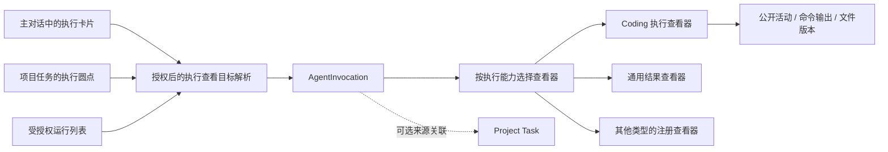

# 独立 Coding CLI 执行查看器

日期：2026-10-06  
状态：可行性分析与产品设计，未实施。  
范围修正：本文取代上一版设计中以任务为中心的执行详情及导航身份；原有 ChatKit 自动接收后台回答的方案继续有效。

2026-10-07 更新：基于 Qwen/Codex/OpenCode 的当前实现，新增[调查与实施计划](2026-10-07-coding-cli-execution-view-implementation.md)。实施范围和顺序以新文档为准：优先复用已有插件扩展点，首版分页轮询、只读观察，暂缓专用 SSE、交互操作和完整 Diff/测试工作台。本文保留产品定位、证据边界及原型参考。

## 1. 产品定位

用户要查看的是“一次 Coding CLI 到底做了什么、正在做什么、产生了什么”，而不是再次打开任务详情。

建立独立的 **Coding 执行查看器**，以平台 `invocationId` 为定位身份。它可以从主对话的运行卡片、项目任务的执行圆点、受授权的运行列表进入。Project Task 只是可选来源，缺少项目任务不影响运行过程读取和展示。

任务管理与运行观察分别回答两个问题：

- 任务：要达成什么、谁负责、何时完成、是否接受结果。
- 执行：哪个 CLI 在哪个环境运行、收到什么指令、调用了哪些工具、改了哪些文件、执行了哪些命令、返回了什么。

## 2. 现有基础与可行性

| 当前实现                                                                                                | 判断                                                                                                   |
| ------------------------------------------------------------------------------------------------------- | ------------------------------------------------------------------------------------------------------ |
| `AgentInvocation` 已独立存在，ProjectTaskExecution 通过 invocationId 关联它                             | 无需新增另一套运行身份或执行状态账本。                                                                 |
| `InvocationResultsProvider` 已在 agent-invocation 下提供独立 View，以 selectionId=invocationId 读取结果 | 可复用 View 注册、授权、iframe 与产物读取机制。当前只展示最终结果，还不是完整执行查看器。              |
| 外部 agent-runtimes 的 result-cards 已能打开 `platform.agent-results__results`                          | 导航基本路径已存在；需增加从派发开始就可用的运行入口，不只在终态展示结果项。                           |
| OpenCode Adapter 已读取 session messages / parts，并匹配当前 run 的 parentID                            | 可在该边界规范化公开执行活动。正式实现前须用固定版本真实回执验证 message/part ID、工具字段和输出格式。 |
| OpenCode 当前只投影开始时间、阶段和最终文字，结果提交后停止 runner                                      | 必须在运行中收集过程，并在清理前完成最后一轮采集。事后打开 CLI 服务无法作为可靠历史方案。              |
| Codex / Claude Adapter 已接收协议消息，但目前只使用其中的文字、终态或交互信息                           | 后续可增加相同活动投影；不能声称当前已具备完整日志或与 Computer OpenCode 等同的环境能力。              |

结论：可行，主要新增工作是**执行活动采集与保留、独立读取接口、Coding 查看器**。项目任务只改关联导航。不能仅靠更换任务详情布局达到目标。

### 2026-10-06 技术核查补充：先证明数据，再承诺界面

本轮核查本地实现、OpenCode 官方 Server 文档及固定版本 `v1.18.33` 的源码；没有重新启动 Computer 或发起新的模型执行。因此以下是协议/源码可行性结论，不代表过程采集已经完成端到端验收。

| 数据               | 已核实来源                                                                                                                                | 展示限制                                                                                                         |
| ------------------ | ----------------------------------------------------------------------------------------------------------------------------------------- | ---------------------------------------------------------------------------------------------------------------- |
| 公开消息与工具过程 | session messages 的 text/tool parts；tool 含 callID、input、状态、output、metadata、起止时间                                              | 现有 Adapter 读取消息，但尚未把完整过程写入平台。                                                                |
| 命令与输出         | OpenCode 1.x 的 ShellTool（兼容工具名 bash）接收 command/workdir，运行中更新 metadata.output，完成后包含 exit/truncated/outputPath 等字段 | 输出为合并流；运行中是有长度上限的尾部预览，不是可无损拼接的 delta。                                             |
| 修改差异           | EditTool 的 metadata.diff / filediff                                                                                                      | WriteTool 完成元数据主要为 filepath/exists；不能宣称所有写入都有同样的 patch。通过 shell 修改也需另行捕获。      |
| Session Diff       | 官方 diff 接口及消息 summary.diffs；快照实现检查 Git 环境与 snapshot 配置                                                                 | 非 Git、关闭快照、共享工作区并发等场景不能保证获得属于本次运行的完整差异。                                       |
| 测试统计           | 命令的实际输出或测试框架报告                                                                                                              | 增加 TAP/JUnit/JSON 等明确格式的解析与完整性校验后，才展示计数；CLI 总结只作为 CLI 的陈述。                      |
| 实时事件           | 官方 `/event` SSE、message.part.updated / message.part.delta                                                                              | 当前 Computer transport 只允许有限 session JSON 操作，不能直接代理该 SSE；需增加专用传输，或先实现累计快照对账。 |

当前 Computer 的请求桥限制响应为 4 MiB，且不允许 query 参数。完整过程采集还需要受约束的分页/增量读取契约，不能长期全量拉取所有消息。通过该桥的请求仍需绑定 invocation 与授权运行回执，不能开放任意 URL。

当前执行配置将 XDG_DATA_HOME 指向运行临时目录；进程退出后 supervisor 删除该目录。service 模式还将 CLI 服务进程的 stdout/stderr 丢弃。因此不能承诺从 Docker logs 或清理后的 CLI 会话补出全部历史，必须在运行中持久化并在停止前完成最终采集与长输出归档。

原型修正约束：OpenCode 首期统一显示“命令输出（合并）”，只有明确支持分流的 Adapter 才提供 stdout/stderr 切换；缺少可验证 patch、完整日志或测试报告时，显示可用范围，不填充示意数据。

正式界面实施前先做一条真实数据验证：在受管 Computer 的隔离工作目录中执行读取、Edit/Write、成功/失败命令、长输出、测试，保存脱敏协议样本并建立字段覆盖表；再验证停止 CLI 后记录仍可读取、断线后不重复、无需关联项目任务也能打开。通过后按真实能力收敛界面。

## 3. 模块与身份



| 身份                                    | 含义与用途                                                                        |
| --------------------------------------- | --------------------------------------------------------------------------------- |
| projectTaskId                           | 业务任务。用于回到任务，不用于定位 Coding 过程。                                  |
| taskExecutionId                         | 任务与某一次执行的关联/尝试记录。圆点先据此解析真实 invocation。                  |
| invocationId                            | 平台的一次执行，查看器的规范身份和授权资源。                                      |
| providerSessionId                       | CLI 内部会话，可包含多次运行；仅由 Adapter 解释，不作为全局路由。                 |
| providerRunId                           | CLI 内部的 turn/run，标定本次过程边界。                                           |
| parentExecutionId / consumerExecutionId | 主 Agent 的派发与结果消费执行，作为来源或后续处理链接。绝不能当成 CLI 的执行 ID。 |

首期按照一次 invocation 显示一次运行；今后复用 CLI session 时，仍不能把整个 session 的其他运行混入本次记录。

### 依赖方向

- Project Tasks 依赖通用运行能力，持有执行引用。
- Coding 查看器依赖 AgentInvocation、活动读取和授权文件读取，不导入 ProjectTaskService，不依赖任务完成逻辑。
- 项目任务链接由宿主关联投影提供；Viewer 渲染可选链接，不自行查询任务表。无权限时隐藏链接，运行本身的授权单独判断。
- Runtime Adapter 解释自己的协议；宿主保存规范化事实；ChatKit 负责打开和挂载查看器。
- 保留原“任务详情”。任务标题仍打开任务；执行卡片或执行圆点明确标为“查看 Coding 执行”。

## 4. 查看器如何选择

业务 taskType 可以指导委托和标签，但不应单独决定查看器。一个 Coding 任务也可能先由普通 Assistant 调研，再由 CLI 实现；一个非 Coding 任务也可能调用 CLI。

在可信 Runtime 扩展元数据中声明展示能力，注册执行查看目标解析器。以下是拟新增契约，不是现有字段：

```ts
type ExecutionPresentation =
  | { kind: 'coding'; viewerKey: string; activity: 'none' | 'snapshot' | 'events' }
  | { kind: 'generic'; viewerKey: string }
```

viewerKey 只可指向已注册、获授权的 View；生产时还要补充独立的 commands、fileChanges、testReports、interactions 等明确能力声明，不能从 CLI 名称、工具文本或任务标题推断。

打开过程：

1. 消息卡片携带已提交的执行资源引用；任务圆点携带任务执行关联引用。
2. 宿主解析 invocation 并检查调用者、组织、会话及运行权限。
3. 根据已注册且可用的展示能力返回 View target，selectionId 使用 invocationId。
4. ChatKit 打开同一个 Coding View；可选参数只包含被校验的 tab/itemId/fileChangeId 等定位信息。

插件移除或特定查看器不可用时，降级显示已持久化的通用运行结果及能力缺失说明。既有结果卡片继续兼容，不强制所有 Runtime 使用 Coding UI。

### 推荐落点

- 在 `agent-invocation` 的独立子目录下放置执行读取、活动持久化、展示目标解析与 Coding View；沿用内置 Plugin/View 注册机制。
- Adapter 改动放在 `xpert-plugins/xpertai/integrations/agent-runtimes`，不把 OpenCode 私有协议写进 Project Tasks。
- 复用现有通用结果 View 作为兼容与降级页面；新增按需打开的 Coding View，而不是把 Task Results 直接改造成所有执行器都必须使用的 Coding 页面。
- 新 ChatKit API 在 `/api/ai` 下提供显式作用域校验，SDK Client 增加对应方法；不把现有管理 controller 直接开放给 client secret。

## 5. Coding View 的产品结构

### 顶部：本次运行

标题如“OpenCode · 字符串规范化”，次级信息为 CLI/版本、模型（有实际记录才展示）、Computer 环境、相对工作目录、运行状态及真实耗时。

来源作为轻量链接“来自项目任务：字符串规范化”；也可以显示“来自 Assistant 对话”。无项目任务时省略该链接。

不要以任务状态、计划时间、验收次数或主 Agent 完成决定占据顶部主体。运行 succeeded 只标注“运行结束 / 执行成功”，不标注“任务完成”。

### 默认主体：执行过程

首屏直接进入 CLI 的公开过程，按真实顺序呈现：

1. 本次指令：宿主允许展示的指令与输入摘要，敏感上下文不直接透传。
2. CLI 公开输出：解释接下来做什么、阶段性发现；不展示私有推理。
3. 读取/搜索：工具名、目标文件或查询、状态、耗时，长结果折叠。
4. 文件编辑：路径、变更类型，点击打开当次可验证的修改内容。
5. 命令执行：命令、工作目录、输出、退出状态；默认显示尾部，可展开已捕获内容。OpenCode 首期标注合并输出，stdout/stderr 分流按 Adapter 明确能力提供。
6. 测试：优先展示实际命令及输出；只有结构化报告才能显示测试数量和分类。
7. 最终答复：CLI 自己的总结、产物链接及执行退出事实。

同一个工具操作从运行中更新为完成，不追加重复操作。公开文字累计快照更新同一消息；有可靠 delta 游标时才按片段追加。可开启/暂停自动跟随；用户翻阅旧输出时保留位置。

### 次级阅读区域

| 区域       | 内容                                                            | 边界                                                                    |
| ---------- | --------------------------------------------------------------- | ----------------------------------------------------------------------- |
| 文件改动   | 本次新增/修改/删除文件、可验证的 patch 或前后版本、关联工具调用 | 不把整个共享工作目录的 git diff 当作该执行的改动。                      |
| 命令与测试 | 实际命令、输出、退出码、耗时、测试报告                          | exitCode=0 不自动等于所有需求通过。没有结构化报告就只展示原始命令结果。 |
| 运行信息   | 运行指令摘要、执行器版本、环境、起止时间、记录完整性和错误      | 诊断字段按需展开，不暴露令牌、模型密钥、内部进程句柄。                  |

“最终结果”保留在过程底部，并提供快速跳转，不一定另设一个占据首屏的结果仪表盘。

### 操作

- 首期默认只读观察，支持跟随输出、查看修改、查看命令输出、回到来源。
- 支持且获授权时允许“停止本次运行”；关闭页签不等于停止运行。
- 等待批准或输入仅在 Adapter 已声明交互能力时显示，必须绑定仍有效的 interactionId；OpenCode 当前不因此自动获得交互能力。
- 不放置“完成任务”“任务返工”等业务操作；由来源链接回任务功能处理。
- 不默认提供一个可自由输入命令的终端。后续若增加与 CLI 继续对话，必须另行定义 session continuation、授权和与主 Agent 的输入仲裁。

### 项目任务中的入口

任务本身保留名称、业务状态与负责人。其执行条目显示具体执行器、用途、状态和“查看 Coding 执行”。同一任务多次运行时，圆点各自解析到对应 invocation，不默认跳到最后一次。

主 Agent 的消息也使用相同运行资源卡片，来源是运行本身；无需先创建任务才能出现这张卡片。结果回传后的主 Agent 回答仍留在主消息列表，Coding 查看器中提供“查看主 Agent 后续处理”的次级链接即可。

## 6. 过程数据：采集与保留比页面布局更关键

### 通用活动投影

在 SDK 定义有版本的活动契约，最少包含：invocationId、宿主递增序号、稳定上游对象标识、对象 revision、kind、occurredAt/observedAt、parentItemId 和类型专有内容。

kind 可以包括公开 Agent 消息、工具操作、命令、文件变更、结构化测试报告、产物、等待交互、运行状态和安全诊断。所有分类来自 Adapter 的明确映射，不从自然语言猜测。

状态账本仍是 AgentInvocation；活动记录是观察与历史，不通过解析日志反向改写业务任务状态。

### OpenCode 首期采集

采用宿主后台采集器，从已保存的 session/run 句柄增量读取/对账消息和 parts。当前固定版本的 message/part 结构先做真实回执验证；若未提供稳定事件流，先以周期读取累计对象的方式完成，不承诺逐 token 实时。

- 只保留属于当前 run 的消息和工具记录，明确解析 parent 链，不能抓取 session 中所有历史。
- 用上游稳定 item 标识与 revision/hash 去重；保留记录顺序与上游时间，不伪造早于首次观测的时间。
- 短期优先保证 1–2 秒级可见更新这一验收目标；若提供者或资源开销不允许，显示观测时间并调整目标，不用动画伪装实际进展。
- 后续支持原生事件订阅时，可增加 `readActivity(cursor)` 或宿主 `recordActivity(batch)` 扩展，共用同一持久化入口和规范化模型。
- 每个运行只由一个持租约的后台采集器读取，多个观看者共享结果；没有用户打开 View 时也继续记录。

### 结束与故障

运行结果提交后、停止 CLI 前，做最终活动收集并持久化 complete/partial 及最后游标，再清理执行进程。活动写入失败不能伪造完整历史，也不应把已经成功的代码执行改为失败；有界重试后保留缺口说明和清理状态。

停止 CLI 不等于删除宿主已保存的历史。页面关闭、刷新、API 进程重启后，已保留的记录仍可查看。无法恢复的进程不能因为查看详情而自动重跑。

### 文件与 Diff

工具报告“修改了文件”与持久化 patch/文件内容是两种证据。Viewer 区分报告、已捕获修改、当前工作区文件和已提交 Artifact。

若执行器提供可靠 patch，保存其上下文与归属；否则需要运行前基线和运行后快照，或者隔离工作区，才能计算该次变更。不能默认用 HEAD 与当前目录之差，因为可能混有用户未提交修改和并行执行。

点击文件首先展示该执行已捕获的版本；若只能打开当前工作区，明确标注“当前内容，可能与运行时不同”。未捕获内容时只展示路径和可用范围。

### API 与推送

独立提供运行详情、活动分页、活动订阅和授权变更/文件读取。调用都通过 SDK Client；Remote View 通过宿主 bridge 获取已授权数据，不持有 CLI token 或直连 Computer 内部端口。

快照与增量使用一致性水位，断线按游标恢复，裁剪/过期返回明确重新同步或缺口状态。大输出分段存储并分页读取，保留截断与日志保留期提示，不把整段 stdout 塞进卡片或 Invocation JSON。

与主 ChatKit 的 thread 活动订阅是两个作用域：主对话按 thread 观察主 Agent 后续回答；Coding View 按 invocation 观察 CLI 过程。两者可以共享传输基础设施，但关闭或切换一个不应影响另一个。

## 7. 解耦的实际验收标准

- 普通 Assistant 直接调用 OpenCode，未关联 Project Task，运行卡片仍能打开相同 Viewer。
- 同一个 invocation 从主对话和任务圆点进入，显示相同公开过程、文件版本和游标。
- 首期只覆盖平台注册并发起的调用；不自动扫描用户终端中的任意 CLI 会话。外部会话导入要有独立的授权绑定流程。
- 项目任务改名、修改计划或完成后，运行历史仍显示自己的事实和运行时输入，不被覆盖。
- 项目关系移除不自动获得或取消运行权限；按独立执行资源的授权与保留策略决定可见性。若产品要求删除关联任务时同步删除历史，需定义显式策略。
- 主 Agent 回调发生在运行结束之后，主对话持续流出；CLI Viewer 不冒充正在运行的主 Agent。
- 执行进程已清理后，仍可重放已保存的公开消息、工具与命令记录；缺失部分明确标记。
- 无法查看他人的私人 Computer 记录时显示访问受限，而不是任务失败或空日志。

## 8. 建议实现顺序

1. **真实数据验证**：先在固定版本 Computer OpenCode 采集公开消息、工具、命令、修改与测试的真实协议样本，验证失败、长输出和缺失字段；形成可展示字段与限制清单，再确认 Viewer 能力契约。
2. **独立运行数据能力**：统一 invocation 定位、后台采集、持久活动、末尾收集、订阅恢复、授权读取及展示目标解析，保证进程停止后仍可读取；验证不依赖任务的直达场景。
3. **Coding 阅读体验**：公开消息与工具过程、命令输出、真实文件修改和测试来源；同步接入任务圆点与主对话卡片。跨 CLI 的验证仍作为后续工作。

首期不需要微服务拆分、不需要嵌入 OpenCode 原生 Web UI，也不需要复制一套任务系统。保持现有内置 View 机制，并将运行观察能力放到独立子功能中即可。

## 9. 原型约束

三种布局只探索 Coding 过程的阅读方式，沿用现有 ChatKit 双栏和主题。右侧主标题为 Coding/CLI 执行，不再是任务详情；关联任务只是可选来源链接。

首屏必须出现 CLI 的公开说明、文件/工具操作、命令输出或 patch 之一；不以任务目标、计划进度、回传四阶段、验收决定等组成首页。所有画面数据为布局示意，生产展示必须遵循本文证据边界。

### 本轮原型

已使用 Product Design 插件生成三个独立的静态原型，编号按对话中的展示顺序对应。它们展示的是同一个独立 Coding Viewer 的候选阅读布局，不是三个需要分别建设的功能。

- [原型 1](assets/2026-10-06-coding-execution-option-1.png)
- [原型 2](assets/2026-10-06-coding-execution-option-2.png)
- [原型 3](assets/2026-10-06-coding-execution-option-3.png)

图片已检查：执行详情是主体，关联任务为来源链接，主对话保留独立的回传后续回答。图片中的代码、日志、时间与测试数字仅为视觉示意，不是验收证据或可直接使用的实现。实施时，输入来源必须由真实委托记录标识；橙色选中态不能被理解为运行中状态，运行状态仍以明确标签表示。

本轮未修改运行逻辑或前端业务代码，布局选择后再细化组件与接口。

## 源码依据

- `packages/server-ai/src/agent-invocation/invocation-results.provider.ts`
- `packages/server-ai/src/agent-invocation/remote-components/agent-results/src/main.ts`
- `packages/server-ai/src/agent-invocation/invocations.controller.ts`
- `packages/plugin-sdk/src/lib/agent/runtime/strategy.ts`
- `packages/plugin-sdk/src/lib/agent/runtime/types.ts`
- `../xpert-plugins/xpertai/integrations/agent-runtimes/src/lib/result-cards.ts`
- `../xpert-plugins/xpertai/integrations/agent-runtimes/src/lib/opencode.strategy.ts`
- `../xpert-plugins/xpertai/integrations/agent-runtimes/src/lib/codex.strategy.ts`
- `../xpert-plugins/xpertai/integrations/agent-runtimes/src/lib/claude.strategy.ts`
- `packages/server-ai/src/computer/cli/computer-runner-http.ts`
- `packages/server-ai/src/computer/cli/computer-cli-program.ts`
- `packages/plugins/cli-model-profiles/src/index.ts`
- [OpenCode Server 官方文档](https://opencode.ai/docs/server/)
- [OpenCode v1.18.33 的消息与工具 Schema](https://github.com/anomalyco/opencode/blob/v1.18.33/packages/schema/src/v1/session.ts)
- [OpenCode v1.18.33 ShellTool](https://github.com/anomalyco/opencode/blob/v1.18.33/packages/opencode/src/tool/shell.ts)
- [OpenCode v1.18.33 EditTool](https://github.com/anomalyco/opencode/blob/v1.18.33/packages/opencode/src/tool/edit.ts)
- [OpenCode v1.18.33 WriteTool](https://github.com/anomalyco/opencode/blob/v1.18.33/packages/opencode/src/tool/write.ts)
- [OpenCode v1.18.33 Snapshot](https://github.com/anomalyco/opencode/blob/v1.18.33/packages/opencode/src/snapshot/index.ts)
