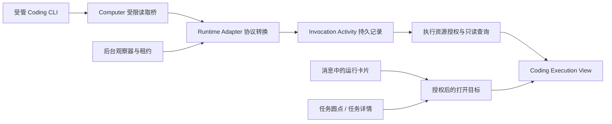

# 独立 Coding CLI 执行查看器：调查与实施计划

日期：2026-10-07  
状态：已实施，最终交互验收与发布记录见第 10 节。用户已授权连续实施和验收，无需逐步确认。  
前置设计：[2026-10-06 Coding 执行查看器](2026-10-06-coding-cli-execution-view.md)。本文收敛其实现范围和顺序；旧文档中的布局原型保留为参考。

## 1. 建议与首版范围

以 **一次 AgentInvocation** 为中心，新增独立的内置 Coding Execution View。Project Tasks 只提供来源关系和打开入口。无 Project Task 的受管 CLI 调用也能使用同一个查看器。

首版覆盖已经接入的 Computer Qwen Code、Codex 和 OpenCode。国内工具优先，以 Qwen 验证第一条完整链路，再验证另外两种协议。继续复用 Runtime Strategy、ResourceCardProvider、ViewExtensionProvider，不增加另一套任务账本或插件注册体系。

首版交付：

- 公开消息、工具调用、命令及已捕获输出、文件操作记录、最终结果和已有产物。
- 执行中自动更新；关闭页面后后台继续采集；进程清理后能阅读已保存的过程。
- 消息运行卡片、任务执行圆点、任务详情内的执行条目打开同一个 invocation。
- 明确区分执行成功、任务验收通过、记录是否完整。

暂不做：交互终端、批准/继续对话、新的停止操作、完整 Git Diff 工作台、结构化测试仪表盘、任意终端会话导入、专用 SSE 通道。现有停止能力仍保留在原入口。首版采用现有 Workbench remote component 实现，保持范围简洁。

## 2. 调查结果

以下第 2 节保留实施前的调查基线，不能作为上线后行为说明。实际契约、限额和行为以第 10 节及实现 README 为准。

### 2.1 已有基础与缺口

| 位置                               | 当前事实                                                                          | 实施影响                                                                                 |
| ---------------------------------- | --------------------------------------------------------------------------------- | ---------------------------------------------------------------------------------------- |
| `AgentInvocationEntity`            | 保存独立执行身份、scope、provider 来源、状态及结果                                | 继续作为执行状态唯一来源。                                                               |
| `AgentInvocationEventEntity`       | 保存 invocation revision 对应的 observation，主要是状态、handle、progress、result | 不是 CLI 过程日志，不向其塞入全部工具输出。                                              |
| `InvocationResultsProvider`        | 已提供 `platform.agent-results__results`，selectionId 为 invocationId             | 复用 View、bridge 和版本化产物授权模式，保留通用结果入口。                               |
| 上述 Provider 的 `read()`          | 读取后调用 Runtime API 的 `inspect()`；只支持 agent host                          | 新查看器使用无执行副作用的读取服务，并处理 agent/project 来源及通用 Project Agent 身份。 |
| `ProjectTaskCardProvider`          | 管理卡片创建和刷新；执行卡片的 resource.id 是 taskExecutionId，当前打开时间线     | 保留资源身份，转换导航目标；不能把 taskExecutionId 当 invocationId。                     |
| Project View 的 `execution-target` | 当前返回主 Agent 的 `assistant.execution` 目标                                    | 增加明确的 CLI 目标；保留“主 Agent 对话/后续处理”次级入口。                              |
| Runtime 插件的 `result-cards.ts`   | 终态之后按结果项生成通用结果/产物卡片                                             | 普通 CLI 调用还需要派发时的运行卡片；避免同次运行再次生成重复摘要卡。                    |
| `RuntimeObservationMonitorService` | 每 5 秒扫描带 `request.dispatch` 的 invocation，使用持久观察租约                  | 不保证普通、无 dispatch 的运行一直采集；扩展扫描资格并复用租约。                         |
| `AgentInvocationRuntime.control()` | 终态直接返回，不再调用 Adapter                                                    | 历史补采、终态收尾不能依赖再次 inspect。                                                 |
| Computer 后台清理器                | 终态、取消、授权撤销或过期均可能触发 stop                                         | 必须协调采集与清理，不能只在页面或 Adapter 的 stop 前临时读一次。                        |
| ThreadActivityService              | 发现主 Agent 后续运行、刷新已提交的 Resource Cards                                | 继续只做原职责；不解析 CLI 事件，不承载命令输出。                                        |

### 2.2 三种 CLI 实际能提供什么

版本依据当前 Runtime/Profile 配置：Qwen `0.24.7`、Codex `0.159.2`、OpenCode `1.18.33`。以下“来源可用”不等于“平台已经保留”。

| CLI      | 已核实的过程来源                                                                                                                              | 首版可以展示                                                     | 限制                                                                                                                      |
| -------- | --------------------------------------------------------------------------------------------------------------------------------------------- | ---------------------------------------------------------------- | ------------------------------------------------------------------------------------------------------------------------- |
| Qwen     | `stream-json` 的 assistant 文本、`tool_use` 和 user `tool_result`；本地验收样本已有稳定调用 ID、write_file/read_file/run_shell_command 等工具 | 公开文本、工具输入摘要、调用状态和输出；命令来自明确工具协议映射 | 当前 Profile 未开启逐 token partial messages；工具结果可能是预览，不能承诺完整 stdout；文件写入输入不是已成功落盘的证明。 |
| Codex    | `exec --json` 的 item.started/item.completed；本地样本已有 command_execution 的 command、aggregated_output、exit_code、status                 | 公开文本、命令开始/结束、已报告的输出和退出码                    | 文件事件字段需固定版本样本补验；不要预设包含 patch，不承诺命令内部输出逐字推送。                                          |
| OpenCode | session messages/parts；现有 Adapter 按 assistant.parentID 匹配本次 run                                                                       | 公开文本、工具生命周期、命令累计输出；有可靠字段时展示修改内容   | 当前桥不支持原生 SSE 或 query 参数；长会话的分页、单消息更新及响应上限须补齐。输出快照不能直接当 delta 拼接。             |

Qwen 和 Codex 的本地样本只读取字段形状及事件类型，没有将机器标识、原始工具内容或凭据写入本文。新版本样本覆盖、失败/长输出用例仍是实施第 1 步的验收项。

官方依据：[Qwen Headless Mode](https://qwenlm.github.io/qwen-code-docs/en/users/features/headless/)、[Codex non-interactive JSON events](https://developers.openai.com/codex/noninteractive/)、[OpenCode Server](https://opencode.ai/docs/server/)。这些文档确认协议方向；实际字段以平台锁定版本及脱敏 fixture 为准。

### 2.3 当前历史数据不能补齐

Computer JSONL 桥将 events 保存在 Python 进程内存中，整体上限 2 MiB / 10,000 条，超限会失败；stderr 当前丢弃。Runtime 只从这些事件提取最终文本及终态，提交结果后停止 runner。OpenCode 的临时数据目录也会被 supervisor 清理。

已分离的 `executionDirectory` 目前用于每次执行的启动占位，并不是已经可读取的过程归档。业务 cwd 仍为 project root。查看器不能靠扫描 `agents/`、当前工程文件、Docker logs 或最终总结重建历史。

上线前的运行显示“此执行未记录过程”，同时保留已有结果及产物。不能用动画或推测日志填补。

## 3. 组件边界



| 组件                      | 负责                                             | 不负责                                          |
| ------------------------- | ------------------------------------------------ | ----------------------------------------------- |
| Computer runner/bridge    | 受控传输、运行位置、采集暂存、输出边界及清理     | 解释每家 CLI 的业务语义、决定任务完成           |
| Runtime Adapter           | 自己的版本化协议 → 公开活动；声明支持的活动类型  | 操作 ProjectTask、直接写平台数据库、生成整套 UI |
| agent-invocation/activity | 收集游标、幂等写入、授权读取、保存范围、收尾状态 | CLI 专有字段解释、任务验收                      |
| ResourceCardProvider      | 运行卡片创建、状态刷新及可信打开目标             | 每个观看者分别轮询 CLI                          |
| ViewExtensionProvider     | 注册并读取 Coding View，复用宿主主题及 bridge    | 改写 invocation 或决定业务 task 状态            |
| Project Tasks             | 任务/执行关联、业务验收、返回来源入口            | 作为 Coding 查看器的数据依赖                    |

首期功能放到 `agent-invocation/activity/` 和 `agent-invocation/execution-view/`，注册在现有所属 Module。只有出现实际模块边界需要时再拆 Module。插件协议转换仍放在 `xpert-plugins/.../agent-runtimes`。

## 4. SDK 的最小扩展

在现有 Runtime capabilities 中增加可选的、版本化活动声明，并在已捕获 invocation scope 的 context 中提供可选的 Activity 写入 capability。建议字段方向如下，实施前由契约测试固定最终命名：

```ts
activity?: {
  version: 1
  presentation: 'coding'
}
```

工具项可以有明确的 `detail.type: 'command' | 'file_change'`。未映射的工具只按通用工具显示；不能根据任务标题、自然语言、工具显示名猜类型。协议内稳定的工具 ID 可以由对应 Adapter 显式映射。

- `AgentRuntimeStrategy` 已是协议扩展点，首期不再引入独立 ActivityProvider 注册表或 ViewerResolver 注册表。
- 宿主提供作用域内的 `readCheckpoint()` / `append(batch)` 能力，返回已提交的源游标。Adapter 在现有 inspect 中复用已取到的协议数据，避免重复请求。
- 宿主绑定 invocationId、owner 和来源版本；插件不能在 batch 中指定另一位用户/另一次执行来写入。
- capability 不可用时旧插件照常运行；没有活动声明的 Runtime 使用通用结果 View。
- 启动时保存展示能力快照，历史读取不依赖插件仍可执行。内置 View key 由宿主决定，不接受模型生成的 URL。
- 首版只有 coding 与通用结果两条显式分支；未来有第二种真实专用查看器，再扩展展示契约。

## 5. 持久化与采集

### 5.1 独立活动记录

最少新增两类持久数据：

1. **Activity State**：每 invocation 一条，保存协议版本、采集游标、宿主序号、采集阶段、缺口原因和收尾期限。
2. **Activity 更新记录**：规范化的公开 item 版本，包含宿主 seq、上游 item ID/revision、首次顺序、observedAt，以及消息/工具/诊断的判别联合类型。

同一工具的 started/completed 更新同一个 item；使用稳定 ID 和版本/内容变更判定去重，游标与该批记录在同一事务提交。只记录内容变化，不把每次轮询当新事件。不增加第三套业务执行状态。

为兼顾分页和断线恢复，保留有界的 item 更新日志；首次读取按水位取各 item 的最近版本，后续按 seq 读取 upsert。界面用 item ID 合并、按首次顺序排列。大输出用现有平台文件存储保存不可变片段/快照引用，数据库只放有界预览与归属，不自动变成面向用户的 Artifact 卡片。

记录完整性与运行状态分开：采集阶段为未启用/采集中/收尾中/已关闭；另有缺口原因，例如上游截断、平台限额、运行丢失、存储失败、取消或历史未记录。“已完整采集”仅表示已取到该协议提供的公开记录，不表示完整终端转录或所有文件变化。

### 5.2 后台采集

- 扩展现有后台观察器：有 dispatch **或**声明了活动采集的运行均纳入观察。无任务、无网页观看者时也继续工作。
- 复用持久租约、续租与幂等提交。页面读取不触发 inspect，不为每个 Viewer 创建采集器；Agent 主动 inspect 与后台观察重叠时仍应去重并避免重复清理。
- 首版沿用约 5 秒采集节奏，View 每约 2 秒读宿主增量；接受数秒级可见更新，不承诺 1–2 秒端到端或逐 token。耗时请求完成后再安排下一次，避免重叠轮询。
- JSONL 增加受限的分页读取及已提交游标确认，避免反复传整个 events 数组。读游标与缓冲区标识绑定；缓冲丢失需报告 gap，不能从 0 假装恢复完整记录。
- JSONL 暂存改为有界文件/分块机制，API 断连时继续排空子进程 stdout。公开归档与 `/tmp` 凭据/控制文件分开；不用共享 project root 中的业务文件作为可信日志来源。
- 区分协议安全边界和“查看记录的配额”。仅因查看输出达到配额不能直接终止 CLI；保留缺口标记，尽力获取终态依据。若判定结果所需的协议证据丢失，返回未知/诊断，不能根据 exitCode 或模型完成句子伪造成功。
- OpenCode 首先对消息/part 累计快照做对账。固定版本若提供受约束分页则纳入 bridge 白名单；同时复查未完成 part。不可只取最新 N 条后声称完整。不能提供完整覆盖时明确 partial，不无限扩大 HTTP 上限。

### 5.3 正常收尾与异常清理

正常顺序：**最终过程采集并持久化 → 保存终态结果 → 停止 runner**。最终活动已保存或明确标记 partial 后，终态提交才能使其他后台清理器释放进程。

结果提交后 API 崩溃、取消、授权过期、Computer 丢失也要覆盖：

- 使用独立 Activity 收尾状态和有界期限，不靠终态后再次 `inspect()`。
- 正常完成时短暂协调 cleanup 与 finalization；收尾失败有界重试，失败诊断独立于原执行结果。
- 授权撤销、绝对超时、用户取消必须及时终止，不能为了补日志保活或续权。保留已有过程并标注可能缺失尾部。
- Viewer 关闭、断网或刷新不停止执行、不清理记录；读取也绝不重放初始 prompt。
- 平台归档使用既有存储策略并配置每执行大小/保存期；到期显示“过程记录已过期”。具体限额在真实长输出测试后设定，保留元数据/最终结果的策略单独说明。

### 5.4 文件与内容边界

业务目录仍为共享 project root；executionDirectory 只表达本次运行的控制/记录位置。原始协议、凭据和敏感配置不通过工程文件浏览器发布。

首版文件操作来自 CLI 明确的调用/变更事件。只有已成功操作且捕获了可靠 patch/版本时显示差异；写入请求、CLI 声称、当前文件、已提交 Artifact 分别标注。不能把 project root 的整体 git diff 归给本次执行；其他 Assistant 或人可能在同一目录编辑。

测试先作为实际命令及输出显示，不从 CLI 总结中猜测试数。只发布允许的公开字段，剔除 reasoning/thinking、授权头、配置秘密及控制句柄；已知秘密脱敏与展示白名单并用。工具输出是非可信内容，不能执行其中的 HTML、脚本或任意导航。

## 6. 只读接口与更新方式

共享读取服务校验 tenant、organization、owner、Assistant/Project Agent、conversation/project scope 及当前访问资格。知道 invocationId、看得到任务或持有卡片不代表获准读取运行内容。首期不自动把私人 Computer 记录共享给项目所有成员。

新增 ChatKit 端点归入 AIModule 的 `/api/ai`，由 SDK Client 调用；Remote View 通过已授权 bridge 调用同一读取能力。建议逻辑接口：

| 接口             | 返回                                                                             |
| ---------------- | -------------------------------------------------------------------------------- |
| execution detail | 安全的标题、执行器/版本、业务 cwd、状态/起止时间、最终结果、采集状态及可用能力   |
| activity page    | 固定水位的 item 快照页，或 `afterSeq` 的更新页；返回 nextCursor/hasMore/记录范围 |
| captured output  | 绑定 invocation/item 的已捕获输出片段或 patch；不接受任意文件路径                |

首次拉取分页快照，之后带游标取增量；游标失效则重新同步持久快照并显示缺口。执行终态且采集关闭后停止自动轮询；仍在收尾中时继续。View 可见时轮询、切换运行取消旧请求并清空旧作用域缓存，后台标签暂停读取不影响后端采集。

沿用 View 的 requestData/query 与文件授权桥，不要求 iframe 携带 CLI 凭据。首版不新建 SSE/Redis 事件总线。主对话的 ThreadActivity SSE 继续负责主 Agent 续流；将来需要更低延迟再为 invocation 增加可恢复订阅。

当前通用结果页依赖 live inspect 和可用 Runtime。应抽取并复用纯读取鉴权路径：允许仍获授权的用户在 CLI 停止或插件卸载后读历史；显式撤销资源访问仍生效，不通过“历史模式”绕过权限。

## 7. 查看器与入口

### 页面

采用独立按需打开的 Workbench 页签；任务详情仍使用现有 Dialog。一个 invocation 对应一个查看目标；同次重复点击复用页签，不把不同重试合并。

- **顶部**：CLI 名称/实际版本、运行状态、业务目录、时间；无真实起止记录时显示未知或观察时间，不伪造耗时。来源任务/主 Agent 对话作为可选链接。
- **过程（默认）**：公开文本与工具行按顺序展示。命令行可展开输出，运行中更新原行；显示执行状态、真实退出码和截断说明。提供跟随/暂停跟随、加载更早记录。
- **结果与文件**：复用已保存最终结果和版本化产物；列出本次有证据的文件操作，存在捕获 patch 才提供查看。无需单独建设 Diff 工作台。
- **运行信息（折叠）**：执行器、采集时间/缺口、错误和诊断。技术 IDs 收到此处，正文不铺开。

沿用宿主主题、语言和 root font size 变量（默认 14px），避免多层卡片套壳。数据缺失、未采集、无权限、正在重连、已过期分别展示，空列表不冒充“执行没有操作”。

### 统一导航与卡片

规范目标建议为 `platform.coding-execution__execution`，`selectionId=invocationId`。具体注册 key 在实施时固定。复用已有 `workbench.view` 导航契约，不另建路由体系。

- **任务名称**：仍打开任务 Dialog。
- **任务执行圆点/执行行**：由 Project 模块校验关联，解析到该次 invocation，再调用通用授权目标解析。非 Coding 运行打开通用结果；尚未分配 invocation 时展示派发诊断。
- **现有项目运行卡片**：保留 `platform.project-tasks/execution/taskExecutionId` 的资源身份和历史标题，只由原 Provider 调整打开目标。
- **无任务的直接 CLI 调用**：增加 invocation 类型 ResourceCardProvider，创建和刷新逻辑放在同一个 Provider；派发成功后发一张运行卡片，状态在原卡片上更新。
- **避免重复**：项目委托已有项目运行卡片时不再发通用运行卡片；普通运行有过程卡片时，结果摘要收进同一查看器。独立文件 Artifact 可以保留自己的文件入口。只在实际发卡位置按同次 invocation 去重，不做跨消息全局删除。
- **旧卡片与旧运行**：不批量改历史消息。旧结果卡兼容；旧项目执行卡可通过 Provider 获得新目标，但无过程数据时明确提示。

通用目标解析只接收 invocation 和可信 scope，不查询 ProjectTask。Project 关联、reviewReport、业务完成状态继续归属 Project 模块。查看器不将“执行成功”改写为“任务已完成”。

从另一个 Assistant 或 project host 进入时，由服务端解析真实来源和获授权的 View scope，宿主据此挂载；不能将目标 invocation 偷换到当前聊天 scope，也不能因共用 project 就跳过来源会话/owner 检查。入口不可访问时明确返回访问受限。

## 8. 五步实施及验收

按用户后续授权，五步连续实施并验收。下表保留原实施目标；实际落地与测试证据见第 10 节。

| 步骤                      | 主要工作                                                                                                                      | 通过标准                                                                                                                 |
| ------------------------- | ----------------------------------------------------------------------------------------------------------------------------- | ------------------------------------------------------------------------------------------------------------------------ |
| **1. 协议样本与最小契约** | Qwen 优先；补齐三种锁定版本的公开消息、文件、成功/失败命令、长输出样本。定义最小 activity union、能力声明、脱敏边界和游标语义 | 用脱敏 fixture 证明工具开始/结束可关联，拒绝/失败可见；列出各 CLI 确实缺少的字段；不改 Project task 状态机。             |
| **2. 后台采集与可靠留存** | 实现 Activity 状态/记录、受限分页桥、Adapter 转换、无 dispatch 的观察、收尾与 cleanup 协调                                    | 无网页观看也记录；API 重启恢复且不重跑；CLI 停止后可读；重复观察不重复行；超限有明确缺口；最终结果不因查看器故障被覆盖。 |
| **3. 独立只读 View**      | 共享读取鉴权、分页/增量、过程展开、结果/产物、宿主主题与字体                                                                  | 无 Project Task 也能打开；命令状态/输出自动更新；断线恢复、翻阅不跳动；无权限及未记录状态正确；页面读取不调用 Runtime。  |
| **4. 接入现有入口**       | 项目卡片、普通运行卡片、任务圆点/执行行统一目标；Provider 高内聚和结果摘要去重                                                | 同次执行各入口内容一致，重试各自定位；卡片不重复；主 Agent 异步续流、任务 Dialog 和通用结果兼容。                        |
| **5. 三 CLI 与故障验收**  | Qwen/Codex/OpenCode 真实闭环，失败/取消/授权撤销、长输出、旧记录、卸载插件、共享 cwd、Desktop/Web                             | 执行证据与展示一致；可读历史与权限边界成立；不把其他 Assistant 文件改动混入本次；已有任务闭环全部回归通过。              |

发布顺序：数据库迁移和 SDK/contracts → 平台读取/采集能力 → 匹配版本 Runtime 插件 → 内置 View/ChatKit 导航。SDK 可选字段保持旧插件兼容；新插件未找到 Activity capability 时不能影响原执行。数据库/UI/插件全部加载后再做真实验收，不能只凭本地编译通过宣称完成。

## 9. 主要源码落点

- 身份与状态：`packages/server-ai/src/agent-invocation/invocation.entity.ts`、`invocation-runtime.ts`、`typeorm-invocation.store.ts`。
- 既有结果查看/授权：`packages/server-ai/src/agent-invocation/invocation-results.provider.ts`、`remote-components/agent-results/src/main.ts`。
- SDK：`packages/plugin-sdk/src/lib/agent/runtime/{types,strategy,execution-runner}.ts`；共享显示数据放 contracts，避免前端引入服务器 SDK 实现。
- 观察调度：`packages/server-ai/src/handoff/runtime-messaging/runtime-observation-monitor.service.ts`。
- Computer：`packages/server-ai/src/computer/cli/{computer-jsonl-program,computer-runner-http,computer-agent-runner.service,computer-cli-program}.ts`。
- 协议转换：`../xpert-plugins/xpertai/integrations/agent-runtimes/src/lib/{computer-jsonl,codex-computer,qwen-computer.strategy,opencode.strategy}.ts`。
- 消息入口：Runtime 插件 `invocation.middleware.ts` / `result-cards.ts`；平台 `xpert-project/runtime/project-task-card.provider.ts`。
- 任务入口：`packages/server-ai/src/xpert-project/views/project-tasks.provider.ts`、`remote-components/project-tasks/src/runtime-detail.tsx`。
- 卡片能力及续流边界：`packages/plugin-sdk/RESOURCE-CARDS.md`、`packages/server-ai/src/ai/thread-activity/README.md`。

以上为调查后的实施方案；实际落地范围与验收证据见下一节。

## 10. 实施与验收记录（2026-10-07）

### 10.1 已落地

五步中的协议、采集、只读 View、统一入口和自动化/真实 CLI 验证均已实现。数据库迁移已应用到本地环境；contracts/SDK/API 和 Runtime 插件已构建，插件按 system/tenant 范围刷新，xpert-pro 的 3000 API 已重启。原有 Assistant 未改写；新增独立验收 Assistant 和项目用于真实测试。没有发布 npm 包或提交版本。

实际结构和运维说明见 [Coding Execution View README](../../packages/server-ai/src/agent-invocation/execution-view/README.md)。为保持首版简单，以下实现细节替代上文中的建议草案：

- 只增加可选 `activity: { version: 1, presentation: 'coding' }` 和 invocation-scoped recorder，不增加 kinds 注册、独立 Provider 注册表或第二套 Runtime。
- 两张活动表；稳定 item ID、规范化 hash、事务内源游标 CAS、终态防回退。初始读取合并快照，后续按 seq 合并更新。
- 正常收尾使用“持久化过程 → 提交终态 → 清理”的顺序；异常通过 closed/gaps 和既有运行清理表达，不再新增持久 finalizing 状态机。取消或丢失会显示缺尾记录，采集失败不覆盖原运行结果。
- 暂存上限 32 MiB；平台默认每次 32 MiB / 20,000 次变更；大输出使用平台私有卷归档，数据库保存 65,536 字符预览，分段读取。默认保留 30 天，可配置；过期保留原 invocation 结果。
- OpenCode 使用有界累计快照；超过响应边界时尝试受限 `limit=1` 取最终消息，同时报告源缺口。锁定版本没有可用于向前回溯的稳定游标，因此不声称实现完整历史分页。
- 复用现有 View bridge 的 requestData、query、文件授权和导航，没有新增 SSE/ChatKit 数据端点。主 Agent 异步续流仍由 ThreadActivity 负责。
- 普通 CLI 调用发一张 invocation 运行卡；项目委托继续发一张项目执行卡。最终摘要归入查看器，交付的文件保留独立入口。
- 消息卡片使用当前授权 Workbench，任务圆点/执行行使用明确 project scope 打开相同 invocation。非 Coding invocation 打开通用结果，旧 Agent execution 保留既有入口。UI 验收补修了圆点只判断 agentExecutionId 而禁用 CLI 记录的问题，并兼容 succeeded 状态颜色/文案。任务详情将“查看执行过程”和“打开负责人对话”分为两个明确入口，后者仍导航回原对话。
- Desktop 验收补修了作用域切换后丢失当前 invocation 的问题：清空旧数据后，保留明确目标并在新作用域重新授权读取，任务圆点与 Dialog 可以打开同一次执行。
- Desktop 文件下载使用原生保存对话框和宿主认证的 `GET /api/workspace-files/view-sessions/:sessionId/grants/:grantId/content/:fileName`。服务端检查原 session/grant、当前用户与组织、有效期和当前 View 资源权限；只接受 download grant。宿主流式写入临时文件，成功后替换用户选择的路径，失败不破坏原文件。Web 保留现有文件授权下载；不依赖 Desktop 内嵌页面的第三方 Cookie，也不把宿主凭据交给页面。

### 10.2 自动化验证

| 验证                       | 结果                                                                                                                                                                               |
| -------------------------- | ---------------------------------------------------------------------------------------------------------------------------------------------------------------------------------- |
| Host 六组定向回归          | 67 项通过：JSONL HTTP 进程/分页、Computer HTTP 白名单、View 权限/历史/产物、通用结果、项目入口与卡片                                                                               |
| 临时 PostgreSQL 实库测试   | 55 项通过：4 项活动事务/并发/合并/长输出/过期测试，以及 51 项既有任务委托回归；测试容器已清理                                                                                      |
| Runtime 插件协议测试       | 56 项通过：Qwen/Codex/OpenCode 映射、工具关联、未知/失败/截断、源游标原子提交、缓冲区更换、结果收尾兼容                                                                            |
| Desktop 下载与既有产物回归 | 16 项通过：限定平台文件地址、宿主身份认证、原始字节流、取消/会话变化/中断不覆盖文件，以及既有产物测试                                                                              |
| 文件授权与 HTTP 回归       | 24 项服务/控制器测试通过；21 项真实 HTTP 测试通过，覆盖原生下载、错误组织/用户、匿名及 client secret 拒绝、资源撤权、preview grant 和已撤销 session                                |
| dist-first 插件生命周期    | 通过；针对构建后的 SDK/contracts 验证，没有以 source alias 代替发布形态                                                                                                            |
| 构建                       | contracts、plugin-sdk、API、Runtime 插件、Coding View、Tasks View 和 Desktop 构建通过；Tasks remote bundle 一致性检查通过。API 保留 3 项动态依赖警告，Desktop 保留 bundle 大小提示 |

明确撤销 binding、跨租户/组织/用户、无安装 Adapter 的纯历史读取、Project Agent 无 Assistant 身份、固定 Artifact version、输出归属/到期等边界由自动化测试覆盖。本轮没有为测试而卸载或禁用用户正在使用的共享插件/binding。

HTTP 测试首次运行被仓库已有的 `agent-execution.service.ts:10` 类型展开诊断 TS2589 阻断；仅在该次 Jest 重跑中忽略此诊断后，21 项测试全部执行通过。未修改生产 TypeScript 配置，API 正常构建通过；该类型诊断未在本次处理。

### 10.3 本地真实执行验证

| 场景                                      | 实际结果                                                                                                                                                                                                                                                                                                                                                                   |
| ----------------------------------------- | -------------------------------------------------------------------------------------------------------------------------------------------------------------------------------------------------------------------------------------------------------------------------------------------------------------------------------------------------------------------------- |
| Qwen Code 0.24.7 直接调用，无 ProjectTask | 捕获真实写文件与 Node assert 42 的命令/输出；执行清理后从持久记录读取；单张运行卡打开独立查看器                                                                                                                                                                                                                                                                            |
| Codex 0.159.2 / OpenCode 1.18.33 直接调用 | 均成功；执行中观察到增量过程，真实命令输出 RESULT=42；初始和最终没有重复卡片                                                                                                                                                                                                                                                                                               |
| Qwen 服务重启                             | 90 秒 guest 命令运行时重启 3000 API；恢复同一次 invocation，捕获开始和结束输出，最终成功；没有再次提交 prompt                                                                                                                                                                                                                                                              |
| 命令失败                                  | Codex 实际运行退出码 7 的命令；工具行保留 failed 和 exitCode=7，与 invocation 对“完成预期失败测试”的结果分开                                                                                                                                                                                                                                                               |
| 用户取消                                  | Qwen 长命令通过正式 cancel API 停止；保留此前运行工具，状态 cancelled，过程标记 interrupted                                                                                                                                                                                                                                                                                |
| 长输出                                    | Qwen 实际生成 90,000 字符；上游预览被识别为截断，不显示其私有临时路径或伪装完整输出。宿主长输出归档/分段/保留期另由实库测试覆盖                                                                                                                                                                                                                                            |
| 项目任务闭环                              | Qwen 实现汇总与 JSON 交付，主 Agent 在异步回传后自动继续，复跑 Node 和独立 assert，任务最终 done；一次委托、一张卡、两个主 Agent run                                                                                                                                                                                                                                       |
| 统一入口与文件                            | 项目卡片、执行圆点解析到同一个 invocation；Web 实际打开命令输出，任务结果保留两个文件；通过授权下载校验 count=12/sum=78/min=1/max=12                                                                                                                                                                                                                                       |
| 历史与作用域                              | CLI 停止后仍可读；上线前记录返回 not_recorded 并保留结果；真实 API 拒绝跨项目和错误 conversation 读取                                                                                                                                                                                                                                                                      |
| Web 交互                                  | 卡片打开、命令展开、暂停跟随、刷新后读历史、时间线圆点导航、任务详情 Dialog 与执行入口、浏览器文件下载通过；另开 90 秒 Qwen 运行，页面未经刷新自动从执行中变为成功，输出追加可见，展开状态和暂停跟随保持，原消息卡同步更新                                                                                                                                                 |
| Desktop 原生窗口                          | 解锁后已实测通过：直接运行卡片、项目卡片、任务时间线圆点、任务 Dialog 的“查看执行过程”均可打开查看器，圆点定位的 invocation 与项目卡一致；“打开负责人对话”返回原对话。另通过 Desktop 发送真实 90 秒 Qwen 命令，无刷新观察执行中变为成功、开始/结束输出追加、原消息卡同步更新，并保留工具展开与暂停跟随。原生保存对话框下载 JSON，实际文件校验 count=12/sum=78/min=1/max=12 |

真实运行 ID、组织/工作空间映射、登录信息及原始回执保留在受保护的本地验收目录，不写入本文或复用模板。截图也保留在该本地目录。

### 10.4 首版边界

这是 CLI 公开协议的执行记录，不是完整终端录屏或隐藏推理记录。Qwen 上游可截断输出；Codex 不保证逐字符命令输出；OpenCode 超大累计会话会标记缺口。文件信息来自该 invocation 的明确协议事件，未扫描共享 project root 的整体 Git diff。旧运行不能补造已丢失的过程。

## 11. WebTUI 过程流与主题（2026-10-07）

用户选择第 2 稿浅色连续过程流，并要求支持几种颜色主题。已采用原生 DOM + `@webtui/css` 基础样式实现，保持独立 View 的身份、Activity 数据和既有下载授权。没有引入 OpenTUI React、xterm.js、PTY、输入终端或新的执行/采集/任务状态机制。

### 11.1 交互与更新

- Header 显示执行器、当前执行状态、搜索、暂停/恢复跟随、复制和主题选择。
- 过程区按顺序展示公开回复、紧凑工具行、命令输出和协议明确提供的文件操作；命令可以折叠，存在协议退出码时才显示退出码。文件补丁只展示实际捕获的 patch。
- 长输出先显示 12 行 / 2,400 字符预览，可展开、分段加载已归档内容。搜索针对已加载内容，用浏览器 Highlight API 标记，不修改文本 DOM；支持 `/`、Ctrl/Cmd+F、Enter/Shift+Enter、Escape 和记录上下键导航。
- 记录按 ID 缓存 DOM，按 `seq` 更新、`firstSeq` 排序；不再轮询重绘整个界面。展开状态、焦点及暂停滚动锚点保留。选中文字时暂缓更新该记录，清空选区后补齐；顶部状态正常更新。
- Execution 已终态而 Activity 仍在采集时，继续读取现有游标直到采集关闭。短暂读取错误保留已有内容。作用域或 invocation 切换才清空旧记录，拒绝旧请求返回。
- SDK 明确版本的结果信封使用已有 schema 校验，将公开 summary 展示一次，原始结果折叠保留；任意 JSON 不猜测、不转换。最终结果与已显示消息相同则去重。技术信息默认折叠。
- 主题为跟随宿主、纸白、炭黑、深蓝，默认跟随宿主；选择在当前 View 实例内保持，不增加全局偏好接口。字体使用宿主变量，根字号默认 14px；中英文标签随宿主 locale。

### 11.2 验收

| 项目     | 本轮结果                                                                                                                   |
| -------- | -------------------------------------------------------------------------------------------------------------------------- |
| 自动回归 | 8 项 built-bundle 测试通过，覆盖稳定节点、选区/焦点/滚动、作用域切换、去重、复制、搜索、键盘、加载输出与下载请求           |
| 构建     | UI 构建、严格 TypeScript 检查、API build/production lock 检查通过；CSS 优化器保留 `::highlight()` 识别警告，浏览器实际可用 |
| Web      | 真实 Qwen 90 秒执行无刷新变为成功；中文长输出、暂停跟随、项目历史执行和文件下载通过                                        |
| Desktop  | 真实 Qwen 60 秒执行无刷新变为成功；深蓝主题、中文长输出搜索、原生复制粘贴通过；项目圆点与任务 Dialog 均进入新版查看器      |
| 文件下载 | Web 与 Desktop 沿用版本授权，下载既有汇总 JSON，实际校验 count=12、sum=78、min=1、max=12                                   |
| 视觉     | 同屏对照选定原型和最终实现；纸白/炭黑/深蓝、窄窗口及默认 14px 检查通过                                                     |

实现说明见 [Transcript README](../../packages/server-ai/src/agent-invocation/remote-components/coding-execution/README.md)，视觉验收见 [design-qa.md](../../packages/server-ai/src/agent-invocation/remote-components/coding-execution/design-qa.md)。本地 API 的 remote component 构建产物已更新，可重新打开现有查看器测试；运行与采集服务没有为此重启。真实回执与界面截图保留在受保护本地验收目录，不将组织和执行标识写入源码。

### 11.3 Header 与字号调整

根据后续要求，Header 改为复用 `@xpert-ai/shadcn-ui` 的 Button、Badge 和 Select；主题菜单使用自定义 listbox，支持键盘导航。Header 独立挂载一个 React root，保持共享组件及菜单状态，过程区仍使用原有按记录 ID 增量更新的 DOM。构建统一 React/React DOM 版本，不变更平台 Remote View 协议。

WebTUI 过程区采用相对 `text-sm`（默认 `0.875rem`）字号，随宿主根字号缩放：默认根字号 14px 对应 12.25px。Header 和主题菜单沿用宿主字体与主题；纸白、炭黑、深蓝只改变过程区配色。

本次已通过 UI 构建、严格 TypeScript 检查及 8 项回归测试；额外覆盖更新 Activity 时保持打开的主题菜单和焦点。Web 与 Desktop 均从现有入口打开历史执行，检查中文、主题切换、Header 控件及内容显示；391px 窄窗口没有页面横向溢出。本次纯界面调整未另启真实 CLI，上一节实时执行与下载验收记录保持原始批次。本地服务的 UI 产物已更新，重新打开 View 即可加载。
