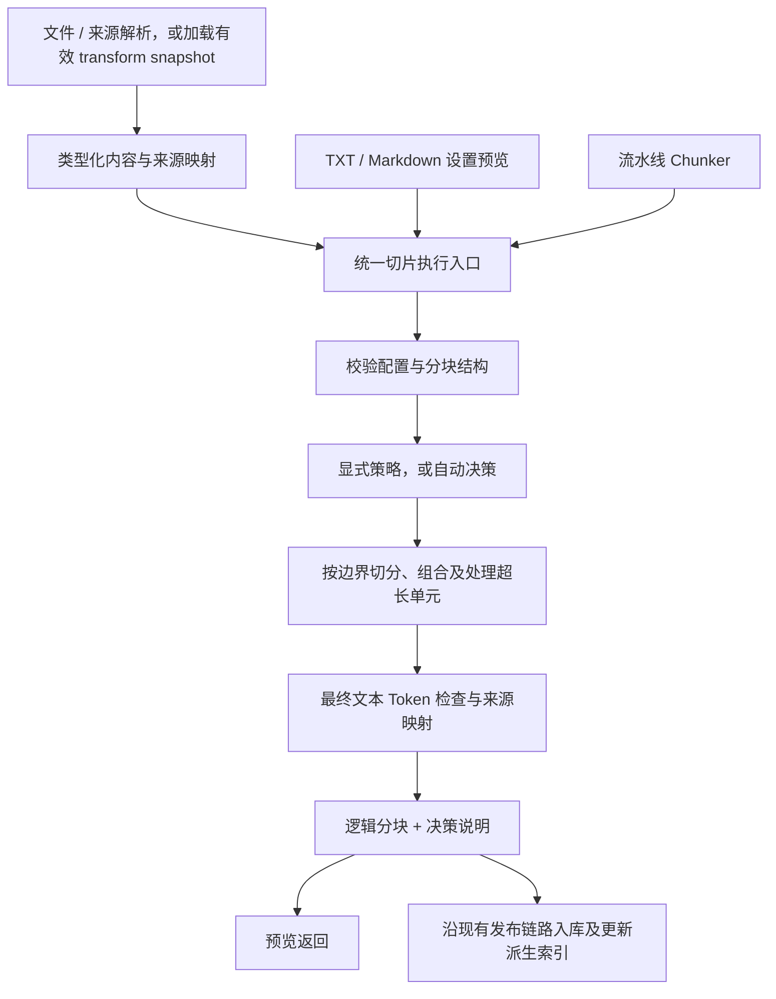

# 知识库切片策略扩展方案

- 状态：首期 P0 / P1 已实现，两轮样例测试后的长表与诊断版本修复已完成；剩余格式问题见第 13 节，P2 / P3 保留为后续规划。
- 日期：2026-09-11。
- 源码基线：本地 `xpert-develop`，`ddd1c68f6`，分支 `update/knowledge-token-limits-and-questions`。以下现状以本次源码检查为准，不表示发布状态。
- 需求：丰富 Xpert 的文档切片策略；参考所附截图中的“自动 / 按标题切分 / 结构感知 / 按长度切分”入口。
- 本次交付：新增普通分块的 `auto` 与 `structure-aware`，接通设置、预览、文档加载和流水线执行；保留旧切分算法。
- 2026-09-11 范围调整：优先新增 `auto` 和 `structure-aware`。`recursive-character` 暂不优化；已有标题策略作为可复用候选，本期也不捆绑其算法升级。
- 2026-09-11 用户确认：普通分块未指定策略时默认 `auto`；保留已明确保存的策略、大小和重叠参数，父子及 Sheet 专属处理保持原语义。

## 1. 建议方案

对用户提供四种清晰的切片策略，底层复用现有 splitter 注册体系：

| 策略       | 解决的问题                             | 建议处理                                                                       |
| ---------- | -------------------------------------- | ------------------------------------------------------------------------------ |
| 自动       | 用户不知道不同文档该选什么             | 新增确定性路由，依据已解析的格式和结构选择标题、结构或长度切分，并解释选择结果 |
| 按标题切分 | 制度、手册、说明书需要保留章节上下文   | 复用现有 `markdown-recursive`，本期不升级该策略的算法                          |
| 结构感知   | 长度切分容易拆散表格、列表、代码块     | 新增 `structure-aware`，优先保留结构单元，再处理过长单元                       |
| 按长度切分 | 普通文本和自定义分隔符需要可预测的大小 | 复用 `recursive-character`，保留字符大小、重叠和有序分隔符                     |

“普通分块 / 父子分块”继续作为独立的**分块结构**。前者是一层检索块；后者用子块检索、父块提供上下文。自动策略不得根据某篇文档把整个知识库的结构从普通改成父子。

第一阶段新增普通结构的两个策略，连同已有标题、长度策略形成四个可选入口，并统一执行约束；先做 `structure-aware` 的实际切分，再接入 `auto` 路由。第二阶段再评估父子结构和快照预览扩展，不作为首期新增策略的前置条件。

## 2. 实施前已有能力与缺口

| 边界         | 当前源码行为                                                                                          | 本次要解决的缺口                                                          |
| ------------ | ----------------------------------------------------------------------------------------------------- | ------------------------------------------------------------------------- |
| 策略注册     | 内置 `recursive-character`、`markdown-recursive`、`parent-child`；通过 `TextSplitterRegistry` 查找    | 没有自动路由和结构感知策略                                                |
| Markdown     | 已按 `#` 到 `######` 标题分章、维护标题栈，再做字符递归切分；可补祖先标题，避开部分代码围栏中的伪标题 | 尚无完整的表格、列表、代码块保护；标题和最终 Token 二次切分缺少共同预算   |
| 父子块       | 已有段落 / 全文父块、父子大小和分隔符、父子 ID 关联                                                   | 目前边界仍主要由字符和分隔符决定，不是标题或结构单元                      |
| Token 上限   | `maxChunkTokens` 已支持 0–8192；0 为关闭；使用 `cl100k_base` 精确计数，对文本检索叶子继续拆分         | 属于已有能力；新增策略必须接入。现有最终硬切分可能再次拆开结构单元        |
| 配置继承     | 库级默认、文档覆盖和共用表单已接通；一个库保持一种分块结构                                            | 表单把普通策略普遍当作字符大小 / 重叠参数，扩展后需要显式参数能力         |
| 预览 / 入库  | TXT / Markdown 设置预览与文档加载调用 `splitKnowledgeDocuments()`                                     | 流水线 chunker 直接调用策略，没有经过同一配置校验和 Token 后处理入口      |
| 已有文档预览 | `/knowledge-document/estimate` 已优先用转换快照试切；快照不可用时允许重新转换                         | 扩展严格只用快照的预览模式与决策信息，不从零重建文件预览                  |
| 来源结构     | 已有 `contentFormat`、`documentLayout.type`、页码、块 ID、Markdown source map、解析结果快照           | 这些数据尚未形成统一的切分决策输入；source map 不携带完整块类型和标题层级 |
| 格式标识     | 默认 Markdown 加载复用文本加载；DOCX OOXML 分支已生成 Markdown，但两者未完整补 `contentFormat`        | 首期在明确知道输出格式的生产者补标，避免粘贴预览与实际上传路由不同        |
| 重切片       | 已有 `full / rechunk`，后者复用校验过的解析快照                                                       | 可直接用于用户调整策略后的重切片，不需要新建转换缓存体系                  |
| 表格文件     | 已有 Sheet 专用处理、records / form_document、row / sheet / workbook 配置                             | 不能因为输出含 Markdown 就把 Sheet 自动送入通用文本策略                   |

源码依据见第 12 节。截图作为目标交互参考，不作为功能已经实现的证据。

## 3. 产品范围和界面

### 3.1 设置入口

沿用现有“文档处理 / 分块”区域，共用组件覆盖知识库默认设置和文档导入 / 编辑：

1. **分块结构**：普通、父子。已有内容时继续执行当前结构锁定规则。
2. **切片策略**：自动、按标题、结构感知、按长度；仅展示当前结构支持的选择。
3. **大小与上下文**：按策略显示适用参数，明确“字符”和“Token”的单位。
4. **测试切片效果**：显示实际采用的策略、选择原因、回退提示和最终逻辑分块。

第一阶段父子结构保留当前父 / 子配置，不展示尚未接通的四策略下拉。第二阶段完成后再开放父子边界选择，避免出现能保存但不执行的设置。

复用 `KnowledgeProcessingSettingsComponent`、`z-form`、`z-select`、现有主题和翻译；不重新设计整个设置弹窗。流水线继续使用 provider/schema 配置方式，同时获得相同的策略参数语义。

### 3.2 参数语义

| 参数                | 按长度       | 按标题                                         | 结构感知 / 自动                                                        |
| ------------------- | ------------ | ---------------------------------------------- | ---------------------------------------------------------------------- |
| 块大小（字符）      | 保留现有含义 | 保留现有含义                                   | 结构策略中是组合单元的目标大小，详见第 4.3 节；auto 路由后说明实际含义 |
| 重叠（字符）        | 保留现有行为 | 保留现有行为                                   | 结构策略只在同一段落的续块使用；auto 调用旧策略时沿用其语义            |
| 有序分隔符          | 保留现有行为 | 保留现有 schema，不注入未支持的选项            | 结构策略中过长原子文本的后备规则；auto 只向目标策略投影支持的参数      |
| 每块 Token 上限     | 复用现有配置 | 包含补入的标题上下文                           | 包含补入的标题、表头、代码围栏等实际索引正文                           |
| 标题层级 / 携带标题 | 不展示       | 复用现有参数，支持 1–6 级                      | 首期固定携带标题上下文，不额外开放标题层级开关                         |
| 结构保护            | 不展示       | 不承诺所有表格、代码完整，复杂材料建议结构感知 | V1 固定保护表格、列表项、代码块、公式，不先堆叠多个开关                |

不把“Token 上限”包装为新的语义切分算法。新增自动 / 结构策略建议初始参数为 1000 字符、100 字符重叠、512 Token 上限；这只是首轮评测起点，不能称为普遍最优值。历史默认和已保存值保持原样；用户可关闭附加 Token 上限。

按用户后续确认，普通分块未指定策略时默认“自动”，前后端使用同一默认值。已有知识库和文档明确保存的策略继续优先；不会后台重切历史文档，也不会替换流水线节点已经选择的 provider。

首期不新增面向用户的“切片 V2 / 兼容模式”升级流程。两个新 provider ID 已能明确表达选择；仅打开或保存旧配置不改变原算法。算法实现修订由服务端记录在执行诊断和缓存键中，不增加一个全局配置版本作为前置工程。

## 4. 四种策略的具体行为

### 4.1 按长度切分

保留 `recursive-character` 的公开身份和配置。按有序分隔符逐级切分，超长内容再细分，最后经过统一的 Token 限制。

适用：TXT、没有明确结构的抽取文本、明确要求按自定义分隔符处理的材料。它是自动策略的确定性后备路径。

### 4.2 按标题切分

保留现有 `markdown-recursive` 及其 `headerToSplitOn`、`addHeadersToChunk`、`stripHeader` 参数。本期仅复用，不增加标题算法升级任务。

`auto` 只能在现有策略能实际消费的标题输入上选择它。布局标题、Setext 标题等不能因为“看起来有标题”就交给不支持相应输入的旧实现，具体路由见第 4.4 节。

### 4.3 结构感知

**职责：决定具体在哪里切，尽量使一块内容仍是完整的段落、表格或操作步骤。** 它消费解析后的正文和结构信息，输出 chunk，不执行 OCR，不用 embedding 判断相似度，也不调用 LLM。

#### 输入和结构来源

按以下顺序取得结构，并只采用能够对应到当前正文的证据：

1. 有完整的 `contentFormat: 'markdown'` 正文时，通过 Markdown 语法解析得到标题、段落、列表、表格、围栏代码和可明确识别的公式；布局辅助定位。
2. 其他输入使用解析器已有的类型化布局块、阅读顺序、页码和来源范围。
3. 其余内容作为普通文本保留；如果整篇没有可用结构，显式回退到现有 `recursive-character`。

对同时存在布局和 Markdown 的输入，Markdown 提供正文结构，可信布局补充页码、资产和块 ID。两者发生冲突时保留正文，不用布局覆盖或删减原文；无法对齐的来源降为粗粒度并提示。不把两份内容重复拼接。

布局只覆盖部分正文时，未覆盖内容保留为普通文本单元，再与已识别单元按真实来源顺序组合。没有可靠顺序或范围时，不从数组邻接或文件名猜位置，改用完整 Markdown；只有纯文本时整体回退。首期不做二维版面阅读顺序重建。

#### 切分过程

1. **建立结构单元**：为每个单元保留明确类型、正文、标题路径、源范围和可用的页 / 块 ID。单元划分一次完成，`auto` 和本策略可复用同一解析结果。
2. **确定章节边界**：标题开启新的章节，前言保留；不跨独立章节合并。缺少层级的明确标题可作为平级边界，但不得编造祖先关系。
3. **按阅读顺序组合**：同一章节的相邻普通段落可以合并；表格、列表、代码、公式先作为独立结构单元处理，不为了填满空间把互不相关的正文塞进表格块。
4. **处理超长单元**：优先按行、列表项、段落等内部边界拆分，不能容纳时才细分文本，规则见下表。
5. **补上下文并计数**：续块按需携带标题路径、表头或围栏；对实际输出正文重新计算 Token，再经过已有最终限制函数。
6. **输出与追溯**：输出正文、来源、顺序、续片关系和警告。合并与拆分后仍能回到原文；不把生成的上下文当成新的原始证据。

标题不能因没有独立正文就消失。标题后紧跟表格时，标题上下文跟随表格；连续标题和文件末尾孤立标题也必须保留，不能为了避免“只有标题的块”而丢内容。

#### 大小规则：目标大小与硬上限分开

`structure-aware` 的 `chunkSize` 是**目标字符数**，界面必须显示“目标块大小”，不宣称它是硬字符上限。比如目标为 1000 字符，一个完整表格有 1200 字符但满足 Token 上限时，可以保留整表；已有 `recursive-character` 的大小语义不变。

- 合并相邻段落时，加入下一个单元会超过目标大小就先输出当前块。
- 一个单元超过目标大小但未超过有效 Token 硬上限时，可以独立成块，不为了接近目标而强拆。
- 超过 `maxChunkTokens > 0` 时必须继续细分；上限包含所有正文及额外上下文。
- `maxChunkTokens = 0` 时取消这道附加上限，仍有资源保护和现有入库前模型预算检查，不能显示“无限制”。
- 额外上下文占满预算时先省略可选的重复祖先标题；原文里的标题、表头、正文不能被删除。无法保持完整表头时，输出可追溯的纯文本续片并提示结构已经拆开。

自动路由会显示实际策略及参数含义；若最终采用旧长度 / 标题策略，`chunkSize` 仍按旧实现解释，不统一改成上述软目标。

| 单元   | 正常处理                         | 单个单元已经超限时                                                                        |
| ------ | -------------------------------- | ----------------------------------------------------------------------------------------- |
| 段落   | 保持完整，可与同章节相邻短段合并 | 按句子 / 分隔符继续切分，最后按 Token 可容纳的完整 Unicode 边界切分                       |
| 列表   | 优先整列表保留，保留原编号及层级 | 先按顶层列表项拆分，并保留其子项；单项仍超限再拆正文，记录续块，不把后续编号重新从 1 开始 |
| 表格   | 优先整表保留                     | 按行分组并重复表头；单行仍超限按单元格 / 文本边界拆分并标记续片                           |
| 代码块 | 代码围栏和内容作为整体           | 先按行拆分，每片补齐围栏；超长行再细分                                                    |
| 公式   | 完整保留                         | 无法保持完整且满足硬上限时明确提示已细分，不宣称公式仍完整                                |
| 图片   | 保留资产引用及原有多模态处理边界 | 不把二进制或图片 URL 当普通文本反复拆分；关联说明文本按文本规则处理                       |

约束：

- 硬上限优先于“尽量完整”。正文、重复表头、标题前缀和围栏共同消耗预算。
- 必要前缀本身过长时缩减可选上下文；仍无空间时使用明确的纯文本续片模式并提示。连一个完整 Unicode 字符都放不下时返回可操作错误。
- 不跨输入文档、独立章节或父块合并；标题不与后续正文完全分离。
- 不自动删除页眉、页脚、脚注或去重正文。首期聚焦切分，内容清洗另行定义。
- 不根据文件名、中文显示文案或 `raw` 字段猜块类型。

表格支持范围需要如实说明：V1 支持 Markdown 表格；显式标记为 table 的布局块，其正文能解析为 Markdown 表格时也使用按行续片；只有图片或无法解析的 HTML 表格时不承诺按行切。首期不合并独立输入片段中的跨页续表；后续需要转换器提供稳定表格身份或明确续表关系，不按相同表头猜是同一张表；复杂合并单元格没有结构信息时保留原有表达并提示限制。

没有明确表头时不把第一行猜成表头。超宽行无法完整保留时，按原行文本形成续片并保留精确来源范围；预算允许时重复原始表头，否则单独保留表头内容并提示上下文缩减。首期不重写为列名与值的投影，也不宣称续片仍具有完整表格外观。

#### 示例：一份设备借用制度

假设原文含“适用范围”的两段说明、“设备清单”的长表格，以及“办理步骤”的编号列表。结构感知输出应是：

- 适用范围的相邻短段可以放在同一块。
- 设备清单能够满足预算时作为一块；超限时按行分成多块，每块携带标题及必要表头。
- 办理步骤尽量保留完整列表；超限时按完整步骤拆，保留原编号。

每块的实际行数由内容长度和 Token 预算决定，不固定为“每表 10 行”。本策略保证尽力保留原有结构，不保证一张超长表永远只有一块。

#### 首期参数

| 参数                | 建议                                                                               |
| ------------------- | ---------------------------------------------------------------------------------- |
| `chunkSize`         | 目标字符数；复用现有字段，但由 provider 能力明确标注语义                           |
| `maxChunkTokens`    | 继续放在公共 parser 配置；执行层以类型化预算传给策略，不在 `textSplitter` 再存一份 |
| `chunkOverlap`      | 仅用于同一普通文本单元内部的续片；结构单元之间不重叠，实际重叠受剩余预算约束       |
| 标题上下文          | 首期固定保留必要上下文；不加入 LLM 摘要标题                                        |
| 结构保护 / 超长处理 | 首期使用固定规则，先不开放每一种块类型的开关和多套超限策略                         |

### 4.4 自动选择

**职责：替用户选一个实际执行的切片器。** `auto` 对内容做一次确定性的结构分析，再调用 `structure-aware`、现有 `markdown-recursive` 或现有 `recursive-character`；自己不维护另一套切分算法。

自动不调用 LLM，也不增加切片阶段的模型费用。原有 PDF / 图像解析自身的调用不属于这项承诺。它不自动调整大小、不训练最佳策略，也不在后台尝试多个切片器后按未知质量分选优。

以一份完整的解析文档为决策单位；多个解析片段只能在明确属于同一来源、保留阅读顺序时共同分析。混合输入逐文档决策，不以首个样本代表整批。

| 优先级 | 输入证据                                                                       | 实际策略                                        |
| ------ | ------------------------------------------------------------------------------ | ----------------------------------------------- |
| 1      | 可用结构里包含表格、列表、代码块或公式；即使也有标题                           | `structure-aware`；同时保留章节边界和复杂结构   |
| 2      | 只有标题与普通段落，且是现有 Markdown 策略支持的 ATX 标题，在配置层级内可切    | 现有 `markdown-recursive`                       |
| 3      | 有可用标题边界，但表达方式不适合旧 Markdown 策略，例如 Setext 或类型化布局标题 | `structure-aware`；没有层级的标题仅作为平级边界 |
| 4      | 只有普通段落 / 纯文本，或没有可验证结构                                        | 现有 `recursive-character`                      |

只要出现一个可用的复杂结构单元，就选结构感知，不先引入“表格占比超过 30%”一类缺少依据的阈值。例如一份 20 页手册只有一张参数表，整篇仍使用结构感知；该策略对普通段落和标题也能正常处理。

ATX / Setext 判定来自已声明 Markdown 的语法解析；代码块内的 `#` 不是标题。若用户将样本声明为纯 TXT，不能只因为里面有 `#` 就改判为 Markdown。PDF / Word 的扩展名仅用于解析器选型，不能直接决定切片策略。

#### 决策和参数传递

1. 校验有效配置和知识库结构，保留用户请求的 `auto` 配置。
2. 分析完整解析输入，产生可复用的结构单元和能力事实。
3. 按上表优先级确定目标 provider，一篇输入只作一次顶层选择。
4. 将公共预算和该 provider 支持的参数交给目标策略；不把 `auto` 自身字段原样塞进旧策略。
5. 执行后返回目标策略结果和诊断；不把保存的 `textSplitterType: 'auto'` 改写成实际 provider。

首期只让用户配置大小与公共 Token 上限，高级区域保留现有适用参数；不提供候选策略勾选、自定义路由脚本、模型选择或“智能程度”滑块。初始路由优先级固定、可测试。

输入结构会随文档而变，所以同一个库可以让手册采用标题策略、表格说明采用结构感知、日志采用长度切分；三者仍属于同一种普通分块结构。

Sheet、FAQ、外部知识库不参加这套文本路由。由已有 category / knowledgebase type 判定适用范围，不从内容字符串反推业务类型。

#### 回退边界

| 情况                                                                  | 处理                                                                            |
| --------------------------------------------------------------------- | ------------------------------------------------------------------------------- |
| 完整输入没有结构                                                      | auto 正常选长度，原因是 `plain-text`；不是处理失败                              |
| 手动选择结构感知，但输入没有可用结构                                  | 回退到现有长度策略，明确提示 `missing-structure`                                |
| 只有一个超长表格行或无法识别的结构块                                  | 结构策略内部对该单元续切 / 降级，其他单元继续保留结构；顶层实际策略仍是结构感知 |
| 布局范围不可用，但有完整 Markdown                                     | 使用 Markdown 结构；来源精度降低时提示，不丢正文                                |
| 输入缺失、配置非法、结构合同损坏、provider 未安装、快照损坏或执行异常 | 明确报错；不能吞掉异常后调用长度策略伪装成功                                    |

自动决策输出稳定原因码，例如 `structured-blocks`、`markdown-headings`、`plain-text`、`missing-structure`，界面再翻译为用户能读懂的说明。不展示未经定义的“置信度 95%”。

预览说明示例：“选择自动；实际采用结构感知；检测到 2 张表格和 1 个列表；其中 1 张表因 Token 上限拆成续片。”表格数量等统计必须来自实际解析结果，不从文件描述推测。执行诊断保留输入指纹、目标 provider 和实现修订，便于复现。

同一输入手动选择 `structure-aware`，与 `auto` 最终路由到它时，必须在同一有效参数下得到相同切片边界；差异仅在“请求策略 / 选择原因”。这是两策略协作最关键的一项验收。

## 5. 执行架构与所有权

### 5.1 共用执行入口

以现有 `splitKnowledgeDocuments()` 为基础，提取可接收“输入 chunks + 已归一化配置”的公共执行层。文档加载负责默认继承；预览负责临时文本输入；流水线负责把节点 `provider/config` 转为执行配置。

公共执行层负责配置校验、策略查找、输入结构检查、Token 限制及诊断信息。不要复制三个自动决策实现，也不要为了复用而给流水线伪造一个持久化知识文档。

保留 `ITextSplitterStrategy` / `TextSplitterRegistry` 扩展点。首期只把经过验证的内置文本策略纳入自动候选；已安装第三方策略仍允许手动选择，不依据其名称猜测用途并自动调用。

### 5.2 解析器负责提供结构，切片器负责消费结构

- 复用 `contentFormat`、`documentLayout`、`DocumentAnalysisSource` 和 Markdown source map；不引入第二份全量解析快照。
- P0 / P1 必须补齐本仓库默认 Markdown 加载和 DOCX OOXML 输出的 `contentFormat: 'markdown'`；TXT 及降级成纯文本的 DOCX 路径如实声明 `text`。生产者根据实际解析分支标注，不能由下游根据文件名或 `parser` 展示信息补猜。
- Markdown 在声明格式的边界进行语法解析，得到带明确 `type` 和源偏移的内部单元。语法解析识别标题合法；根据业务名称猜标题类型不合法。
- 直接消费布局块时使用共享的 `DocumentAnalysisBlockType`。如果标题层级缺失，新增可选共享 `headingLevel` 并由转换器适配；不能用 `providerType`、字号或展示文本在消费端猜层级。
- source map 只有来源区间，不能冒充语义块树。只有 analysis asset 的解析器需要通过受控解析适配读取；拿不到时如实降级。
- 结构数据、JSON 配置和外部插件输出在入口做类型校验；下游使用具体类型，不增加 `as any` 或通用 `asRecord()` 绕过检查。

历史快照缺少格式标识时继续保守降级并提示原因；不能为了补标而暗中重新解析。新解析后的文件和粘贴相同格式的样本必须纳入入口一致性测试。

### 5.3 结构保护与 Token 限制

保留已有 `limitChunkTokens()` 为最终安全门。新增结构策略提前拿到同一个 Token 预算，优先生成满足限制的结构块，使安全门通常只校验、不破坏结构。

确实进入最后硬切时必须记录该块因预算而细分，并重新计算片段来源。旧策略继续允许既有后处理路径；新增策略不另外引入 tokenizer 或把字符数当作精确 Token 数。

区分切片器输出、最终保存块和物理向量数量：当前 `document.job.ts` 在保存 chunks 之前还会调用 embedding guard，按模型输入预算继续拆分，因此它可能改变最终保存的正文和块数，并非只改变向量请求。`cl100k_base` 上限也不承诺适配每一种模型 tokenizer。

轻量设置预览明确标注为“切片结果”。若界面展示“最终入库结果”，必须取得相同的 embedding 模型预算，复用同一 guard 后再展示，且仍不调用 embedding 模型。首期不重构整个逻辑块 / 物理向量存储模型；问题派生向量等还会使向量条数不同。

### 5.4 来源证据不能被补入的上下文污染

最终块保留 `sourceBlockIds`、页码范围、资产关联、已有父子 ID 和顺序。跨块组合时取实际贡献来源的并集；拆分时收窄到实际片段。

标题前缀、重复表头、补齐围栏是额外上下文，不伪装为原文连续区间。必要时在共享 metadata 中新增有类型的多段 `sourceRanges` / `contextRanges`；只有正文与原文一一对应时才写精确的单一 `startOffset/endOffset`。无法精确映射时保留可信的页 / 块级来源并标记粗粒度，不编造坐标。

任何清洗操作改变文本长度后，必须更新映射或降低映射精度。新策略不能直接沿用清洗前的精确偏移。

## 6. 配置、协议与兼容

### 6.1 建议新增的最小契约

首期契约已放入 `packages/contracts`，并以可选字段兼容原有调用方。

| 位置                       | 建议扩展                                                                         | 目的                                                           |
| -------------------------- | -------------------------------------------------------------------------------- | -------------------------------------------------------------- |
| `textSplitterType`         | 新增 `auto`、`structure-aware` 注册名                                            | 复用现有策略身份，不再增加一套并行的顶层策略名称               |
| 内置 `textSplitter` 参数   | 新增 `KnowledgeStructuredChunkOptions`，新策略在入口校验并向旧策略投影支持的参数 | 保存、校验和执行共享参数语义；保留现有外部插件参数扩展接口     |
| `IDocumentChunkerProvider` | 可选类型化 `chunkingCapabilities`，描述支持的公共参数与单位                      | 前端不再无条件删除 schema 的大小字段或向所有策略注入同一套参数 |
| 预览结果                   | 保留 `chunks`，可选增加文档级 `decisions`，其中包含 `warnings`                   | 向后兼容现有消费者，让自动结果可解释                           |
| 分块 metadata              | 类型化执行追踪：请求策略、实际策略、算法版本、原因码、是否因超限再次拆分         | 实际入库可回查；不在每块复制完整解析树或长篇诊断               |

新 provider 名称及适用参数必须经过库级默认、文档覆盖、流水线节点适配、保存、回填及服务端校验；不能只加在界面。执行诊断中的算法修订由服务端产生，不由客户端任意指定。

### 6.2 兼容原则

1. 旧 `recursive-character`、`markdown-recursive`、`parent-child` 名称及旧参数继续有效；仅打开和保存旧配置不自动升级。
2. 普通分块缺省使用 `auto`；明确选择的策略优先，包括 `structure-aware` 和旧长度、Markdown、父子策略。旧策略保持原切分算法。
3. 文档显式配置优先于库级默认；显式 `false`、`0`、空分隔符列表不能被默认值覆盖。切换策略不得遗留不适用参数进入新策略。
4. 自动只选择切分边界，不改变知识库结构。既有 `General / ParentChild` 校验继续由服务端执行。
5. 第三方 provider 未声明新能力时继续旧 schema / 参数路径；不要因新增能力字段而下架已有插件。
6. 缓存键包含全部有效切片参数及算法实现修订；复用解析快照不等于复用旧切片结果。
7. 修改默认配置不会自动重切历史文档。用户明确重处理时，有有效快照可用 `rechunk`；缺失、过期、损坏仍按现有能力提示，不静默重新调用转换器。
8. 继续沿用当前文档任务、执行归属、`publicationEpoch` 和派生索引发布链路；不在新策略里直接删除或重建向量、问题、Wiki、Graph。

本方案优先使用已有 JSON 配置和 metadata，不预设新增数据库表。若实施需要新增持久化列，另行定义显式迁移，不依赖破坏性的自动 schema 同步。

## 7. 父子结构扩展

第二阶段在 `parent-child` 内扩展边界选择，不注册“自动父子”“标题父子”等多组重复 provider：

- 父块继续保留全文模式；分段模式新增标题 / 结构边界，旧字段缺省时仍用旧分隔符路径。
- 子块在所属父块内部选择长度 / 标题 / 结构 / 自动边界，不允许再次嵌套父子策略。
- 使用共享的类型化可选边界配置，例如 `parent.boundary` / `child.boundary`，其 discriminator 必须来自合同；父块全文模式下不存在父级切分参数。
- `maxChunkTokens` 继续只约束文本检索叶子，不拿该值切碎用于上下文的父块。
- 父级上下文长度是另一项约束。界面提示过大的全文父块，但不在本次顺手改变检索上下文截断语义。
- 子块不能跨父块合并；章节信息、顺序和父级关联在 Token 细分后仍完整保留。

## 8. 预览与可解释性

首期扩展现有 TXT / Markdown 设置预览：

- 显示“请求：自动；实际：结构感知；原因：检测到表格和列表”等说明。
- 显示最终逻辑块数、字符数、Token 数、标题路径和结构续片提示；父子模式区分父块数与可检索子块数。
- 回退为长度切分时保留提示；空输入、非法参数、取消及失败沿用可操作状态，不用空列表冒充成功。
- 继续遵守当前最多 100000 字符的输入限制；增加输出数量 / 体积上限，超限明确提示，不能把截断样本称为完整预览。
- 相同的解析输入、有效配置和算法版本下，预览与正式执行在共同切片阶段的正文、顺序、Token 数和相对父子关系一致；随机 chunk ID 和持久化时间不参与逐值比较。最终保存结果的比较还需纳入第 5.3 节的 embedding guard 和模型预算。

第二阶段扩展已有 `/knowledge-document/estimate` 快照优先预览：增加显式的“仅使用已有解析结果”模式，在文档权限及快照指纹校验之后，用尚未保存的配置试切；快照不可用就返回原因，不自动调用转换器。默认旧请求仍保留现有行为，不能因为新增模式改变原接口返回形状。决策信息通过向后兼容的版本化结果或新只读子接口提供。

这种严格快照预览可验证 PDF 等解析后的真实结构，不重新上传、不保存新 chunk。它复用已有转换快照及权限边界，不新建一套快照存储。

文本粘贴预览不能验证原 PDF 的 OCR 和版面解析质量；解析器没有输出结构时，切片策略不能凭空恢复原文布局。

## 9. 实施顺序

| 批次                   | 工作内容                                                                                                       | 完成条件                                                           |
| ---------------------- | -------------------------------------------------------------------------------------------------------------- | ------------------------------------------------------------------ |
| P0：接入基础           | 新增必要类型化契约；补齐默认 Markdown / DOCX 输出格式；提取公共执行层；接通流水线校验和 Token 上限；梳理缓存键 | 新能力能够共用执行约束；不改变旧长度和标题算法                     |
| P1a：结构感知          | 注册 `structure-aware`；结构解析、组合、超长续片和来源映射；保存回填及预览                                     | 手动选择能真实处理标题、段落、列表、表格、代码；超限和降级可验证   |
| P1b：自动路由          | 注册 `auto`；复用结构分析并调用新结构策略或现有标题 / 长度策略；接通决策说明                                   | 自动与手动调用相同目标策略的切片边界一致；三个入口配置适用范围一致 |
| P2：父子和真实解析预览 | 父子边界复用；扩展已有 estimate 为可选的严格快照模式；补齐需要的转换器结构适配                                 | 父子关系不变；不重复解析即可比较真实文档切片效果                   |
| P3：质量实验           | 经固定问答集评测后，决定是否加入语义相似度切分或自定义章节规则                                                 | 有相对现有策略的质量收益和成本证据后再单独立项                     |

P0、P1a、P1b 构成首期交付；先让结构感知能实际切分，再让自动选择它。主工作位于本仓库；若 P2 的具体转换器来自外部插件仓库，先发布向后兼容的共享合同，再适配对应插件，最后验证宿主消费。首期不得依赖尚未发布的插件能力。

## 10. 验收与测试

| 场景                                                       | 必须满足                                                                                                 |
| ---------------------------------------------------------- | -------------------------------------------------------------------------------------------------------- |
| 中文制度、有多级 Markdown 标题                             | 受旧策略支持的纯标题文档自动选现有标题策略；Setext / 布局标题选结构感知；不虚构标题层级                  |
| 表格 + 列表 + 代码的混合 Markdown                          | 自动选结构；正常大小的单元不拆散；过长表格按行续片且 Token 上限有效                                      |
| 纯 TXT、代码块中的伪标题、声明为 text 的 Markdown 外观内容 | 不猜业务格式；自动按已声明能力处理；回退原因明确                                                         |
| 中英混合、emoji、长单词、极小 Token 限制                   | 无 Unicode 破损；无静默丢字；无法容纳完整字符时明确报错                                                  |
| 长标题、长表头、长代码行、长公式                           | 最终实际正文满足硬上限；额外上下文也计数；无法保留结构时明确提示                                         |
| 重复正文、重复标题、跨页表格                               | 不靠全文第一次字符串匹配定位；来源页 / 块 / 范围准确，或明确标记粗粒度                                   |
| 普通预览、普通入库、流水线执行                             | 同版本、同解析内容和同配置下的切片阶段结果一致；最终保存结果对比还需同一模型预算和 embedding guard       |
| 实际上传 MD / DOCX 与粘贴 Markdown                         | 明确的 Markdown 生产者正确标注格式；内容结构相同时自动路由一致；纯文本降级分支及旧快照缺标识时有明确提示 |
| 自动路由到结构感知与手动选择结构感知                       | 同一输入、同一有效参数下切片边界相同；请求策略和决策说明可以不同                                         |
| 库级默认、文档覆盖、旧流水线配置                           | 值能保存回填；旧行为不自动升级；错误配置在执行前被拒绝                                                   |
| 父子库                                                     | 自动不改变库结构；子块保持父关联；Token 细分仅作用于检索叶子                                             |
| Sheet、FAQ、第三方 splitter                                | 专属语义保持；不被自动文本路由接管；外部插件手动配置可继续使用                                           |
| rechunk、快照缺失、来源变化、并发重处理                    | 切片调整可复用有效转换结果；过期任务不能覆盖新结果；问题 / Wiki / Graph 不引用失效 chunk                 |

自动化验证优先扩展已有策略、`split-documents`、`token-limited-chunks`、`parser-settings`、流水线 chunker 和共用表单测试，增加跨入口结果对比。针对新增公开行为做回归，避免只镜像内部函数实现。

质量评测准备同一批获准使用的固定文档和问答，覆盖制度、操作手册、表格说明和纯文本；固定 embedding 模型、检索方式、Top-K 及查询集，只改变切片策略。比较答案证据召回、引用可定位性、断表 / 断句数量、冗余率、耗时和逻辑块数量。自动路由的通过标准先是选择可解释、行为正确，不承诺每篇文档的检索质量必然提高。

浏览器验收由用户执行；本次没有打开浏览器。实施后的验收包含策略切换、动态参数、保存回填、未保存配置预览、回退提示、导入及重切片。

## 11. 不在本次范围与主要风险

不包含：`recursive-character` 优化、现有 `markdown-recursive` 算法升级、全局切片版本迁移、FAQ 自动抽取、重新设计 Excel 解析、自动标签、ASR、替换 OCR / PDF 引擎、向量数据库迁移、知识检索融合算法调整、历史知识库批量重建，以及 LLM 语义切分上线。

主要风险及处理：

- **解析器结构信息不齐**：按可验证能力降级；不会仅因格式是 PDF 就宣称“结构感知成功”。
- **切片更新改变检索结果**：新策略显式选择，先预览，再由用户重切；保留旧配置路径。
- **结构保护被最终上限破坏**：策略内提前做同 tokenizer 预算，最后保留硬限制与续片原因。
- **来源范围失真**：区别原文和额外上下文；清洗后重建映射；无法精确定位就降低精度。
- **参数越来越复杂**：默认只呈现策略适用项；第三方能力由显式合同或 schema 驱动。

本方案推荐的决策已经明确：先补齐结构感知和自动两个新策略，现有长度和标题策略直接复用；父子边界作为后续工作。不需要先选择模型或新增模型配置。普通分块默认“自动”已经用户确认；块大小等数值的进一步调整仍根据固定样本评测决定。

## 12. 源码索引与本次核验

以下链接为本次实际检查过的源码或测试目录；使用仓库相对路径，避免绑定本机目录和易变化的行号。

| 模块                          | 相关位置                                                                                                                                                                                                                                                                           |
| ----------------------------- | ---------------------------------------------------------------------------------------------------------------------------------------------------------------------------------------------------------------------------------------------------------------------------------- |
| 文档配置、结构快照            | [knowledge-doc.model.ts](../../packages/contracts/src/ai/knowledge-doc.model.ts)                                                                                                                                                                                                   |
| 块类型、来源映射、布局合同    | [knowledge-doc-chunk.model.ts](../../packages/contracts/src/ai/knowledge-doc-chunk.model.ts)                                                                                                                                                                                       |
| provider 与流水线合同         | [knowledge-pipeline.ts](../../packages/contracts/src/ai/knowledge-pipeline.ts)                                                                                                                                                                                                     |
| 预览与默认值合同              | [knowledge-parser.model.ts](../../packages/contracts/src/ai/knowledge-parser.model.ts)                                                                                                                                                                                             |
| splitter 扩展点               | [strategy.interface.ts](../../packages/plugin-sdk/src/lib/rag/textsplitter/strategy.interface.ts)                                                                                                                                                                                  |
| 内置策略与测试                | [textsplitter-common](../../packages/server-ai/src/knowledgebase/plugins/textsplitter-common)                                                                                                                                                                                      |
| 标题切分实现                  | [MarkdownRecursiveTextSplitter.ts](../../packages/server-ai/src/knowledgebase/plugins/textsplitter-common/MarkdownRecursiveTextSplitter.ts)                                                                                                                                        |
| 内置格式生产者                | [transformer.strategy.ts](../../packages/server-ai/src/knowledgebase/plugins/transformer-common/transformer.strategy.ts)、[docx-outline.ts](../../packages/server-ai/src/knowledgebase/plugins/transformer-common/docx-outline.ts)                                                 |
| 归一化、共同执行与 Token 限制 | [parser-config.ts](../../packages/server-ai/src/knowledge-document/parser-config.ts)、[split-documents.ts](../../packages/server-ai/src/knowledge-document/split-documents.ts)、[token-limited-chunks.ts](../../packages/server-ai/src/knowledge-document/token-limited-chunks.ts) |
| 设置验证及预览                | [parser-settings.service.ts](../../packages/server-ai/src/knowledgebase/parser-settings.service.ts)                                                                                                                                                                                |
| 正式加载、转换快照            | [load.handler.ts](../../packages/server-ai/src/knowledge-document/commands/handlers/load.handler.ts)、[transform-snapshot.service.ts](../../packages/server-ai/src/knowledge-document/transform-snapshot.service.ts)                                                               |
| 已有文档预览                  | [document.controller.ts](../../packages/server-ai/src/knowledge-document/document.controller.ts)                                                                                                                                                                                   |
| 入库前额外拆分                | [document.job.ts](../../packages/server-ai/src/knowledge-document/document.job.ts)、[embedding-input-guard.ts](../../packages/server-ai/src/knowledge-document/embedding-input-guard.ts)                                                                                           |
| 流水线独立执行路径            | [chunker/strategy.ts](../../packages/server-ai/src/knowledgebase/plugins/chunker/strategy.ts)                                                                                                                                                                                      |
| Sheet 专属处理                | [spreadsheet-document.ts](../../packages/server-ai/src/knowledge-document/spreadsheet-document.ts)                                                                                                                                                                                 |
| 共用表单、设置 UI             | [processing-form.ts](../../apps/cloud/src/app/features/xpert/knowledge/processing/processing-form.ts)、[processing-settings.component.html](../../apps/cloud/src/app/features/xpert/knowledge/processing/processing-settings.component.html)                                       |
| 设置预览 UI                   | [chunk-preview.component.ts](../../apps/cloud/src/app/features/xpert/knowledge/new/chunk-preview.component.ts)                                                                                                                                                                     |

实现记录和实际验证结果见第 13 节。第 10 节的浏览器、真实数据库、模型检索质量和并发发布验收，仍需在相应运行环境单独执行。

## 13. 首期实现记录（2026-09-11）

### 已接通能力

- 注册 `auto` 和 `structure-aware`，仅用于普通文本分块；未指定策略时默认 `auto`，已有显式策略及原大小、重叠数值保留。
- `auto` 按显式格式和结构分流：复杂结构优先；旧标题算法支持的 ATX 1–3 级标题交给 `markdown-recursive`；其他标题交给结构感知；普通文本交给 `recursive-character`。缺少格式声明时明确提示。
- 结构感知使用项目已有的 Marked 解析 Markdown，并支持显式布局标题、表格和公式。维护章节、段落、列表、表格、代码及 `$$` 公式边界；布局片段使用明确的页码和阅读顺序。
- 预算包含重复标题、表头和代码围栏；超限表格按行、列表按项、代码按行续片，极端情况下保留原文文本续片。代码缩进、空行、尾部空格和原列表编号不重写。
- 预览显示请求与实际策略、选择原因、结构统计、标题路径、续片和降级说明；按 provider 能力区分目标大小及旧策略大小语义。
- `executeKnowledgeSplitter()` 统一文档加载、轻量预览与流水线的配置验证和 Token 限制；流水线节点显式 Token 配置优先，`0` 能覆盖继承上限。已知文档身份用于共同分析同一文档的转换片段。
- 默认 Markdown、DOCX OOXML 与 TXT / DOCX 纯文本回退分支补齐输出格式；没有更改已有转换快照的内容。
- `chunking` 元数据保存策略、算法修订、输入指纹、来源与上下文范围。来源清洗失配或旧策略不能提供精确范围时标记粗粒度；整份 source map 不复制到每个新块。
- 新策略算法修订参与处理与切片缓存指纹；文档级诊断指纹不参与单块内容哈希，避免仅因其他段落变化而使未变块重新索引。

### 执行边界

- `maxChunkTokens` 保留现有 0–8192 约束；新分析输入上限为 500 万字符，输出上限为 10000 块，原轻量预览继续限制 10 万字符。
- Markdown 结构解析复用仓库已有版本的 `marked`，在 `server-ai` 中补为直接运行依赖；没有引入切片阶段模型调用。
- 已经存在 `parentId` 或父子类型的输入、Sheet 输入，以及 `searchContent` 与原文不同的字段投影输入，不能静默送入新通用策略。与原文相同的 `searchContent` 随新块正文更新。
- HTML / 图片表格、复杂合并单元格、跨片段续表、外部转换器结构增强仍有明确边界；不会根据显示名称猜类型。
- 父子边界扩展、严格只使用快照的 estimate 模式、模型检索质量评测属于 P2 / P3。最终持久化前的 embedding guard 仍可能因实际模型预算继续拆分。

### 本次验证

| 检查                        | 结果                      | 覆盖范围                                                                                     |
| --------------------------- | ------------------------- | -------------------------------------------------------------------------------------------- |
| 后端 Jest                   | 13 个测试套件、124 项通过 | 新旧策略、公共执行、Token 限制、配置和哈希、加载器、设置预览、实际 Markdown / DOCX 转换入口  |
| 前端 Jest                   | 3 个测试套件、30 项通过   | 共用表单、策略和参数回填、Token 单一来源、设置组件、决策与续片预览                           |
| API TypeScript              | 通过                      | `corepack pnpm exec tsc --project apps/api/tsconfig.app.json --noEmit --incremental false`   |
| Angular 编译 / 模板类型检查 | 通过                      | `corepack pnpm exec ngc --project apps/cloud/tsconfig.app.json --noEmit --incremental false` |
| 文档 / diff                 | 通过                      | 相对链接、三份语言资源键、`git diff --check`、新增 TypeScript 文件行数约束                   |

测试还覆盖极小预算下表头保留、完整 Unicode 字符、代码缩进和空行、原列表编号、CRLF / 重复正文的单调来源定位、显式布局阅读顺序、字段投影拒绝、最终 Token 续片的索引文本同步、旧加载器兼容和未变切片的哈希稳定性。

浏览器未打开；未调用模型或修改数据库；未提交、推送或创建 PR。用户已有的 `docs/knowledgebase-settings-implementation-status.md` 保持原样。

### 默认策略调整

按用户后续要求，将未指定策略时的普通分块默认值统一为 `auto`。共用表单、文档设置入口、配置归一化和执行回退引用 `DEFAULT_KNOWLEDGE_TEXT_SPLITTER`；关闭父子分块后也回到自动。已经保存的策略优先，显式 `recursive-character` 缺省参数仍维持原值。处理指纹按实际生效的策略记录算法修订，避免未指定策略的重处理复用之前长度切分的结果。

本次默认值调整验证：后端 6 个套件 / 93 项、前端 3 个套件 / 31 项通过；API TypeScript 与 Angular 编译 / 模板类型检查通过。未操作浏览器、数据库或历史文档重建。

### 两轮样例测试后的修复与剩余问题

- 长表预算优先保障完整数据行；放不下时先减少重复标题，再减少重复表头。只有数据行自身超过 Token 硬上限时才拆行，原表头至少保留一次。`05_long_table.md` 在大小 200、重叠 20、Token 上限 64 的同一配置下，由修复前 51 片变为 28 片；24 条数据行完整保留。
- 缓存修订、执行决策和切片元数据统一引用 `KNOWLEDGE_CHUNKING_ALGORITHM_VERSION`。当前版本为 3，同时使曾错误记录版本 1 的 `structured-2` 缓存失效；历史版本 1 数据继续可读，不自动改写历史记录。
- 最终自动化验证：后端 13 个套件 / 137 项、前端 3 个套件 / 32 项通过；API TypeScript 和 Angular 编译 / 模板类型检查通过。新增测试覆盖自动与手动策略、旧算法回退、Token 二次切分后的版本一致性、处理指纹失效和历史版本预览。
- 尚未修复：旧 Markdown 策略对 CRLF 标题的识别、DOCX 转换丢失自动编号、PDF 转换结果中正文与图片合并标记为非文本后被新策略跳过切分。这些样例不能计入全面格式验收通过；其中 PDF 路径存在切片粒度回退，需要后续处理。
