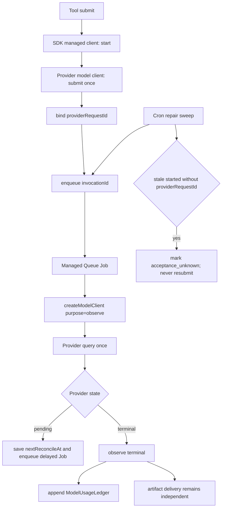

# 图片 / 视频生成用量记账实施计划

状态：实现完成，自动化验证通过，待手工验收；主仓提交至 PR #874，插件改动仍保留在本地
范围：`xpert-develop`、`xpert-plugins`
插件：智谱 CogVideo、SiliconFlow Video、Kling、Google Veo、Volcengine Seedream / Seedance

## 1. 结论

图片和视频生成不应伪装成普通 LLM，也不能把不同计量单位都塞进 Token。

最终方案分成四层：

1. 插件 Provider adapter 负责第三方请求、响应解析和权威 usage 归一化；
2. Plugin SDK 统一 IMAGE / VIDEO 客户端、异步 submit / query 协议和调用生命周期包装；
3. 宿主 `createModelClient` 负责模型提供商解析、权限检查、身份绑定和后台 observation 客户端创建；
4. `ModelInvocation` 保存可变运行状态，`ModelUsageLedger` 保存终态用量事实，Managed Queue 负责异步收口。

`recordInvocation` 是宿主内部生命周期协调器，不是五个插件各自重复实现的一套业务协议。插件工具通过 SDK 的托管生成客户端间接使用它。

## 2. 已确认的产品行为

1. Toolset 不再配置 API Key；使用“模型提供商”中已有的 Provider 配置。
2. 没有对应模型提供商时，保存或使用工具时明确要求先配置对应 Provider。
3. 图片和视频按最终产物划分模型类型：
   - `IMAGE`：`text_to_image`、`image_to_image`、`multi_image_to_image`；
   - `VIDEO`：`text_to_video`、`image_to_video`、`first_last_frame_to_video`、`reference_to_video`。
4. `TEXT2IMG` 暂时保留为兼容别名；新代码使用 `IMAGE`，不能一次性破坏已有 Provider 和已保存模型配置。
5. submit 只提交一次，不在 submit 方法中长期轮询。
6. 用户主动 query 和后台 Job 共用同一个 Provider query / usage normalizer。
7. Provider 已成功生成后，即使下载或写入工作区失败，也必须保留 Provider 用量。
8. Token、generation、second 分单位记录；不同单位不能相加。
9. generation / second / token 的默认公开价格写在模型 YAML，不写在工具配置或插件代码常量中。
10. 免费与未计价必须分开：免费有明确规则且金额为 0；未计价没有可用规则且金额为空。

## 3. 当前问题与本次修复

### 3.1 模型类型与客户端契约不完整

当前只有 `TEXT2IMG` 和新增的 `VIDEO`，异步 AIGC 客户端只约定 `invoke/observe`，没有标准化 submit 结果、Provider request ID 和 observation。

本次修复：

- 增加规范的 `IMAGE`，保留 `TEXT2IMG` 兼容；
- 增加共享的图片 / 视频 operation 类型；
- 将异步生成客户端定义为：
  - `submit(input)` -> `{ providerRequestId, data }`；
  - `query(providerRequestId, context)` -> `{ data, observation }`；
- observation 使用统一的状态、usage availability 和 metric 结构。

### 3.2 五个插件重复手写调用生命周期

当前每个 Tool 都重复：

```text
start -> Provider submit -> bind / fail
query -> normalize -> observe
```

这导致幂等、失败语义、usage 写入和后续修复要在五个插件重复维护。

本次修复：在 Plugin SDK 提供托管异步生成客户端。插件只传入：

- Provider 原始 model client；
- provider / model / tool / operation；
- invocationKey 和定价维度。

SDK 统一执行 start、submit、bind、query、observe；插件保留输入 schema、Provider payload、结果下载和工作区写入。

### 3.3 `createModelClient` 没有真正覆盖五个视频 Provider

当前五个插件虽然能从模型提供商取得凭证，但视频请求仍直接 `new XxxClient(credentials)`，Provider 中也没有注册 `VideoGenerationModel`。

本次修复：

- 智谱、SiliconFlow、Kling、Veo、Volcengine 都注册 `VideoGenerationModel`；
- Provider YAML 声明 `video`，并提供必要的 model metadata；
- Toolset 通过 `createModelClient({ copilotId, model, modelType: VIDEO })` 创建客户端；
- 原始 HTTP client 继续继承 SDK `ModelProviderHttpClient`，Provider-specific URL、payload、安全校验和响应解析不下沉到宿主。

### 3.4 `recordInvocation` 与 `reportUsage` 边界混乱

职责固定如下：

| 能力                  | 负责内容                                                                  | 不负责内容                                    |
| --------------------- | ------------------------------------------------------------------------- | --------------------------------------------- |
| `recordInvocation`    | start / bind / observe 状态机、归属身份、Provider task 幂等、触发后台收口 | Provider HTTP、价格规则、工作区下载           |
| `reportUsage`         | 兼容同步或一次性、token-only 的直接 Tool usage                            | 异步任务状态、generation/second、后台轮询     |
| Provider model client | submit/query、响应解析、usage normalizer                                  | tenant/user/execution 归属、持久化和队列      |
| Managed Queue Job     | 每次执行一次 query、写 observation、pending 时延迟补投                    | 在一个 Job 中循环等待、把请求上下文写回原对话 |
| `ModelUsageLedger`    | 终态用量事实、持久幂等、用量中心查询                                      | 可变 Provider 状态和交付文件状态              |

新 AIGC 路径以 `ModelInvocation -> ModelUsageLedger` 为权威记录。`reportUsage` 保留给已有 OpenAPI / 同步 Token 工具，避免破坏兼容。

### 3.5 Cron 被当成主轮询器

当前 Cron 直接重建 Toolset 并访问 Provider，存在这些问题：

- 后台任务依赖 Toolset 仍存在；
- Provider 配置与 tool 配置耦合；
- 多节点锁、重试、延迟和 RequestContext 恢复重复造轮子；
- Job 的可观察性和失败重试无法复用平台能力。

本次修复：

- `ModelInvocationModule` 注册平台 `@PluginJobProcessor`；
- bind 后向 Managed Queue 投递只包含 `invocationId` 的 Job；
- Job 从数据库加载 tenant / organization / user / copilot / model，再用 `createModelClient(..., purpose: 'observe')` 查询一次；
- pending 时保存下一次时间并投递新的 delayed Job；
- 网络错误抛出给 Managed Queue 的 attempts/backoff；
- Cron 只扫描到期或卡住记录并补投 Job，不再直接调用 Provider。

### 3.6 RequestContext 的异步处理不明确

原 HTTP 请求结束后，不尝试恢复或改写原来的 RequestContext。

队列 envelope 显式保存 tenant、organization、user；业务表保存相同宿主身份。平台 Managed Queue 在处理 Job 时建立新的上下文，Job 再从 `ModelInvocation` 校验业务归属。原 execution 只通过持久化 ID 更新和查询，不向已经结束的请求回写内存状态。

### 3.7 只有 execution 汇总，没有可审计账本

`execution.tokens` 或临时汇总字段只能回答“合计多少”，不能回答“哪个 Provider、哪个模型、哪个 task、什么单位被记了一次”。

本次修复：

- `ModelInvocation` 保存每次 Provider 调用和状态；
- `ModelUsageLedger` 在终态、usage 可用时按 invocation + metric unit 唯一落账；
- execution API 同时返回聚合值和调用明细；
- 用量中心后端提供按 Provider、模型、用户、组织、单位查询的账本数据；
- 计价尚未定义的 generation / second 仍可记录 quantity，不能假造为 Token 或金额。

### 3.8 后台 observation 不应再次按“新生成”检查额度

`createModelClient` 当前每次创建都会执行模型访问检查。后台 query 不是新生成，不能再次消耗或阻断成一次新的调用。

本次修复：在 SDK runtime API 和模型提供商工具父类中增加 `purpose: 'invoke' | 'observe'`：

- `invoke`：正常权限 / 配额检查；
- `observe`：用户 query 和后台 Job 都使用已持久化且受宿主约束的 Provider scope，只创建查询客户端，不重复权限 / 配额检查，不把 observation 记成新调用，也不重复记录 Token。

### 3.9 Provider 选择过宽

当前 `getModelProvider(provider)` 只按 Provider 名称挑候选，未校验请求的 model type / model。

本次修复：Provider connection 创建 model client 时必须带 `copilotId + modelType + model`；宿主用该 Copilot 对应的 Provider scope 创建客户端，调用记录持久化 `copilotId`、`modelType` 和 `providerScopeId`，后台不能重新猜 Provider。

### 3.10 独立工具测试没有 execution

Agent execution 统计要求 `originExecutionId`，但页面“测试工具”可能没有 execution。

本次修复：账本和 invocation 使用显式 origin：

- Agent 路径：`originType = execution`、`originId = executionId`；
- 独立工具路径：`originType = tool`、`originId = 宿主生成的调用作用域 ID`。

execution 汇总只读取 `originType=execution`；账本仍记录独立工具用量。

### 3.11 用量事实和金额没有稳定的结算边界

只在查询用量中心时读取最新 YAML 价格，会让历史金额随插件升级而变化；把金额直接写进 usage，又会污染 Provider 返回的原始事实。

本次修复：

- 模型 YAML 保存带 `id`、`version`、`effective_from/effective_to` 的 usage price rules；
- invocation 开始时按 model、operation、定价维度和生效时间解析规则，并冻结 `pricingSnapshot`；
- `ModelUsageLedger` 只保存 Provider/契约给出的 token、generation、second；
- `ModelChargeLedger` 对每条 usage ledger 幂等结算，保存使用的规则版本、数量、单价、币种和金额；
- 公式统一为 `amount = quantity / unit_size * unit_price`；
- `free` 保存金额 0，`unpriced` 保存金额 null，二者在查询和 UI 中保持不同语义。

## 4. 共享合同

### 4.1 输出模态与 operation

```ts
type GenerationModality = 'image' | 'video'

type ImageGenerationOperation = 'text_to_image' | 'image_to_image' | 'multi_image_to_image'

type VideoGenerationOperation = 'text_to_video' | 'image_to_video' | 'first_last_frame_to_video' | 'reference_to_video'
```

### 4.2 用量单位

```ts
type ModelUsageMetric =
  | { unit: 'token'; promptTokens?: number; completionTokens?: number; totalTokens?: number; authority: 'provider' }
  | { unit: 'generation'; quantity: number; authority: 'provider' | 'contract' }
  | { unit: 'second'; quantity: number; authority: 'provider' | 'request' }
```

约束：

- token 至少有一个有限非负整数字段；
- generation 是正整数；
- second 是有限正数；
- `pending` 不是 0；
- Provider 未提供 usage 时终态写 `unknown`，不能猜测；
- 不同单位分别聚合。

### 4.3 异步客户端

```ts
interface AsyncAIGCModelClient<TInput, TData> {
  submit(input: TInput): Promise<{ providerRequestId: string; data: TData }>
  query(
    providerRequestId: string,
    context?: { operation?: string; pricingDimensions?: ModelInvocationPricingDimensions }
  ): Promise<{ data: TData; observation: ModelInvocationObservation }>
}
```

`submit` 不轮询。用户 query 和后台 Job 都调用 `query`。

## 5. 持久化

### 5.1 ModelInvocation

保存：

- tenant / organization / user；
- `originType` / `originId`，execution 路径另存 `originExecutionId`；
- toolset / tool / agent；
- `copilotId` / `providerScopeId` / provider / model / modelType；
- modality / operation / pricingDimensions；
- providerRequestId / providerState；
- usageAvailability / metrics / rawUsage；
- artifactState；
- reconciliationState / nextReconcileAt / attempts；
- startedAt / completedAt / lastObservedAt。

唯一约束：

- tenant + originType + originId + invocationKey；
- tenant + providerScopeId + providerRequestId。

状态只能单向推进；终态 observation 不得被旧的 processing 覆盖；已有权威 usage 不得被 unknown 覆盖。

### 5.2 ModelUsageLedger

账本是只追加事实表，一条 invocation 的一个 metric unit 只允许一条当前版本：

- 唯一键：`invocationId + unit + revision`；
- 保存 provider、model、modelType、modality、operation、quantity / token fields、authority；
- 保存 tenant / organization / user / copilot / origin；
- 只在终态且 `usageAvailability=available` 时写入；
- 重复 query、Job 重试、多节点并发都通过数据库唯一约束幂等。

价格规则与 quantity 分离。以后价格变化通过新的定价/结算条目引用 ledger，不改写 Provider 用量事实。

### 5.3 PricingRule 与 ModelChargeLedger

`pricing.type = usage` 的模型 YAML 规则保存：

- `id`、`version`、`effective_from/effective_to`；
- `unit = token | generation | second`、`unit_size`、`unit_price`、`currency`；
- `charge_type = paid | free`；
- 可选 operation、resolution、audio、videoInput、mode 维度；
- token 规则可选择 `prompt | completion | total`；
- `source_url` 保存公开价格来源。

`ModelChargeLedger` 与 usage ledger 一对一，唯一键为 `usageLedgerId`。它保存定价状态、规则 ID/版本、结算 quantity、unit size、unit price、币种、金额和规则快照。这样重复 observation、Job 重试和并发写入不会重复收费，历史金额也不会被后续 YAML 改价重算。

## 6. 异步生命周期



异常边界：

- Provider submit 明确失败：只有可确认未受理的 4xx 才记 failed；
- Provider submit 的传输异常、超时或 5xx：受理结果不确定，立即记 acceptance_unknown；
- Provider 接受后进程在 bind 前崩溃：repair sweep 将超过 5 分钟且没有 providerRequestId 的 started 记录改为 acceptance_unknown；不进入 Job、不自动盲目重复提交；若原调用稍后成功 bind，则清除旧的 unknown 完成时间、错误和用量状态，恢复为 submitted 并正常对账；
- acceptance_unknown 是“禁止自动重提”的终态，不是不可纠正的事实：同步 IMAGE 的迟到成功/失败观察或异步任务的迟到 bind 均可用确定证据纠正该记录；
- Provider 已返回同步 IMAGE 成功结果、但 observation 持久化失败：向上抛出持久化错误，不得把 Provider 成功改写为 failed；
- query 网络失败：Job 抛错，由 Managed Queue retry/backoff；
- Provider 已成功但最终响应和请求维度都无法给出可计量用量：以 succeeded + unknown 终止，不做无法收敛的永久查询；
- 下载失败：只更新 artifactState，不撤销 succeeded usage；
- 队列投递失败：数据库保留 due 状态，由 repair sweep 补投。

## 7. 五个 Provider 的用量与价格规则

规则版本和默认生效时间为 `2026-08-14`；每条规则在对应模型 YAML 中保存官方来源 URL。价格是 Provider 公开标价，不做币种换算。

| Provider            | 成功用量                                                                  | 当前计价方式                                                                                           |
| ------------------- | ------------------------------------------------------------------------- | ------------------------------------------------------------------------------------------------------ |
| 智谱 CogVideo       | `generation = 1`                                                          | CogVideoX 3：CNY 1/次；CogVideoX 2：CNY 0.5/次；Flash：明确免费                                        |
| SiliconFlow Video   | `generation = 1`                                                          | 中国 endpoint：CNY 2/次；国际 endpoint：USD 0.29/次；自定义 endpoint：未计价                           |
| Kling               | `second = video.duration`；没有 Provider duration 时才使用原请求 duration | 按分辨率、是否音频和模型档位匹配 CNY/秒；Provider duration 优先，请求 duration 只作为回退              |
| Google Veo          | `second = durationSeconds`                                                | 按 Standard/Fast、分辨率匹配 USD/秒；当前插件请求为带音频定价                                          |
| Volcengine Seedance | Provider `task.usage` 中的 token 字段                                     | 按模型及 audio/videoInput 维度匹配 CNY/百万 output token；Provider 缺少 token 时 usage unknown、不收费 |
| Volcengine Seedream | Provider token + `generation = 1`                                         | 公开了单图价的模型按 CNY/次结算；Provider token 同时保留用于审计；没有公开价格的模型标记未计价         |

## 8. 实施顺序

1. 更新 contracts 和 SDK：IMAGE/VIDEO、operation、标准 submit/query、托管客户端和测试。
2. 更新宿主：Provider scope、`purpose=observe`、ModelInvocation 字段、Managed Queue、repair sweep、账本和查询。
3. 更新五个插件：注册 VIDEO model manager、Provider YAML/model metadata、Toolset 改走 `createModelClient`、删除工具内重复生命周期代码。
4. 增加 PricingRule 快照、ModelChargeLedger、免费/未计价语义和幂等价格计算。
5. 补 execution 明细/汇总和用量中心 token/generation/second/金额查询 API 与筛选 UI。
6. 跑聚焦测试、五个插件 typecheck/test/build、`git diff --check`，审计未提交文件列表。

## 9. 验收标准

### SDK / 宿主

- `IMAGE` 和 `VIDEO` 均能通过 `createModelClient` 创建；`TEXT2IMG` 旧配置仍能工作。
- submit 不轮询；query 可由用户和 Job 共用。
- 插件工具不再直接手写 start / bind / observe。
- Job payload 只有 invocationId，不包含 API Key、原始文件字节或可伪造 tenant 身份。
- Job 不依赖 Toolset 记录存在，不把 query 计作新调用。
- Cron 不直接访问 Provider，只补投 due invocation。
- 未 bind 的陈旧 started 会进入 acceptance_unknown，且不会触发第二次 submit。
- 终态 usage 在 ledger 中数据库幂等；不同单位不相加。
- execution 能返回调用明细及按单位汇总。
- 独立 Tool invoke 即使没有 execution 也能记账。
- invocation 开始时冻结价格规则；插件升级改价不会改变历史结算。
- 同一个 usage ledger 只产生一条 charge ledger。
- 免费用量显示 0 金额；未计价用量显示未计价且金额为空。
- 用量中心可以分别查看 token、generation、second，并按 Provider、模型、用户、组织、模态、币种和计价状态筛选。

### 五个插件

- 智谱、SiliconFlow、Kling、Veo、Volcengine 都声明并注册 VIDEO model client。
- Seedream 使用 IMAGE model client；旧 TEXT2IMG 配置兼容。
- Toolset UI 不出现 API Key 输入。
- 没有模型提供商时给出明确配置错误。
- 同一 tool call 重试不会重复提交可幂等的 Provider 任务或重复落账。
- Provider 成功、下载失败时 ledger 仍有用量，artifactState 为 failed。
- Seedance 返回 token 时，execution 明细和 ledger 都可见；缺失时明确 unknown。

## 10. 改动边界

### xpert-develop

- `packages/contracts`：模型类型、operation、invocation、ledger 合同；
- `packages/plugin-sdk`：AIGC 客户端、托管生命周期、模型 Provider Toolset 公共能力；
- `packages/server-ai/src/shared/agent`：createModelClient / Provider scope；
- `packages/server-ai/src/model-invocation`：状态机、Managed Queue、repair sweep、账本；
- `packages/server-ai/src/xpert-toolset` 和 `xpert-tool`：Agent 与独立 Tool 的宿主 scope；
- `packages/server-ai/src/xpert-agent-execution`：明细与汇总；
- `packages/server-ai/src/copilot-usage`：账本查询入口。

### xpert-plugins

- `xpertai/models/zhipuai/src/cogvideo`；
- `xpertai/models/siliconflow/src/video`；
- `xpertai/models/kling/src`；
- `xpertai/models/veo/src`；
- `xpertai/models/volcengine/src/seedream-aigc`；
- 对应 Provider YAML、model metadata、module 注册、聚焦测试和 changeset。

以下不在本次范围：钉钉、MiniMax、remote-components 生成产物、提交/推送/PR、浏览器手工验收。

## 11. 产品决策状态

本次已落实：

1. 默认公开价格写入模型 YAML，并保留币种、规则版本、生效时间和来源；
2. 免费模型显示用量和 0 金额；没有可匹配价格的模型显示“未计价”，金额为空；
3. 用量中心增加 LLM Token、图片/视频 Token、Generation、Second 四种视图；图片/视频账本支持 Provider、模型、用户、组织、模态、币种、计价状态筛选，并展示金额。

以下不属于本次价格闭环，继续保留为后续产品设计：

1. 异步完成通知、对话卡片和文件交付 UX；
2. acceptance unknown 是否需要人工处理入口。
