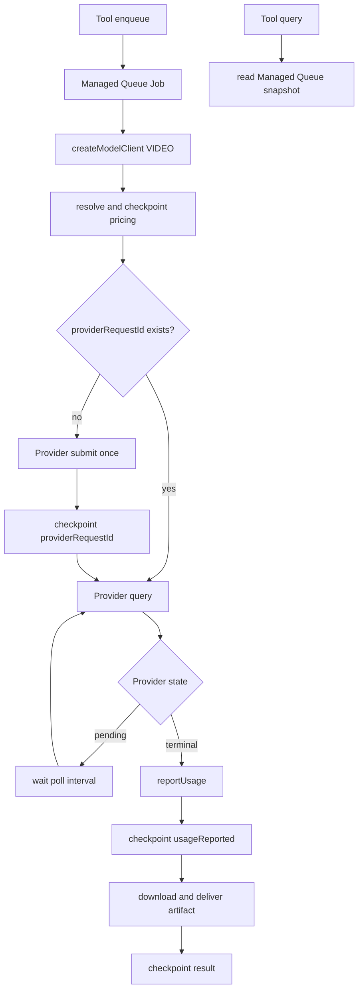

# 图片 / 视频生成用量记账实施计划

状态：实现完成，自动化验证通过，待手工验收；主仓提交至 PR #874，插件改动仍保留在本地
范围：`xpert-develop`、`xpert-plugins`
插件：智谱 CogVideo、SiliconFlow Video、Kling、Google Veo、Volcengine Seedream / Seedance

## 1. 结论

图片和视频生成不伪装成普通 LLM，也不把不同计量单位都塞进 Token。

最终方案分成四层：

1. 插件 Provider adapter 负责第三方请求、响应解析和权威 usage 归一化；
2. Plugin SDK 统一 IMAGE / VIDEO client、异步 submit / query 协议、Managed Queue Job checkpoint 与终态上报；
3. 宿主 `createModelClient` 负责模型提供商解析、权限检查、身份绑定和 client 创建；
4. Managed Queue Job 保存异步任务的可恢复状态，`ModelUsageLedger` 保存终态用量事实，`ModelChargeLedger` 保存冻结价格产生的金额。

不再保留独立的 `ModelInvocation` 状态机、调度器或 reconciliation 表。插件 Job 通过 SDK 的
`processAsyncAIGCManagedJob` 复用 checkpoint、轮询、终态 `reportUsage` 和防重复上报逻辑；Provider、下载和文件交付仍由插件实现。

## 2. 已确认的产品行为

1. Toolset 不配置 API Key；使用“模型提供商”中已有的 Provider 配置。
2. 没有对应模型提供商时，保存或使用工具时明确要求先配置对应 Provider。
3. 图片和视频按最终产物划分模型类型：
   - `IMAGE`：`text_to_image`、`image_to_image`、`multi_image_to_image`；
   - `VIDEO`：`text_to_video`、`image_to_video`、`first_last_frame_to_video`、`reference_to_video`。
4. `TEXT2IMG` 暂时保留为兼容别名；新代码使用 `IMAGE`，不能一次性破坏已有 Provider 和已保存模型配置。
5. Provider client 的 submit 只提交一次，不在 submit 方法中轮询；Managed Queue Job 在 submit 后调用 query 直到终态。
6. 用户 query 读取同一个 Managed Queue Job；Provider query / usage normalizer 只在 Job Processor 内执行。
7. Provider 已成功生成后，即使下载或写入工作区失败，也必须先保留 Provider 用量。
8. Token、generation、second 分单位记录；不同单位不能相加。
9. generation / second / token 的默认公开价格写在模型 YAML，不写在工具配置或插件代码常量中。
10. 免费与未计价分开：免费有明确规则且金额为 0；未计价没有可用规则且金额为空。

## 3. 职责与边界

### 3.1 模型 client

同步图片模型实现：

```ts
interface AIGCModelClient<TInput, TOutput> {
  invoke(input: TInput): Promise<{ data: TOutput; observation: AIGCModelObservation }>
}
```

异步视频模型实现：

```ts
interface AsyncAIGCModelClient<TInput, TData> {
  submit(input: TInput): Promise<{ providerRequestId: string; data: TData }>
  query(
    providerRequestId: string,
    context?: { operation?: ModelUsageOperation; pricingDimensions?: ModelUsagePricingDimensions }
  ): Promise<{ data: TData; observation: AIGCModelObservation }>
}
```

Provider adapter 只负责 Provider HTTP、状态解析和 usage normalizer，不负责 tenant、execution、账本或队列。

### 3.2 Managed Queue Job

整个异步 Provider 生命周期由一个 Managed Queue Job Processor 执行：

```text
resolve pricing -> submit -> checkpoint providerRequestId -> query/poll -> reportUsage -> finalize artifact
```

SDK `processAsyncAIGCManagedJob` 统一：

- 第一次执行时冻结价格并 submit；
- submit 成功后立即把 `providerRequestId` 写回 Job payload；
- retry 时如果已有 `providerRequestId`，从 query 恢复，不再主动 submit；
- pending/processing 在同一个 Job 中等待后继续 query；
- 终态先调用 `reportUsage`，checkpoint `usageReported=true`，再下载和交付文件；
- Job payload 已有 `result` 时直接返回，避免重复交付；
- `@PluginJobProcessor({ concurrency })` 控制每个插件任务处理器并发。

Job Processor 中的 Provider-specific 创建 client、结果下载和工作区写入由五个插件各自实现。Managed Queue 负责持久化 payload、retry/backoff、执行身份恢复和并发，不理解模型业务。

### 3.3 `reportUsage`

`reportUsage` 是同步图片和异步视频共用的最终用量入口，不再局限于 Token。它负责：

- 校验并归一化 token / generation / second；
- 从宿主 scope 绑定 tenant、organization、user、copilot、provider scope 和 execution；
- 以 `providerScopeId + requestId + unit + revision` 幂等写入 `ModelUsageLedger`；
- 按调用开始时冻结的 `pricingSnapshot` 计算并幂等写入 `ModelChargeLedger`；
- 返回 ledger IDs。

它不负责 Provider HTTP、异步状态、轮询、重试或产物下载。

### 3.4 `createModelClient`

五个插件的 IMAGE / VIDEO 请求都走宿主 `createModelClient`：

- `invoke` 用于新生成，执行正常模型访问检查；
- `observe` 用于已经提交的异步任务查询，不把 query 当成新生成；
- Job 用持久化的 `providerScopeId` 创建 scoped runtime，不能重新猜 Provider；
- Provider YAML 声明模型类型、模型 metadata 和 usage price rules。

### 3.5 RequestContext

原 HTTP/Agent 请求结束后，不恢复或改写原请求对象。Managed Queue envelope 保存并恢复 tenant、organization、user actor；Job payload 只保存模型业务 checkpoint。Job Processor 在新的 RequestContext 中创建 scoped runtime，`reportUsage` 使用该 scope 写账本。

## 4. 共享合同

### 4.1 输出模态与 operation

```ts
type ModelUsageModality = 'image' | 'video'

type ImageGenerationOperation = 'text_to_image' | 'image_to_image' | 'multi_image_to_image'

type VideoGenerationOperation = 'text_to_video' | 'image_to_video' | 'first_last_frame_to_video' | 'reference_to_video'
```

### 4.2 用量单位

```ts
type ModelUsageMetric =
  | { unit: 'token'; promptTokens?: number; completionTokens?: number; totalTokens?: number; authority: 'provider' }
  | { unit: 'generation'; quantity: number; authority: 'provider' | 'contract' }
  | { unit: 'second'; quantity: number; authority: 'provider' | 'request' }
```

约束：

- token 至少有一个有限非负整数字段；
- generation 是正整数；
- second 是有限正数；
- Provider 未返回可计量 usage 时不伪造 0，也不写 usage ledger；
- 同一个 report 不能重复提供相同 unit；
- 不同单位分别聚合。

### 4.3 Job checkpoint

Job payload 保存：

- requestId、model、tool、modality、operation 和 pricing dimensions；
- Provider 输入；
- phase、startedAt、providerRequestId、providerState；
- pricingSnapshot、usageReported；
- 最终 result 或 errorCode。

Job payload 不保存 API Key。Provider 凭证始终由宿主模型提供商连接提供。

## 5. 持久化与计价

### 5.1 ModelUsageLedger

账本是一组终态用量事实，每个 request 的一个 metric unit 只写一条当前版本：

- 唯一键：`tenantId + providerScopeId + requestId + unit + revision`；
- 保存 provider、model、modelType、modality、operation、quantity / token fields、authority；
- 保存 tenant、organization、user、copilot 和 origin；
- execution 路径保存 `originExecutionId`，独立工具路径以 requestId 为 originId；
- 重复 query、Job retry 和并发写入通过数据库唯一约束幂等。

### 5.2 PricingRule 与 ModelChargeLedger

`pricing.type = usage` 的模型 YAML 规则保存：

- `id`、`version`、`effective_from/effective_to`；
- `unit = token | generation | second`、`unit_size`、`unit_price`、`currency`；
- `charge_type = paid | free`；
- 可选 operation、resolution、audio、videoInput、mode 维度；
- token 规则可选择 `prompt | completion | total`；
- `source_url` 保存公开价格来源。

价格在调用开始时解析并冻结到 Job payload；同步 IMAGE 在 invoke 前冻结。`ModelChargeLedger` 与 usage ledger 一对一，保存规则 ID/版本、结算 quantity、单价、币种、金额和规则快照。

公式统一为：

```text
amount = quantity / unit_size * unit_price
```

明确的 free 规则保存金额 0；没有匹配规则时保存 unpriced，金额为空。历史金额不随 YAML 后续改价重算。

## 6. 异步生命周期



异常边界：

- Provider submit 明确失败：Job 失败，由 Managed Queue 按配置 retry；
- submit 后已获得 `providerRequestId`：retry 从 checkpoint 恢复 query，不主动重复 submit；
- query 网络失败：抛给 Managed Queue retry/backoff；
- Provider 已终态但下载失败：用量已先落账，Job retry 时 `reportUsage` 由数据库唯一约束和 `usageReported` checkpoint 去重；
- cancelled/failed 如果 Provider 返回 metrics，也记录该权威 usage；
- Provider 没有返回可计量 usage：不猜测、不写 0；
- 进程恰好在 Provider 接受请求、但 `providerRequestId` 写入 Job payload 之前崩溃时，仍存在再次 submit 的小窗口。移除独立 ModelInvocation 后无法在宿主侧完全消除该窗口；能传 Provider idempotency key 的插件必须使用 requestId。不能把不确定受理自动标成已用量或已收费。

## 7. 五个 Provider 的用量与价格规则

规则版本和默认生效时间为 `2026-08-14`；每条规则在对应模型 YAML 中保存公开来源 URL。价格不做币种换算。

| Provider            | 成功用量                                                                  | 当前计价方式                                                                                     |
| ------------------- | ------------------------------------------------------------------------- | ------------------------------------------------------------------------------------------------ |
| 智谱 CogVideo       | `generation = 1`                                                          | CogVideoX 3：CNY 1/次；CogVideoX 2：CNY 0.5/次；Flash：明确免费                                  |
| SiliconFlow Video   | `generation = 1`                                                          | 中国 endpoint：CNY 2/次；国际 endpoint：USD 0.29/次；自定义 endpoint：未计价                     |
| Kling               | `second = video.duration`；没有 Provider duration 时才使用原请求 duration | 按分辨率、是否音频和模型档位匹配 CNY/秒；Provider duration 优先，请求 duration 只作为回退        |
| Google Veo          | `second = durationSeconds`                                                | 按 Standard/Fast、分辨率匹配 USD/秒；当前插件请求为带音频定价                                    |
| Volcengine Seedance | Provider `task.usage` 中的 token 字段                                     | 按模型及 audio/videoInput 维度匹配 CNY/百万 output token；Provider 缺少 token 时不落用量、不收费 |
| Volcengine Seedream | Provider token + `generation = 1`                                         | 公开了单图价的模型按 CNY/次结算；Provider token同时保留用于审计；没有公开价格的模型标记未计价    |

## 8. 实施顺序

1. 更新 contracts 和 SDK：IMAGE/VIDEO、operation、标准 submit/query、Managed Queue checkpoint helper 和测试。
2. 更新宿主：Provider scope、`purpose=observe`、`reportUsage`、Usage/Charge ledger、Managed Queue payload 更新能力。
3. 更新五个插件：注册 IMAGE/VIDEO model manager、Provider YAML/model metadata、Toolset 改走 `createModelClient`、异步任务移入 Job Processor。
4. 接入 PricingRule 快照、免费/未计价语义和幂等价格计算。
5. 接入 execution 明细/总 token 和用量中心 token/generation/second/金额查询及筛选 UI。
6. 跑聚焦测试、五个插件 typecheck/build、`git diff --check`，审计提交文件列表。

## 9. 验收标准

### SDK / 宿主

- `IMAGE` 和 `VIDEO` 均能通过 `createModelClient` 创建；`TEXT2IMG` 旧配置仍能工作。
- Provider client 的 submit 不轮询；整个异步任务由 Managed Queue Job Processor 执行。
- Job checkpoint 有 `providerRequestId` 时 retry 不再次 submit。
- `reportUsage` 支持 token、generation、second，并与异步状态和文件交付解耦。
- 终态 usage 和 charge 均数据库幂等；不同单位不相加。
- execution 返回调用明细，并把图片/视频 token 计入总 token。
- Tool 消息上显示 usage 图标，tooltip 展示 Provider、模型、operation 和 metrics。
- 独立 Tool invoke 即使没有 execution 也能记账。
- 免费用量显示 0 金额；未计价用量显示未计价且金额为空。
- 用量中心分别查看 LLM Token、图片/视频 Token、Generation、Second，并按 Provider、模型、用户、组织、模态、币种和计价状态筛选。
- Managed Queue Processor 按插件声明的 concurrency 限制并发。

### 五个插件

- 智谱、SiliconFlow、Kling、Veo、Volcengine 都声明并注册 VIDEO model client。
- Seedream 使用 IMAGE model client；旧 TEXT2IMG 配置兼容。
- Toolset UI 不出现 API Key 输入。
- 没有模型提供商时给出明确配置错误。
- 五个异步任务都由 `@PluginJobProcessor` 处理并使用 SDK 公共 helper。
- Provider 成功、下载失败时 ledger 仍保留用量。
- Seedance 返回 token 时，execution 明细、工具 tooltip 和用量中心都可见；缺失时不伪造 Token。

## 10. 改动边界

### xpert-develop

- `packages/contracts`：模型类型、operation、usage / ledger 合同；
- `packages/plugin-sdk`：AIGC clients、Managed Queue checkpoint helper、Provider Toolset 公共能力；
- `packages/server`：Managed Queue Job payload 更新；
- `packages/server-ai/src/shared/agent`：createModelClient / Provider scope；
- `packages/server-ai/src/xpert-toolset` 和 `xpert-tool`：Agent 与独立 Tool 的宿主 scope；
- `packages/server-ai/src/xpert-agent-execution`：调用明细与总 token 汇总；
- `packages/server-ai/src/copilot-usage`：Copilot usage 对外能力，以及内部 Usage/Charge ledger、价格计算和查询；
- `apps/cloud`：工具 usage tooltip、execution 汇总和用量中心。

### xpert-plugins

- `xpertai/models/zhipuai/src/cogvideo`；
- `xpertai/models/siliconflow/src/video`；
- `xpertai/models/kling/src`；
- `xpertai/models/veo/src`；
- `xpertai/models/volcengine/src/seedream-aigc`；
- 对应 Provider YAML、model metadata、module 注册、聚焦测试和 changeset。

以下不在本次范围：钉钉、MiniMax、remote-components 生成产物、浏览器手工验收。

## 11. 产品决策状态

本次已落实：

1. 默认公开价格写入模型 YAML，并保留币种、规则版本、生效时间和来源；
2. 免费模型显示用量和 0 金额；没有可匹配价格的模型显示“未计价”，金额为空；
3. 用量中心增加 LLM Token、图片/视频 Token、Generation、Second 四种视图，并展示金额和筛选。

以下继续保留为后续产品设计：

1. 异步完成通知、对话卡片和文件交付 UX；
2. 人民币金额与平台积点的兑换、扣减和额度关系。
