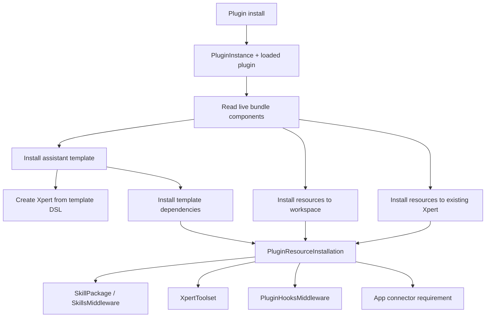

# Plugin Resources 随模板、Workspace、Xpert 安装实施记录

**日期**：2026-06-10

**目标**：把 Codex-style plugin 中的 `skills`、`mcpServers`、`apps`、`hooks` 等资源纳入 Xpert 现有 assistant/template/workspace 体系。插件安装阶段只保存插件实例和加载插件代码，资源定义始终从真实 plugin bundle 实时读取；资源只有在安装模板、安装到 workspace、安装到已有 Xpert 时才被实例化和绑定。

## 背景

本轮工作从 OpenAI Codex Plugins 文档出发，对比 Xpert 现有插件体系后，形成了一个关键判断：

Codex plugin 更像一个可分发 bundle，可以把 manifest、skills、MCP servers、apps/connectors、hooks、assets、marketplace policy 打包在一起；而 Xpert 已有体系更强在业务运行时，包括 `XpertPlugin`、NestJS module、entities、controllers、providers、assistant templates、toolsets、middlewares、权限、workspace、organization scope 等。

因此升级方向不是把 Codex plugin 直接全局运行到 Xpert，而是让 Xpert 兼容 Codex-style bundle 的资源声明，并把这些资源落到 Xpert 现有运行体系里：

- `skills` 落到 `SkillPackage` / `SkillsMiddleware`
- `mcpServers` 落到 `XpertToolset`
- `hooks` 落到新的 `PluginHooksMiddleware`
- `apps` 先落到 app connector requirement / auth state
- `templates` 仍然通过 Xpert template 创建 assistant

## 核心架构选择

最初 Codex-style plugin 的自然模型是“插件安装后，资源对 Codex 可见”。但在 Xpert 里，这会绕开 workspace 隔离、assistant template、agent graph 和权限边界。

本轮采用的架构是：

1. 插件安装阶段只负责保存 `PluginInstance`、加载插件代码和校验 bundle 是否可读。
2. 插件资源不会默认给所有 agent 使用。
3. 资源实例化有三类入口：
   - 安装 plugin 内 assistant template 到 workspace。
   - 单独把 plugin resources 安装到指定 workspace。
   - 把 plugin resources 安装并绑定到已存在 Xpert。
4. template dependencies 是首选绑定入口，资源随着 assistant template 初始化到 workspace，并只绑定到模板指定 agent。
5. hook 不做全局 agent hook，而是通过普通 Agent middleware 进入现有 middleware hooks 管线。
6. 插件资源定义不落独立组件实例表；UI、API 和安装服务都通过 `readPluginBundleManifest()` / `collectPluginBundleComponents()` 从真实 plugin bundle 实时计算。

整体流向：



## 已落地范围

### 1. Contracts 与 SDK

主要文件：

- `packages/contracts/src/plugin.ts`
- `packages/contracts/src/ai/xpert-template.model.ts`
- `packages/plugin-sdk/src/lib/types.ts`

新增或扩展内容：

- `XpertTemplateContribution.dependencies`
- `TTemplate.dependencies`
- `XpertTemplatePluginDependencies`
- `PluginResourceInstallation`
- `IPluginResourceComponentState`
- `IPluginResourceInstallResult`
- `PLUGIN_RESOURCE_RUNTIME_TYPE`
- `PLUGIN_RESOURCE_INSTALLATION_STATUS`
- `PluginResourceComponentSelector`

模板依赖声明支持：

```ts
dependencies: {
  plugins?: string[]
  skills?: Array<{
    pluginName?: string
    componentKey: string
    targetAgentKey?: string
  }>
  mcpServers?: Array<{
    pluginName?: string
    componentKey: string
    targetAgentKey?: string
    policyOverrides?: unknown
  }>
  hooks?: Array<{
    pluginName?: string
    componentKey: string
    targetAgentKey?: string
    events?: string[]
  }>
  apps?: Array<{
    pluginName?: string
    componentKey: string
    auth?: 'on_install' | 'on_first_use'
  }>
}
```

`pluginName` 缺省为贡献该 template 的 plugin，避免每个 template 重复声明。

### 2. 数据模型

主要文件：

- `packages/server/src/plugin/plugin-instance.entity.ts`
- `packages/server-ai/src/plugin-resource/plugin-resource-installation.entity.ts`
- `packages/server-ai/src/core/entities/index.ts`
- `packages/server-ai/src/core/entities/internal.ts`

`PluginInstance` 继续表示某个 plugin 已安装到组织/系统作用域，并承载插件级必要状态，例如 package、version、source、sourceConfig、config、configurationStatus。当前资源能力不需要新增独立组件实例表；如果后续需要记录 workspace connector 覆盖、组织默认策略等插件级运行态，优先放入 `PluginInstance.config`，并通过明确的 parser 读取。

不会再新增或维护独立组件实例表。组件定义来自 bundle manifest，是 plugin 文件本身的事实来源，避免插件更新后数据库组件表和真实 bundle 内容不同步。

`PluginResourceInstallation` 是当前唯一的 plugin resource 运行时状态表。它同时表示：

- 某个 plugin component 已经实例化到哪个 workspace。
- 当资源需要接入某个 Xpert / agent runtime 时，记录它绑定到哪个 `xpertId` / `agentKey`。
- 当前运行时对象是什么，例如 skill package、toolset、hook profile 或 app connector requirement。

关键字段：

- `pluginName`
- `componentType`
- `componentKey`
- `workspaceId`
- `xpertId?`
- `agentKey?`
- `runtimeType`
- `runtimeId?`
- `runtimeNodeKey?`
- `definitionHash`
- `status`
- `config`
- `enabled`

唯一索引边界：

- `workspaceId`
- `xpertId`
- `agentKey?`
- `pluginName`
- `componentType`
- `componentKey`

记录形态：

- workspace target：`xpertId = null`、`agentKey = null`，可安装 Skills / MCP / Apps。
- Xpert target：`xpertId != null`、`agentKey` 指向目标 agent，手动资源安装只开放 Hooks；template dependencies 安装时可以把模板声明的 Skills / MCP / Apps / Hooks 绑定到目标 agent。

`PluginResourceAttachment` 已去掉。原因是新资源系统不需要兼容历史数据，且 installation 已经能够承载“实例化状态 + runtime 绑定状态”。这样可以避免安装状态与绑定状态分散在两张表中，减少重复可安装、同步滞后和升级判断复杂度。

注意：当前新增了实体注册。生产部署如果不使用 TypeORM 自动同步，需要按项目数据库迁移策略补 migration。

### 3. 后端服务与 API

主要文件：

- `packages/server-ai/src/plugin-resource/plugin-resource-installer.service.ts`
- `packages/server-ai/src/plugin-resource/plugin-resource.controller.ts`
- `packages/server-ai/src/plugin-resource/plugin-resource.module.ts`
- `packages/server-ai/src/plugin-resource/commands/install-template.command.ts`
- `packages/server-ai/src/plugin-resource/commands/install-template.handler.ts`
- `packages/server-ai/src/xpert-template/xpert-template.controller.ts`
- `packages/server-ai/src/app.module.ts`
- `packages/server-ai/src/index.ts`

新增统一服务 `PluginResourceInstallerService`：

```ts
installToWorkspace(pluginName, workspaceId, components?)
installToXpert(pluginName, xpertId, components?, agentKey?)
installTemplate(templateId, workspaceId, basic?)
listComponentStates(pluginName, { target, workspaceId, xpertId, agentKey })
```

新增 API：

```http
GET /plugin/:name/resources/state?target=workspace&workspaceId=:workspaceId
GET /plugin/:name/resources/state?target=xpert&xpertId=:xpertId&agentKey=:agentKey
POST /xpert-template/:id/install
POST /plugin/:name/resources/install-workspace
POST /plugin/:name/resources/install-xpert
```

`/xpert-template/:id/install` 的职责：

1. 服务端读取 template。
2. 解析 template export data / DSL。
3. 调用现有 `XpertImportCommand` 创建 Xpert。
4. 解析并安装 template dependencies。
5. 将资源绑定到目标 agent。
6. 资源安装失败时尝试回滚新建 Xpert。

这替代了前端直接解析 YAML 后调用 `/xpert/import` 的旧流程。

安装返回结构：

```ts
{
  installations: PluginResourceInstallation[]
  pendingAuth: PluginResourceInstallation[]
  xpert?: IXpert
}
```

状态查询返回的每个 component state 包含 `installed`、`staleDefinition`、`runtimeType`、`runtimeId`、`status` 和可选 `installation`。`staleDefinition` 通过 installation 内保存的 `definitionHash` 与实时 bundle component definition hash 对比得出。

### 4. Skills 实例化

主要文件：

- `packages/server-ai/src/skill-package/skill-package.service.ts`
- `packages/server-ai/src/skill-package/plugins/skills-middleware/index.ts`
- `packages/server-ai/src/plugin-resource/plugin-resource-installer.service.ts`

新增：

```ts
syncPluginSkillBundle(workspaceId, {
  pluginName,
  componentKey,
  bundleRootPath
})
```

规则：

- `sharedSkillId` 固定为 `plugin:<pluginName>:skill:<componentKey>`。
- 安装到 workspace 时创建或更新 `SkillPackage`。
- 绑定到 Xpert 时，将 SkillPackage id 写入目标 agent 的 `SkillsMiddleware` 配置。
- 如果目标 agent 没有 `SkillsMiddleware`，安装服务自动创建 middleware node 并连接到 agent graph。
- Skills runtime 的 workspace 权限校验调整为 `assertCanRun(workspaceId)`。
- `resources/state` 查询 workspace target 时要求 workspace authoring access，并用 `sharedSkillId` 反查已有 plugin skill package；即使安装记录缺失，也能把既有 skill 识别为已安装，避免重复显示为可安装。

### 5. MCP 实例化

主要文件：

- `packages/server-ai/src/plugin-resource/plugin-resource-installer.service.ts`

规则：

- plugin component 中的 MCP server 声明被转换为 `XpertToolset`。
- workspace install 创建 workspace-scoped plugin-managed toolset，不自动绑定 agent。
- Xpert/template install 创建或复用 xpert-scoped plugin-managed toolset，并把 toolset 挂到目标 agent。
- `policy.defaultToolsApprovalMode` 和 per-tool policy 写入 toolset options。
- prompt approval 模式的工具同步到 draft graph 的 `interruptBefore`，复用现有 HITL / interrupt 审批能力。
- repeated install 应复用同一 plugin/component/target 的 runtime，不重复创建 toolset 或 graph node。

### 6. Hooks Middleware

主要文件：

- `packages/server-ai/src/plugin-resource/plugin-hooks.middleware.ts`
- `packages/server-ai/src/plugin-resource/plugin-resource-installer.service.ts`

新增 middleware：

```ts
PluginHooksMiddleware
```

它作为普通 Agent middleware 注册到 `AgentMiddlewareRegistry`，而不是成为全局 hook 系统。

事件映射：

- `SessionStart` -> `beforeAgent`
- `PreToolUse` -> `wrapToolCall` 前置执行
- `PostToolUse` -> `wrapToolCall` 后置执行

执行规则：

- 只有被安装并绑定到目标 agent 的 `PluginHooksMiddleware.options.hooks` 才会进入运行时。
- hook component 每次从已加载 plugin 的真实 bundle manifest 解析；如果 plugin 或 hook 定义不存在，会返回 unavailable/blocked 事件。
- hook command 通过 sandbox backend 执行。
- 注入环境变量：
  - `XPERT_PLUGIN_ROOT`
  - `XPERT_PLUGIN_DATA`
  - `PLUGIN_ROOT`
  - `PLUGIN_DATA`
- data dir 按 tenant/workspace/plugin/component 隔离。

这保留了 Xpert 的 middleware 管线和 workspace 运行权限，同时让 hook 定义跟随 plugin bundle 实时更新。

### 7. Apps / Connectors

主要文件：

- `packages/server-ai/src/plugin-resource/plugin-resource-installer.service.ts`

v1 处理范围：

- workspace install 记录 app connector requirement。
- Xpert/template install 记录 app connector requirement installation；app 不写入 agent graph，`runtimeNodeKey` 保持 `null`。
- `auth: 'on_install'` 返回 `pending_auth`。
- `auth: 'on_first_use'` 保持 ready，运行时可返回认证需求。
- 卸载或解绑 plugin resource 不删除用户已有外部授权。
- 上游 `.app.json` 中的 `REPLACE_WITH_*` placeholder 不会伪装成可用 connector；安装状态写为 `blocked`，并在 `config.reason` 等字段中记录原因。
- 必要的 workspace connector 覆盖信息放在 `PluginInstance.config` 中，通过显式边界 parser 读取，不新增表。

本轮没有实现新的第三方 connector runtime。apps 首期是 requirement/auth 状态和绑定模型。

### 8. Template 安装前端改造

主要文件：

- `apps/cloud/src/app/@core/services/xpert-template.service.ts`
- `apps/cloud/src/app/features/explore/agents/install/install.component.ts`
- `apps/cloud/src/app/features/setting/plugins/resources/resources.component.ts`
- `apps/cloud/src/app/features/setting/plugins/resources/resources.component.html`
- `apps/cloud/src/assets/i18n/en.json`
- `apps/cloud/src/assets/i18n/zh-Hans.json`

变更：

- 新增前端 service 方法 `installTemplate(id, body)`。
- Explore Agent Install 不再在浏览器解析 template YAML。
- 安装入口改为调用：

```http
POST /xpert-template/:id/install
```

服务端统一完成 Xpert 创建、template dependencies 安装和资源绑定。

插件资源初始化弹窗：

- 从已安装插件卡片进入，调用 `/plugin/:name/resources/state` 获取实时 component state。
- target 为 workspace 时只展示可安装的 Skills / MCP / Apps。
- target 为 Xpert 时只展示可安装的 Hooks，并要求选择目标 Xpert / agent。
- 已安装或 blocked 的资源不再重复出现在可安装列表里。
- 新增文本必须写入 i18n，HTML 模板中使用 `translate`。

### 9. 验收插件 xpertai-browser-lab

主要目录：

- `packages/plugins/xpertai-browser-lab`

该插件作为首个覆盖 Codex-style bundle 能力的验收插件，明确回答了“XpertAI Browser Lab plugin 中有没有 skills 等资源”：有，而且资源同时通过 `.xpertai-plugin/plugin.json`、插件 `targetAppMeta`、assistant template dependencies 三层声明出来。

资源清单：

| 资源类型        | componentKey                           | 声明/来源                             | 安装后运行态                                                                |
| --------------- | -------------------------------------- | ------------------------------------- | --------------------------------------------------------------------------- |
| Skill           | `browser-research`                     | `skills/browser-research/SKILL.md`    | workspace `SkillPackage`，绑定 Xpert 时写入目标 agent 的 `SkillsMiddleware` |
| MCP server      | `xpertai-browser-lab`                  | `mcp.json` + `mcp/browser-lab-mcp.js` | plugin-managed `XpertToolset`，绑定 Xpert 时挂到目标 agent                  |
| App requirement | `xpertai-browser-session`              | `apps/browser-session.json`           | app connector requirement / auth state，`on_first_use` 为 ready             |
| Hooks           | `hooks`                                | `hooks/hooks.json` + command scripts  | `PluginHooksMiddleware` hook profile，绑定到 agent 后通过 middleware 执行   |
| Assets          | `composerIcon` / `logo` / `screenshot` | `assets/*`                            | marketplace / plugin UI 展示资源                                            |

该插件包含：

- `.xpertai-plugin/plugin.json`
- `skills/browser-research/SKILL.md`
- MCP server 声明
- hook 声明
- app connector requirement
- assistant template

template 中声明 dependencies：

- skill: `browser-research`
- MCP server: `xpertai-browser-lab`
- hook: `hooks`
- app: `xpertai-browser-session`

插件安装阶段预期结果：

1. `PluginManagementService` 读取 `.xpertai-plugin/plugin.json`。
2. `collectPluginBundleComponents()` 发现 7 个 component：1 skill、1 MCP server、1 app、1 hook、3 assets。
3. 不写入组件实例表；资源摘要和 Resources dialog 都从真实 plugin bundle 实时计算。
4. 插件设置页卡片显示资源摘要，Resources dialog 可选择 bundle resources，并执行 workspace / Xpert 初始化。

模板安装后预期结果：

1. workspace 中生成 plugin skill package。
2. 新建 Xpert primary agent 带 `SkillsMiddleware`。
3. 目标 agent 绑定 plugin-managed MCP toolset。
4. 目标 agent graph 中出现 `PluginHooksMiddleware`。
5. app requirement 记录到 `PluginResourceInstallation`。

workspace-only resources 安装后预期结果：

1. 生成 workspace-scoped `PluginResourceInstallation`。
2. skill 创建或更新 workspace `SkillPackage`。
3. MCP server 创建 workspace-scoped plugin-managed `XpertToolset`。
4. app 记录 connector requirement / auth state。
5. hooks 不出现在 workspace target 安装列表中。

existing Xpert resources 安装后预期结果：

1. 复用或创建 xpert-scoped `PluginResourceInstallation`。
2. 手动 Xpert target 只允许安装 hook。
3. hook 写入目标 agent 的 `PluginHooksMiddleware.options.hooks`。
4. `runtimeNodeKey` 记录 `PluginHooksMiddleware` node key。

template dependencies 安装时的 Xpert 绑定预期结果：

1. skill 写入目标 agent 的 `SkillsMiddleware.options.skills`，`runtimeNodeKey` 记录 skills middleware node key。
2. MCP toolset 写入目标 agent 的 `toolsetIds`，并根据 policy 更新 `interruptBefore`，`runtimeNodeKey` 记录 toolset id。
3. hook 写入目标 agent 的 `PluginHooksMiddleware.options.hooks`，`runtimeNodeKey` 记录 middleware node key。
4. app requirement 写入 `PluginResourceInstallation`，`runtimeNodeKey` 为 `null`。

### 10. Role-Specific XpertAI 插件复刻

主要目录：

- `packages/plugins/xpertai-sales`
- `packages/plugins/xpertai-data-analytics`
- `packages/plugins/xpertai-product-design`
- `packages/plugins/xpertai-financial-markets`

这四个插件复刻自上游 role-specific plugins 的当前仓库结构，并转换成 Xpert 独立插件包。每个包沿用 `xpertai-browser-lab` 的 Nx / Rollup / package 结构，保留 upstream README、MIT license、skills、assets 和 `.app.json`；Data Analytics 额外包含 `.mcp.json`、`mcp/server.cjs` 以及 widget assets。

包名和 manifest 约定：

| 角色插件          | Xpert package                                | Skills | Apps | MCP |
| ----------------- | -------------------------------------------- | -----: | ---: | --: |
| Sales             | `@xpert-ai/plugin-xpertai-sales`             |     20 |   29 |   0 |
| Data Analytics    | `@xpert-ai/plugin-xpertai-data-analytics`    |     15 |   21 |   1 |
| Product Design    | `@xpert-ai/plugin-xpertai-product-design`    |     11 |    1 |   0 |
| Financial Markets | `@xpert-ai/plugin-xpertai-financial-markets` |     23 |   15 |   0 |

转换规则：

- `.xpertai-plugin/plugin.json` 的 `name` 改为 Xpert package name。
- 保留 upstream version、license、interface 文案和 assets 路径。
- 补齐 `targetApps: ["xpert"]`、`targetAppMeta.xpert.types`、`capabilities`、`marketplace.contents` 和 `policy.installation = AVAILABLE`。
- 每个插件贡献一个单 agent assistant template，并通过 template dependencies 绑定该角色插件的全部 skills。
- Data Analytics template 额外绑定 MCP server `datascienceWidgets`。
- Role-specific 插件本身没有 hooks；hook 安装能力仍由 `xpertai-browser-lab` 作为示例和验收插件覆盖。
- assets 作为 bundle metadata 和 marketplace/plugin UI 展示资源，不作为 workspace / Xpert 可安装资源。

bundle parser 变更：

- `collectAppComponents()` 支持上游 `.app.json` 的 `{ "apps": { "<key>": { ... } } }` map 形状。
- map 中每个 key 会展开成一个独立 `APP` component，避免把整份 `.app.json` 误读成单个 `.app` component。
- 旧的单 app JSON 和数组形状继续按原行为解析。

默认加载：

- 四个插件加入 `packages/analytics/src/bootstrap/index.ts` 的 `preBootstrapPlugins()`，随 analytics/server 启动默认全局加载。
- `tsconfig.base.json` 增加四个路径 alias，方便源码和测试解析。

## API 使用示例

### 安装 template 到 workspace

```http
POST /xpert-template/browser-research-assistant/install
Content-Type: application/json

{
  "workspaceId": "workspace-id",
  "basic": {
    "name": "Browser Research Assistant",
    "description": "Research web pages with evidence and UI checks"
  }
}
```

### 单独安装 plugin resources 到 workspace

```http
POST /plugin/%40xpert-ai%2Fplugin-xpertai-browser-lab/resources/install-workspace
Content-Type: application/json

{
  "workspaceId": "workspace-id",
  "components": [
    { "componentType": "skill", "componentKey": "browser-research" },
    { "componentType": "mcp_server", "componentKey": "xpertai-browser-lab" },
    { "componentType": "app", "componentKey": "xpertai-browser-session" }
  ]
}
```

workspace-only install 不修改任何 Xpert draft，也不会让 hooks 在 runtime 生效。

### 安装并绑定到已有 Xpert

```http
POST /plugin/%40xpert-ai%2Fplugin-xpertai-browser-lab/resources/install-xpert
Content-Type: application/json

{
  "xpertId": "xpert-id",
  "agentKey": "Agent_XpertAIBrowserResearch",
  "components": [
    {
      "componentType": "hook",
      "componentKey": "hooks",
      "events": ["SessionStart", "PreToolUse"]
    }
  ]
}
```

未指定 `agentKey` 时，默认绑定 primary agent。手动 Xpert target 只允许安装 Hooks；Skills / MCP / Apps 通过 workspace target 或 assistant template dependencies 初始化。

## 权限与隔离

已采用的权限边界：

- template/workspace install 需要 workspace authoring/write 权限；组织 scope 下不能安装到 tenant-shared workspace。
- existing Xpert install 根据 Xpert 所属 workspace 校验 authoring/write 权限。
- plugin resource state 查询如果带 workspace target，也按 authoring 语义校验目标 workspace。
- agent runtime 的 skill 选择使用 workspace run 权限。
- plugin component selector 必须匹配当前已加载 plugin bundle 中的真实资源定义。
- hooks 只有被显式绑定到 agent 的 `PluginHooksMiddleware` 后才会在该 agent runtime 中执行。
- workspace-only install 不改变任何 agent runtime 能力。
- 手动 workspace target 只允许 Skills / MCP / Apps。
- 手动 Xpert target 只允许 Hooks。
- template dependencies install 可以把模板声明的 Skills / MCP / Apps / Hooks 绑定到目标 agent，但不对所有 agent 全局注入。

后续仍需继续完善：

- plugin component 可见性需要继续结合 tenant/org/global scope 做更细粒度校验。
- app connector requirement 需要接入现有 integration/account-binding 权限服务。
- hook execution 审计 UI 需要展示 command、hash、env、data dir 和事件映射。

## 幂等与失败处理

设计原则：

- 相同 plugin/component/workspace/xpert/agent 重复安装不创建重复 runtime。
- installation 记录 runtime id 和 definition hash。
- installation 同时记录 `agentKey`、`runtimeNodeKey` 和 `enabled`，用于表达绑定目标和 graph node key。
- template install 中资源安装失败时尝试删除刚创建的 Xpert。

需要继续补强：

- 对所有 xpert-scoped resources 做更完整事务/补偿。
- 对 hook profile、app requirement 的重装和升级行为增加单元测试。
- 对 MCP toolset options 的 policy merge 增加精确测试。

## 验证记录

本轮已执行并通过：

```bash
pnpm -s nx build contracts
pnpm -s nx build plugin-sdk
pnpm -s nx build xpertai-browser-lab
pnpm -s nx build server-ai --skip-nx-cache
pnpm -s nx build server --skip-nx-cache
pnpm -s nx build cloud --skip-nx-cache
pnpm -s nx test xpertai-browser-lab --runInBand
pnpm -s nx test server --testFile=packages/server/src/plugin/plugin-bundle-manifest.spec.ts --runInBand
pnpm -s nx test server --testFile=packages/server/src/plugin/plugin.controller.spec.ts --runInBand
```

已知验证限制：

- `packages/server-ai/src/skill-package/plugins/skills-middleware/index.spec.ts` 当前存在既有 spec 结构/语法损坏，导致该单测文件无法作为本轮回归验证。
- `cloud` build 通过，但仍有仓库既有 Angular bundle/CSS budget 和 CommonJS warnings。

新增 role-specific 插件的重点验证点：

- `packages/server/src/plugin/plugin-bundle-manifest.spec.ts` 覆盖 `.app.json` app map 展开、placeholder app blocked 状态、旧单 app JSON 和目录 JSON 回归。
- `readPluginBundleManifest()` / `collectPluginBundleComponents()` 应返回 Sales 20 skills / 29 apps、Data Analytics 15 skills / 21 apps / 1 MCP、Product Design 11 skills / 1 app、Financial Markets 23 skills / 15 apps。
- Data Analytics MCP component key 必须为 `datascienceWidgets`。
- 四个插件的 Nx build 需要确认 `.xpertai-plugin`、`skills`、`.app.json`、assets，以及 Data Analytics 的 `.mcp.json` / `mcp` 都进入 dist。

## 后续改进路线

### P0：补齐可靠性与数据库迁移

- 为 `PluginResourceInstallation` 增加正式 migration。
- 增加 installation 唯一约束，确保幂等由数据库兜底。
- 给 template install 增加事务或更强补偿机制。
- 修复既有 SkillsMiddleware spec 文件后补回 runtime 回归测试。

### P1：补齐 UI 与运维体验

- plugin 详情页展示 resource installations 和 stale definition 状态。
- 完善 workspace install 和 install to existing Xpert 的 UI。
- hook runtime 审计页展示 command、hash、env、data dir、事件映射。
- MCP policy UI 支持默认审批和 per-tool 审批。
- app requirement UI 显示 `pending_auth` / `on_first_use` 状态。

### P2：完善 runtime 与权限

- 将 plugin component visibility 和 tenant/org/global scope 统一到安装服务前置校验。
- apps 接入 integration/account-binding runtime。
- hook execution 增加更细的 sandbox policy、超时、输出限制和审计日志。
- MCP tool approval policy 与现有 HITL 审批结果做端到端测试。

### P3：升级与卸载

- 支持 plugin component definition hash 变化后的 resource upgrade。
- 支持移除 Xpert 绑定但保留 workspace installation。
- 支持卸载 workspace installation，并清理 plugin-managed skill/toolset/hook profile，但不删除外部 app 授权。

## 关键文件索引

Contracts：

- `packages/contracts/src/plugin.ts`
- `packages/contracts/src/ai/xpert-template.model.ts`
- `packages/plugin-sdk/src/lib/types.ts`

Plugin resources backend：

- `packages/server-ai/src/plugin-resource/plugin-resource-installer.service.ts`
- `packages/server-ai/src/plugin-resource/plugin-resource.controller.ts`
- `packages/server-ai/src/plugin-resource/plugin-hooks.middleware.ts`
- `packages/server-ai/src/plugin-resource/plugin-resource-installation.entity.ts`
- `packages/server-ai/src/plugin-resource/plugin-resource-app-status.ts`
- `packages/server-ai/src/plugin-resource/plugin-resource.module.ts`

Template install：

- `packages/server-ai/src/xpert-template/xpert-template.controller.ts`
- `packages/server-ai/src/xpert-template/xpert-template.service.ts`
- `packages/server-ai/src/xpert/commands/import.command.ts`
- `apps/cloud/src/app/@core/services/xpert-template.service.ts`
- `apps/cloud/src/app/features/explore/agents/install/install.component.ts`

Skills：

- `packages/server-ai/src/skill-package/skill-package.service.ts`
- `packages/server-ai/src/skill-package/plugins/skills-middleware/index.ts`

Codex-style bundle 基础能力：

- `packages/server/src/plugin/plugin-bundle-manifest.ts`
- `packages/server/src/plugin/plugin-management.service.ts`
- `packages/server/src/plugin/plugin-marketplace.service.ts`

验收插件：

- `packages/plugins/xpertai-browser-lab`

## 当前结论

这次实现把 Codex-style plugin resources 从“安装即全局可用”调整为“按 workspace / Xpert / agent 显式实例化和绑定”。它保留了 Xpert 原有运行模型：assistant template 创建 Xpert，agent graph 决定 runtime，middleware/toolset/skill package 各走现有能力，权限仍围绕 workspace 和 Xpert。

后续继续演进时，应优先沿着这个边界推进：plugin 负责声明资源，installation 负责实例化资源并记录目标 workspace / Xpert / agent 的运行态。
