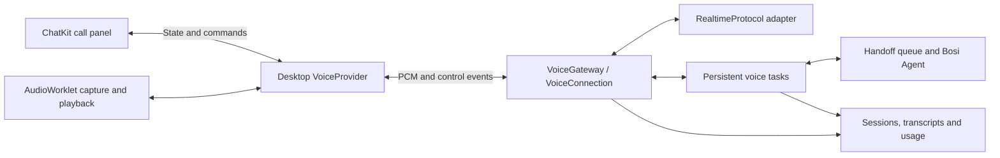

# Realtime voice calls

Realtime voice is an optional Bosi capability for speaking with an assistant while it works. The voice model handles conversation, clarification and task delegation. The assistant's existing Agent handles tools, files and long-running work using its own reasoning model and permissions.

The integration supports Doubao Seeduplex 3.0 and Qwen-Omni-Realtime through model provider plugins. ChatKit provides the call interface; Bosi Desktop owns microphone capture, playback and the call lifecycle; Xpert connects to the provider and manages background tasks.

## Enable the capability

1. Install a provider plugin that exposes a `realtime` model, and configure its credentials in the intended organization.
2. Configure an enabled Copilot with that model and grant the caller model access.
3. When creating a Bosi assistant, select **Realtime voice calls**, a voice model and a voice. For an existing assistant, use **Edit profile → Model & capabilities**.
4. Save and publish the assistant configuration. Calls use the published configuration, and the server rechecks model access and the selected voice when a call starts.

Voice selection is independent of the assistant's reasoning model. Changing the voice does not change its tools or grant additional permissions. Advanced workflow changes remain in Xpert Studio. See [Assistant capabilities](assistant-capabilities.md) for the shared authoring and publishing rules.

The published feature is stored in `features.realtimeVoice` with `enabled`, `copilotModel` and `voice`. The model selection contains `copilotId`, `model` and `modelType: 'realtime'`. Clients select an authorized model from the catalog; provider credentials stay on the server.

## Make and manage a call

Open the assistant's appearance dialog inside the chat and select **Call**. Allow microphone access when prompted. The call panel appears above the appearance dialog within the chat, showing connection status, elapsed time, live captions and task progress.

The panel provides equally sized **Mute / Unmute** and **Hang up** controls. A local ringback tone plays while connecting and stops when the provider is ready. Hanging up plays a short local tone. These sounds do not require a separate speech service.

| Action               | Call behavior                                           | Background work                                                          |
| -------------------- | ------------------------------------------------------- | ------------------------------------------------------------------------ |
| Mute                 | Stops microphone audio until unmuted                    | Continues                                                                |
| Speak over a reply   | Interrupts playback when the provider detects speech    | Continues                                                                |
| Hang up              | Releases the microphone, player and provider connection | Accepted tasks continue in the original conversation                     |
| Ask to cancel a task | Keeps the call available                                | Requests cancellation of the specified task and reports its actual state |

A call remains bound to the assistant, conversation and thread where it started. Navigating to another chat does not rebind it. Desktop keeps the call alive across chat navigation and provides fallback controls when no ChatKit surface is mounted. Signing out, switching organizations or changing the API connection ends the call.

After disconnection, start a new call. The server supplies recent voice context and existing task handles, but does not resume the previous provider's audio session or automatically repeat work. Tasks that need local Shell or device access still require the desktop to be online and authorized.

### Call history

Ending a call adds a duration and a localized **Call ended** message to the originating chat. Duration runs from provider readiness to the first end event; a call canceled before readiness has zero duration.

The server saves one `call_ended` receipt per session. Repeated hangups do not duplicate it, and refreshing the chat reloads the saved receipt. Receipts belong to their original conversation/thread; a new branch has its own call history.

These are timeline events: they do not advance the model's message-tree head, enter model checkpoints or cancel delegated tasks. ChatKit translates the label using `voiceCall.ended` while persistence uses the stable `call_ended` content type.

## Provider configuration

| Setting     | Doubao                        | Qwen                                               |
| ----------- | ----------------------------- | -------------------------------------------------- |
| Plugin      | `@xpert-ai/plugin-volcengine` | `@xpert-ai/plugin-tongyi`                          |
| Provider    | `volcengine-speech`           | `tongyi`                                           |
| Model       | `1.2.6.1`                     | `qwen3.8-omni-flash-realtime`                      |
| Protocol    | Seeduplex 3.0 JSON WebSocket  | Qwen Realtime WebSocket                            |
| Credentials | `speech_api_key`              | `dashscope_api_key` and `api_host`                 |
| Endpoint    | Fixed Speech endpoint         | Bailian workspace endpoint derived from `api_host` |

### Doubao

Configure `speech_api_key` for the Speech service with access to model `1.2.6.1`. Speech is a separate provider within the Volcengine plugin and does not use the Ark API key.

The adapter connects to `wss://openspeech.bytedance.com/api/v3/duplex/realtime/dialogue` and uses JSON frames. Audio output explicitly requests `pcm_s16le` at 24 kHz. Choose a voice from the model catalog.

### Qwen

Set `api_host` to the Bailian workspace host, for example:

```text
example-workspace.cn-beijing.maas.aliyuncs.com
https://example-workspace.ap-southeast-1.maas.aliyuncs.com
```

The workspace and region are already encoded in the host. No `realtime_workspace_id` or `realtime_region` fields are required. This is the Bailian workspace, not an Xpert workspace ID. The DashScope key must match the configured workspace and region.

The adapter accepts the supported Beijing and Singapore workspace domains, converts HTTPS to WSS and appends `/api-ws/v1/realtime?model=...`. The shared international-endpoint switch does not override an explicit workspace host. The generic `dashscope.aliyuncs.com` host does not identify a workspace and is not valid for this realtime model. Arbitrary proxy endpoints are not accepted.

Both plugins retain their existing installation metadata; voice support requires no additional `xpert.plugin` configuration. Provider prices remain unspecified until an operator configures applicable pricing.

## Background tasks and spoken results

The voice model receives four narrow tools. The server binds every operation to the authorized assistant and thread; tool arguments cannot select another organization or grant access to another assistant.

| Tool              | Purpose                                                               |
| ----------------- | --------------------------------------------------------------------- |
| `delegate_task`   | Persist and queue a goal, returning a task handle                     |
| `get_task_status` | Read the current task state and result summary                        |
| `steer_task`      | Send additional instructions through the Agent's follow-up/steer path |
| `cancel_task`     | Request cancellation and report the confirmed state                   |

Tasks run through the existing Handoff queue and Agent execution path. Shell, Computer and connector approval rules still apply. Hanging up or interrupting speech does not cancel accepted work.

The task table acts as a durable outbox. A unique `sessionId + callId` prevents duplicate delegation, and a conditional `queued → running` update gives a task to one worker. An execution with an uncertain outcome after a worker failure is marked `unknown`; the host reconciles its state instead of blindly repeating potentially completed actions.

The host uses the same authoritative task snapshot for the model and UI. Tasks completed before the call are available as context but do not appear as new completion cards when the call connects. Completions observed during the call can be announced when playback and provider turn handling allow it.

### Provider turn handling

Doubao receives a complete batch of tool results and resumes itself. It can synthesize a completion notification while idle; otherwise the host keeps the notification queued.

Qwen treats completed function arguments as provisional until a completed `response.done` confirms the calls. Canceled responses cannot launch tasks. Each function output must receive a matching `conversation.item.created` acknowledgement before one manual continuation is allowed. A newer user turn retires older continuations, including late acknowledgements.

Qwen task snapshots and notifications use typed, quoted runtime text with fixed system instructions. Although the provider uses a user-role message as the carrier, this is runtime data: it emits no user transcript, is not saved as a human chat message and cannot authorize new work. Completion speech waits for an exact echoed-message acknowledgement; provider item IDs alone are insufficient because the provider may replace them. Acknowledgements have a bounded timeout, and completed call IDs are not replayed. A newer user turn consumes an acknowledged notification without starting competing speech.

Qwen VAD owns automatic cancellation when speech begins. The adapter clears local playback without issuing a competing cancel request; explicit interruption still sends an idempotent cancellation. Recognized cancellation conflicts, active-response conflicts, semantic-turn rejection and rejected tool receipts are recoverable. Unknown, authentication and quota errors end the call. Accepted tasks remain independent of that failure.

## Architecture and API



`AiModelTypeEnum.REALTIME` is separate from text model execution. The SDK's server-only `RealtimeModelConnection` provides a URL, headers and a `RealtimeProtocol` factory. The host owns sockets, credentials, backpressure and authorization; adapters encode provider events and emit typed model events.

ChatKit sends call commands through the host bridge and receives call state. It does not carry raw audio. Desktop's top-level renderer owns AudioWorklet capture and playback; its main process uses existing authenticated services to create the session. The renderer receives only a short-lived connection ticket. Call overlays participate in Desktop's no-drag handling so the window drag region does not intercept their controls.

### HTTP endpoints

All HTTP routes below are under `/api/ai` and are registered in `AIModule`. `VoiceController` and `VoiceCapabilityController` share the platform authentication boundary; business services enforce assistant and conversation access. This implementation supports signed-in users and rejects API principals rather than converting them into user permissions.

| Method and path                                  | Purpose                                                                         |
| ------------------------------------------------ | ------------------------------------------------------------------------------- |
| `GET /assistants/:assistantId/voice`             | Read published voice capability availability                                    |
| `POST /threads/:threadId/voice/sessions`         | Create a session for `{assistantId, originMode}` and return a connection ticket |
| `POST /threads/:threadId/voice/sessions/:id/end` | End the call idempotently and return its timeline receipt                       |
| `GET /threads/:threadId/voice/tasks`             | Read the current user's recent tasks in the thread                              |
| `GET /threads/:threadId/voice/transcript`        | Read the current user's recent voice context in the thread                      |

Session creation requires a persisted, authorized thread and the matching assistant ID. `originMode` accepts `web` or `desktop` and defaults to `web`; unknown request fields are rejected. The response contains `sessionId`, `conversationId`, `ticket`, `path`, `inputSampleRate`, `outputSampleRate` and `expiresAt`.

### WebSocket transport

Connect to `/api/ai/voice/stream` with two subprotocols: `xpert-voice-v1` and `ticket.<ticket>`. Redis atomically consumes the ticket, which expires after 30 seconds. The endpoint rejects query parameters, keeping tickets out of URLs.

The transport carries bounded binary PCM frames and typed JSON controls. Client controls include `mute`, `interrupt`, `end`, `ping` and `playback.done`; server events include readiness, transcripts, response boundaries, task state, audio clearing, errors and termination. See the [transport contract](../packages/contracts/src/ai/realtime-voice.transport.ts) for exact fields.

Authorization runs at session creation, connection establishment and every 10 seconds during the call. Checks include organization, user, published assistant configuration, thread access, model access and quota. Allowed origins come from `REALTIME_VOICE_ALLOWED_ORIGINS`, falling back to `CLIENT_BASE_URL`. An opaque `Origin: null` is accepted only for a ticket explicitly created in desktop mode. Electron limits microphone access to trusted top-level content.

### Runtime limits

| Limit                  | Value or behavior                                             |
| ---------------------- | ------------------------------------------------------------- |
| Concurrent calls       | One per user within a tenant                                  |
| Maximum call duration  | 30 minutes                                                    |
| Input audio            | Mono signed PCM16, 16 kHz; 20 ms / 640 bytes per frame        |
| Output audio           | PCM16 at 24 kHz, resampled for the playback device            |
| Input rate             | 50 frames per second with a maximum 100-frame burst allowance |
| Upstream socket buffer | 128,000 bytes                                                 |
| Playback queue         | Up to 30 seconds of samples                                   |

The microphone clock controls upload pacing; the server validates and forwards frames without adding another timed queue. Upload rate violations return `audio_rate_limit`; actual upstream socket accumulation returns `upstream_backpressure`.

If playback exceeds its queue limit, the runtime interrupts that reply, clears queued and late audio for it, and keeps the call available. A provider's `response.done` means generation ended. Playback completes only when the audio thread confirms that the queue is drained for the response ID.

## Persistence and usage

The host stores voice sessions, task mappings, final transcripts, interruption flags, model pricing snapshots and recognized usage receipts. It does not store raw audio. Text and audio usage are reported separately to the existing usage ledger and deduplicated by session, response and modality. Background Agent usage remains separate.

Missing provider usage or a failed ledger write marks the session `incomplete`. Missing pricing remains unpriced; transcript length is not used to estimate audio cost. `reported` means recognized receipts were received, not that every provider billing dimension was available. There is no automatic ledger-redelivery job.

Voice delegation records provenance in the dedicated `ChatMessage.messageEnvelope` JSONB column. The [message envelope contract](../packages/contracts/src/ai/chat-message-envelope.model.ts) describes a version, source, presentation, optional target and correlation. Voice requests use `source: voice` and `presentation: runtime`, preserving execution and retry history while remaining hidden from ordinary chat messages.

The envelope describes provenance and does not grant authority. Its target is audit information; the authorized request controls routing. `thirdPartyMessage` retains its separate purpose. Source variants for users, assistants, agents and automations allow reuse of the contract without implying that a general cross-Agent messaging service is part of voice calls.

Call termination locks the session row and atomically saves the first end time and one `call_ended` chat receipt. Later termination requests preserve that timestamp and already reported usage.

## Deployment

1. Deploy compatible host contracts, plugin SDK, API, provider plugins, Desktop and ChatKit builds. Satisfy the plugins' declared peer dependencies; local source links do not establish that required packages have been published.
2. Create the voice entities and timing columns through the platform's existing TypeORM schema synchronization. With `DB_SCHEMA_SYNC_MODE=external`, run the schema-sync job before API instances start. There is no separate realtime voice SQL migration. For the existing chat table, apply the [message-envelope migration](../packages/server-ai/src/chat-message/migrations/20261005-message-envelope.sql) before deploying message provenance support.
3. Allow WebSocket upgrades on `/api/ai/voice/stream` through the reverse proxy and configure timeouts for long connections. Use HTTPS/WSS for remote services.
4. Set `REALTIME_VOICE_ALLOWED_ORIGINS` to a comma-separated list of allowed renderer origins, or provide the appropriate `CLIENT_BASE_URL` fallback.
5. Install plugins at their declared installation scope. Configure providers, Copilots and published assistants in the intended business organization; installation scope and business request scope are separate.
6. Ensure the desktop build includes microphone permissions. macOS declares microphone usage; system authorization, signing and device behavior still need validation for the distributed application.

For local ChatKit integration, `XPERT_DESKTOP_CHATKIT_BUNDLE` can point to a built web-component entry. Keep the types, UI and web component on the same revision as each other and compatible with the host.

## Troubleshooting and limitations

| Symptom                                      | Check or expected behavior                                                                                                                                     |
| -------------------------------------------- | -------------------------------------------------------------------------------------------------------------------------------------------------------------- |
| Voice is unavailable                         | Check published capability settings, enabled Copilot, selected voice and model authorization in the current organization                                       |
| HTTP 403                                     | Verify the identity and organization context before concluding that access is denied; login alone does not select an organization                              |
| Qwen fails to connect                        | Check that `api_host` is a supported Bailian workspace domain and that its key, region and model access match                                                  |
| No microphone audio                          | Check application and system permissions and the selected input device                                                                                         |
| `audio_rate_limit` / `upstream_backpressure` | Inspect upload pacing or the provider socket backlog; do not mask the problem with unbounded buffering                                                         |
| `playback_overflow`                          | The current reply exceeded the playback queue; the call remains available for the next turn                                                                    |
| Provider disconnects                         | Inspect bounded codes in `voice_protocol_error`, `voice_provider_closed` and `voice_call_ended`; do not log provider secrets, tickets, audio or raw error text |

Calls do not automatically reconnect to the same provider session. Neither adapter provides sample-accurate provider-history truncation; interruption flags do not identify the exact words already heard.

Provider behavior must be qualified for the target account and deployment. Doubao live notification timing and usage coverage, complete billing dimensions, weak networks, speaker echo, Bluetooth switching and signed application behavior require environment-specific validation. The feature does not promise a measured latency or cost SLA.

## Source map

| Area                                         | Location                                                                         |
| -------------------------------------------- | -------------------------------------------------------------------------------- |
| Shared model and transport types             | [Realtime voice contracts](../packages/contracts/src/ai/realtime-voice.model.ts) |
| Provider protocol abstraction                | [Realtime SDK interfaces](../packages/plugin-sdk/src/lib/ai-model/realtime.ts)   |
| HTTP boundary                                | [Voice controllers](../packages/server-ai/src/ai/voice.controller.ts)            |
| Sessions, tasks, audio relay and persistence | [Realtime voice backend](../packages/server-ai/src/realtime-voice/)              |
| Desktop audio and call lifecycle             | [Desktop voice runtime](../apps/desktop/src/voice/)                              |
| ChatKit interface                            | `chatkit-js`: `packages/chatkit-ui/src/components/chat/voice/`                   |
| Provider adapters                            | `xpert-plugins`: `xpertai/models/tongyi` and `xpertai/models/volcengine`         |

Provider-specific protocol checks and packaging commands are documented in the plugin repository's `plugin-dev-harness/REALTIME-VOICE.md`.
