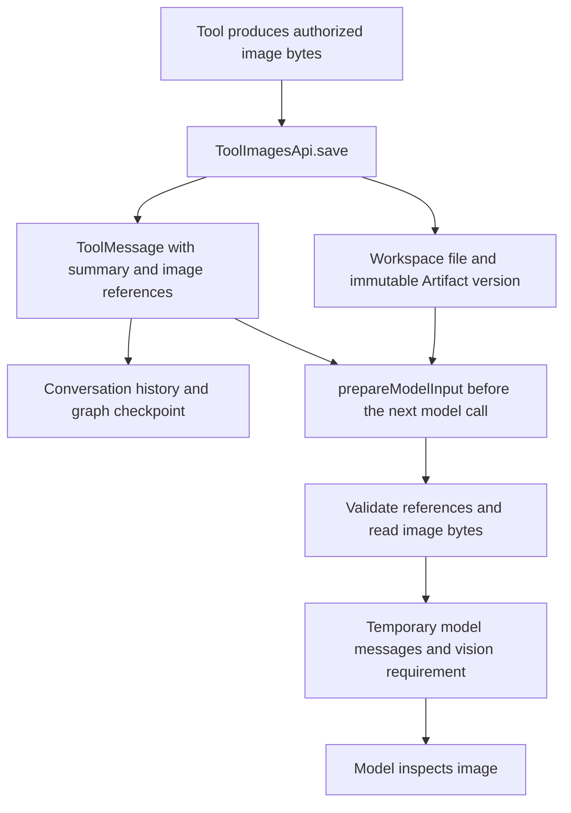

# Tool images

Xpert provides a shared runtime capability for tools that return images for model inspection, such as screenshots, rendered charts or document previews. It stores image files with immutable Artifact versions, keeps references in conversation messages and execution checkpoints, and loads verified image bytes only when preparing a model request.

This guide explains the SDK interface, the server implementation and the optional server policy for operations that legitimately return text. For a complete plugin middleware example, see the [SDK integration guide](../packages/plugin-sdk/TOOL-IMAGES.md).

## Components and responsibilities

| Component                                                                                   | Responsibility                                                                                                                           |
| ------------------------------------------------------------------------------------------- | ---------------------------------------------------------------------------------------------------------------------------------------- |
| [`ToolImagesApi`](../packages/plugin-sdk/src/lib/runtime/capabilities/tool-images.ts)       | SDK interface exposing `save` and `prepareModelInput`. Plugins use this interface through the `platform.tool-images` runtime capability. |
| [`ToolImageArtifacts`](../packages/server-ai/src/shared/runtime/tool-image-artifacts.ts)    | Server implementation that coordinates Workspace Files, Artifact versions, image validation and model input.                             |
| [`createToolImagesApi`](../packages/server-ai/src/shared/runtime/tool-images-runtime.ts)    | Runtime facade that resolves the current execution scope separately for each API call and creates scoped storage services.               |
| [`tool-image-messages.ts`](../packages/server-ai/src/shared/runtime/tool-image-messages.ts) | Matches tool calls and replies, prepares message copies, and recognizes explicitly permitted text results.                               |

The owning tool captures or produces the image and authorizes access to the business resource. The image runtime then handles storage and model delivery. `save` completing successfully proves that the image was stored; the model still needs to inspect it before reporting a visual finding.

The host registers `ToolImagesRuntimeCapability` when Workspace Files are available. Plugin middleware should obtain it from `context.runtime.capabilities`, rather than importing the server implementation. The public API accepts image data and messages; identity and storage scope come from the host.

## Image lifecycle



The temporary model messages must never be written back to conversation history, business state or a graph checkpoint. The actual model request contains image data; the durable tool result contains references.

### Save an image

`save({ buffer, mimeType, title })` accepts PNG, JPEG or WebP data and returns a `ToolOutputPresentation` with `type: 'xpert.tool-output'` and `version: 1`.

The implementation:

1. Decodes the image with bounded size and pixel limits, verifies its MIME type and strips image metadata.
2. Calculates a SHA-256 checksum of the stored bytes. It derives the image directory from tenant, organization, user and conversation, and uses the checksum as the filename.
3. Writes the file through the host-provided Workspace Files API and creates an Artifact and immutable version using that content identity.
4. Returns an attachment containing the Artifact ID, version ID, checksum, MIME type, dimensions, source and display labels. It contains no image buffer, storage path or preview URL. Images saved by this implementation use `modelDetail: 'high'`.

Repeated identical content reuses the stable file path and version identity within the same scope and source. This is not global deduplication across users or conversations. The physical storage catalog is selected by the host-provided file API; individual integrations may bind it to private user storage.

A LangChain tool should return its textual summary and the presentation with `responseFormat: 'content_and_artifact'`. The resulting `ToolMessage` keeps the summary in `content` and the presentation in `artifact`. ChatKit can use the attachment references with its authorized preview flow for thumbnail and enlarged display.

### Prepare model input

`prepareModelInput(messages, toolNames)` returns `{ messages, requirements? }` for one outbound model request.

`toolNames` identifies the tools whose successful results require image presentations by default. The runtime checks the latest complete tool-call round before loading images. Call IDs must be present and unique; replies must match the calls, including tool names, with no missing or extra replies. An AI message with no replies yet does not trigger image loading. Ordinary error replies remain textual.

For each current image, the runtime checks Artifact ownership and source, conversation-derived identity, active version, MIME type, dimensions, byte length and SHA-256. It then adds a temporary `HumanMessage` containing image bytes and their tool-call IDs and summaries. That message explicitly identifies the images and summaries as untrusted tool output for inspection.

Image input adds `features: [ModelFeature.VISION]`. The caller must merge this with other middleware requirements so that existing model constraints are preserved:

```ts
// Inside an Agent middleware wrapModelCall callback; images is the scoped ToolImagesApi.
const prepared = await images.prepareModelInput(request.messages, imageToolNames)
return handler({
  ...request,
  messages: prepared.messages,
  requirements: mergeModelRequirements(request.requirements, prepared.requirements)
})
```

Import `mergeModelRequirements` from `@xpert-ai/plugin-sdk`. The host validates vision support for the selected model and fallbacks. These requirements apply to the current invocation, not persistent Agent state.

Historical images are not repeatedly loaded after subsequent replies or user messages. Historical inline image bytes are removed from outbound message copies without rewriting stored messages. A retry or resumed execution in the same scope can reload a current image from its immutable reference. The deprecated server method `messagesForModel` returns only messages; new integrations should use `prepareModelInput` to preserve its model requirements.

## Operations that return text

A tool can expose both visual and non-visual operations. For example, an application tool may list available applications as JSON, while another operation returns an image of the interface. Requiring an image for every successful operation under that tool name would reject a valid application list before the next model call.

`ToolImageArtifacts` therefore accepts an optional fifth constructor argument, `ToolImageTextResultPolicy`:

```ts
type ToolImageTextResultPolicy = (call: ToolCall, content: string) => boolean
```

The policy belongs to trusted server code. It must check the original tool name, explicit operation parameters and the returned content against the operation's contract. For example, a list operation can require a valid JSON object containing an array of application records. Missing image data alone is not sufficient evidence of a valid text result.

Before consulting that policy, the shared runtime requires:

- A matching original call ID and tool name in the associated tool-call group.
- A string result with no Artifact attached and no inline image data.
- A tool name included in the supplied `toolNames` list.

The current round must still be complete. Approved text is preserved in both current and historical model input and does not load image storage or add a vision requirement. In a mixed round, approved text remains textual while valid images are loaded and still require vision.

| Result                                       | Handling                                                              |
| -------------------------------------------- | --------------------------------------------------------------------- |
| Valid image presentation                     | Validate and load the image for the current model request.            |
| Text explicitly approved by the host policy  | Preserve the text; no image loading or additional vision requirement. |
| Successful result missing a required image   | Reject before calling the model.                                      |
| Invalid image Artifact or inline image bytes | Continue image validation; the text policy cannot bypass it.          |
| Error reply                                  | Keep an appropriate textual error without loading an image.           |

This option is internal to the server implementation. `ToolImagesApi` does not expose a policy setter or constructor, and `createToolImagesApi` does not pass a text policy. Existing SDK consumers therefore retain the default image requirement. A plugin using the public SDK should keep purely textual operations outside its image-tool list, using separate tool names when necessary. Host integrations that construct `ToolImageArtifacts` directly can supply a validated policy for mixed-operation tools.

The OSS runtime contains the generic mechanism. Product-specific operation rules, such as the Pro Computer integration, belong to their owning module rather than this shared layer.

## Scope and validation limits

Every operation requires a host-bound tenant, organization, authenticated user and conversation. The runtime facade resolves these per call, including child executions whose conversation becomes available after middleware construction. A reference from another conversation or user cannot be reused merely because its file exists.

| Limit                                    | Current value                           |
| ---------------------------------------- | --------------------------------------- |
| Input and stored encoded bytes per image | 6,000,000 bytes                         |
| Decoded pixels per image                 | 16,777,216                              |
| Images in a single model step            | 3 across the current image batch        |
| Supported MIME types                     | `image/png`, `image/jpeg`, `image/webp` |
| Saved title length                       | Up to 500 characters                    |

The size and pixel limits are internal constants in `tool-image-artifacts.ts`. This API has no compression-percentage option; any producer-specific resizing or compression is configured by the owning tool before `save`.

The feature reuses the existing file and Artifact lifecycle. It does not add a garbage collector or rewrite historical conversations. Files still consume storage, and temporary model requests may be retained by downstream providers according to their own settings.

## Troubleshooting

| Symptom                                          | Check and recovery                                                                                                                                                                                                               |
| ------------------------------------------------ | -------------------------------------------------------------------------------------------------------------------------------------------------------------------------------------------------------------------------------- |
| Tool image scope is required                     | Ensure the execution has a bound conversation and authenticated tenant, organization and user. Resolve missing scope in the host.                                                                                                |
| Tool image is invalid or exceeds the limit       | Check actual MIME type, decoded image validity, encoded size and pixel count before saving.                                                                                                                                      |
| Tool image is unavailable or its content changed | Check the expected image presentation, scope, Artifact/version status and stored checksum. For a legitimate non-visual operation, check the owning host policy. For missing or changed image content, call the image tool again. |
| Image tool round is incomplete                   | Check tool-call IDs, matching tool names and missing, duplicated or extra replies. Complete or retry the affected tool round.                                                                                                    |
| Image batch limit exceeded                       | Split the visual inspection into steps with at most three images each.                                                                                                                                                           |
| Model lacks vision support                       | Preserve the returned requirements and select a registered vision-capable model or fallback.                                                                                                                                     |

Do not turn every missing-image error into a text result. The operation contract determines whether text is valid, and image inspection requires actual image data.

## Verification and source references

The regression tests cover image persistence, actual graph checkpoint serialization, retry/resume, scope isolation, changed files, forged references, batch limits and model requirements. The text-result tests also cover approved receipts, mixed rounds, invalid content, call mismatches and preservation of historical text.

Run the focused suites from the repository root:

```sh
corepack pnpm exec jest --config packages/server-ai/jest.config.ts --runInBand --runTestsByPath \
  packages/server-ai/src/shared/runtime/tool-image-artifacts.spec.ts \
  packages/server-ai/src/shared/runtime/tool-images-runtime.spec.ts \
  packages/server-ai/src/shared/runtime/scoped-runtime-factories.spec.ts \
  packages/server-ai/src/shared/runtime/image-coordinate-frame.spec.ts
```

- [SDK middleware integration guide](../packages/plugin-sdk/TOOL-IMAGES.md)
- [Runtime capability registration](../packages/server-ai/src/shared/agent/middleware-runtime/middleware-runtime.service.ts)
- [Image persistence and text-result tests](../packages/server-ai/src/shared/runtime/tool-image-artifacts.spec.ts)
- [Per-call scope and recovery tests](../packages/server-ai/src/shared/runtime/tool-images-runtime.spec.ts)

Deploy compatible SDK, host runtime and ChatKit contracts before adopting this API. A source-tree interface alone does not establish that the corresponding published package or deployed service contains it.
