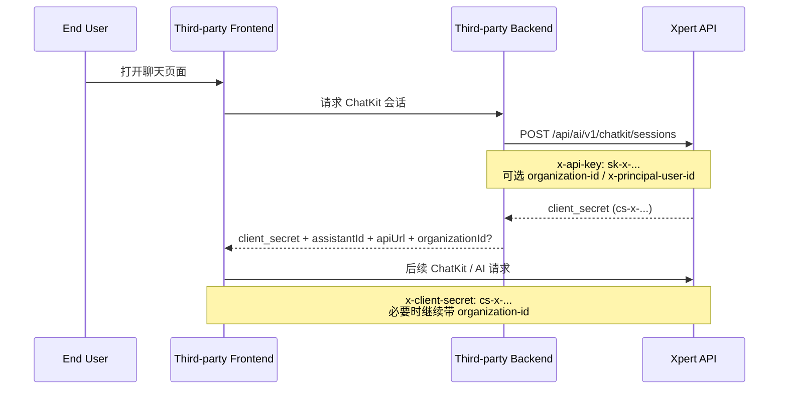

# 第三方系统接入 ChatKit

这篇文档说明第三方系统如何通过 `apiKey` 接入 Xpert ChatKit，包括换取 `client_secret`、初始化 ChatKit、继续访问 AI 接口时需要带上的上下文，以及 assistant 场景下的访问限制。

## 适用场景

这篇文档适用于以下接入方式：

- 第三方 Web 应用嵌入 ChatKit UI
- 第三方服务端持有 Xpert `apiKey`，为前端换取短期 `client_secret`
- 第三方系统需要访问已发布 assistant / thread / conversation / context 相关 AI 接口

如果你只是直接调用普通后端 API，而不接入 ChatKit，会话换取和 `client_secret` 部分可以跳过。

## 核心概念

接入前先区分两类凭据：

- `apiKey`
  - 长期凭据
  - 形如 `sk-x-...`
  - 用于服务端到服务端鉴权
  - 可以换取 `client_secret`
- `client_secret`
  - 短期凭据
  - 形如 `cs-x-...`
  - 由 `POST /api/ai/v1/chatkit/sessions` 签发
  - 供 ChatKit 或前端侧 AI 请求使用

推荐做法是：

- 第三方后端安全保存 `apiKey`
- 第三方前端永远不要直接持有长期 `apiKey`
- 第三方前端只拿短期 `client_secret`

## 推荐接入架构



## 接入前提

开始接入前，需要先准备好以下信息：

### 1. API 基础地址

假设 Xpert 服务地址为：

```text
https://xpert.example.com
```

则 AI API 基础地址通常为：

```text
https://xpert.example.com/api/ai
```

### 2. ChatKit frame 地址

如果你要嵌入托管版 ChatKit UI，还需要一个可访问的 `frameUrl`。

在当前仓库前端运行时中，ChatKit frame 由部署环境统一提供，不写入数据库。

### 3. Assistant 标识

如果你接入的是某个已发布 assistant，需要准备：

- `assistantId`
- 或等价的 `xpertId`

在当前实现里，ChatKit 使用的 `assistantId` 实际上就是 `Xpert.id`。

### 4. 对应的 `apiKey`

第三方系统至少需要一个有效的 `apiKey`。

常见绑定方式如下：

- `apiKey.userId`
  - 直接绑定某个技术账号
- `apiKey.type = assistant` + `apiKey.entityId = xpertId`
  - 绑定某个 assistant
- `apiKey.type = integration` + `apiKey.entityId = integrationId`
  - 绑定某个 integration
- `apiKey.type = client` + `apiKey.entityId = clientCode`
  - 绑定某个通用第三方 client

对于 assistant 专用接入，推荐显式使用：

```text
apiKey.type = assistant
apiKey.entityId = <assistantId>
```

这样后续运行 assistant 时，服务端会校验这个 key 是否允许访问当前 assistant。

## 第一步：用 `apiKey` 换取 `client_secret`

### 接口

```http
POST /api/ai/v1/chatkit/sessions
```

### 鉴权方式

这个接口只能使用 `apiKey` 访问，不能使用已有的 `client_secret` 再换新 secret。

你可以二选一：

- `x-api-key: sk-x-...`
- `Authorization: Bearer sk-x-...`

### 请求头

#### 必传

```http
Content-Type: application/json
x-api-key: sk-x-...
```

#### 可选

```http
organization-id: org-xxx
x-principal-user-id: user-xxx
```

这些可选头的含义是：

- `organization-id`
  - 表示这次请求原始所属的组织上下文
  - 对组织级 published assistant 的访问控制很重要
- `x-principal-user-id`
  - 显式声明“这次请求代表哪个业务用户”
  - 不传时，默认按 `apiKey` 绑定出的技术身份执行
  - 如果你希望后续 `client_secret` 固定绑定某个 end user，应该在这一步传入

对于第三方 ChatKit 接入，若会话对应的是某个明确的终端用户，建议在创建 `client_secret` 时就传入：

- Header 常量：`API_PRINCIPAL_USER_ID_HEADER`
- 实际 Header 名称：`x-principal-user-id`

这样生成出来的 `client_secret` 会绑定到这个“实际使用人”。

### 请求体

当前接口只识别一个可选字段：

```json
{
  "expires_after": 600
}
```

说明：

- 单位为秒
- 不传时默认 `600`
- 传入非正数时，也会回退到 `600`

### 示例

```bash
curl -X POST "https://xpert.example.com/api/ai/v1/chatkit/sessions" \
  -H "Content-Type: application/json" \
  -H "x-api-key: sk-x-your-api-key" \
  -H "organization-id: org-001" \
  -H "x-principal-user-id: user-001" \
  -d '{"expires_after":600}'
```

### 返回结果

```json
{
  "client_secret": "cs-x-xxxxxxxxxxxxxxxx",
  "expires_at": "2026-04-07T08:00:00.000Z",
  "expires_after": 600
}
```

### `client_secret` 会绑定到谁

`client_secret` 创建时，会把当前请求上下文中的用户写入 `secretToken.createdById`。

这意味着：

- 如果你在 `chatkit/sessions` 这一步传了 `x-principal-user-id`
  - `client_secret` 会绑定到这个业务用户
- 如果你没有传
  - `client_secret` 会绑定到当前 `apiKey` 解析出的技术身份

在第三方 ChatKit 场景里，更推荐的约定是：

- 用 `apiKey` 作为系统级长期凭据
- 在创建 `client_secret` 时显式传 `API_PRINCIPAL_USER_ID_HEADER`
- 让 `client_secret` 绑定到实际使用该会话的终端用户

换句话说，`apiKey` 是系统级长期凭据，而 `client_secret` 是“由谁申请出来，就归谁使用”的短期凭据。

## 第二步：把 `client_secret` 交给 ChatKit

第三方系统推荐不要让前端直接去调用 Xpert 的 `chatkit/sessions`。

更推荐的做法是：

1. 前端请求你自己的后端
2. 你自己的后端再去调用 Xpert `chatkit/sessions`
3. 后端把短期 `client_secret` 返回给前端

返回给前端的最小信息通常包括：

- `client_secret`
- `assistantId`
- `apiUrl`
- `frameUrl`
- `organizationId`

示例返回：

```json
{
  "client_secret": "cs-x-xxxxxxxxxxxxxxxx",
  "assistantId": "a0d7a437-xxxx-xxxx-xxxx-xxxxxxxxxxxx",
  "apiUrl": "https://xpert.example.com/api/ai",
  "frameUrl": "https://xpert.example.com/chatkit/index.html",
  "organizationId": "org-001"
}
```

### 前端初始化示例

下面是一个示意性用法，重点是把短期 secret 注入到 ChatKit，而不是暴露长期 `apiKey`：

```ts
const session = await fetch('/api/chatkit/session', {
  method: 'POST'
}).then((res) => res.json())

const control = createChatKit({
  frameUrl: session.frameUrl,
  api: {
    apiUrl: session.apiUrl,
    xpertId: session.assistantId,
    getClientSecret: async () =>
      session.organizationId
        ? {
            secret: session.client_secret,
            organizationId: session.organizationId
          }
        : session.client_secret
  }
})
```

如果你的场景没有组织上下文，可以直接返回字符串形式的 `client_secret`。

## 第三步：后续 AI 请求如何带凭据

换取到 `client_secret` 后，后续 AI 请求可以使用以下任一方式：

- `x-client-secret: cs-x-...`
- `Authorization: Bearer cs-x-...`

### `client_secret` 鉴权时服务端会做什么

当前 `SecretTokenStrategy` 的处理逻辑是：

1. 从 `x-client-secret` 或 `Authorization: Bearer cs-x-...` 读取 token
2. 校验 `client_secret` 记录存在且未过期
3. 反查它对应的原始 `apiKey`
4. 再次校验原始 `apiKey` 没有过期
5. 把当前请求标记为 `principalType = client_secret`
6. 把业务用户固定为 `secretToken.createdById`
7. 记录原始 `organization-id`，然后把请求归一到 tenant scope

这也意味着：

- 后续使用 `client_secret` 时，业务用户不是从 `x-principal-user-id` 现取
- 而是直接使用这个 secret 在创建时绑定下来的用户

当前仓库中，以下 AI 控制器都支持 `apiKey` 或 `client_secret` 访问：

- `/api/ai/assistants/**`
- `/api/ai/threads/**`
- `/api/ai/conversations/**`
- `/api/ai/contexts/**`
- `/api/ai/store/**`
- `/api/ai/v1/chat`

也就是说，`client_secret` 主要用于“会话换取之后的 AI 访问”，而不是重新申请新的 session。

## Assistant 场景的特殊规则

### 1. 换取 `client_secret` 时不需要传 `assistantId`

`POST /api/ai/v1/chatkit/sessions` 本身不会要求你在 body 中传 `assistantId`。

它只做两件事：

- 校验 `apiKey`
- 为这个 `apiKey` 生成一个短期 `client_secret`

### 2. 真正运行 assistant 时才校验 assistant 绑定

如果当前 `apiKey` 是 assistant 专用 key：

```text
apiKey.type = assistant
apiKey.entityId = <assistantId>
```

那么当后续请求真正进入 assistant 运行链路时，服务端会校验：

- 当前 key 是否允许访问这个 assistant

如果 `entityId` 和实际 assistant 不一致，请求会被拒绝。

### 3. `assistantId` 要和前端传给 ChatKit 的 `xpertId` 保持一致

ChatKit 初始化时传入的：

```ts
api: {
  xpertId: assistantId
}
```

应该与目标 published assistant 的真实 `Xpert.id` 一致。

## 组织与业务用户上下文

这是第三方接入里最容易混淆的一部分。

### 1. `organization-id`

如果目标 assistant 的可见性或权限依赖组织上下文，建议在整个会话期间保持同一个 `organization-id`。

注意：

- `chatkit/sessions` 在鉴权时会先记录原始 `organization-id`
- 然后把请求归一到 tenant scope
- assistant 实际授权时会优先参考这个原始组织上下文

这意味着：

- 如果你的 assistant 是组织级 published assistant
- 或者启用了 org / userGroup 访问控制
- 第三方系统就不应该丢掉 `organization-id`

### 2. `x-principal-user-id`

这个 header 用于声明：

- 当前请求代表的是哪个业务用户

它和 `apiKey` 背后的技术身份不是一回事：

- 技术身份：第三方系统本身
- 业务用户：第三方系统当前正在代表谁发起请求

如果你不传 `x-principal-user-id`，默认由系统按 `apiKey` 绑定出的技术主体执行。

但要注意区分两个阶段：

- 使用 `apiKey` 调 `POST /api/ai/v1/chatkit/sessions` 时
  - 可以通过 `x-principal-user-id` 指定本次要绑定的业务用户
- 后续使用 `client_secret` 调 AI 接口时
  - 当前 `SecretTokenStrategy` 不再用 `x-principal-user-id` 覆盖业务用户
  - 而是直接使用 `secretToken.createdById`

所以如果你希望一个 ChatKit 会话固定代表某个 end user，应该在换取 `client_secret` 时就通过 `API_PRINCIPAL_USER_ID_HEADER` 把这个用户传进去。

### 3. 一个重要限制

从对外暴露的 token 字符串本身看，`client_secret` 不会直接编码：

- `assistantId`
- `organization-id`

但在服务端记录里，它会关联：

- 对应的 `apiKey`
- 过期时间
- `secretToken.createdById`

也就是说，业务用户并不是靠后续 header 动态决定，而是由 `secretToken.createdById` 固定下来。

因此建议：

- `organization-id` 在后续请求里继续保持一致
- 如果你需要显式业务用户语义，在创建 `client_secret` 时就传入 `API_PRINCIPAL_USER_ID_HEADER`，也就是 `x-principal-user-id`

如果你使用的是托管版 ChatKit，而宿主层当前没有暴露自定义 header 注入能力，建议在第三方系统前面增加一层轻量代理，由代理统一转发这些上下文。

## 常见错误与排查

### 1. `401 Invalid token`

通常表示：

- `x-api-key` 填错
- key 已失效
- key 对应记录异常

### 2. `401 Token expired`

通常表示：

- `client_secret` 已过期
- 需要重新调用 `/api/ai/v1/chatkit/sessions`

### 3. `401 ApiKey expired`

通常表示：

- `client_secret` 自身虽然还在有效期内
- 但它对应的原始 `apiKey` 已经过期

### 4. `403 API key is not allowed to access this assistant`

通常表示：

- 这是 assistant 绑定 key
- 但 `apiKey.entityId` 与当前 assistant 不一致

### 5. 组织级 assistant 返回 `403`

优先检查：

- 是否带了正确的 `organization-id`
- 当前组织下是否有访问该 published assistant 的权限
- 当前组织是否满足对应 user group / ACL 要求

## 安全建议

- 永远不要在浏览器中暴露长期 `apiKey`
- `client_secret` 建议使用短过期时间
- 前端在 secret 过期后重新向自己的后端申请，而不是直接持有长期 key
- assistant 专用接入尽量使用 `type = assistant` 的绑定 key
- 需要 end-user 审计时，显式传 `x-principal-user-id`

## 最小落地清单

如果你要最快完成第三方接入，至少需要做到这几件事：

1. 创建并保存一个服务端使用的 `apiKey`
2. 明确目标 `assistantId`
3. 第三方后端实现 `/chatkit/session` 之类的会话代理接口
4. 代理接口内部调用 `POST /api/ai/v1/chatkit/sessions`
5. 前端只接收 `client_secret`，不接触长期 `apiKey`
6. assistant 有组织权限要求时，全链路保持 `organization-id`

## 相关文档

- `助手架构`: 说明当前 Assistant / ChatKit 运行时在系统中的角色
- OpenAPI: 可查看 `/api/ai/v1/chatkit/sessions` 以及相关 AI 接口导出
