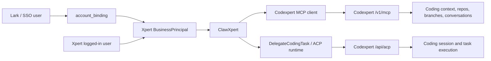

# Xpert 调 Codexpert Remote ACP 技术总结

本文总结这次通过 ClawXpert 从 Xpert 调用 Codexpert 的工程实践。

目标链路是：

```text
三方用户 -> account_binding -> Xpert business principal -> Codexpert MCP/ACP
```

在飞书链路里，具体目标链路是：

```text
Lark union_id -> account_binding -> Xpert user -> BusinessPrincipal -> Codexpert headers
```

## 范围

本实践覆盖：

- 运行在 Xpert 内的 ClawXpert。
- 通过 MCP 暴露的 Codexpert 上下文工具。
- 通过 remote ACP 暴露的 Codexpert 编码任务执行。
- 使用 `tenantId`、`organizationId`、`userId` 的硬身份边界。

本次不试图做通用 ACP 平台、通用 MCP identity framework，也不做通用三方身份中台。

## 架构



## 文件地图

Xpert host：

- `packages/server-ai/src/shared/identity/business-principal.ts`
  - 构造完整的 `BusinessPrincipal`。
  - 要么使用 API principal 作为完整来源，要么使用普通 RequestContext 作为完整来源。
  - 不把 `requestedUserId` 和 fallback `currentUserId` 混在一起拼身份。
- `packages/server-ai/src/codexpert/codexpert-identity-headers.ts`
  - 把 `BusinessPrincipal` 映射成 Codexpert headers。
  - 不读 RequestContext、不读飞书 payload、不读 ACP session。
- `packages/server-ai/src/xpert-toolset/provider/mcp/types.ts`
  - 创建 MCP client。
  - 只给 server name 为 `codexpert-context` 的 MCP server 注入 Codexpert 身份。
  - 保留 schema/env 中的 `Authorization`。
- `packages/server-ai/src/xpert-toolset/commands/handlers/get-tools.handler.ts`
  - 当请求的 toolset 包含 `codexpert-context` 时解析 `BusinessPrincipal`。
- `packages/server-ai/src/xpert-tool/commands/handlers/tool-invoke.handler.ts`
  - 直接调用 MCP tool 时解析 `BusinessPrincipal`。
- `packages/server-ai/src/codexpert/codexpert-context-mcp.middleware.ts`
  - 把 Codexpert MCP tools 暴露成 agent middleware。
  - 从 options/env 读取 MCP URL 和 service token。
- `packages/server-ai/src/acp-runtime/delegate-coding-task.middleware.ts`
  - 暴露 `delegate_coding_task` 工具。
  - 创建 delegated ACP session，并把进度流回聊天。
- `packages/server-ai/src/acp-runtime/acp-runtime.service.ts`
  - 创建 delegated session 时只解析一次当前 `BusinessPrincipal`。
  - 写入 `session.metadata.businessPrincipal`。
- `packages/server-ai/src/acp-runtime/backends/remote-xpert-acp.backend.ts`
  - 向 Codexpert 发 remote ACP 请求。
  - 只从 `session.metadata.businessPrincipal` 构造身份 headers。
- `packages/contracts/src/ai/acp-session.model.ts`
  - 定义稳定的 ACP session metadata 字段 `businessPrincipal`。

Codexpert API：

- `apps/api/src/features/acp/acp.controller.ts`
  - 暴露 remote ACP endpoints。
- `apps/api/src/features/acp/acp.service.ts`
  - 从 `tenant-id`、`organization-id`、`x-principal-user-id` 解析调用方身份。
  - 把 ACP prompt 转成 Codexpert coding task，并流式返回事件。
- `apps/api/src/features/mcp/mcp.controller.ts`
  - 暴露 MCP streamable HTTP 和 legacy SSE endpoints。
- `apps/api/src/features/mcp/mcp-coding-context.service.ts`
  - 对 coding context tools 要求同一组三段身份 headers。
- `apps/api/src/lib/principal-context.ts`
  - 归一化 requested/effective principal context。

Lark plugin：

- `xpertai/integrations/lark/src/lib/lark-inbound-identity.service.ts`
  - 通过 `account_binding` 把 `union_id` 解析成 Xpert user。
- `xpertai/integrations/lark/src/lib/workflow/lark-trigger.strategy.ts`
  - Codexpert/Claw 路径要求 mapped-user 执行时，不应该 fallback 到 integration creator。

## 身份规则

集成使用硬业务身份：

```ts
type BusinessPrincipal = {
  tenantId: string
  organizationId: string
  userId: string
}
```

允许的来源：

- API principal 来源：
  - `requestedUserId`
  - `requestedOrganizationId`
  - `currentTenantId`
- 普通 request context 来源：
  - `currentUserId`
  - `currentTenantId`
  - `getOrganizationId`

resolver 必须使用一条完整来源。不能拿 API requested user 再混普通 request context 的 organization 或 user 来拼身份。

Codexpert 收到的是：

```http
tenant-id: <tenantId>
organization-id: <organizationId>
x-principal-user-id: <userId>
Authorization: Bearer <service-token>
```

## MCP 流程

1. ClawXpert 需要 Codexpert 上下文。
2. `ToolsetGetToolsHandler` 或 `ToolInvokeHandler` 检测到 `codexpert-context`。
3. Xpert 解析 `BusinessPrincipal`。
4. `MCPToolset` 把 principal 传给 `createMCPClient`。
5. `createMCPClient` 先渲染配置 headers，再为 `codexpert-context` 覆盖三段业务身份 headers。
6. Codexpert MCP 校验 headers，并返回上下文工具。

关键不变量：

- MCP schema 可以负责连接鉴权，例如 `Authorization`。
- MCP schema 不能负责业务身份 headers。

## ACP 流程

1. ClawXpert 调用 `delegate_coding_task`。
2. `DelegateCodingTaskMiddleware` 校验 sandbox、execution、conversation 和 target policy。
3. `AcpRuntimeService.ensureDelegatedSession()` 只解析一次 `BusinessPrincipal`。
4. principal 被写入 `session.metadata.businessPrincipal`。
5. `RemoteXpertAcpBackend` 只读取这个字段构造 Codexpert headers。
6. Codexpert 创建或加载 coding session。
7. Xpert 通过 `AcpSessionBridgeService` 启动 prompt stream。
8. ACP events 和可见正文流回 ClawXpert 对话。
9. 如果 ACP 流缺少 `done` 或 `error` 终态，要按错误处理，不能包装成成功。

关键不变量：

- 远程 Codexpert ACP 失败时，不应该 fallback 到本地 CLI。
- 缺少 `businessPrincipal` 时，必须在出站请求 Codexpert 前失败。

## 为什么 ACP 和 MCP 必须使用同一个 Principal

MCP 决定用户能看到和选择什么：

- coding assistants；
- Git connections；
- repositories；
- branches；
- 已有 Codexpert conversations；
- 可恢复上下文。

ACP 执行真正改代码的任务。如果 MCP 和 ACP 使用不同用户，ClawXpert 可能用 A 用户选择上下文，却用 B 用户执行代码。因此两条路径必须消费同一个 `BusinessPrincipal`。

## 失败边界

这里优先使用硬错误，而不是隐形 fallback：

- 飞书用户进入 Codexpert 执行路径时没有 account binding。
- 缺少 tenant、organization 或 user。
- `codexpert-context` MCP 没有 principal。
- ACP session 没有 `metadata.businessPrincipal`。
- Codexpert stream 关闭时没有终态 `done` 或 `error`。
- remote Codexpert target 鉴权失败或 endpoint 解析失败。

系统应该在错误源头附近报错，而不是转成本地 CLI、creator fallback 或假成功。

## 本地验证清单

本地联调时按这个清单确认：

1. Codexpert API 已启动。
2. Xpert API 已启动。
3. Codexpert 配了 `ACP_SERVICE_TOKEN` 或 `CODEXPERT_ACP_SERVICE_TOKEN`。
4. Codexpert 配了 `MCP_SERVER_TOKEN` 或 `MCP_SERVER_TOKENS`。
5. Xpert 配了 `CODEXPERT_ACP_BASE_URL`。
6. Xpert 配了 `CODEXPERT_ACP_SERVICE_TOKEN`。
7. Xpert 配了 `CODEXPERT_MCP_BASE_URL`。
8. Xpert 配了 `CODEXPERT_MCP_SERVICE_TOKEN`。
9. ClawXpert 启用了 `DelegateCodingTask`，target 是 `remote_xpert_acp`。
10. ClawXpert 通过 `CodexpertContextMcp` 或名为 `codexpert-context` 的 MCP toolset 暴露 Codexpert MCP。
11. 当前请求上下文能解析出完整 `BusinessPrincipal`。
12. `listCodingAssistants`、`listGitConnections` 等 Codexpert MCP 工具不再报缺 headers。
13. ACP `delegate_coding_task` 能创建 remote Codexpert session。
14. ACP stream 能到达 `done` 或 `error` 终态。

## 线上验证清单

开放给真实用户前按这个清单确认：

1. Codexpert 生产 secret 包含 `ACP_SERVICE_TOKEN` 或 `CODEXPERT_ACP_SERVICE_TOKEN`。
2. Codexpert 生产 secret 包含 `MCP_SERVER_TOKEN` 或 `MCP_SERVER_TOKENS`。
3. Xpert 生产 secret 包含 `CODEXPERT_ACP_BASE_URL`，并且指向真实 Codexpert ACP 路由。
4. Xpert 生产 secret 包含 `CODEXPERT_ACP_SERVICE_TOKEN`，并且和 Codexpert ACP 匹配。
5. Xpert 生产 secret 包含 `CODEXPERT_MCP_BASE_URL`，并且指向真实 Codexpert `/v1/mcp` 路由。
6. Xpert 生产 secret 包含 `CODEXPERT_MCP_SERVICE_TOKEN`，并且和 Codexpert MCP 匹配。
7. 已发布 ClawXpert 配置启用了 `DelegateCodingTask`，target 是 `remote_xpert_acp`。
8. 已发布 ClawXpert 通过 `CodexpertContextMcp` 或 `codexpert-context` MCP toolset 暴露 Codexpert MCP。
9. MCP schema 里没有静态 `tenant-id`、`organization-id` 或 `x-principal-user-id`。
10. 浏览器用户能解析出完整 Xpert `BusinessPrincipal`。
11. 飞书用户进入 Codexpert 路径时能通过 `account_binding(provider = lark)` 解析。
12. 未绑定三方用户收到绑定错误或绑定链接，而不是 fallback 到 creator。
13. 远程 Codexpert 错误可观测，并且不会 fallback 到本地 CLI。

## 设计边界

本实践保持职责分离：

- 插件负责识别三方用户，并使用 `account_binding` 这样的平台能力。
- Xpert host 负责解析平台业务身份，并通过 Codexpert adapter 转成 Codexpert headers。
- Codexpert 负责校验三段身份 headers，并执行上下文和任务逻辑。

后续企业微信、钉钉等 SSO/集成也应该走同样模式：

```text
provider subject id -> account_binding -> Xpert user -> BusinessPrincipal -> downstream adapter headers
```

它们不应该知道 Codexpert 专用 headers。
