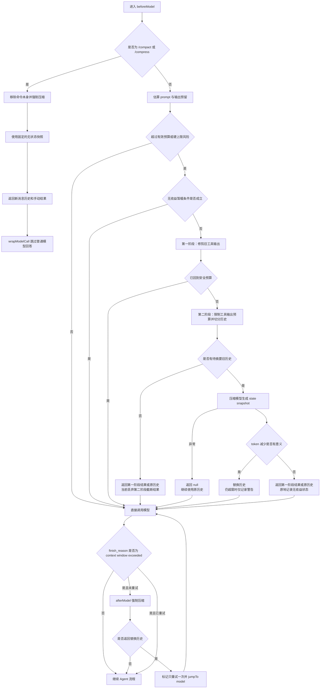

## 本次实现状态（2026-09-07，本地未提交）

保留现有“两阶段修剪与摘要”以及 LangGraph Agent channel 架构，修复预算、状态写回和模型参数来源。以下描述本地修改后的行为；后面的折叠章节保留修复前审计证据，不表示缺陷仍全部存在。未连接华域内网验证，也未部署。

| 改动         | 当前行为                                                                                                                                                                                                                                                                                                          |
| ------------ | ----------------------------------------------------------------------------------------------------------------------------------------------------------------------------------------------------------------------------------------------------------------------------------------------------------------- |
| 模型窗口来源 | `context_size_source` 区分 `provider`、`override`、`snapshot`；仅标为 provider 的值随目录刷新。无标记旧值继续保留，避免静默改变已有配置。                                                                                                                                                                         |
| 有效模型参数 | 主调用和 middleware 模型工厂解析参数默认值；执行元数据保存脱敏后的有效快照。输出 token 上限不会被凭证过滤误删。Primary 已有快照在对应 Primary 执行解析后更新，并标为 snapshot。                                                                                                                                   |
| 窗口显示     | 首次调用前保存有效快照，用量事件直接读取当前 Agent 快照（包括实际启用的 fallback），不等待整轮结束；事件附带有效模型窗口；输入框优先读取该窗口，其次读取 Primary Agent 的配置，最后回退根配置。旧事件继续兼容。                                                                                                   |
| 动态工具预算 | 工具文本缩减目标不超过可用消息目标的 35%；图片等非文本块保留合法结构并交由最终预算检查；旧工具修剪保护量和最小收益门槛也受目标预算约束。已有配置值作为上限。                                                                                                                                                      |
| 最新回合     | 即使没有可摘要的旧用户回合，也独立保留工具截断结果。工具调用和结果配对、消息 ID 和附加元数据继续保留。                                                                                                                                                                                                            |
| 截断边界     | 移除五行保底；行数只限制最多保留量，截断标记和文件路径本身也计入预算。                                                                                                                                                                                                                                            |
| 完整请求检查 | 触发与最终检查采用同一口径：本地完整请求估算与仍有效的 usage 锚点取较大值，预留输出及 5% 余量。检查放在 retry/fallback 内，对每个实际候选模型分别执行，均不满足才停止；配置的默认值 fallback 仍可处理错误。                                                                                                       |
| 历史 usage   | 替换历史后标记旧 usage 锚点失效，重新按新内容估算；保留原 usage 数据供审计。                                                                                                                                                                                                                                      |
| 无收益状态   | 通过 hook 返回值及显式 Agent channel 更新保存，按旧历史和模型配置指纹抑制重复摘要，清理用 null；硬超窗不再自动绕过抑制。包装阶段失败会携带状态返回模型节点，先写入 checkpoint，再在首个 afterModel 节点报错；同一次失败执行恢复时不会重新摘要；从该失败 checkpoint 发起的新执行可携带已保存的状态重新进入模型链。 |
| 摘要自身预算 | 长输入按预算滚动分块；摘要输出有上限，最多 32 个分块请求。失败或无收益不会替换原历史；主请求仍需通过最终预算检查。                                                                                                                                                                                                |
| 完整工具输出 | 可用时通过 WorkspaceFiles runtime capability 保存并保留可移植引用；写入失败或能力缺失时不伪造可恢复路径，仍执行硬预算截断。                                                                                                                                                                                       |

临时摘要调用失败使用独立状态，按 1 秒、2 秒退避重试，连续第 3 次失败后冷却 60 秒；不会误记为“无收益”。图中断和取消原样传播。普通请求失败的状态保存依赖已启用的 checkpoint；进程在模型节点尚未返回时崩溃，仍遵循 LangGraph 原有的节点重放语义。

### 边界与限制

- 这是请求估算与拦截，不是对所有 Provider tokenizer 的精确等价实现。文本按 ASCII/Unicode 估算；非文本块暂按每块 4096 tokens 预留，不再将 base64 传输内容当文本计数；文本截断保留非文本内容块。图像分辨率、音视频时长以及 Provider 隐式模板仍可能造成差异，不能声称绝对不会被服务端拒绝。
- 目录里的窗口声明不证明实际 endpoint 支持该窗口。旧模型无来源标记的 32K 值不会自动变成 1M，仍需管理员核对并显式重新配置。
- system prompt、工具定义和最新用户正文不会被自动删除；它们自身过大时会检查配置的备用模型，所有候选均不满足才停止请求，而不是无限摘要。
- 工作区能力缺失或保存失败时，截断内容没有新增的持久化副本；此前的聊天/工具业务记录不因此被删除。需要完整恢复保证的环境必须提供可用的 WorkspaceFiles 能力和相应读取工具。
- `/compact` 继续沿用已有手动压缩语义。没有升级 LangChain/LangGraph，也没有迁移旧聊天记录或改变 FileAsset 处理协议。

### 验证范围

新增回归覆盖单回合超长工具结果、Unicode 与工具参数计数、完整请求拦截、后续 wrapper 校验、无收益状态 checkpoint、模型来源兼容性、输出参数脱敏和执行窗口事件。CR 修复后新增回归包含已知 usage 超窗、混合图片工具结果、临时摘要恢复、模型候选与默认值 fallback、包装失败 checkpoint 恢复，以及真实 execution loader 尚未保存快照时的实时事件。后端定向用例共 48 项通过，后端 TypeScript 与改动文件格式检查通过。前一轮前端 3 项及前后端类型检查通过。扩大测试中的 9 项文件服务/外部 Assistant 失败和 subgraph 模块加载错误，在独立 HEAD 快照中同样复现，尚未解决。未进行浏览器手工验收或内网端到端验证。

<details>
<summary>修复前源码审计、现场记录与原始验收矩阵（历史基线）</summary>

下面所有“当前实现”“待修复”和复现结果均指 `main@519d0448` 的修复前基线；不要将其当作上表本地修改后的现状。

## 概览

上下文压缩是 Agent 模型调用前后的运行时中间件。它的职责是在模型输入接近上下文窗口上限时缩短 LangGraph 消息历史，同时尽量保留最近用户意图、关键工具证据和继续执行任务所需的状态。

一句话理解：

> 它不删除聊天记录，也不是长期记忆；它只把 Agent 下一次提交给模型的旧消息历史，替换成一份更短的运行态历史。

当前实现支持三条入口：

1. 每次模型调用前检查预算，超过阈值时自动压缩。
2. 模型返回 `finish_reason=model_context_window_exceeded` 后，强制压缩并最多自动重试一次。
3. 用户提交 `/compact` 或 `/compress`，主动压缩当前线程的旧上下文。

核心实现位于：

```text
packages/server-ai/src/xpert-middleware/context-compression.middleware.ts
```

本文源码核查基线为 `xpert main@519d0448e2138c05d49b9d1b1efecd16fa41792b`（2026-09-07）。生命周期与算法章节描述当前实现；设计目标、不变量和后续演进描述待满足的要求，不代表相关缺陷已经修复。私有部署章节引用此前诊断保留的日志与配置记录，本次文档复核未重新连接现场。

## 设计目标

- 在模型拒绝请求之前主动控制输入规模。
- 优先丢弃可重新获取、语义密度低的旧工具输出。
- 自动压缩时，用结构化快照保留继续工作所需的目标、约束、计划、文件状态和工具用法。
- 正常情况下优先保留最近若干用户回合；超预算时保留最新用户意图与必要证据，允许缩减同一回合内已完成的旧工具结果。
- 压缩结果没有明显变小时，不用劣质摘要替换原历史。
- 每次模型调用前检查完整输入与输出预留；缩减后仍装不下时，有界处理或明确停止，不能把“变短”视为“已回到预算内”。
- 向 ChatKit 发出可更新的运行、成功、跳过或失败状态。
- 所有需要跨节点生效的控制状态，都通过 middleware hook 的返回值写入 Agent channel。

## 非目标

- 不把数据库里已有的历史 `ChatMessage`、附件、`FileAsset` 或工具业务数据替换成摘要。压缩状态 component 可以作为展示内容写入当前 AI 消息。
- 不代替 File Memory、知识库或 Project Workspace 等长期状态。
- 不保证摘要能代替外部系统的最新事实；后续 Agent 仍应重新读取权威状态。
- 不压缩 system prompt、工具定义等不在 `state.messages` 内的模型输入。
- 不把临时保存的完整工具输出当作持久化文件服务。

## 关键概念

| 概念            | 含义                                                                                            |
| --------------- | ----------------------------------------------------------------------------------------------- |
| 模型上下文窗口  | 一次模型请求可接受的输入和输出总预算，例如 32,768 tokens。                                      |
| Agent 消息历史  | LangGraph channel 中的 `HumanMessage`、`AIMessage`、`ToolMessage`。这是压缩模块直接读写的对象。 |
| 持久化聊天记录  | 数据库中的用户可见 `ChatMessage`。压缩不会删除这些记录。                                        |
| 状态快照        | 自动压缩时由模型生成的 `<state_snapshot>`；手动压缩时使用无业务状态的固定快照。                 |
| 保留区          | 压缩后仍以原消息形式保留的最近历史。                                                            |
| middleware 状态 | 防止重复重试、记录手动压缩结果等控制字段；必须随 Agent channel 持久化。                         |
| 压缩事件        | 通过 SSE 发送给 ChatKit 的 `context-compression` component，只负责展示执行状态。                |

不要把这些对象统称为“上下文”。例如，附件文件仍在对象存储中，不代表文件全文已经进入模型输入；只有附件转换后的消息内容才进入 Agent 消息历史。

## 模块与运行接缝

上下文压缩模块对 Agent 编排暴露一个较小的 middleware 接口，把预算估算、修剪、摘要、重试和 UI 事件封装在实现内部。

| 模块                           | 接口与职责                                                                           |
| ------------------------------ | ------------------------------------------------------------------------------------ |
| `ContextCompressionMiddleware` | 提供配置、`beforeModel`、`wrapModelCall`、`afterModel` 和 middleware `stateSchema`。 |
| Agent middleware runtime       | 按当前 Copilot 模型创建压缩模型客户端，并提供模型配置和 SSE subscriber。             |
| `subgraph.handler.ts`          | 把 hook 组装为 LangGraph 节点，将 hook 返回的 partial state 合并进 Agent channel。   |
| LangGraph channel/checkpoint   | 保存压缩后的消息历史和 middleware 控制状态。                                         |
| `@xpert-ai/contracts`          | 定义前后端共享的压缩 component 类型、状态和 reason。                                 |
| ChatKit/Cloud 展示层           | 按 component `id` 更新同一条压缩状态，展示运行、完成、跳过和失败。                   |

最重要的状态写入规则是：

> hook 对传入对象的原地修改不能作为持久化契约。需要跨节点或跨模型调用生效的字段，必须出现在 hook 返回的 partial state 中。

`subgraph.handler.ts` 只把 hook 返回对象中的字段合并到 Agent channel。这个规则同时适用于消息替换、一次性重试标记和“压缩无收益后暂缓重试”状态。

## 生命周期



`beforeModel` 在每次模型调用前运行，所以一次用户请求包含多次工具调用时，预算检查和自动压缩也可能运行多次。无收益状态需要通过 hook 返回值写入 channel；但即使状态存在，预计总量超过窗口时仍会主动绕过暂缓条件。状态持久化是必要修复，不能单独保证压缩停止重复。

## 哪些内容计入压缩输入

压缩模块直接计算的是 `state.messages`。

| 输入来源                       | 是否在 `state.messages` 中     | 当前压缩行为                                                             |
| ------------------------------ | ------------------------------ | ------------------------------------------------------------------------ |
| 用户文本                       | 是                             | 参与预算、切分和摘要；最新用户回合优先保留。                             |
| AI 回复和 reasoning 的消息表示 | 是                             | 参与预算、切分和摘要。                                                   |
| AI 工具调用参数                | 在消息的 `tool_calls` 等字段中 | 当前只计算 `content` 的本地估算与摘要文本不会完整覆盖这些参数。          |
| 工具结果                       | 是                             | 第一阶段可清空旧输出，第二阶段可截断或摘要。                             |
| 自动压缩快照                   | 是                             | 后续轮次把它当作历史摘要继续携带。                                       |
| system prompt                  | 否，模型调用时单独添加         | 当前本地字符估算不直接覆盖，也不能被该模块压缩。                         |
| 工具 schema                    | 否，绑定模型时单独提交         | 当前本地字符估算不直接覆盖，也不能被该模块压缩。                         |
| 模型输出预留                   | 不属于消息                     | 通过模型 `max_*` 配置或阈值回退单独预留。                                |
| 附件                           | 取决于转换后的 `HumanMessage`  | 文件卡片、全文 fallback 或多模态内容一旦进入消息，就参与模型输入和压缩。 |

最近一次模型返回的 usage 可以间接覆盖 system prompt、工具 schema 等真实请求开销。没有 usage 锚点时，本地估算只看到消息内容，因此会低估这些不可压缩开销。

### 对话附件

附件是否“全量进入上下文”取决于上传和解析路径：

- 文本/文档类新版 `FileAsset` 在 `ready` / `partial` 且 preview 有 chunks、summary 或 artifacts 时，进入紧凑文件卡片：文件标识、能力、最多 700 字符摘要、最多 8 个内容锚点和最多 8 个页面图片位置。chunk/page 正文不直接嵌入 prompt。图片、音频、视频另有多模态分支。
- Agent 后续调用 `parsed_file_search`、`parsed_file_read`、页面图片或 sandbox 读取工具时，工具返回的相关内容才成为新的 `ToolMessage`。
- 旧 `StorageFile` 或未满足卡片条件、仍有可读文件路径的新 `FileAsset`，可能进入兼容 fallback，把 `LoadFileCommand` 返回的全部 `pageContent` 拼接进 `<file_content>`。不能仅凭 `ready` 状态和能力标记排除全文进入消息。
- 图片、音频、视频可能以 URL 或多模态数据进入消息。字符数除以 4 无法准确表示多模态模型的真实计费或上下文占用。

因此，附件文件本身不是压缩对象，附件在 `HumanMessage` 中的表示才是压缩对象。位于最新用户回合中的附件表示也会受到“保留最新用户回合”的保护。

当前 `parsed_file_read` 已有 4,000 字符上限，`parsed_file_search` 最多返回 8 个结果、每条片段最多 800 字符。单次限制不能约束连续调用的累计量，也不能代表 sandbox/shell 输出的限制。排查时应确认实际工具和返回内容，而不是将所有文件读取视为同一路径。

完整的文件模型和按需读取设计见 [文件理解架构](/zh-hans/guides/file-understanding-architecture)。

## 触发预算

### 上下文窗口来源

中间件优先从当前配置的 Copilot 模型解析上下文窗口；如果取不到，再创建压缩模型客户端并从实际模型 profile 解析。两者都无法得到正数时：

- 自动压缩直接跳过。
- 手动压缩发出失败状态，说明无法解析 token limit。

这里必须区分四个可能不同步的数据层：

1. Provider 模型目录的 `model_properties.context_size` 表示当前目录声明的模型能力，模型选择器中的 `1,000K` 标签来自这一层。
2. 专家或 Agent 保存的 `copilotModel.options.context_size` 是选择模型时复制进去的实例配置。
3. 支持 primary 模型选择且命中 primary Agent 的执行，会在 `xpert_agent_execution.metadata.primaryModelSnapshot` 保存所选模型配置。该快照早于模型客户端的默认值和限制解析，尚不能等同于完整的最终有效参数；重新发布不会追溯修改已有快照。
4. Chat 输入框的用量分子取 primary Agent 的 usage，窗口分母却读取 `conversation.xpert.copilotModel.options.context_size`，即专家根模型，而不一定是当前实际执行的模型。

后端 `ensureCopilotModelContextSize()` 发现实例配置中已经存在正数 `context_size` 时会直接使用该值，不再用 Provider 目录覆盖。因此，模型插件把某个模型从 32K 修正为 1M 后，旧专家中已经保存的 32K 不会自动刷新。重新选择模型可以复制新目录值，但只影响之后创建的模型配置和新执行。

这会产生两个容易混淆的现象：

- 模型下拉框显示 1,000K，但旧执行日志仍然使用 32,768。
- Agent 节点已经保存为 1,000,000，但输入框仍按专家根模型的 32,768 展示。

根模型作为回退、Agent 配置作为覆盖是合法关系，不应通过强制两层值相同修复 UI。后续应在解析目录能力、显式覆盖、默认值和限制后，生成完整有效的执行快照，让压缩、模型调用和 UI 共同消费。Provider 继承值与用户显式覆盖值应带来源标记；发布时可刷新继承值，已有无来源配置需要明确的迁移策略，不能凭数值猜测是否为用户覆盖。

有效配置应按执行和 Agent 确定，不能让所有子 Agent 共用 root primary 快照。验证新配置时应区分新执行与旧执行的恢复/重试；新建任务便于核对，但同一线程中的普通新请求也可能重新解析模型选择。

日志里的 `tokenLimit=32768` 证明平台按 32K 做预算，不证明模型接口真实上限只有 32K。插件目录声明 1M 同样不是接口实测；实际 endpoint 的窗口需要由部署配置、对应文档或请求边界另行核验。

### 执行快照的输出参数缺口

`sanitizeAssistantModelSnapshot()` 使用包含 `token` 的正则过滤敏感配置，误删 `max_tokens`、`max_completion_tokens`、`max_output_tokens` 等合法输出参数。恢复/重试优先使用这份快照，可能改变实际输出参数及压缩预算的回退选择。

这项缺陷已通过当前函数的内存执行确认，尚不能认定为华域此次重复压缩的原因。修复目标是用明确的敏感字段契约保留合法模型参数，并验证首次执行、恢复和重试的一致性；仅统一 `context_size` 不足以实现完整快照。

### 本地消息估算

当前本地估算使用：

```text
messageOnlyTokens = ceil(sum(JSON.stringify(message.content).length) / 4)
```

这是近似值，不是 provider tokenizer。中文、代码、JSON、base64、多模态内容都可能产生明显偏差；消息中的工具调用参数也未被这套 `content` 计数完整覆盖。

### usage 锚点

系统从最新一条带 usage 的 `AIMessage` 中选取锚点，优先级如下：

1. `response_metadata.usage.total_tokens`
2. `response_metadata.usage.prompt_tokens`
3. `response_metadata.tokenUsage.totalTokens`
4. `response_metadata.tokenUsage.promptTokens`
5. `usage_metadata.total_tokens`
6. `usage_metadata.input_tokens`
7. `additional_kwargs.__raw_response.usage.total_tokens`
8. `additional_kwargs.__raw_response.usage.prompt_tokens`

锚点之后的新消息再用本地字符法估算：

```text
estimatedPromptTokens = max(
  messageOnlyTokens,
  latestUsageAnchor + tokens(messagesAfterAnchor)
)
```

当前实现把 `total_tokens` 作为保守的下一轮 prompt 锚点，因此它可能包含上一轮 completion tokens。

如果修剪或摘要替换了旧历史，但保留区仍携带原 AI 消息的 usage，锚点描述的仍是修改前的完整请求。当前实现没有扣除已移除历史的占用，重新估算可能继续判定超预算。后续应将 usage 关联到对应请求，并在消息变换后重算或校准，而不是沿用旧总量下界。

### 输出预留与有效预算

输出预留依次读取模型配置中的：

```text
max_output_tokens
max_completion_tokens
max_tokens
maxTokens
max_tokens_to_sample
num_predict
```

没有显式值时，按 `contextWindow * (1 - threshold)` 回退。默认 `threshold=0.7`，因此默认给输出预留 30%。

```text
availablePromptTokens = contextWindow - reservedOutputTokens
thresholdPromptTokens = contextWindow * threshold
effectivePromptBudget = min(availablePromptTokens, thresholdPromptTokens)
projectedTotalTokens = estimatedPromptTokens + reservedOutputTokens
```

自动压缩的触发条件是以下任一成立：

```text
estimatedPromptTokens > effectivePromptBudget
projectedTotalTokens > contextWindow
```

手动压缩和 context-window fallback 使用 `force=true`，不受普通阈值和无收益暂缓条件限制。

## 第一阶段：旧工具输出修剪

第一阶段只处理 `ToolMessage`，不调用摘要模型。

默认参数：

| 参数                 | 默认值 | 作用                                                              |
| -------------------- | -----: | ----------------------------------------------------------------- |
| `protectedUserTurns` |      2 | 用户回合数量达到 2 时，以倒数第二个用户回合作为第一阶段保护起点。 |
| `pruneProtectTokens` | 40,000 | 从新到旧累计工具输出，达到该值后才把更旧输出标记为候选。          |
| `pruneMinimumTokens` | 20,000 | 所有候选合计不足该值时，本阶段完全不修改历史。                    |
| 单条候选下限         |    100 | 估算不超过 100 tokens 的工具结果不修剪。                          |

算法从最新消息向前扫描：

1. 用户回合数量达到配置值时，以倒数第 N 个用户回合作为保护起点。
2. 对保护区和靠近当前轮次的工具输出只累计 token，不修剪。
3. 累计达到 `pruneProtectTokens` 后，把更早、足够大的工具输出标记为候选。
4. 只有候选总量达到 `pruneMinimumTokens`，才把候选内容替换为：

```text
[Old tool output cleared. Tool: <tool-name>]
```

5. `additional_kwargs` 记录 `pruned`、`prunedAt` 和 `originalTokens`，避免重复修剪。

名称包含 `skill` 或 `task` 的工具被视为第一阶段保护工具：既不会被第一阶段修剪，也不会计入用于越过 `pruneProtectTokens` 的累计值。第二阶段的工具总预算不使用这份保护列表。

当前第一阶段还有一个边界差异：用户回合总数少于 `protectedUserTurns` 时，代码不会建立用户回合保护起点，只依靠 `pruneProtectTokens` 保留靠近当前轮次的工具输出。第二阶段在相同情况下会保护已有的全部用户回合。修改保护语义时必须同时覆盖这两条路径，避免配置名相同但行为不同。

### 小上下文窗口约束

当前 40,000 / 20,000 是固定值。对 32,768-token 模型，默认有效 prompt 预算约为：

```text
32,768 * 70% ≈ 22,938 tokens
```

`pruneProtectTokens=40,000` 高于整个模型窗口，`pruneMinimumTokens=20,000` 又接近有效 prompt 预算。这意味着第一阶段通常无法在请求达到危险区之前产生收益。

设计上，修剪阈值应该受 `effectivePromptBudget` 约束，并随模型窗口缩放；不能只复制适合大上下文模型的绝对常量。当前实现尚未完成这项动态化。

## 第二阶段：工具预算、切分和摘要

第一阶段没有产生足够收益，或者修剪后仍超预算时，进入第二阶段。

### 工具输出总预算

系统从最新消息向前累计所有 `ToolMessage`，默认总预算为 50,000 tokens。超出剩余预算的工具结果会：

1. 尝试把完整内容保存到当前 API 进程的临时目录：

```text
<os.tmpdir()>/xpert-compression/
```

2. 在消息里保留预算允许的末尾行和完整文件路径。
3. 临时文件写入失败时，仍在消息内执行不带文件指针的简单截断。

这个目录是 pod / 容器本地、临时且不具备跨副本共享语义。重启、调度或清理后，消息中的路径可能失效，不能作为业务持久化引用。

默认 50,000 也高于 32K 模型窗口，所以它对小窗口模型不能充当预防性上限。设计上同样应由有效 prompt 预算派生。

当前工具预算还不是硬上限：`truncateToFitBudget()` 在按预算选择末尾行后，会在原输出至少有五行时补足最后五行。这些行本身可能远大于剩余预算；占位说明与文件路径也需要计入最终长度。内存复现中，五行各 10,000 字符的工具输出，在 1,000-token 预算下仍返回约 12,526 tokens。

### 历史切分

切分目标默认压缩旧历史的约 70%，保留最近约 30%。实现使用消息 JSON 字符数近似权重，并且只在 `HumanMessage` 边界切分，避免从一个用户回合中间截断。

普通情况下最近 `protectedUserTurns=2` 个用户回合是保护区。如果保护区本身已经大于目标预算，则启用软保护：

- 最新用户回合保持原文。
- 更早的受保护回合允许进入摘要。
- UI 摘要增加说明，明确旧保护内容已经被压缩。

如果没有任何可压缩的旧历史且第一阶段未产生修改，则保留原消息并报告 `no_unprotected_history`；第一阶段已修改历史时，当前代码会返回该结果并报告完成，但没有保证最终预算安全。

这里保护的是最新 `HumanMessage` 开始的整段消息，包含其后的工具调用与结果，不只是用户文本。只有一个用户回合的长工具循环会令摘要区为空。当前空摘要区分支返回 `currentMessages` 或 `null`，没有返回已经生成的 `truncatedHistory`；因此第二阶段工具截断的成果会被丢弃。已有旧历史但摘要无收益时，也会返回第一阶段结果或原历史，而非独立保留第二阶段截断结果。

后续应让工具缩减独立于摘要成功生效，并允许整理同一用户回合内已完成的旧工具结果。边界应保护最新意图、必要证据和合法的工具调用/结果配对，而非无限保留整个回合。

### 自动状态快照

自动压缩使用当前 Copilot 模型创建压缩模型客户端，把待压缩消息转换为带角色的文本，再要求模型输出结构化 `<state_snapshot>`。

字符串消息直接进入压缩 prompt；数组或其他复合内容会先经过 `JSON.stringify`。因此，落入待摘要区域的内联多模态 base64 也可能被序列化成大段文本。压缩 prompt 自身还包含固定说明，但当前预算判断没有单独为这部分输入预留空间。

快照要求保留：

- 用户总体目标和明确约束。
- 已确认的关键事实、接口与约定。
- 已读、已改、已创建或删除的文件状态。
- 最近重要操作、结果和错误。
- 当前计划和完成状态。
- 后续继续工作所需的工具调用格式。

新历史结构固定为：

```text
HumanMessage(<state_snapshot>, compressed metadata)
AIMessage("Understood...", compression acknowledgement)
...原样保留的最近消息
```

LangGraph 更新使用 `RemoveMessage(REMOVE_ALL_MESSAGES)` 先清空旧 channel 消息，再追加新历史。数据库聊天记录不随之删除。

### 有意义的压缩收益

自动摘要生成后会重新估算 token。当前最小收益为：

```text
minimumGain = min(1,024, ceil(currentTokenCount * 20%))
```

新历史没有达到该收益时：

- 不用摘要替换原历史。
- 发出 `fail` 压缩事件。
- 非强制压缩记录“暂缓重试”条件。

当前暂缓逻辑在以下情况之一发生后允许再次尝试：

- 消息总量至少增长 `max(1024, ceil(currentTokenCount * 10%))`。
- 估算 prompt 至少增长 `max(1024, ceil(estimatedPromptTokens * 10%))`。
- 有效 prompt 预算收紧。
- 已存在越过模型硬上限的风险。
- 手动或 context-window fallback 强制压缩。

其中硬上限风险会直接清除无收益状态。即使待摘要旧历史完全相同，只要 `projectedTotalTokens > tokenLimit`，下一次检查仍会再次尝试摘要。总 prompt 增长也可能只来自不可摘要的最新回合。因此，修复持久化后仍需改变重试条件：记录可压缩内容、策略和预算是否变化；硬超限应进入有界缩减或明确停止，不能反复执行已经无收益的同一策略。

### 压缩收益与最终放行

当前自动摘要通过最小收益检查后，只对 `newTokenCount + reservedOutputTokens >= tokenLimit` 记录警告，随后仍发出 `success` 并返回新历史。这里没有保证完整请求回到 `effectivePromptBudget` 内，也没有在成功判定中完整计入 system、工具 schema 等开销。

摘要异常会返回 `null`；普通 `beforeModel` 没有返回更新时，模型调用继续使用原历史。无收益时也可能继续使用原历史或第一阶段结果。这些分支说明“压缩事件成功/失败”与“下一请求是否安全装入窗口”是不同判断。

后续必须在历史转换后重新检查完整请求预算。只有回到可用预算内才允许正常继续；若仍超限，应采取有界缩减或给出明确的拆分/输入调整结果，避免无限压缩或原样发送已确认超窗的请求。

### 手动压缩

`/compact` 和 `/compress` 必须是单独的 slash command。手动压缩会把命令消息从待压缩历史中移除，并跳过普通模型回答。

手动压缩不使用模型生成的业务摘要，而是写入固定的无状态快照，明确要求后续 Agent 重新读取外部文件、工具状态和不可变项目状态。这避免手动清理上下文后，把可能过期的模型摘要当成新的权威状态。

## context-window fallback

模型返回以下精确 finish reason 时，`afterModel` 启动 fallback：

```text
model_context_window_exceeded
```

处理流程：

1. 移除本次表示超限的最后一条 `AIMessage`。
2. 使用 `force=true` 压缩之前的消息。
3. 返回替换后的消息历史。
4. 写入一次性重试标记。
5. `jumpTo: 'model'` 重新调用模型。

只有压缩返回替换历史时，才会写入重试标记并回跳。该 fallback 最多自动重试一次；重试后的模型仍然报告超限时，清除标记并结束自动重试。普通 `beforeModel` 自动压缩不受这个一次性标记约束。

此入口仅处理上述精确 finish reason。Provider 抛出的 HTTP 上下文超限异常能否进入此流程，需要核对 Provider 适配层；不能把它视为覆盖所有超限错误的统一恢复机制。

## middleware 状态

当前 schema 定义三个内部字段：

| 字段                                            | 作用                                                       | 正确的写入方式          |
| ----------------------------------------------- | ---------------------------------------------------------- | ----------------------- |
| `__contextCompressionContextWindowRetryApplied` | 限制 context-window fallback 只重试一次。                  | 从 `afterModel` 返回。  |
| `__contextCompressionNoGainRetryState`          | 摘要无明显收益后，记录下一次允许尝试的增长条件。           | 必须从 hook 返回。      |
| `__contextCompressionManualCommandResult`       | 把手动压缩的 compressed/skipped 结果交给 `wrapModelCall`。 | 从 `beforeModel` 返回。 |

### 当前实现缺口

截至当前实现，`__contextCompressionNoGainRetryState` 通过 `Reflect.set` 原地写入传入的 channel state，但摘要无收益时 `beforeModel` 没有把该字段放进返回值。

Agent 图适配层通过 hook 返回的 partial state 更新 channel。原对象引用可能产生偶然副作用，但不能保证该字段进入下一节点或 checkpoint。即使已成功保存，硬超限或总量增长仍会绕过暂缓条件，不能由重复日志反推出现场一定发生了状态丢失。

这是实现缺陷，不是预期架构。修复时必须满足：

- `record`、`clear` 都变成明确的状态转移结果。
- `beforeModel` / `afterModel` 返回这些字段，由 Agent channel reducer 持久化。
- 测试必须经过真实 hook 适配层和连续两次模型调用，不能只验证同一个可变对象实例。
- 硬超限时执行有界恢复策略，不因清除无收益状态而重复调用同一份旧历史摘要。

## 前后端事件协议

每次实际压缩使用同一个 UUID 作为 component `id`，先发送 `running`，再用相同 `id` 更新为最终状态。

共享类型位于：

```text
packages/contracts/src/ai/context-compression.model.ts
```

事件主体：

```ts
type TContextCompressionComponentData = {
  category: 'Tool'
  type: 'context-compression'
  status: 'running' | 'success' | 'fail'
  reason?: 'no_messages' | 'no_unprotected_history' | 'no_token_gain'
  title?: I18nText
  message?: I18nText
  summary?: string
  error?: I18nText
  created_date?: string | Date | null
  end_date?: string | Date | null
}
```

展示规则：

- `running`：显示自动压缩中的 loading 状态。
- `success`：显示上下文已压缩。
- `fail`：显示压缩失败，tooltip 展示错误。
- 带 `no_messages`、`no_unprotected_history` 或 `no_token_gain` reason 的事件：前端按“未执行压缩”展示。当前服务端会发送前两种；`no_token_gain` 已进入共享契约，但自动摘要收益不足的当前实现发送的是不带 reason 的 `fail`。
- `summary`、`error`、`message` 按此优先级作为 tooltip 内容。

component 合并必须按相同 `id` upsert，不能把 running 和 final 渲染成两条分隔线。

## 配置接口

| 配置                        |       默认值 | Studio schema 可见 | 当前行为                                                               |
| --------------------------- | -----------: | ------------------ | ---------------------------------------------------------------------- |
| `threshold`                 |        `0.7` | 是                 | 自动压缩的上下文窗口比例。                                             |
| `preserveFraction`          |        `0.3` | 是                 | 第二阶段期望保留的最近历史比例。                                       |
| `enableTwoPhaseCompression` |       `true` | 是                 | 是否在摘要前运行第一阶段修剪。                                         |
| `protectedUserTurns`        |          `2` | 是                 | 第一阶段保护回合数，也是第二阶段优先保留回合数。                       |
| `toolOutputBudget`          |     `50,000` | 否                 | 第二阶段所有工具输出的总预算。                                         |
| `pruneProtectTokens`        |     `40,000` | 否                 | 第一阶段开始选择旧输出前保留的工具 token。                             |
| `pruneMinimumTokens`        |     `20,000` | 否                 | 第一阶段真正执行替换所需的最小候选量。                                 |
| `truncateLines`             | 声明但未接入 | 否                 | 当前 `createMiddleware` 没有解析或使用它；不能依赖该配置改变截断行数。 |

`truncateLines` 声明后未消费属于配置契约缺口。其他内部参数未在 Studio 展示本身不构成运行故障，也不意味着必须全部开放给用户；应先确定内部动态默认值和需要显式覆盖的配置。对外配置需保持类型、Studio schema、运行时解析和测试一致。

## 设计不变量

以下是后续实现的验收约束，当前代码尚未全部满足：

1. 压缩只替换 Agent 运行态消息，不删除持久化聊天记录或业务文件。
2. 消息转换不得破坏必要的工具调用/结果配对；允许在同一用户回合内整理已完成的旧工具结果。
3. 最新用户意图与明确约束优先保留原文；输入本身超预算时明确要求拆分，不能以“整轮保护”无限保留工具历史。
4. 摘要没有明显降低 token 时，不得用摘要替换原历史。
5. fallback 必须有持久化的一次性保护，不能无限回跳模型。
6. 无收益暂缓状态必须通过 hook 返回值持久化，不能依赖原地修改。
7. 修剪和工具预算必须受有效 prompt 预算约束；单条结果、长行、占位文字和文件引用都不能绕过上限。
8. system prompt、工具 schema、附件和多模态输入必须被视为完整模型预算的一部分，即使它们不都能被当前模块直接压缩。
9. UI 的 running 和 final 事件必须使用相同 component `id`。
10. 手动压缩不能把可能过期的模型摘要当作外部状态权威。
11. 压缩预算、模型调用和 UI 用量必须使用对应执行及 Agent 的最终有效配置，包含窗口与输出参数；保留根模型与 Agent 的合法继承/覆盖。
12. Provider 目录继承的 `context_size` 与用户显式覆盖值必须可区分，不能把继承值永久固化成无来源的实例配置。
13. 工具缩减不依赖旧摘要区存在或摘要成功；压缩完成后要重算完整预算并处理超限，不能仅凭 token 减少报告可继续执行。
14. 历史变换后，旧 usage 锚点必须重新校准；无收益重试依据可压缩内容、策略和预算的实质变化，并有次数边界。

## 已知限制与风险

### 1. 固定工具阈值不适配小窗口模型

40K 修剪保护、20K 最小收益和 50K 第二阶段工具预算来源于大上下文场景。它们对 32K 模型基本无法及时发挥作用。

### 2. 无收益状态存在持久化缺口

原地写状态不满足 graph hook 的状态更新接口，缺少可靠的跨节点和 checkpoint 契约。此外，硬超限会主动绕过暂缓条件，状态修复不能独立消除现场重复。

### 3. 多套 token 近似口径

- 总消息估算只计算 `message.content` 字符数。
- 工具调用参数等消息字段未被本地估算完整计入。
- 切分位置按完整消息 JSON 字符数计算。
- 工具修剪再单独按工具内容字符数计算。
- provider usage 是历史锚点，不是下一次请求的完整精确值。

这些口径可能在临界点给出不同判断。修剪或摘要后继续携带旧 usage，又可能把已移除的历史计入下次预算；这项锚点失效问题需要与计数接口一起处理。

### 4. 不可压缩输入没有独立核算

没有 usage 锚点时，system prompt 和工具 schema 不进入本地估算。工具数量多或系统提示很长时，实际请求可能早于估算触顶。

### 5. 多模态估算不准确

图片、音频、视频和 base64 的 provider 计量规则不是固定的字符数除以 4。

### 6. 临时工具输出不是持久化资产

第二阶段保存到系统临时目录的完整输出不能跨 pod、重启或清理可靠恢复。

### 7. 部分配置只存在于类型层

`truncateLines` 当前未进入运行时解析。工具预算和修剪阈值未暴露在 Studio schema 是配置可见性问题，应按实际覆盖需求决定是否开放，不能直接视为故障根因。

### 8. 压缩模型调用自身也可能超限

第二阶段把待压缩历史和固定说明一次性提交给当前 Copilot 模型，没有再做分块摘要。强制 fallback、超长用户消息、全文附件或被序列化的多模态数据都可能让压缩请求本身超过同一个模型的窗口。

### 9. 模型目录与已保存配置可能漂移

模型选择器展示 Provider 目录的当前 `context_size`，但已保存的 Copilot 模型实例会优先保留自己的旧值。插件升级修正模型窗口后，旧专家、已发布版本和执行快照可能继续使用旧窗口。

### 10. 前端与 Agent 可能引用不同模型层级

Chat 输入框用 primary Agent 的 usage 作分子、专家根模型的窗口作分母。缺陷是显示与运行不同源；根模型和 Agent 本身可以合法不同。平台预算、目录声明和 endpoint 真实能力也需要分别核验。

### 11. 最新回合与工具预算缺少可收敛的缩减规则

整轮保护令单用户回合的工具循环无法进入摘要；空摘要区或摘要无收益分支会丢弃第二阶段截断成果。截断函数的五行保底还可能超过预算，因此只降低固定阈值不能解决这些边界。

### 12. 压缩成功未保证最终请求回到预算内

当前只检查摘要收益，仍超窗时只记警告；摘要异常或无收益后也可能继续调用原请求。需要明确的最终预算检查与有限恢复策略。

### 13. 执行快照不完整且误删输出参数

快照创建早于最终参数解析，脱敏规则又误删名称含 `token` 的合法调优参数。恢复/重试可能使用不完整参数；应建立按执行及 Agent 解析的有效配置和明确的敏感字段边界。此项已做源码复现，尚无证据认定它是本次现场原因。

## 32K 模型故障模式示例

假设模型上下文窗口为 32,768，使用默认配置：

```text
thresholdPromptTokens ≈ 22,938
fallback reservedOutputTokens ≈ 9,830
effectivePromptBudget ≈ 22,938
pruneProtectTokens = 40,000
pruneMinimumTokens = 20,000
toolOutputBudget = 50,000
```

可能出现以下链路：

1. 消息刚超过约 22.9K 就触发自动压缩。
2. 第一阶段因为 40K 保护阈值无法选出旧工具输出。
3. 50K 工具预算也不会截断当前规模的工具输出。
4. 第二阶段只能尝试摘要旧历史。
5. 最近用户回合及其中的附件表示、近期工具输出优先保留，实际可摘要内容很少。
6. 新快照没有达到最小收益，压缩失败并保留原历史。
7. 下一次工具调用后，状态丢失、总量增长或硬超限绕过都可能再次触发压缩；如果新增内容仍在保留区，可摘要的旧历史并没有因此变多。

这里涉及预算参数、可压缩区域、重试策略和最终放行条件的不匹配。即使修好状态持久化，也必须保证当前回合能缩减、工具截断能保留、下一次请求真正回到预算内。

## 私有部署现场复现（2026-09-07，脱敏）

以下引用关联诊断任务保留的 2026-09-07 现场日志和配置记录，时间为北京时间。记录显示“目录声明 1M、平台按 32K 预算、同一轮连续压缩失败”；本次源码复核没有重新连接现场，也没有测试 endpoint 的真实上下文上限。

### 输入与附件表示

- 用户在一个新回合中提交 1 个 DOCX 总需求和 4 个 XLSX 附件，共 5 个文件。
- 5 个文件在数据库中都是 `ready` 的新版 `FileAsset`，都具备 `preview`、`read` 和 `search` 能力；消息没有关联旧 `StorageFile` 附件。
- 这些记录支持继续检查新版文件卡片路径，但仅凭 `ready` 和能力标记不足以确认当次 `HumanMessage` 只有卡片。仍需当次 preview 有效内容或实际消息表示来排除全文 fallback；不能把“五个文件全文一次性进入”或“全部只有卡片”写成已证实原因。
- Agent 随后读取和处理文件产生的工具结果进入当前用户回合；界面依次显示已处理 4 个文件/命令、2 个命令、2 个命令。

### 实际执行快照与模型目录

- 现场用于对比的 Chat 页面和 Studio 页面属于不同专家记录，因此不能只凭两个页面上的同名模型判断运行配置；诊断以线程关联的 `conversation.xpertId` 和执行快照为准。
- 任务执行于 11:00:55 启动，记录的 `primaryModelSnapshot` 是 `qwen3.8-max`，`context_size=32768`。
- 服务器安装的熙壤插件 `0.2.0` 同时声明 `qwen3.8-max` 的 `context_size=1000000`，模型选择器因此显示 `1,000K`。
- 该专家新的 1M Agent 模型配置在 11:04:18 才创建并发布，晚于本次执行启动和前三次压缩触发，不能改变已经运行的执行快照。
- 发布后同一专家仍存在两层配置：primary Agent 为 1,000,000，专家根模型仍为 32,768。Chat 输入框读取后者，所以继续显示 32.8K。

### 连续压缩日志

同一个请求中观测到：

| 时间     | 消息数 | 估算 prompt | 有效 prompt 预算 | 摘要切分        | 结果                          |
| -------- | -----: | ----------: | ---------------: | --------------- | ----------------------------- |
| 11:01:27 |     18 |      44,132 |           22,938 | 压缩 4，保留 14 | 29,696 → 30,027，反而增加 331 |
| 11:02:54 |     21 |     107,019 |           22,938 | 压缩 4，保留 17 | 34,469 → 34,716，反而增加 247 |
| 11:03:59 |     24 |     119,583 |           22,938 | 压缩 4，保留 20 | 发出 running，执行随后被中断  |

三次日志的 `tokenLimit` 都是 32,768，实际输出预留都为 6,511；对应预计总量分别为 50,643、113,530、126,094，均已超过平台预算窗口。这里的 6,511 来自现场配置，不是前述默认回退示例的约 9,830。

第一阶段每次都报告修剪不足，第二阶段始终只压缩最早的 4 条消息，保留区从 14 条增长到 20 条。触发用的 estimated prompt 与收益比较用的消息 token 是不同口径，不能把表中两列视为同一次精确 tokenizer 计数。

### 日志事实与源码解释

1. 本次执行启动时固化了旧的 32K 模型实例值；当前 Provider 目录的 1M 标签不能追溯修改它。
2. 已保存的 `context_size` 优先级高于 Provider 目录，缺少“继承目录”与“用户覆盖”的来源语义，目录升级不能安全刷新旧专家。
3. 平台按小窗口预算执行时，40K / 20K / 50K 固定阈值失去及时预防作用；这不等于已验证 endpoint 仅支持 32K。
4. 日志确认连续两次摘要负收益，且待摘要区都是 4 条消息。结合切分代码，最新回合及其工具结果受保护，使摘要难以回收主要新增内容。
5. 三次预计总量均超窗，足以命中主动绕过无收益暂缓的代码分支；即使状态持久化正确，仍会再次压缩。当前持久化契约也有缺口，但日志没有证明 checkpoint 中该字段丢失，不能将现场重复唯一归因于此。
6. 前端读取专家根模型，而运行配置按实际 Agent 解析，进一步掩盖了“这次执行按哪个窗口计算”。旧执行不随发布变更本身是正常的快照语义。

### 现场处置与长期修复

现场配置核对应按以下步骤进行：

1. 从当前聊天定位实际关联的同一个专家和 Agent，避免修改另一个同名模型所在专家；确认 endpoint 的实际能力和期望配置。
2. 核对有效 Agent 配置和根模型回退关系，必要时重新选择模型、保存并发布。保存/发布本身不会自动刷新已有正数窗口；也不要求所有 Agent 与根模型强制相同。
3. 发起新执行，核对所选配置快照、客户端解析后的有效参数、输出预留与压缩日志。新建任务便于核对；旧执行恢复/重试仍可能读取旧快照。
4. 单独核对 Chat 显示，避免把输入框仍读根模型的旧值误认为实际 Agent 仍使用旧配置。当前 UI 缺陷需要长期修复。

长期修复需要同时处理模型来源与压缩收敛：建立完整有效参数快照，修正显示来源，并完成当前回合工具预算、最终放行、无收益重试和状态持久化。仅更新目录、扩大窗口或修复一个状态字段，都不能覆盖真正使用小窗口时的失败边界。

## 可观测性与排查清单

排查私有部署的压缩问题时，至少需要记录或核对：

1. 运行中的镜像版本、Git revision 和实际启用的 middleware 配置。
2. Provider 目录、专家根模型、primary Agent、执行快照各自的模型名和 `context_size`，以及它们的创建/发布时间。
3. 所选配置、脱敏快照与解析后有效参数中的 `max_*` / camelCase 输出参数是否一致，以及预算解析最终选择的来源。
4. `estimatedPromptTokens`、`reservedOutputTokens`、`effectivePromptBudget`、`projectedTotalTokens` 和 `tokenLimit`。
5. usage 锚点来源、对应请求、锚点值及增量估算；消息变换后是否仍错误沿用旧请求总量。
6. 第一阶段候选数量、预计可节省 token、是否低于 minimum。
7. 第二阶段压缩消息数、保留消息数、原 token、新 token 和压缩比例。
8. 最新两个用户回合中是否包含全文 fallback 附件或大量多模态数据。
9. 当次 preview 内容、实际 `HumanMessage` 是卡片还是全文 fallback，以及具体文件/sandbox/shell 工具产生了多少累计内容。
10. 工具结果是否都位于保护区，或工具名是否命中 `skill` / `task` 保护规则。
11. 无收益状态是否出现在 hook 返回值、下一节点 channel state 和 checkpoint 中。
12. 同一 compression `id` 是否依次收到 running 和 final 事件。
13. fallback retry 标记是否在第二次超限后清除。
14. 无收益状态存在时，是否被硬超限、预算收紧或仅来自保护区的总量增长绕过。
15. 最终返回的是原历史、第一阶段结果还是第二阶段结果；截断成果是否被丢弃，长行和占位开销是否超预算。
16. 报告成功后的完整输入与输出预留是否在窗口内；失败后是否原样放行，摘要请求自身是否超限。

日志里的“上下文压缩失败”只是结果，不足以单独判断原因。必须把预算、消息构成、可压缩区域和状态持久化串起来看。

## 验证矩阵

以下矩阵是后续实现的目标验收范围，不能当作当前测试均已覆盖或代码均已满足：

| 场景                   | 必须验证的结果                                                                 |
| ---------------------- | ------------------------------------------------------------------------------ |
| 未超阈值               | 不创建压缩模型、不改消息。                                                     |
| usage total 超阈值     | 当前保守锚点行为有回归保护；统一计数时显式验证输入、输出和下一请求估算的关系。 |
| 第一阶段足够           | 只替换旧工具输出，不生成摘要。                                                 |
| 第一阶段不足           | 进入第二阶段。                                                                 |
| 保护区正常             | 最近配置数量的用户回合保持原文。                                               |
| 保护区过大             | 优先保留最新意图，允许缩减同轮已完成旧工具结果，保持调用/结果配对。            |
| 自动摘要收益不足       | 不采用无收益摘要，保留有效工具缩减并持久化控制状态，再检查最终预算。           |
| 连续模型调用           | 相同候选区和策略不重复做无收益摘要；保护区增长不应触发无效重试。               |
| 手动压缩               | 使用固定快照，跳过普通模型回答。                                               |
| 模型超限 fallback      | 最多强制压缩并重试一次。                                                       |
| 文件卡片条件满足       | 文本/文档类 ready/partial 且有有效 preview 时进入卡片，正文按需读取。          |
| 卡片条件不满足或旧附件 | 全文 fallback 受预算约束，不能只凭 ready 或能力标记推断消息表示。              |
| 32K 模型               | 修剪阈值和工具预算不会高于有效 prompt 预算。                                   |
| Provider 目录升级      | 继承窗口随目录刷新，显式用户覆盖保持不变。                                     |
| 运行中重新发布         | 旧执行恢复保持其配置语义，新执行重新解析；不同 Agent 使用各自有效配置。        |
| 根模型与 Agent 不同    | 压缩、实际调用和 UI 明确使用同一执行模型。                                     |
| 多附件连续工具调用     | 按实际工具累计预算，候选旧历史相同时不在 4/2/2 等批次间重复无效摘要。          |
| 单用户回合长工具循环   | 即使摘要区为空，工具截断结果也能独立写入，最终请求满足预算。                   |
| 长行与极小剩余预算     | 行数保护、占位说明和文件引用不撑破硬预算。                                     |
| 压缩变短但仍超窗       | 不直接放行，执行有界缩减或明确停止。                                           |
| 消息变换后的 usage     | 旧请求锚点重算或校准，已移除历史不再作为下界。                                 |
| 摘要超窗或异常         | 摘要有独立输入/输出预算；失败不会无限重试或原样发送已确认超窗输入。            |
| 硬超限且已有无收益状态 | 状态经过真实 hook/checkpoint，恢复策略有边界，不重复同一摘要。                 |
| 执行快照恢复/重试      | 保留合法 token 调优参数并移除真正凭证，实际输出参数与预算一致。                |
| 工具完整输出回读       | 跨副本/恢复后可通过授权文件引用读取，失效时有明确结果。                        |
| UI component           | running/final 按同一 ID 更新。                                                 |

### 本次核查已执行的验证

2026-09-07 只读核查运行既有 `context-compression.middleware.spec.ts`，8/8 通过，覆盖 slash command、无历史手动压缩、软保护、`total_tokens` 锚点、自动摘要无收益拒绝和手动固定快照。通过这些测试不代表上述新增边界已被保护。

另以内存转译执行当前源码函数/类方法，使用模拟模型、日志及虚拟文件保存，确认以下行为：

| 输入/场景                                                                                            | 当前实际结果                                                      |
| ---------------------------------------------------------------------------------------------------- | ----------------------------------------------------------------- |
| 已有无收益状态，prompt 44,132，输出预留 6,511，窗口 32,768                                           | 不跳过压缩，并清除无收益状态。                                    |
| 消息 54,002 压到 30,026，输出预留 6,511，窗口 32,768                                                 | 发出 success；预计总量仍为 36,537，仅记录警告。                   |
| 单用户回合约 60,005 tokens，工具输出已进行虚拟截断                                                   | 返回 null / no_unprotected_history，原 240,000 字符工具输出保持。 |
| 五行各 10,000 字符，工具剩余预算 1,000 tokens                                                        | 原约 12,501 tokens，返回约 12,526 tokens，超过预算。              |
| 快照输入含 `context_size`、`temperature`、`max_tokens`、`max_completion_tokens`、`max_output_tokens` | `context_size`、`temperature` 保留，三个输出参数被误删。          |

这些是源码级最小复现，未调用真实 Provider、未连接现场、未验证真实 checkpoint。复现脚本未加入仓库，不能视为已提交的回归测试。后续需把关键边界落实到真实 hook、消息 reducer、checkpoint 恢复和模型适配层的聚焦测试中。

推荐的后端聚焦测试命令：

```bash
corepack pnpm nx test server-ai \
  --testFile=packages/server-ai/src/xpert-middleware/context-compression.middleware.spec.ts \
  --runInBand \
  --skip-nx-cache
```

共享事件协议变更还应运行：

```bash
corepack pnpm nx test contracts \
  --testFile=packages/contracts/src/ai/message-content.utils.spec.ts \
  --runInBand \
  --skip-nx-cache
```

## 相关文件

```text
packages/server-ai/src/xpert-middleware/context-compression.middleware.ts
packages/server-ai/src/xpert-middleware/context-compression.middleware.spec.ts
packages/server-ai/src/xpert-agent/commands/handlers/subgraph.handler.ts
packages/server-ai/src/shared/agent/message.ts
packages/server-ai/src/file-understanding/tools/file-understanding.tools.ts
packages/server-ai/src/copilot-model/utils/context-size.ts
packages/server-ai/src/copilot-model/queries/handlers/get-chat-model.handler.ts
packages/server-ai/src/xpert/assistant-model-selection.util.ts
packages/server-ai/src/xpert/assistant-model-selection.service.ts
packages/server-ai/src/xpert/commands/handlers/chat.handler.ts
packages/server-ai/src/xpert/commands/handlers/publish.handler.ts
packages/server-ai/src/xpert-agent/effective-copilot-model.ts
packages/plugin-sdk/src/lib/ai-model/utils/limits.ts
packages/contracts/src/ai/context-compression.model.ts
packages/contracts/src/ai/message-content.utils.ts
apps/cloud/src/app/@shared/chat/context-compression/context-compression.component.ts
apps/cloud/src/app/xpert/chat-input/chat-input.component.ts
docs/zh-hans/guides/agent-middleware.mdx
docs/zh-hans/guides/file-understanding-architecture.mdx

跨仓模型窗口目录：xpert-plugins/xpertai/models/xirang/src/catalog/llm-specs.json
跨仓生成模型配置：xpert-plugins/xpertai/models/xirang/src/llm/004-qwen3.8-max.yaml
```

## 后续演进方向

首批优先处理以下两组可独立推进、验收时需要串联的工作：

1. **压缩收敛与状态转移**：工具缩减独立于摘要生效，覆盖最新回合内的工具循环；修复截断成果丢弃和五行保底超限；所有 record/clear 经 hook 返回并写入 channel。重试依据候选内容、策略和预算的实质变化，硬超限进入有界恢复。最终请求必须重新核算，仍装不下时明确停止或要求拆分。
2. **有效模型配置同源**：修复快照误删合法输出参数；解析目录能力、显式覆盖、默认值和限制后形成按执行及 Agent 生效的快照，供调用、预算和 UI 共同消费。保留合法 Agent 覆盖与旧执行语义；给旧实例增加可审查的来源迁移/刷新策略。

随后完善统一预算、摘要边界和可恢复引用：

3. **完整请求预算**：统一消息、工具调用参数、system、工具 schema 和多模态计量；输出预留与实际发送参数一致，历史变换后校准 usage 锚点。由可用历史预算动态分配工具上限、保留量和缩减目标，保留大窗口合理上限；不能只为 32K 另换一套固定常量。
4. **摘要自身预算**：为摘要输入、固定提示和输出分别留空间，超长历史分块处理，并定义摘要失败后的有限退路；固定比例只能作为待评估策略，不能当作已经验证的最优参数。
5. **可恢复内容与观测**：完整工具输出复用 Workspace/FileAsset 等可授权、可跨副本的引用；补充无收益、保护区过大、摘要异常和预算仍超限的区别，并验证跨副本回读。

每组改动都应同时落地上表对应的行为回归，而不是等到全部重构后再补测试。模块继续通过 middleware 接口组织预算、历史变换和失败恢复；最终有效模型配置的解析与文件持久化分别由已有模型运行时和文件能力负责。

## 外部设计参考

- [LangGraph Graph API](https://docs.langchain.com/oss/javascript/langgraph/graph-api)：节点通过返回的 partial update 交给 reducer 更新状态，支持这里对 hook/channel 持久化边界的要求。
- [LangChain Summarization](https://docs.langchain.com/oss/javascript/langchain/middleware/built-in#summarization)：分别配置触发条件、保留预算、tokenCounter 和摘要输入上限；可借鉴预算边界，不能据此假设当前 Xpert 已实现这些行为。
- [Anthropic 上下文工程实践](https://www.anthropic.com/engineering/effective-context-engineering-for-ai-agents)：清理冗余工具结果、保留关键决策和未完成状态，并以外部文件保存需要恢复的上下文。

上述资料于 2026-09-07 核查。当前仓库使用 LangChain 0.3.31 / LangGraph 0.4.7，官方当前示例涉及更新版本；本方案借鉴设计边界，不以直接替换依赖为前提。

</details>
