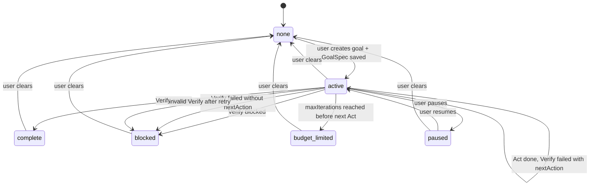

# Conversation Goal 流程设计

这篇文档只讲设计，不要求读代码。

当前 V1 已经确定：**Goal 仍然由 Ralph Loop 插件 / middleware 托管**。这次不是把 goal 平台化，也不是做多 provider 控制面重构，而是优化现有 goal 的运行流程。

新的核心流程是：

```text
User Request
  -> GoalSpec
  -> Act <-> Tool
  -> Verify
  -> middleware converts lifecycle
  -> Done or Loop
```

## 一句话理解

`goal` 仍然是 Ralph Loop 插件提供的长期任务能力。

用户创建 goal 后，系统先把用户的话整理成一份 `GoalSpec`。后续模型先执行工作，也就是 Act；Act 完后不能直接结束目标，必须进入 Verify。Verify 根据证据输出结构化的 `GoalVerification`。最后由 middleware 读取这个验证结果，决定目标是完成、阻塞，还是继续下一轮。

这次设计解决的核心问题是：**模型不再自己一边干活、一边直接改 goal 状态**。

## 和原来有什么区别

| 设计点       | 原来                                | V1                                    |
| ------------ | ----------------------------------- | ------------------------------------- |
| Goal 归属    | Ralph Loop 插件托管                 | 仍然是 Ralph Loop 插件托管            |
| 用户创建目标 | 保存 `objective`                    | 保存 `objective`，同时生成 `GoalSpec` |
| 模型执行     | 模型执行后可以调用状态工具          | Act 只能执行工作或提出“可能完成”      |
| 完成判断     | 模型可以直接调用 `update_goal`      | Verify 生成结构化验证结果             |
| 状态落库     | 模型通过工具触发                    | middleware 统一转换 lifecycle         |
| ChatKit      | 展示 `objective`                    | 仍展示 `objective`，不暴露 Verify UI  |
| 改动范围     | goal middleware + ChatKit goal 类型 | 仍是这两个边界，未做平台化重构        |

## 为什么要这样改

原来的问题不是“goal 放在平台还是插件”，而是执行链路里职责混在一起：

- 模型负责干活。
- 模型又能判断自己是否完成。
- 模型还能直接调用工具修改 goal 状态。

这样容易出现“自己干活、自己验收、自己盖章”的问题。

V1 把它拆开：

| 阶段       | 负责什么                         | 不负责什么                     |
| ---------- | -------------------------------- | ------------------------------ |
| GoalSpec   | 把用户目标整理成可执行规格       | 不改变用户原始目标             |
| Act        | 执行任务、调用工具、产出工作结果 | 不修改 goal lifecycle          |
| Verify     | 根据证据判断是否满足目标         | 不做新工作，不调用普通执行工具 |
| Middleware | 把验证结果转换成状态             | 不伪造执行证据                 |

这样以后即使 Verify 仍然是 LLM 验证，也至少不是同一个 Act 阶段直接改状态。middleware 成为唯一 lifecycle 转换点。

## GoalSpec

`GoalSpec` 是创建或编辑 goal 时生成的目标规格。

它不是给用户看的主展示文本。ChatKit 继续展示 `objective`。`GoalSpec` 主要给 Ralph Loop 的 Act / Verify prompt 使用。

V1 至少保存这些信息：

| 字段           | 作用                         |
| -------------- | ---------------------------- |
| 用户原始目标   | 保留用户真实表达             |
| 可执行目标说明 | 告诉 Act 阶段到底要推进什么  |
| 成功标准       | 告诉 Verify 阶段什么叫完成   |
| 约束条件       | 告诉 Act 阶段不要越界        |
| 验证清单       | 告诉 Verify 阶段要看哪些证据 |
| 推荐执行方式   | V1 固定为 act_then_verify    |

当前实现里，`GoalSpec` 是服务端根据 `objective` 生成的基础结构化结果，不是任意可执行 verifier 代码。

后续可以把生成逻辑换成 LLM 翻译，但边界不变：

- 必须保留用户原始目标。
- 不能偷偷扩大目标范围。
- 不能生成可直接执行的任意 verifier 脚本。
- 如果目标需要澄清，应该阻塞或询问用户，而不是盲跑。

## Act 阶段

Act 是真正执行任务的阶段。

Act 可以：

- 读取 `GoalSpec`。
- 调用工具。
- 修改文件、查询数据、推进任务。
- 说明“我认为现在可以验证了”。
- 给 Verify 留下证据。

Act 不可以：

- 把 goal 标记为 `complete`。
- 把 goal 标记为 `blocked`。
- 调用 lifecycle 状态变更工具。
- 因为自己说“完成了”就结束目标。

也就是说，Act 的输出最多是“完成声明”或“工作结果”，不是最终裁决。

## Verify 阶段

Verify 是验收阶段。

Verify 只根据已有信息判断，不做新工作。

Verify 输入包括：

- `GoalSpec`
- 最近一轮 Act 输出
- 工具调用结果
- 已有文件、消息、错误或产物证据
- middleware 整理出的结构化证据包

Verify 输出固定为结构化 `GoalVerification`。

```json
{
  "outcome": "passed",
  "evidence": ["..."],
  "reason": "...",
  "nextAction": "..."
}
```

V1 只接受三种 outcome：

| outcome   | 含义                     | middleware 动作               |
| --------- | ------------------------ | ----------------------------- |
| `passed`  | 证据满足成功标准         | 转成 `complete`               |
| `failed`  | 未完成，但还有明确下一步 | 保持 `active`，进入下一轮 Act |
| `blocked` | 无法继续推进             | 转成 `blocked`                |

`GoalVerification` 必须有有效 `evidence` 和 `reason`。

如果 outcome 是 `failed`，但没有 `nextAction`，middleware 按 `blocked` 处理，避免无限空转。

如果 Verify 输出无法解析为有效 `GoalVerification`，middleware 会重试一次 Verify；第二次仍无效就转 `blocked`。

当前实现会先按严格 JSON 解析。若模型输出的是固定 `GoalVerification` 结构，但因为字符串里的未转义引号等常见格式问题导致 `JSON.parse` 失败，middleware 会尝试按固定字段做容错解析。容错解析成功后，仍然只按 `outcome` 做 lifecycle 转换。

Verify 不能只相信 Act 的自述。

例如 Act 说“我已经检索确认了”，但实际工具结果里 `memory_search` 返回空数组，这不算满足“通过检索确认能找到”的成功标准。即使后面又用 ID 直接 `memory_get` 读到了内容，也不能把它等同于“检索能找到”。这类判断必须看工具证据，而不是看 Act 的总结。

因此 V1 会把最近消息整理成内部证据：

| 证据             | 作用                                 |
| ---------------- | ------------------------------------ |
| assistantOutputs | Act 的文字说明，只能作为辅助信息     |
| toolResults      | 工具名、状态、输出摘要、是否为空结果 |
| errors           | 执行过程中的错误                     |

Verify prompt 会明确要求：

- `passed` 必须基于工具结果、文件产物或持久化输出等具体证据。
- 助手自己的“已经完成”声明不能单独作为通过依据。
- 如果成功标准要求搜索 / 检索确认，而搜索结果为空，不能用按 ID 直接读取替代。

## Middleware 的职责

middleware 是 V1 的生命周期裁决点。

它负责：

- 注入隐藏 goal context。
- 暴露只读 `get_goal`。
- 不再暴露模型可直接调用的 `update_goal`。
- 在 Act 阶段允许工具调用。
- 在 Verify 阶段关闭普通执行工具。
- 判断 Act 是否还有未完成 tool calls。
- 解析 `GoalVerification`。
- 把 verification outcome 转成 lifecycle status。
- 执行 `maxIterations` 自动续跑上限。
- 发 goal 更新事件。
- 把内部 Verify 调用标记为 hidden / internal，避免把验证 JSON 当成用户可见回答。

它不负责：

- 平台化管理多个 goal provider。
- 处理插件关闭后已有 goal 的 provider availability。
- 实现独立 verifier 服务。
- 提供 GoalSpec 编辑器。

## 状态机

对外持久化状态仍然只有原来的 lifecycle status。



Act / Verify 只是内部 phase，不是公开 status。

内部可以理解成：

| 公开状态 | 内部 phase | 含义               |
| -------- | ---------- | ------------------ |
| `active` | `act`      | 正在推进目标       |
| `active` | `verify`   | 正在验收上一轮工作 |

对 ChatKit 和 API 来说，goal 仍然是 `active`，直到 middleware 根据 Verify 结果把它转成 `complete`、`blocked` 或 `budget_limited`。

## 什么时候继续，什么时候停止

每轮后按这个顺序判断：

1. 如果没有 conversationId、Plan mode 开启、没有 goal、goal 不是 runnable 状态，停止 goal loop。
2. 如果最新 AI 消息还有 tool calls，不进入 Verify，等待工具结果。
3. 如果当前 phase 是 Act 且没有 tool calls，进入 Verify。
4. 如果当前 phase 是 Verify，解析 `GoalVerification`。
5. Verify passed，转 `complete`。
6. Verify blocked，转 `blocked`。
7. Verify failed 但没有 `nextAction`，转 `blocked`。
8. Verify failed 且有 `nextAction`，检查 `maxIterations`。
9. 没超过上限，进入下一轮 Act。
10. 达到上限，转 `budget_limited`。

注意：Act 阶段不会直接产生终态。即使已经达到 `maxIterations`，也会先进入 Verify，让 Verify 判断上一轮工作是否已经完成。只有 Verify 判断还需要下一轮 Act 时，middleware 才转 `budget_limited`。

## 谁判断完成

V1 的完成判断不是 Act 自己判断。

更准确地说：

| 动作                         | Owner               |
| ---------------------------- | ------------------- |
| 提出可能完成                 | Act                 |
| 根据证据生成验证结果         | Verify              |
| 把验证结果转换成 goal status | middleware          |
| 持久化状态                   | server goal service |

Verify 当前仍然可以由 LLM 完成，所以它不是强验证器。但它和 Act 分离，并且输出结构化结果，middleware 再做硬规则转换。

这比“模型执行完直接调用 update_goal”更稳，因为：

- lifecycle 工具不再暴露给 Act。
- Verify 必须给 evidence 和 reason。
- failed 没有下一步会 blocked。
- invalid Verify 有 retry 上限。
- maxIterations 由 middleware 控制。

## 当前 V1 没做什么

V1 有意不做这些事情：

| 未做事项                     | 原因                              |
| ---------------------------- | --------------------------------- |
| 平台托管 goal provider       | 改动面大，当前先保持插件托管      |
| 多 provider / strategy 抽象  | Ralph Loop 是唯一 V1 strategy     |
| 独立 verifier 服务           | 第一版先用结构化 LLM Verify       |
| LLM 生成可执行 verifier 代码 | 安全和越界风险太高                |
| GoalSpec 编辑器              | ChatKit 暂时只展示 `objective`    |
| Verify UI                    | 验证阶段是 middleware 内部流程    |
| provider availability 状态   | 插件关闭后的恢复/灰态留到后续版本 |

## 运行时循环

Act / Verify 分离以后，middleware 不只是追加一条 Verify prompt，还必须让 graph 可靠地进入下一次 model 调用。

这个点很重要：如果只把 `jumpTo: "model"` 放在一次 hook 返回值里，运行时不一定会在下一次路由判断时读到它。结果就是 Verify prompt 已经进入消息历史，但 graph 没有真正回到 model；下一次用户再触发继续时，phase 还可能被重置，导致 verifier JSON 被当成 Act 输出。

V1 的运行时规则是：

| 运行时信息            | 保存位置             | 作用                                     |
| --------------------- | -------------------- | ---------------------------------------- |
| `threadGoalPhase`     | agent channel state  | 区分当前是 Act 还是 Verify               |
| `jumpTo`              | graph state          | 告诉路由节点下一步回 model / tools / end |
| Verify prompt         | hidden human message | 让下一次 model 执行验证                  |
| Verify model metadata | `internal: true`     | 隐藏 verifier JSON，不作为普通对话输出   |

这样 Act 结束后进入 Verify 是一个真正的内部循环，而不是等下一次外部请求时碰运气。

## Repo 改动面

### xpert-develop

| 模块            | 改动                                                           |
| --------------- | -------------------------------------------------------------- |
| contracts       | `ThreadGoal` 增加可选 `goalSpec`                               |
| goal entity     | 增加可选 JSON 字段保存 `goalSpec`                              |
| goal service    | 创建和编辑 objective 时生成 `GoalSpec`，暂停/恢复保留          |
| goal middleware | 移除模型可见 `update_goal`，增加 Act / Verify phase            |
| xpert subgraph  | 把内部 `jumpTo` 写入 graph state，保证 Verify 能自动回到 model |
| Ralph Loop      | 继续作为默认插件 strategy                                      |

持久化 status 没有新增：

- `active`
- `paused`
- `complete`
- `blocked`
- `budget_limited`
- `usage_limited`

### chatkit-js

| 模块              | 改动                                     |
| ----------------- | ---------------------------------------- |
| chatkit types     | `ThreadGoal` 增加可选 `goalSpec`         |
| chatkit-ui parser | 解析 goal payload 时透传合法 `goalSpec`  |
| UI                | 不新增 GoalSpec 编辑器，不新增 Verify UI |

ChatKit 仍然使用现有 `/goal` 行为：

- 创建
- 查看
- 编辑
- 暂停
- 恢复
- 清除

展示上仍然以 `objective` 为主。

## 测试清单

V1 需要覆盖这些行为：

| 场景                                         | 期望                                                  |
| -------------------------------------------- | ----------------------------------------------------- |
| 创建 goal                                    | 保存 `objective` 和 `goalSpec`                        |
| 编辑 objective                               | 重新生成 `goalSpec`                                   |
| 暂停 / 恢复                                  | 保留已有 `goalSpec`                                   |
| 老 goal 没有 `goalSpec`                      | 仍能使用 `objective` 跑                               |
| Act phase                                    | 可以调用工具                                          |
| Act phase                                    | 不能改 goal lifecycle                                 |
| Act 有 tool calls                            | 不进入 Verify                                         |
| Act 无 tool calls                            | 进入 Verify                                           |
| Verify passed                                | 转 `complete`                                         |
| Verify failed + nextAction                   | 回到 Act                                              |
| Verify failed 无 nextAction                  | 转 `blocked`                                          |
| Verify blocked                               | 转 `blocked`                                          |
| Verify 常见格式错误但字段完整                | 容错解析成功后按 `outcome` 处理                       |
| Verify 无法解析为有效 `GoalVerification`     | 重试一次                                              |
| Verify 重试后仍无法解析                      | 转 `blocked`                                          |
| maxIterations 到达                           | 只有 Verify 需要下一轮 Act 时转 `budget_limited`      |
| Act 声称完成但工具证据不足                   | Verify 不能 `passed`                                  |
| 检索工具返回空结果                           | 不能用按 ID 读取替代检索成功                          |
| Act 后进入 Verify                            | graph state 中的 `jumpTo` 必须能驱动下一次 model 调用 |
| Plan mode                                    | 不触发 goal loop                                      |
| paused / complete / blocked / budget_limited | 不自动继续                                            |
| ChatKit                                      | 现有 `/goal` 行为不变                                 |
| ChatKit                                      | goal display 仍使用 `objective`                       |

## 设计结论

V1 的设计原则是：

| 原则                      | 含义                                             |
| ------------------------- | ------------------------------------------------ |
| 插件托管不变              | Goal 仍由 Ralph Loop middleware 提供             |
| 先结构化目标              | 用户输入先变成 `GoalSpec`                        |
| Act 不落状态              | 执行阶段不能 complete / blocked goal             |
| Verify 输出结构化结果     | 验收必须给 outcome、evidence、reason、nextAction |
| Middleware 负责 lifecycle | 状态转换集中在 middleware                        |
| ChatKit 少动              | UI 继续展示 `objective`，不承载 Verify 逻辑      |

这版没有解决所有可插拔问题，但解决了当前最关键的一点：**模型不能再直接控制目标生命周期，goal 的继续 / 结束由 Verify 结果和 middleware 状态机统一决定**。
