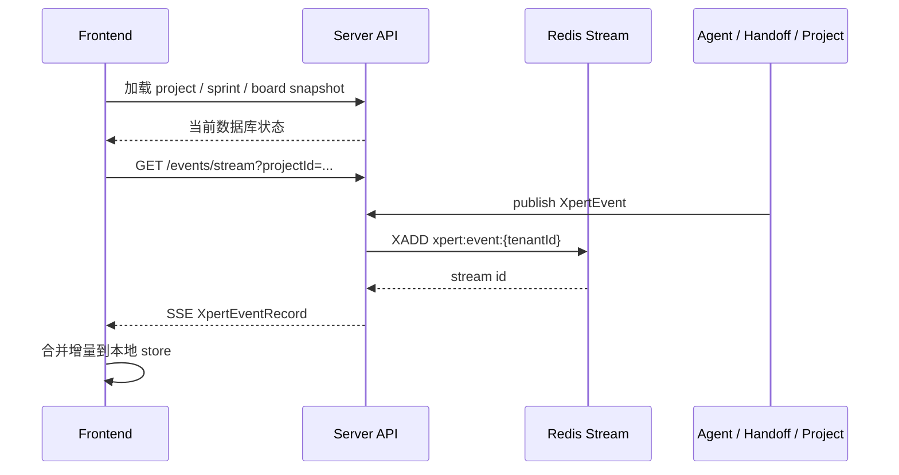

# Xpert Event System

Xpert Event System 是 Xpert 的统一事件平面，用来把 Chat、Agent、[Handoff](/zh-hans/guides/handoff)、Project Orchestrator 等运行过程中的状态变化标准化成可订阅、可回放的事件流。

它的目标不是替换现有的 Chat SSE、Agent Protocol SSE 或 [Handoff callback queue](/zh-hans/guides/handoff)，而是在它们之上提供一层稳定的产品能力：

- 看板可以实时感知任务认领、派发、运行、成功、失败。
- 协作用户可以订阅同一个项目的增量变化。
- 调试和恢复可以基于短期事件回放，而不是只依赖当前页面内存。
- 不同 Agent、Worker、工具和业务模块发出的事件可以用同一套协议消费。

## 一句话理解

Event System 把系统里的“正在发生什么”抽象成统一的 `XpertEvent`。

前端先加载数据库里的当前状态快照，再订阅 `/events/stream` 获取后续增量。这样页面既不会丢失初始状态，也不需要为每个运行通道定制一套刷新逻辑。



## 用户价值

### 项目看板更实时

当任务被 AI 团队认领、派发到队列、开始执行或完成时，看板可以直接收到 `project.task_*` 事件并更新任务卡片，不需要等待用户手动刷新。

### 多智能体运行更可观察

Chat、Agent execution、tool message、interrupt、[handoff 生命周期](/zh-hans/guides/handoff) 都被桥接成统一事件。后续可以在统一时间线、调试面板、运行日志和审计视图里复用同一条数据通路。

### 页面恢复更稳

SSE 断线重连时，客户端可以携带 `Last-Event-ID` 或 `afterId` 回放 Redis Stream 中的短期事件，减少“刚才发生了什么”的空窗。

### 不破坏现有通道

v1 保持现有用户协议兼容：

- Chat 原 SSE 输出不变。
- Agent Protocol `/ai/:thread_id/runs/*/stream` 不迁移。
- [Handoff callback queue](/zh-hans/guides/handoff) 不替换。
- Event System 只做标准化桥接和新增订阅入口。

## 核心概念

### XpertEvent

`XpertEvent` 是统一事件协议，表达一次业务状态变化。

```ts
interface XpertEvent<TPayload = unknown> {
  id: string
  type: string
  version: number
  scope: {
    projectId?: string
    sprintId?: string
    taskId?: string
    taskExecutionId?: string
    conversationId?: string
    agentExecutionId?: string
    xpertId?: string
  }
  source: {
    type: 'agent' | 'workflow' | 'system' | 'tool' | 'handoff' | 'chat' | 'project'
    id: string
    name?: string
  }
  payload: TPayload
  meta?: {
    tenantId?: string
    organizationId?: string | null
    userId?: string | null
    traceId?: string
    requestId?: string
  }
  timestamp: number
}
```

### XpertEventRecord

`XpertEventRecord` 是从 Redis Stream 读出后的事件记录，比 `XpertEvent` 多一个 `streamId`。

`streamId` 是 SSE 的续传游标，客户端应该把它当作 `Last-Event-ID` 使用，而不是使用事件本身的 UUID。

```ts
interface XpertEventRecord<TPayload = unknown> extends XpertEvent<TPayload> {
  streamId: string
}
```

### Scope

`scope` 用来描述事件属于哪个业务范围。订阅端一般用 scope 过滤事件。

常用过滤维度：

- `projectId`
- `sprintId`
- `taskId`
- `taskExecutionId`
- `conversationId`
- `agentExecutionId`
- `xpertId`

## 事件类型

事件类型使用 dot-case，格式为 `domain.action`。新事件不复用旧的 `ON_*` Chat 事件名。

### Chat 与 Agent

| 事件类型 | 含义 |
| --- | --- |
| `chat.conversation_started` | 会话创建或开始 |
| `chat.message_delta` | 消息流式增量 |
| `chat.message_started` | 消息开始 |
| `chat.message_ended` | 消息结束 |
| `chat.event` | 通用 chat 事件 |
| `agent.execution_started` | Agent execution 开始 |
| `agent.execution_ended` | Agent execution 结束 |
| `agent.interrupted` | Agent 被中断或需要人工介入 |
| `tool.message` | 工具消息 |
| `tool.failed` | 工具失败 |

### Handoff

Handoff queue 与 callback 语义详见 [Handoff Message 管道](/zh-hans/guides/handoff)。

| 事件类型 | 含义 |
| --- | --- |
| `handoff.enqueued` | 消息进入 [handoff queue](/zh-hans/guides/handoff) |
| `handoff.started` | 消息开始被 processor 处理 |
| `handoff.completed` | 消息处理成功 |
| `handoff.failed` | 消息处理失败、取消或进入 dead 状态 |

### Project

| 事件类型 | 含义 |
| --- | --- |
| `project.task_claimed` | 任务被调度器认领并分配团队/Agent |
| `project.task_dispatch_enqueued` | 任务执行消息进入 [handoff queue](/zh-hans/guides/handoff) |
| `project.task_execution_started` | 任务执行开始运行 |
| `project.task_execution_updated` | 任务执行补充 conversation / agent execution 等信息 |
| `project.task_execution_succeeded` | 任务执行成功 |
| `project.task_execution_failed` | 任务执行失败 |

## 产品流程

### Project Board 增量更新

项目看板使用“快照 + 增量”的模型：

1. 进入项目页。
2. 加载项目、sprint、swimlane、task 的数据库快照。
3. 根据当前 `projectId` 和 `sprintId` 订阅 `/events/stream`。
4. 收到 `project.task_*` 事件后合并到本地任务列表。
5. 如果事件指向未知任务或缺少关键实体，触发一次轻量刷新。

这种方式避免了两类问题：

- 只靠事件会丢失页面首次进入前已经存在的状态。
- 只靠轮询会让 AI 执行状态看起来滞后。

### Agent 与 Handoff 可观察性

[Agent chat dispatch](/zh-hans/guides/handoff) 仍然通过原 [callback queue](/zh-hans/guides/handoff) 把 stream event 回传给调用方，同时 Event System 会桥接一份标准事件。

这意味着：

- 原有调用方不需要迁移。
- 新的观察面板可以直接订阅统一事件。
- 同一条运行链路可以通过 `traceId`、`conversationId`、`agentExecutionId` 串起来。

## API

### 回放事件

```http
GET /events
```

常用 query：

- `type`
- `projectId`
- `sprintId`
- `taskId`
- `taskExecutionId`
- `conversationId`
- `agentExecutionId`
- `xpertId`
- `afterId`
- `limit`

返回：

```ts
XpertEventRecord[]
```

示例：

```http
GET /events?projectId=project-1&sprintId=sprint-1&afterId=1700000000000-0&limit=100
```

### 订阅事件

```http
GET /events/stream
```

`/events/stream` 使用 SSE 推送增量事件，支持和 `/events` 相同的 query filter。

客户端断线重连时，可以使用以下任一方式继续：

- HTTP header：`Last-Event-ID: <streamId>`
- Query：`afterId=<streamId>`

示例：

```http
GET /events/stream?projectId=project-1&sprintId=sprint-1
Last-Event-ID: 1700000000000-0
```

## 前端使用方式

前端通过 `XpertEventService` 订阅统一事件流。

```ts
this.xpertEventService
  .stream<XpertProjectTaskEventPayload>({
    projectId,
    sprintId
  })
  .subscribe((event) => {
    // 根据 event.type 和 event.payload 合并到本地 store
  })
```

对项目看板来说，推荐策略是：

- 先加载 snapshot。
- 再订阅 project/sprint 维度的增量事件。
- 对已知 task 做局部 patch。
- 对未知 task、缺少 taskId、或实体关系不完整的事件做一次轻量刷新。

## 数据保留与隔离

事件存储使用 Redis Stream，按租户隔离：

```text
xpert:event:{tenantId}
```

v1 的事件流定位为短期回放和实时订阅，不作为长期审计库。

当前边界：

- 不引入 Kafka。
- 不引入数据库事件表。
- 不引入 Redis consumer group。
- 不引入独立 snapshot 表。
- 数据库仍然是最终状态的权威来源。

## 什么时候使用 Event System

适合使用：

- UI 需要实时反映后台运行状态。
- 多个模块需要观察同一类状态变化。
- 事件需要支持短期回放或断线续传。
- 后续可能进入运行时间线、审计、调试面板。

不适合使用：

- 只在单个函数内部使用的一次性回调。
- 必须强一致事务完成后才能返回的同步业务逻辑。
- 长期审计、结算、合规等需要永久保存的记录。

## 设计原则

1. 事件描述事实，不描述 UI 操作。
2. `type` 必须是稳定的机器可读字段，不从文案或名称推断业务含义。
3. 发布方应尽量补齐 `scope`，订阅方不应猜测事件归属。
4. 前端以数据库 snapshot 为基线，事件只做增量修正。
5. 桥接旧协议时保持兼容，不改变原 SSE 或 [Handoff callback](/zh-hans/guides/handoff) 行为。
6. 新事件类型继续使用 `domain.action` dot-case 命名。
