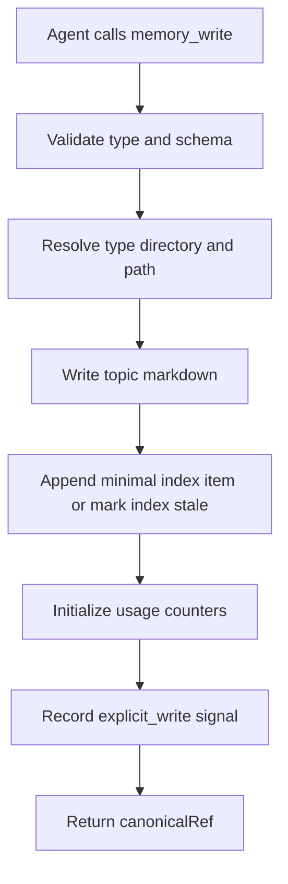
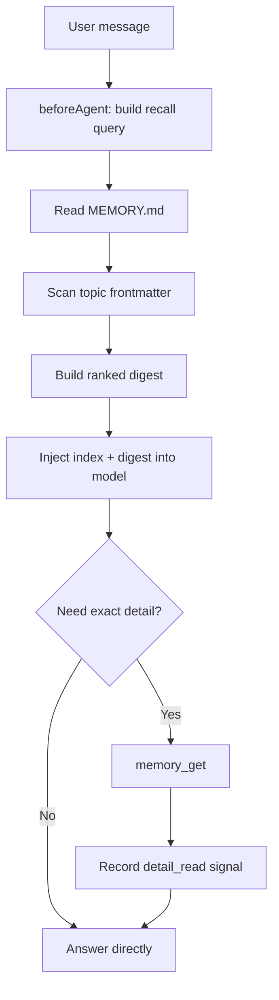
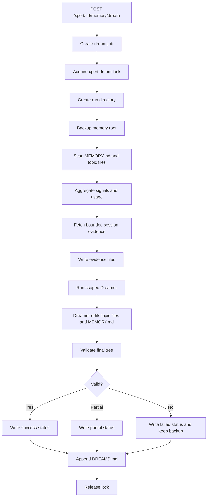

# 内置 FileMemory 与 Dream 重构方案

本文档描述将外部 `file-memory` 插件重构为 Xpert 平台内置记忆能力的方案。新版方案固定为“一个 Xpert 一套记忆文件”，不再按权限层或用户身份拆分目录。一个 Xpert 只有一个记忆根目录，下面按 Claude Code 风格的四种记忆类型组织文件。

核心结论：

- FileMemory v2 是平台内置能力，不再作为普通外部插件承担全链路职责。
- 一个 Xpert 对应一个 memory root，所有长期记忆都在这个 root 下。
- 记忆类型固定为 `user`、`feedback`、`project`、`reference`。
- `MEMORY.md` 是索引，由 Dreamer 原生维护，宿主只做结构校验。
- topic markdown 文件是长期记忆事实源。
- 前台 Agent 只使用 `memory_search`、`memory_get`、`memory_write` 三条工具。
- `afterAgent` 异步 writeback 只产出候选 signal，不直接写长期记忆，不阻塞 SSE。
- Dream 是后台长任务，创建受限 Dreamer 实例，直接整理 memory root 内的文件。
- 召回、精读、写入、纠错都必须沉淀为 signal，并聚合回 topic frontmatter 的 `usage` 字段，用于判断记忆有效性。

## 1. 设计取舍

第一阶段不做多层权限模型，也不做按用户身份拆分的记忆目录。原因是：

- Dream 只需要整理一个 memory root，工程链路更短。
- 召回、写入、打分、Dream 都围绕同一个 Xpert scope 收敛。
- 用户更容易理解“这个 Xpert 有一套记忆”，而不是理解多个目录层。
- `user` 类型只表示“与使用者协作相关的稳定约定”，不是用户身份目录。

方案固定为：

```text
one Xpert = one memory root = one Dream scope
```

这意味着记忆默认属于 Xpert，而不是属于某个用户。`user` 类型只是 Claude Code 四类型中的一种，用来保存“与使用者协作相关的稳定事实或偏好”，不按 `userId` 拆目录，也不生成按人的长期资料。

## 2. 存储路径

平台继续使用宿主已有的 `.xpert/memory` 根目录。

```text
.xpert/
  memory/
    xperts/
      <xpertId>/
        MEMORY.md
        user/
          <title>-<memoryId>.md
        feedback/
          <title>-<memoryId>.md
        project/
          <title>-<memoryId>.md
        reference/
          <title>-<memoryId>.md
        .dream/
          locks/
            dream.json
          signals/
            YYYY-MM-DD.jsonl
          scorecards/
            index.json
          runs/
            <runId>/
              request.json
              status.json
              before/
                MEMORY.md
                user/
                feedback/
                project/
                reference/
              evidence/
                memory-manifest.json
                signals.json
                session-snippets.jsonl
                instructions.md
              output/
                preflight-report.md
                dream-report.json
                validation.json
          cursors/
            dream.json
          DREAMS.md
```

说明：

- `xperts/<xpertId>` 是唯一记忆 scope。
- `MEMORY.md` 是导航索引，不承载正文事实。
- `user/feedback/project/reference/` 是四种 topic 目录。
- `.dream/` 是机器状态区，默认不参与前台记忆召回。
- `.dream/runs/<runId>` 是每次 Dream 的独立运行记录，避免多个 Dream 任务写同一个报告文件。
- `before/` 是运行前备份，不是提交区；第一阶段 Dreamer 直接修改目标文件。

## 3. 四种记忆类型

四种类型参考 Claude Code 的 closed taxonomy：

| 类型 | 用途 | 保存例子 |
| --- | --- | --- |
| `user` | 与使用者协作相关的稳定事实、偏好、角色、表达习惯 | 用户希望回答先给结论；用户偏好中文解释工程细节 |
| `feedback` | 用户对 Agent 工作方式的纠正、确认、偏好规则 | 不要在没确认前改代码；调查要附具体文件路径 |
| `project` | 项目状态、业务背景、阶段性决策、非代码可推导上下文 | 当前要把 file-memory 内置到平台；第一阶段采用 in-place Dream |
| `reference` | 外部资源、文档、系统、链接、仓库、看板位置 | 相关设计文档路径；外部系统入口；参考仓库位置 |

约束：

- 不新增第五种类型。
- 不再使用权限层作为路径层。
- 不在 `user/` 下按 userId 拆目录。
- 如果信息只对单个会话短期有效，不写入长期 memory。
- 如果信息涉及敏感内容、token、密码或隐私原文，不写入长期 memory。

## 4. Topic 文件格式

每个 topic 文件使用 frontmatter + markdown body。

```md
---
id: mem_01j...
scopeType: xpert
scopeId: <xpertId>
type: feedback
status: active
title: 回答风格偏好
summary: 用户希望回答先给结论，再补充代码路径和证据。
confidence: 0.86
usage:
  recallCount: 12
  detailReadCount: 4
  explicitWriteCount: 1
  writebackCandidateCount: 2
  correctionCount: 0
  lastRecalledAt: 2026-05-13T10:20:00.000Z
  lastDetailReadAt: 2026-05-13T10:21:00.000Z
  uniqueConversationCount: 5
  uniqueQueryCount: 7
  usefulnessScore: 0.82
createdAt: 2026-05-13T10:00:00.000Z
updatedAt: 2026-05-13T10:00:00.000Z
createdBy: memory_write
updatedBy: dream
source: explicit
sourceRefs:
  - conversation:<conversationId>#message:<messageId>
tags:
  - preference
  - response-style
---

## 内容

用户偏好回答时先给结论，然后再展开代码路径、运行证据和边界条件。

## 证据

- 2026-05-13：用户要求“给我完整的调查落地方案”，并多次强调需要 repo-backed evidence。

## 更新历史

- 2026-05-13：由 Dream 合并相近偏好记忆。
```

`usage` 是系统维护的可见聚合字段。它不是聊天日志，也不是完整事件明细；它只保存判断记忆有效程度所需的计数、最近使用时间和分数。原始事件仍写入 `.dream/signals/*.jsonl`，便于 Dream 查证。

## 5. MEMORY.md 规则

`MEMORY.md` 只做导航：

```md
# Xpert Memory

<!-- XPERT_FILE_MEMORY_INDEX_START -->
- [回答风格偏好](feedback/answer-style-mem_01j.md) - 先给结论，再给代码路径和证据。
- [文件记忆架构](project/file-memory-architecture-mem_01k.md) - FileMemory v2 使用单根目录和 Dream 后台整理。
<!-- XPERT_FILE_MEMORY_INDEX_END -->
```

约束：

- 每条索引一行。
- 每条索引只包含标题、相对路径、短 hook。
- 不在 `MEMORY.md` 写正文事实。
- `MEMORY.md` 由 Dreamer 原生维护。
- 宿主只验证链接是否存在、路径是否越界、索引项是否过长、是否把正文事实塞进 index。

## 6. 前台工具

前台只暴露三条工具。

| 工具 | 职责 | 是否直接写文件 | 是否记录 signal |
| --- | --- | --- | --- |
| `memory_search` | 按查询召回相关记忆摘要 | 否 | 是 |
| `memory_get` | 按 `memoryId`、`relativePath`、`canonicalRef` 精确读取正文 | 否 | 是 |
| `memory_write` | 显式写入稳定长期记忆 | 是 | 是 |

### 6.1 memory_search

`memory_search` 不返回大量正文，而是返回 digest 和可引用定位：

```ts
type MemorySearchInput = {
  query: string
  types?: Array<'user' | 'feedback' | 'project' | 'reference'>
  limit?: number
}
```

返回时必须记录召回信号：

- 如果某条记忆进入最终注入 digest，写 `recall_hit` signal。
- 更新 topic frontmatter 的 `usage.recallCount`、`lastRecalledAt`、`uniqueQueryCount`、`uniqueConversationCount`。
- 重新计算 `usage.usefulnessScore`。
- 如果只是候选但没有注入 digest，可以只写低权重 event，不增加 `recallCount`。

### 6.2 memory_get

`memory_get` 用于精确读取正文：

```ts
type MemoryGetInput = {
  memoryId?: string
  relativePath?: string
  canonicalRef?: string
}
```

读取正文时必须记录精读信号：

- 写 `detail_read` signal。
- 更新 `usage.detailReadCount` 和 `lastDetailReadAt`。
- 重新计算 `usage.usefulnessScore`。

### 6.3 memory_write

`memory_write` 用于显式长期写入：

```ts
type MemoryWriteInput = {
  type: 'user' | 'feedback' | 'project' | 'reference'
  title: string
  summary: string
  content: string
  tags?: string[]
  sourceRefs?: string[]
}
```

写入流程：



`memory_write` 可以做最小 `MEMORY.md` index append，也可以只标记 index stale。完整索引整理交给 Dreamer。

## 7. Recall 注入流程

前台召回遵守三层结构：

```text
index -> digest -> detail
```



召回不是只给当前回答使用，也会反向更新记忆有效性。每次 search/get/write 都必须进入 signal 和 usage 聚合。

## 8. Signal 与 Usage

系统新增 `MemorySignalStore`。第一阶段可以先使用 `.dream/signals/*.jsonl`，后续可迁移到数据库表。

路径：

```text
.xpert/memory/xperts/<xpertId>/
  .dream/
    signals/
      YYYY-MM-DD.jsonl
    scorecards/
      index.json
```

写入规则：

- `signals/*.jsonl` 追加原始事件。
- topic frontmatter 的 `usage` 字段保存聚合结果。
- `scorecards/index.json` 是排序缓存，不是事实源。
- 如果 topic 文件暂时不可写，signal 仍然保留，下一次 Dream 或 repair job 从 signals 回填 usage。

信号类型：

| 类型 | 来源 | 作用 |
| --- | --- | --- |
| `recall_hit` | `memory_search` | 证明某条记忆被检索到并注入 digest |
| `detail_read` | `memory_get` | 证明某条记忆被精读 |
| `explicit_write` | `memory_write` | 高置信长期写入 |
| `writeback_candidate` | `afterAgent` | 待 Dream 评估的候选事实 |
| `user_correction` | 用户反馈或编辑 | 发现冲突和过期事实 |
| `index_issue` | scanner / validator | 触发修复索引 |

聚合字段更新规则：

| signal | frontmatter 更新 |
| --- | --- |
| `recall_hit` | `usage.recallCount += 1`，更新 `lastRecalledAt`、`uniqueQueryCount`、`uniqueConversationCount` |
| `detail_read` | `usage.detailReadCount += 1`，更新 `lastDetailReadAt` |
| `explicit_write` | `usage.explicitWriteCount += 1`，更新 `confidence` 和 `updatedAt` |
| `writeback_candidate` | `usage.writebackCandidateCount += 1`，不直接写正文 |
| `user_correction` | `usage.correctionCount += 1`，降低旧事实分数或标记 conflict |
| `index_issue` | 不改正文，写入 scorecard 和 Dream evidence |

## 9. 异步 Writeback

保留外部 file-memory 已验证过的异步记忆写回注入思路，但调整职责边界：

- `wrapModelCall` 注入 `MEMORY.md + digest`，让主 Agent 在本轮回答时使用长期记忆。
- `afterAgent` 在主回答完成后拿到最近消息、工具调用、recall 命中，生成 writeback snapshot。
- writeback runner 异步执行，不进入聊天 SSE 完成链路。
- writeback runner 不直接写 topic 文件，只输出 `writeback_candidate` signal。
- signal 带 `sourceRef`、候选文本、建议 type、置信度、去重 key。
- Dream 后台长任务读取这些候选，结合 recall/get/write/user correction 信号决定是否沉淀。

默认策略：

```text
writeback.waitPolicy = never_wait
```

即使 writeback 失败，也只记录日志和失败 signal，不影响用户看到回答完成。

## 10. Dream 总体流程

Dream 是后台维护循环，不是普通问答 Agent。它整理整个 Xpert memory root。

触发来源：

- 手动触发：用户在 UI 或命令中点击 `Run Dream`。
- 定时触发：低频 cron，默认关闭或保守开启。
- 事件触发：signal 积累到阈值后入队。

第一阶段默认策略：

```text
manual: enabled
auto: disabled by default
minSignals: 20
minHoursSinceLastDream: 24
maxRunsPerXpertPerDay: 1
```

队列和锁：

```text
queue: xpert-file-memory-dream
job: dream
lock: memory:dream:<tenantId>:<xpertId>
```

一个 Xpert 同一时间只允许一个 Dreamer 整理 memory root。Dream 运行期间前台 `memory_search` 和 `memory_get` 不阻塞；`memory_write` 建议排队或短暂拒绝，避免与 Dreamer 同时改文件。

### 10.1 流程图



### 10.2 Run 目录

每次 Dream 写独立目录：

```text
.dream/runs/<runId>/
  request.json
  status.json
  before/
    MEMORY.md
    user/
    feedback/
    project/
    reference/
  evidence/
    memory-manifest.json
    signals.json
    session-snippets.jsonl
    instructions.md
  output/
    preflight-report.md
    dream-report.json
    validation.json
```

`before/` 是运行前备份，用于人工恢复或后续 repair Dream，不做自动 merge。

### 10.3 Evidence

宿主把选择后的证据写成 run-scoped 文件，而不是给 Dreamer 数据库权限：

```text
.dream/runs/<runId>/evidence/
  memory-manifest.json
  signals.json
  session-snippets.jsonl
  instructions.md
```

证据来源：

- 当前 `MEMORY.md`。
- 四类 topic 文件 frontmatter。
- usage 聚合和 scorecards。
- 最近 signals。
- 通过 `sourceRefs` 关联的有界聊天片段。
- scanner 发现的坏链接、重复标题、失效索引、疑似冲突。

聊天历史必须有界读取：

```text
maxMessages: 500
maxConversationCount: 20
maxHistoryBytes: 200KB
maxEvidenceTokens: 60000
```

### 10.4 Dreamer 权限

Dreamer 可以写：

```text
.xpert/memory/xperts/<xpertId>/MEMORY.md
.xpert/memory/xperts/<xpertId>/user/**
.xpert/memory/xperts/<xpertId>/feedback/**
.xpert/memory/xperts/<xpertId>/project/**
.xpert/memory/xperts/<xpertId>/reference/**
.xpert/memory/xperts/<xpertId>/.dream/runs/<runId>/output/**
```

Dreamer 禁止写：

```text
.xpert/memory/xperts/<otherXpertId>/**
.xpert/memory/xperts/<xpertId>/.dream/runs/<otherRunId>/**
宿主数据库
外部网络
```

Dreamer 必须先写 `output/preflight-report.md`，说明准备整理哪些文件和理由，然后再修改 topic 文件。运行结束写 `output/dream-report.json`。

### 10.5 校验

宿主不重建 `MEMORY.md`，只做结构性校验：

- 文件路径必须在当前 Xpert memory root 内。
- topic frontmatter 能 parse。
- `type` 必须是 `user`、`feedback`、`project`、`reference`。
- `MEMORY.md` 链接必须存在。
- `MEMORY.md` index item 不能过长，不能承载正文事实。
- archived 文件默认不应出现在主索引。
- 不允许硬删除重要 topic；过期或矛盾内容应改为 `status: archived`。
- 不允许写疑似密钥、token、密码或敏感原文。

如果校验失败：

- run 标记为 `failed` 或 `partial`。
- 写入 `output/validation.json`。
- 保留 `before/`。
- 不自动回滚，交给人工恢复或后续 repair Dream。

## 11. Dream Prompt

Dream prompt 分为 system prompt、evidence files、report schema 三部分。

核心系统提示：

```text
You are FileMemory Dream, a background memory maintenance agent.
You do not answer the user.
You may edit only the allowed memory files in this run.
MEMORY.md is an index. Topic markdown files are the durable memory units.
Use exactly these memory types: user, feedback, project, reference.
Do not create permission-layer directories.
Do not create per-user directories.
Do not copy raw chat transcripts into memory.
Use absolute dates.
Prefer merging into existing topic files over creating duplicates.
Update MEMORY.md yourself as a concise navigation index.
Write a preflight report before editing files, then write a final dream report.
```

四阶段：

1. **Orient**：阅读 `MEMORY.md`、manifest、topic frontmatter，理解现有结构。
2. **Gather recent signal**：优先看 recall/get/write/writeback/user correction signals。
3. **Consolidate**：合并重复记忆，修复过时事实，把相对日期改成绝对日期。
4. **Prune and index**：归档过期内容，整理 `MEMORY.md`，保持短索引。

报告：

```ts
type DreamRunReport = {
  runId: string
  changedFiles: Array<{
    path: string
    changeType: 'created' | 'updated' | 'archived'
    reason: string
  }>
  unresolvedConflicts: DreamConflict[]
  dreamDiary: string
}
```

## 12. 工程化打分

记忆质量不能只靠模型判断。召回、精读、写入、纠错都必须成为判断记忆有效性的信号。

打分信息存在两个地方：

- topic frontmatter 的 `usage.usefulnessScore`：用户可见、Dreamer 可见。
- `.dream/scorecards/index.json`：系统缓存，用于快速排序和批量统计。

### 12.1 Usage 分数

```text
usefulnessScore =
  0.30 * normalizedRecall +
  0.24 * normalizedDetailRead +
  0.18 * recurrenceScore +
  0.14 * recencyScore +
  0.10 * sourceQualityScore -
  0.12 * correctionPenalty
```

说明：

- `normalizedRecall = min(1, log1p(recallCount) / log1p(20))`
- `normalizedDetailRead = min(1, log1p(detailReadCount) / log1p(10))`
- `recurrenceScore` 来自 `uniqueConversationCount` 和跨天命中。
- `recencyScore` 使用半衰期衰减。
- `correctionPenalty` 来自 `user_correction` 和 conflict。

`usefulnessScore` 不直接决定是否删除记忆。低分只表示“近期没被证明有用”，由 Dreamer 结合内容判断是否归档、合并或保留。

### 12.2 Dream 候选分数

```text
score =
  0.24 * signalScore +
  0.18 * recurrenceScore +
  0.16 * sourceQualityScore +
  0.14 * recencyScore +
  0.12 * actionabilityScore +
  0.08 * conflictScore +
  0.08 * coverageScore
```

信号权重：

```text
explicit_write: 1.00
user_correction: 0.95
detail_read: 0.70
writeback_candidate: 0.55
recall_hit: 0.35
index_issue: 0.30
```

阈值：

```text
score >= 0.82: 可以进入 Dreamer 候选证据包
0.65 <= score < 0.82: 保留为观察候选
0.45 <= score < 0.65: 只写 report，不写 memory
score < 0.45: 丢弃或保留原始 signal
```

## 13. API 草案

### 13.1 Dream API

```http
POST /xpert/:id/memory/dream
GET  /xpert/:id/memory/dream/runs
GET  /xpert/:id/memory/dream/runs/:runId
POST /xpert/:id/memory/dream/runs/:runId/cancel
```

请求：

```ts
type MemoryDreamRequest = {
  reason?: 'manual' | 'scheduled' | 'signal_threshold'
}
```

响应：

```json
{
  "runId": "dream_01j...",
  "xpertId": "xpert_01j...",
  "status": "queued"
}
```

### 13.2 内部历史读取接口

```ts
type ConversationHistoryReader = {
  readMessages(params: {
    xpertId: string
    conversationId?: string
    executionId?: string
    since?: string
    until?: string
    cursor?: string
    limit: number
  }): Promise<{
    items: ConversationHistoryMessage[]
    nextCursor?: string
  }>
}
```

Dream 只能通过宿主导出的 evidence 读取历史，不直接拿 DB 全量查询能力。

## 14. 模块边界

### 14.1 宿主负责

- 文件 volume 能力。
- DB 查询和 evidence 导出。
- 队列调度。
- Dream lock。
- Dreamer runtime 创建。
- 写权限限制。
- 最终结构校验。
- report 持久化。
- UI 展示。

### 14.2 FileMemory 负责

- memory path 规则。
- 四类型 taxonomy。
- frontmatter schema。
- usage schema。
- index/digest/detail 召回语义。
- signal schema。
- usage 聚合与 scorecards。
- Dream prompt。
- 候选评分。
- `MEMORY.md` index 维护规则和健康校验。

### 14.3 业务 Agent 负责

- 按工具说明搜索、读取、写入记忆。
- 不直接维护长期记忆结构。
- 不直接运行 Dream。

## 15. UI 可见性

Memory 页面展示：

- `MEMORY.md`
- `user/`
- `feedback/`
- `project/`
- `reference/`
- topic 正文和 frontmatter usage。
- Dream runs。
- Dream report。
- unresolved conflicts。

聊天中默认不刷屏。手动触发 Dream 时可以显示：

```text
Memory Dream finished: improved 3 memories, archived 1 stale memory, fixed 2 index links.
```

## 16. 观测指标

建议指标：

- `file_memory_search_latency_ms`
- `file_memory_get_latency_ms`
- `file_memory_write_latency_ms`
- `file_memory_usage_update_latency_ms`
- `file_memory_dream_job_duration_ms`
- `file_memory_dream_queue_wait_ms`
- `file_memory_dream_changed_files`
- `file_memory_dream_validation_errors`
- `file_memory_dream_conflicts`
- `file_memory_signal_count`
- `file_memory_recall_hit_count`
- `file_memory_detail_read_count`
- `file_memory_usefulness_score_updated_count`

日志必须带：

- `runId`
- `xpertId`
- `memoryId`
- `type`
- `path`
- `operationType`
- `reason`

## 17. 风险和处理

| 风险 | 处理 |
| --- | --- |
| Dream 误改记忆 | scope lock、写目录限制、运行前备份、最终校验、archive 不硬删 |
| 前台被后台阻塞 | Dream 只走后台 job，前台只 enqueue |
| 记忆写入边界不清 | 明确一个 Xpert 一个 memory root，只沉淀对这个 Xpert 稳定有用的信息；敏感内容不写入 |
| index 和 topic 不一致 | Dreamer 维护 `MEMORY.md`，宿主校验坏链接和过长索引项 |
| 聊天历史过大 | sourceRef 优先，有界分页和字节预算 |
| writeback 影响前台完成 | writeback runner 默认 never_wait，只写候选 signal |
| usage 写回失败 | signal 先落盘，后续 Dream/repair 从 signals 回填 frontmatter usage |
| usage 频繁写文件 | 同一 conversation 内对同一 memory 做去抖聚合，批量 flush usage |
| Dream report 非法 | 文件仍走最终校验，run 标记 partial，并由宿主补写 validation report |

## 18. 测试计划

### 18.1 单元测试

- frontmatter parse/render。
- usage frontmatter 聚合更新。
- path resolver 防目录穿越。
- index validator 检查 `MEMORY.md` 链接、长度和导航边界。
- signal scoring。
- usefulnessScore 计算和半衰期衰减。
- Dream report schema 校验。
- Dreamer 写入目录校验。
- writeback candidate signal schema 校验。

### 18.2 集成测试

- `memory_write` 写入四类型 topic file，并追加最小索引项或标记 index stale。
- `memory_search` 返回 digest、记录 `recall_hit` signal，并更新 topic `usage.recallCount`。
- `memory_get` 返回正文、记录 `detail_read` signal，并更新 topic `usage.detailReadCount`。
- `afterAgent` 异步 writeback 不阻塞 SSE 完成，并写入 `writeback_candidate` signal。
- signal 已写但 usage 更新失败时，repair/Dream 能从 `.dream/signals` 回填 usage。
- `POST /xpert/:id/memory/dream` 创建 Dream job，并立即返回 `runId`。
- Dream job 开始前写 `.dream/runs/<runId>/before/` 运行前备份。
- Dreamer 能直接修改 topic 文件和 `MEMORY.md`。
- validator 能发现坏链接、过长 index item、越界路径、非法 type。
- Dream 完成后写 `dream-report.json`、`validation.json` 和 `DREAMS.md`。

### 18.3 并发测试

- 同一 Xpert 两个 Dream 只能一个拿锁。
- Dream 运行时前台 search/get 不阻塞。
- Dream 运行时 memory_write 被排队或短暂拒绝。
- 不同 Xpert 的 Dream 可以并行。
- 多个用户同时触发同一 Xpert Dream 时复用或排队，不产生并发文件写。

## 19. 推荐拆分任务

1. 新增 `file-memory` 内置模块骨架、四类型 taxonomy、frontmatter schema、usage schema、path resolver、index validator。
2. 新增 `MemorySignalStore`、usage 聚合更新、scorecards 缓存和 repair 回填。
3. 新增三工具：`memory_search`、`memory_get`、`memory_write`。
4. 新增异步 writeback runner、writeback candidate signal、never_wait 策略和失败日志。
5. 新增 Dream queue、Dream lock、Dream evidence builder、Dreamer runtime、写目录限制、运行前备份。
6. 新增 Dream validator、report、`DREAMS.md`、Dream API 和 run 查询 API。
7. 新增 Memory UI 的文件树、usage 展示、Dream runs、reports。
8. 后续阶段再迁移旧插件兼容入口和外部插件默认启用策略。

## 20. 最终判断

新版 FileMemory v2 的核心是：

```text
one Xpert memory root
+ four Claude Code memory types
+ visible usage scoring
+ async writeback signals
+ in-place Dreamer maintenance
```

这个版本放弃第一阶段的多层权限目录，换来更低的工程复杂度、更清晰的产品心智和更接近 Claude Code 的文件记忆体验。
