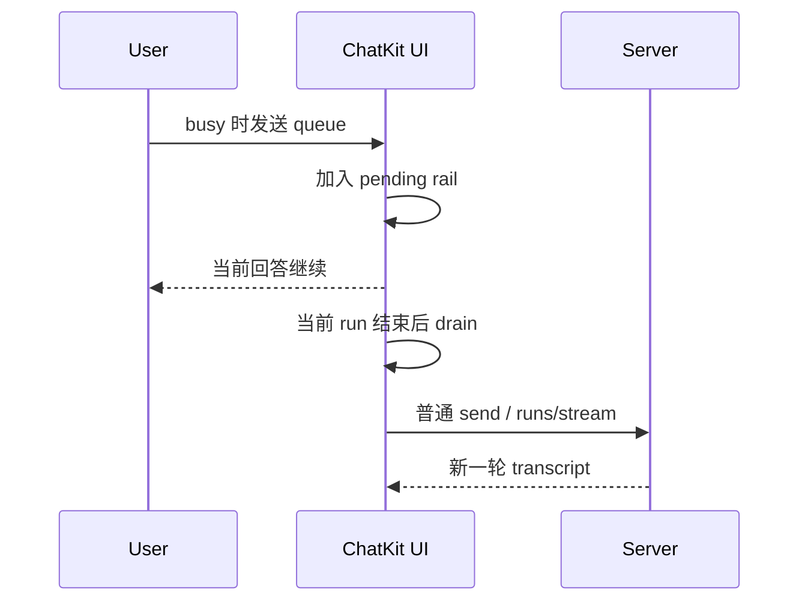
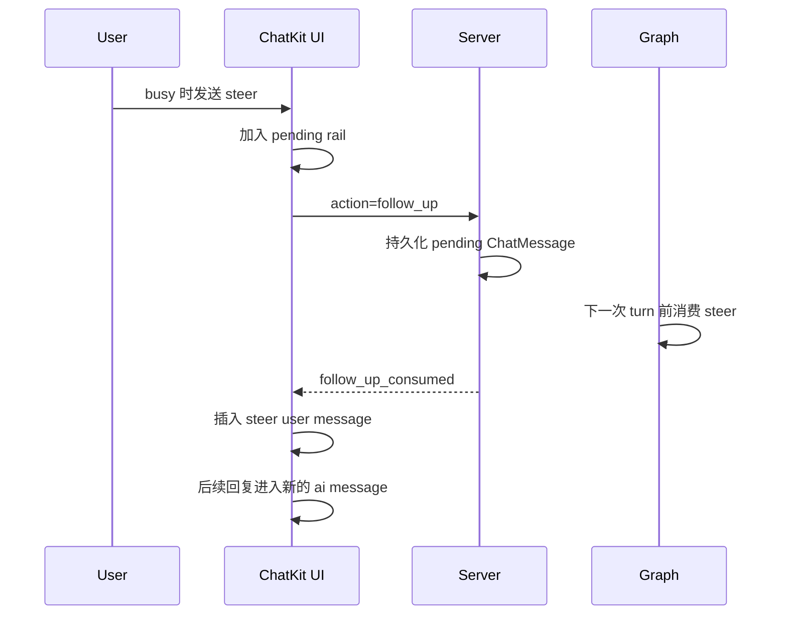

# Follow-up 技术架构

这篇文档描述 Xpert 当前 `follow-up` 能力的完整技术架构，覆盖：

- `chatkit` / `chatkit-ui`
- xpert 前端宿主
- `server-ai`
- LangGraph turn 前置消费链路

它的目标不是解释某一段实现细节，而是给后续开发提供一套统一心智模型。

## 一句话理解

`follow-up` 的本质不是“多发一条消息”，而是：

- 当当前 run 还在执行时，新输入应该如何进入系统
- 它什么时候进入正式 transcript
- 它是否要影响当前 execution，还是排到下一轮

系统当前支持两种模式：

- `queue`
  - 当前 run 结束后，作为下一轮普通用户消息执行
- `steer`
  - 在当前 execution 的下一次 turn 开始前注入
  - 不新开 execution

## 总体分层

| 层级 | 角色 | 职责 |
| --- | --- | --- |
| `chatkit-ui` | 交互层 | 允许回答中继续输入、维护 pending rail、决定 `queue / steer` |
| `chatkit` 协议层 | 发送层 | 在 busy 状态下把消息转成 follow-up 请求 |
| `server-ai` chat 入口 | durable inbox | 把 follow-up 先持久化成 pending `ChatMessage` |
| LangGraph pre-turn node | 消费层 | 在 turn 前 staging / consume steer |
| transcript / SSE | 展示层 | 只有消费成功后才把 steer user message 放进正式消息流 |

## 核心约束

当前实现有几条必须保持的约束：

1. Follow-up 默认开启，不依赖外部显式开关。
2. busy 状态下允许继续输入与发送。
3. follow-up 在被真正消费前，只能出现在 pending rail，不能提前进入 transcript。
4. `steer` 被消费后，必须在 transcript 中形成新的 user turn，并且后续回复必须进入新的 ai message。
5. `queue` 不尝试改写当前 execution，只在下一轮普通发送时执行。
6. `steer` 的消费时机是“下一次 turn 开始前”，不是“收到请求立刻生效”。

## ChatKit 侧架构

### 1. 默认行为

ChatKit 当前把 follow-up 视为内建能力：

- 不再依赖 `ChatKitOptions.composer.followUps`
- `queue / steer` 偏好由 ChatKit 内部自己持久化
- 宿主只负责提供 assistant、thread、api 等运行参数

### 2. 输入与发送

当用户发送消息时：

- 如果当前不是 busy
  - 按普通消息发送
  - optimistic 地插入 human message
- 如果当前是 busy
  - 不再中止当前 run
  - 这条消息先进入 pending rail
  - 再根据当前模式走 `queue` 或 `steer`

### 3. pending rail

pending rail 是 ChatKit 中 follow-up 的唯一前端暂存区。

它负责展示：

- 待处理文本
- 当前消息是 `queue` 还是 `steer`
- `queue -> steer` 提升按钮
- 未自动发送 queue 的 `send now`
- 单条移除

它不负责决定消息何时正式进入 transcript。

### 4. queue 模式

`queue` 的前端行为是：

1. 消息加入 pending rail
2. 当前 run 继续
3. 当前 run 结束后，自动或手动 drain queue
4. drain 时把消息重新组装成普通 `send` 请求
5. 再开启下一轮 `/runs/stream`

关键点是：

- queue 不保留上一轮的 `executionId`
- queue 发出去时，它已经不是 follow-up 协议，而是普通下一轮用户消息

### 5. steer 模式

`steer` 的前端行为是：

1. 消息加入 pending rail
2. 立刻通过后台 `/runs` 提交显式 `action: 'follow_up'`
3. 不立刻插入 transcript
4. 等后端发出 `follow_up_consumed`
5. 收到消费事件后，再把对应 user message 插入 transcript
6. 后续 assistant 输出进入新的 ai message

关键点是：

- `steer` 不是第二条并行 stream
- 它先进入后端 durable inbox
- 只有真正被当前 execution 消费后才“变成可见消息”

## 前端消息展示规则

### queue



### steer



## 后端持久化模型

follow-up 在后端先被存成普通 `ChatMessage`，但带 4 个额外字段：

- `followUpMode`
- `followUpStatus`
- `targetExecutionId`
- `visibleAt`

它们组合起来表达的是“这是一条可持久化的 follow-up inbox 记录”。

### 字段语义

- `followUpMode`
  - `queue` 或 `steer`
  - 决定消息后续如何被消费
- `followUpStatus`
  - `pending`、`consumed`、`canceled`
  - 决定消息现在是否仍在 inbox 中
- `targetExecutionId`
  - 这条消息想作用到哪个 execution
  - `steer` staging 主要靠它定位目标 run
- `visibleAt`
  - 这条消息什么时候正式可见
  - pending 时为 `null`
  - consumed 后写入时间

## 为什么不直接进 transcript

follow-up 和普通消息的关键差异在于：

- 普通消息一发送就已经是“正式消息”
- follow-up 在真正被系统消费之前，只是“待处理输入”

如果一开始就把它插进 transcript，会出现三个问题：

1. UI 会提前显示一个还没被执行的 user turn。
2. `steer` 失败或降级时，消息流会和真实执行顺序不一致。
3. assistant 后续 chunk 可能继续追加到旧 ai message，造成 turn 边界错乱。

因此系统统一采用：

- pending rail 负责即时反馈
- transcript 只展示已消费消息

## `action: 'follow_up'` 协议

当前后端 follow-up 入口使用显式协议：

```json
{
  "action": "follow_up",
  "conversationId": "conv_xxx",
  "mode": "steer",
  "message": {
    "clientMessageId": "msg_xxx",
    "input": {
      "input": "..."
    }
  },
  "target": {
    "executionId": "exec_xxx"
  },
  "state": {}
}
```

这个协议的职责只有一个：

- 把 follow-up 安全地写进 durable inbox

它本身不代表“已经消费成功”。

## LangGraph turn 前置消费

### 核心变化

当前 `steer` 不再依赖事件钩子直接改 graph state。

系统改成了两段明确的 pre-turn node：

1. `stage pending steer follow-ups`
2. `consume pending steer follow-ups`

这两个 node 现在由两个 CQRS command handler 返回 `RunnableLambda`，并在建图时直接挂入 graph。

### Stage 节点

stage 节点负责：

- 读取当前 `conversationId + targetExecutionId`
- 查询所有 `followUpMode='steer' + followUpStatus='pending'` 的消息
- 把它们转成 `pending_follow_ups` state channel

它只做“把 durable inbox 搬进 graph staging channel”。

### Consume 节点

consume 节点负责：

- 读取 `pending_follow_ups`
- 按 FIFO 合并输入
- 生成新的 `HumanMessage`
- 把它写回：
  - 根 `messages`
  - execution 主 channel
  - 当前 agent channel
- 更新：
  - `input`
  - `STATE_VARIABLE_HUMAN`
  - `STATE_VARIABLE_PENDING_FOLLOW_UPS`
- 把数据库消息标记为 `consumed`
- 发出 `follow_up_consumed`

它是真正把 steer 从“待处理消息”变成“当前执行中的正式 user turn”的地方。

## 为什么要分成 stage + consume 两步

这样做有三个好处：

1. durable inbox 和 graph runtime state 解耦
   - DB 负责跨刷新、跨连接持久化
   - graph state 只负责当前 turn 的运行时 staging
2. 消费时机稳定
   - 一定发生在 turn 前，而不是依赖事件钩子时序
3. 更容易扩展
   - 以后如果要加筛选、优先级、合并规则，主要改 staging / consume 逻辑即可

## `follow_up_consumed` 事件

前端把 steer 放进 transcript 的唯一依据是：

- 后端发出 `follow_up_consumed`

这个事件至少包含：

- `mode`
- `messageIds`
- `clientMessageIds`
- `executionId`
- `visibleAt`

它表示的不是“follow-up 已收到”，而是：

- 这条 steer 已真正进入当前 execution 的消息流

## transcript turn 规则

`steer` 被消费后，前端必须做两件事：

1. 把 steer user message 插入 transcript
2. 把下一段 assistant 输出切到新的 ai message

否则就会出现：

- steer user message 插在中间
- 但后面的 assistant chunk 继续写进旧 ai message

这会破坏消息顺序，也会让 execution log 和 UI 对不上。

## 降级与兜底

系统现在有以下兜底策略：

- 如果 `steer` 目标 execution 已结束
  - 自动降级为 `queue`
- 如果当前 run 在下一次 turn 前结束
  - 仍未消费的 steer 降级为 `queue`
- 如果前端刷新
  - 通过持久化的 pending `ChatMessage` 恢复状态
- 如果用户手动把 pending queue 提升成 steer
  - 立即走 follow-up 协议

## 关键模块

后续开发时，主要关注这些模块：

- `chatkit-ui`
  - `Stream.tsx`
  - `follow-ups.ts`
  - `follow-up-consumed.ts`
- `server-ai`
  - `chat-common.handler.ts`
  - `xpert/commands/handlers/chat.handler.ts`
  - `xpert-agent/commands/handlers/create-node-stage-pending-steer-follow-ups.handler.ts`
  - `xpert-agent/commands/handlers/create-node-consume-pending-steer-follow-ups.handler.ts`
  - `xpert-agent/commands/handlers/invoke.handler.ts`
- contracts
  - `chat-message.model.ts`
  - `chat-event.model.ts`

## 后续开发建议

后续如果继续扩展 follow-up，建议优先遵守下面几条：

1. 不要让前端在消费前提前把 follow-up 放进 transcript。
2. 不要让 `queue` 复用上一轮 `executionId`。
3. 不要把 `steer` 的消费重新挂回事件钩子。
4. 任何新的消费条件，都应尽量落在 stage / consume 节点里。
5. transcript、execution log、graph state 三者必须保持同一条 steer 的可见性一致。

## 一句话总结

当前架构可以概括为：

- `queue` 是“下一轮普通消息”
- `steer` 是“当前 execution 下一次 turn 的前置注入”
- 数据库存 durable inbox
- graph 负责 turn 前 staging 与 consume
- 前端只在消费成功后展示正式消息

