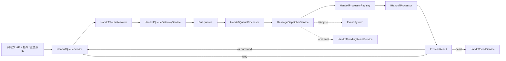

# Handoff Message 管道

`handoff` 是 `server-ai` 内部的异步消息与派发管道，用来把“需要某个 processor 执行的工作”封装成可路由、可重试、可取消的 `HandoffMessage`。

它不是 UI 事件流，也不是长期审计日志。它负责派活、执行、重试、取消和回调；运行过程中的可观察事实会桥接到 [Xpert Event System](/zh-hans/guides/event-system)。

## 一句话理解

`HandoffMessage` 是工作指令，[Event System](/zh-hans/guides/event-system) 是事实广播。

- Handoff 回答“让谁去做什么工作”。
- Event System 回答“系统刚刚发生了什么”。

## 解决什么问题

Handoff 用于把长耗时、跨模块、跨插件或跨渠道的执行从调用方解耦出来：

- 调用方只需要投递消息，不需要持有 worker 的执行上下文。
- Processor 可以按 `type` 独立注册、演进和部署。
- 消息可以进入不同队列，支持重试、延迟、取消和死信。
- 同一条管道可以承载本地同步任务、项目任务、Agent 派发、外部集成等不同处理策略。
- `enqueueAndWait` 可以在同进程内提供轻量等待和事件回调，用于少量需要同步等待的内部流程。

## 总体架构



## 核心组件

| 组件 | 职责 |
| --- | --- |
| `HandoffQueueService` | 统一入队入口，提供 `enqueue`、`enqueueMany`、`enqueueAndWait`，入队后发布 `handoff.enqueued` 事件。 |
| `HandoffRouteResolver` | 根据 header、类型策略、路由规则和默认配置解析目标队列、lane、timeout 策略。 |
| `HandoffQueueGatewayService` | 封装 Bull queue 的 add、bulk add、扫描和移除能力。 |
| `HandoffQueueProcessor` | 消费 Bull job，调用 dispatcher，并处理 `ok`、`retry`、`dead`。 |
| `MessageDispatcherService` | 校验消息、解析 processor、注册取消控制器、调用 processor，并发布 `handoff.started`、`handoff.completed`、`handoff.failed` 事件。 |
| `HandoffProcessorRegistry` | 根据 `message.type` 和组织上下文解析 `IHandoffProcessor`。 |
| `HandoffPendingResultService` | 同进程 pending registry，为 `enqueueAndWait` 提供完成回调和 `ctx.emit` 事件回调。 |
| `HandoffCancelService` | 注册运行中的 `AbortController`，通过 Redis pub/sub 广播跨实例取消。 |
| `HandoffDeadService` | 记录不可继续处理的消息。v1 主要输出日志，后续可扩展到持久化死信与告警。 |

## HandoffMessage 契约

`HandoffMessage` 是队列里的标准信封。`type` 用来决定由哪个 processor 处理，`payload` 是该类型自己的业务负载。

```ts
interface HandoffMessage<TPayload extends Record<string, unknown> = Record<string, unknown>> {
  id: string
  type: string
  version: number
  tenantId: string
  sessionKey: string
  businessKey: string
  attempt: number
  maxAttempts: number
  enqueuedAt: number
  traceId: string
  parentMessageId?: string
  payload: TPayload
  headers?: HandoffMessageHeaders
}
```

关键字段语义：

| 字段 | 含义 |
| --- | --- |
| `id` | 消息唯一 ID，也是运行中的取消和 callback 关联主键。 |
| `type` | processor 解析键，例如 `agent.chat_dispatch.v1`。 |
| `tenantId` | 租户隔离字段。 |
| `sessionKey` | 会话或运行维度的聚合键。 |
| `businessKey` | 业务幂等或业务链路聚合键。 |
| `traceId` | 链路追踪 ID，用于串联 Handoff、Agent、Chat 和 Event System。 |
| `attempt` / `maxAttempts` | 当前尝试次数和最大尝试次数。 |
| `parentMessageId` | callback 或派生消息指向上游消息。 |
| `payload` | 业务负载，由 `type` 对应的 processor 定义。 |
| `headers` | 组织、用户、语言、来源、队列和 lane 等调度上下文。 |

入队时 `HandoffQueueService` 会补齐 `id`、`version`、`attempt`、`maxAttempts`、`enqueuedAt` 等默认值。进入 dispatcher 前，消息必须具备 `id`、`type`、`tenantId`、`sessionKey`、`businessKey`、`traceId`。

常用 headers：

| Header | 用途 |
| --- | --- |
| `organizationId` | 组织上下文，也参与 processor 解析。 |
| `userId` | 用户上下文，部分 processor 会用它恢复 request context。 |
| `language` | 语言上下文。 |
| `conversationId` / `threadId` | 会话或线程关联。 |
| `source` | 运行来源，可为 `chat`、`xpert`、`lark`、`analytics`、`api`。 |
| `requestedLane` | 请求的 lane，属于软策略和可观察标签。 |
| `handoffQueue` / `queue` | 显式指定目标队列。 |
| `policyTimeoutMs` | 传递 timeout 策略，供等待或 processor 处理链路使用。 |
| `sourceAgent` / `targetAgent` | 多 Agent handoff 的来源和目标标识。 |
| `integrationId` | 外部集成上下文。 |

## 消息类型命名

Handoff 运行时允许任意字符串类型，插件可以动态扩展。推荐使用结构化命名，减少手写字符串错误：

| 格式 | 示例 |
| --- | --- |
| `channel.{provider}.{action}.v{number}` | `channel.lark.inbound.v1` |
| `agent.{action}.v{number}` | `agent.chat_dispatch.v1` |
| `system.{action}.v{number}` | `system.cleanup.v1` |
| `plugin.{domain}.{action}.v{number}` | `plugin.crm.sync.v1` |

Agent 类型应优先通过 `defineAgentMessageType(action, version)` 构造。当前系统已实现的具体消息类型见“系统已实现的 Handoff Processors”。

## 队列与路由

Handoff 当前注册四个 Bull queue：

| 队列 | 用途 |
| --- | --- |
| `handoff` | 默认队列。 |
| `handoff:realtime` | 实时性更高的任务。 |
| `handoff:batch` | 批处理任务。 |
| `handoff:integration` | 外部集成相关任务。 |

路由由 `HandoffRouteResolver` 决定，优先级如下：

1. Header 中的 `handoffQueue` 或 `queue`。
2. `HANDOFF_ROUTING_CONFIG_PATH` 指向的 YAML 配置里的 `typePolicies[message.type].queue`。
3. YAML `routes` 中按 `type`、`typePrefix`、`tenantId`、`organizationId`、`source` 命中的目标队列。
4. 默认队列 `handoff`。

lane 解析优先级类似：

1. Header 中的 `requestedLane`。
2. 类型策略里的 `lane`。
3. 路由规则里的 `target.lane`。
4. 默认 lane `main`。

当前 lane 是执行标签和软策略，不再是硬性的 lane/session permit。可用 lane 包括 `main`、`subagent`、`cron`、`nested`，别名 `high`、`normal` 会映射到 `main`，`low` 会映射到 `cron`。

timeout 解析优先级为 `policyTimeoutMs` header、类型策略 `timeoutMs`、路由目标 `timeoutMs`。解析结果会写入 `policyTimeoutMs` header，作为调度策略上下文；它不等于全局强制中断。需要强制超时的流程应在等待侧或 processor 内显式处理 timeout 与 `ctx.abortSignal`。

## 处理语义

每个 processor 返回统一的 `ProcessResult`：

```ts
type ProcessResult =
  | { status: 'ok'; outbound?: HandoffMessage[] }
  | { status: 'retry'; delayMs: number; reason?: string }
  | { status: 'dead'; reason: string }
```

处理规则：

- `ok`：当前消息完成。如果带有 `outbound`，队列会继续投递派生消息。
- `retry`：按 `delayMs` 延迟重投，`attempt` 自动递增，超过 `maxAttempts` 后进入 `dead`。
- `dead`：停止重试，记录死信。取消类原因不会作为普通失败死信处理。
- processor 抛错时，系统会根据错误类型决定重试、死信或取消。
- 找不到 processor、消息缺少必填字段、消息 ID 缺失等属于永久错误，直接进入 dead。

## 入队、等待与取消

### `enqueue`

`enqueue(message)` 是最常用入口。它解析路由、补齐默认字段、写入 Bull queue，并发布 `handoff.enqueued` 到 [Event System](/zh-hans/guides/event-system)。

### `enqueueMany`

`enqueueMany(messages)` 用于批量投递。每条消息仍然独立解析路由，并分别发布入队事件。

### `enqueueAndWait`

`enqueueAndWait(message, { timeoutMs, onEvent })` 会先在 `HandoffPendingResultService` 注册本地 pending，再投递消息，等待 processor 最终返回 `ProcessResult`。

需要注意：

- pending registry 只存在于当前 Node.js 进程内。
- 如果 waiter 和 worker 不在同一个实例，结果回调不会到达。
- 它适合少量内部同步等待，不适合作为跨实例可靠 RPC。
- processor 可以通过 `ctx.emit(event)` 给本地 waiter 推送中间事件。

### 停止与取消

`StopHandoffMessageCommand` 支持按 `messageIds` 或 `executionIds` 停止任务：

- `waiting`、`delayed`、`paused` 状态的 job 会从 Bull queue 移除。
- `active` job 会通过 `HandoffCancelService.cancelMessages` 广播取消。
- 跨实例取消使用 Redis pub/sub channel `ai:handoff:cancel`。
- 本地运行中的 processor 会收到 `ctx.abortSignal`。
- pending waiter 会收到取消错误。

Processor 需要主动监听或传递 `ctx.abortSignal`，否则只能在下一次可中断点结束。

## 系统已实现的 Handoff Processors

Processor 是 Handoff 的策略实现。Handoff 管道只负责消息入队、路由、消费、重试、取消和结果处理；具体“做什么”由 processor 决定。

截至当前实现，系统内置以下 Handoff processors：

| Processor | Message type | 主要入口 | 职责 |
| --- | --- | --- | --- |
| `AgentChatHandoffProcessor` | `agent.chat.v1` | `EnqueueAgentChatMessageCommand`、Chat SSE 路径 | 执行 `LocalQueueTaskService` 注册的同进程闭包任务，并通过 `enqueueAndWait` 返回结果。 |
| `AgentChatDispatchHandoffProcessor` | `agent.chat_dispatch.v1` | Project Assistant、Xpert trigger dispatch | 执行可序列化的 Agent chat request，并把 Chat stream 转换成 callback messages。 |
| `AgentChatCallbackNoopHandoffProcessor` | `agent.chat_callback.noop.v1` | fire-and-forget callback | 消费 callback envelope 后直接返回 `ok`，用于调用方不关心 stream 回调的场景。 |
| `ProjectTaskDispatchProcessor` | `agent.project_task_dispatch.v1` | `ProjectOrchestratorService` | 执行项目任务，驱动团队 lead assistant 完成任务并回写 task execution 状态。 |

新增 processor 时，应该在这里补充消息类型、入口、职责、回调和事件行为。

### AgentChatHandoffProcessor

`AgentChatHandoffProcessor` 处理 `agent.chat.v1`，用于把一个本地注册的闭包任务放进 Handoff 队列执行。

它的典型入口是 `EnqueueAgentChatMessageCommand`：

1. 调用方先把闭包注册到 `LocalQueueTaskService`，得到 `taskId`。
2. Handler 构造 `agent.chat.v1` 消息，payload 中携带 `taskId`、`executionId`、`integrationId`。
3. 消息通过 `enqueueAndWait` 入队并等待本进程结果。
4. Processor 取出闭包，恢复 request context，执行任务。
5. 闭包可以通过 `ctx.emit` 向本地 waiter 推送中间事件。

这个 processor 只能用于同进程任务。它依赖内存中的 `LocalQueueTaskService`，不适合跨实例 worker 执行，也不适合作为持久化任务恢复机制。

当前 Chat SSE 路径会用它包装 `XpertChatCommand`，使原有 SSE 连接可以在 Handoff 的取消和 pending 体系内运行。

### AgentChatDispatchHandoffProcessor

`AgentChatDispatchHandoffProcessor` 处理 `agent.chat_dispatch.v1`。这是系统中已实现的一种 Handoff processor 策略，不是 Handoff 产品概念本身。

它把一个 `XpertChatCommand` 所需的 `request`、`options` 和 callback 目标封装进可序列化队列消息，适合触发器、项目助手等不持有 SSE 连接的调用方。

```ts
interface AgentChatDispatchPayload extends Record<string, unknown> {
  request: TChatRequest
  options: TChatOptions
  callback: {
    messageType: string
    headers?: Record<string, string>
    context?: Record<string, unknown>
  }
}
```

典型消息形态：

```ts
const message: HandoffMessage<AgentChatDispatchPayload> = {
  id: 'xpert-trigger-...',
  type: 'agent.chat_dispatch.v1',
  version: 1,
  tenantId,
  sessionKey,
  businessKey: sessionKey,
  attempt: 1,
  maxAttempts: 1,
  enqueuedAt: Date.now(),
  traceId,
  payload: {
    request: {
      action: 'send',
      conversationId,
      projectId,
      message: {
        input
      }
    },
    options: {
      xpertId,
      from: 'job'
    },
    callback: {
      messageType: 'agent.chat_callback.noop.v1'
    }
  },
  headers: {
    organizationId,
    userId,
    language,
    source: 'xpert'
  }
}
```

执行流程：

1. 调用方构造 `agent.chat_dispatch.v1` 消息并投递到 Handoff。
2. `AgentChatDispatchHandoffProcessor` 校验 `request`、`options.xpertId`、`callback.messageType`。
3. Processor 恢复 `tenantId`、`organizationId`、`userId`、`language` request context。
4. Processor 执行 `XpertChatCommand`，并关闭命令内部 event bridge，避免重复发布事件。
5. 每收到一个 Chat stream `MessageEvent`，processor 做两件事：发布标准 `XpertEvent`，并投递一条 callback message。
6. Chat stream complete 或 error 时，processor 投递最终 callback message。
7. 如果任务被取消，processor 投递 `kind: 'error'` 的 callback，并结束当前 dispatch。

callback message 的 payload 使用统一信封：

```ts
interface AgentChatCallbackEnvelopePayload extends Record<string, unknown> {
  kind: 'stream' | 'complete' | 'error'
  sourceMessageId: string
  sequence: number
  event?: unknown
  error?: string
  context?: Record<string, unknown>
}
```

callback message 会继承原消息的 `tenantId`、`sessionKey`、`businessKey`、`traceId` 和 headers，并设置：

- `id`：`${sourceMessage.id}:callback:${sequence}`
- `parentMessageId`：原 `agent.chat_dispatch.v1` 消息 ID
- `type`：`payload.callback.messageType`

如果调用方不需要处理 stream 回调，可以使用 `agent.chat_callback.noop.v1`。当前项目助手 Manage Backlog 和 Xpert trigger dispatch 都使用这种 fire-and-forget 模式。

不要把 `agent.chat_dispatch.v1` 和 `agent.chat.v1` 混淆：

- `agent.chat_dispatch.v1` 的 payload 是可序列化的 chat request，适合队列 worker 执行。
- `agent.chat.v1` 的 payload 指向本地 `LocalQueueTaskService` 中的 `taskId`，只能用于同进程闭包任务。

### AgentChatCallbackNoopHandoffProcessor

`AgentChatCallbackNoopHandoffProcessor` 处理 `agent.chat_callback.noop.v1`。

它消费 `AgentChatCallbackEnvelopePayload` 后直接返回 `{ status: 'ok' }`，用于 fire-and-forget 场景：

- 调用方希望复用 `agent.chat_dispatch.v1` 的异步派发能力。
- 调用方不需要处理每个 stream event。
- 仍希望 callback message 链路完整，不让 dispatch processor 因缺少 callback target 进入 dead。

当前项目助手 Manage Backlog 和 Xpert trigger dispatch 都使用 noop callback。

### ProjectTaskDispatchProcessor

`ProjectTaskDispatchProcessor` 处理 `agent.project_task_dispatch.v1`，是 Project Orchestrator 的任务执行策略。

消息 payload 只需要携带 `taskExecutionId`：

```ts
interface ProjectTaskDispatchPayload extends Record<string, unknown> {
  taskExecutionId: string
}
```

执行流程：

1. `ProjectOrchestratorService` 认领任务后创建 task execution，并投递 `agent.project_task_dispatch.v1`。
2. Processor 加载 task execution、task、team、project。
3. 如果目标 team 不存在、project 不存在、或任务被错误派给 project main assistant，processor 会把 task execution 标记为 failed。
4. Processor 将 task execution 更新为 `Running`，记录 `dispatchId`、`xpertId`，并发布 `project.task_execution_started`。
5. Processor 调用团队 lead assistant 执行任务，并注入 `reportProjectTaskOutcome` 工具。
6. Agent 必须通过 `reportProjectTaskOutcome` 上报 outcome、summary、artifacts、error。
7. Processor 根据 outcome 更新 task 和 latest execution，并发布 `project.task_execution_succeeded` 或 `project.task_execution_failed`。
8. 执行过程中如果捕获到 conversationId 或 agentExecutionId，会发布 `project.task_execution_updated`。

这个 processor 是 Project Board 增量更新的主要事件来源之一。它通过 [Event System](/zh-hans/guides/event-system) 发布 project task 事件，而不是通过 Handoff callback 面向 UI 广播。

## 与 Event System 的关系

[Event System](/zh-hans/guides/event-system) 和 Handoff Message 会协同工作，但职责不同。

| 维度 | Handoff Message | Event System |
| --- | --- | --- |
| 主要问题 | 派发工作，让 processor 执行。 | 广播事实，让订阅方观察。 |
| 数据模型 | `HandoffMessage`，包含 `type`、`payload`、重试、callback 和调度上下文。 | `XpertEvent` / `XpertEventRecord`，包含 `type`、`scope`、`source`、`payload`、`meta`、`streamId`。 |
| 传输机制 | Bull queue，processor 消费，支持重试、延迟、取消。 | Redis Stream + SSE，支持短期回放和增量订阅。 |
| 消费者 | 注册的 `IHandoffProcessor`。 | 前端 store、运行时间线、调试面板、其他观察者。 |
| 副作用 | 消费消息会执行业务动作。 | 订阅事件不应触发核心业务动作。 |
| 回放含义 | 队列 job 不是产品事件回放接口。 | `GET /events` 和 `/events/stream` 是产品事件回放和订阅接口。 |

Handoff 会把自己的生命周期桥接成事件：

- `handoff.enqueued`
- `handoff.started`
- `handoff.completed`
- `handoff.failed`

不同 processor 还可以按自身职责发布领域事件。例如 Project Task Dispatch 会发布 `project.task_*` 事件，Agent Chat Dispatch 会把 Chat stream 映射成 `chat.message_delta`、`agent.execution_started`、`agent.execution_ended`、`tool.message`、`tool.failed` 等统一事件。

推荐分工：

- 要让系统执行工作，使用 Handoff。
- 要让 UI 或观察者知道工作进展，使用 Event System。
- Handoff callback queue 继续服务原调用方的协议兼容和回调链路。
- Event System 服务统一订阅、断线续传、看板增量更新和运行可观察性。
- 两者通过 `traceId`、`sessionKey`、`businessKey`、`conversationId`、`executionId` 等字段关联。

## 什么时候使用 Handoff

适合使用：

- 任务需要异步执行、可重试或可取消。
- 任务由 Agent、插件、渠道集成或项目调度器处理。
- 调用方不应该持有 worker 执行细节。
- 需要把某类执行封装成独立 processor 策略，或需要 callback / outbound 链路。
- 需要在成功后继续派发 `outbound` 消息。

不适合使用：

- 单个函数内可以直接完成的同步逻辑。
- 只需要给 UI 推送状态变化的观察需求，此时使用 [Event System](/zh-hans/guides/event-system)。
- 需要跨实例强可靠请求响应的 RPC，`enqueueAndWait` 只保证同进程 best-effort。
- 长期审计、结算、合规保存，当前 Handoff 队列不是审计存储。

## 设计约束与实践

Producer 应该：

- 使用稳定的机器可读 `type`，不要从显示文案推断 processor。
- 补齐 `tenantId`、`sessionKey`、`businessKey`、`traceId`。
- 在 headers 中传递 `organizationId`、`userId`、`language`、`source` 等上下文。
- 为 callback 或派生消息设置 `parentMessageId`。
- 根据业务重试语义设置 `maxAttempts`，不需要重试的任务使用 `1`。

Processor 应该：

- 只处理自己声明的消息类型。
- 对 payload 做显式校验，缺少关键字段时返回 `dead`。
- 对可恢复错误返回 `retry`，对不可恢复错误返回 `dead`。
- 在长耗时流程中传递或监听 `ctx.abortSignal`。
- 需要继续派发工作时返回 `ok` + `outbound`，不要在 processor 内绕过统一队列入口。
- 需要对外展示进展时发布或桥接到 [Event System](/zh-hans/guides/event-system)，不要把 Handoff callback 当作通用 UI 广播。
