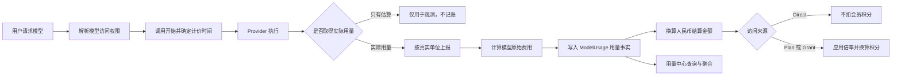

# 模型用量与计费架构

Xpert 的模型计费不是简单的“Token 乘以单价”。平台把模型调用拆成相互独立的用量、定价、结算和会员扣点层，使文本、图片、视频等不同模型可以保留各自真实的计量单位，同时进入统一台账。

本文说明 `xpert-develop` 当前实现的模型用量与计费能力、核心数据流、扩展方式和已知边界。

## 职责边界

相关职责分布在不同仓库和模块中：

| 边界            | 主要职责                                                                                             |
| --------------- | ---------------------------------------------------------------------------------------------------- |
| `xpert-develop` | 定义统一用量协议，解析模型访问权限，执行计价，保存用量与费用，结算人民币，扣减会员积分并提供用量中心 |
| `xpert-plugins` | 实现具体 Provider 调用，解析 Provider 返回的真实用量，并维护具体模型的价格配置                       |
| 商业产品层      | 定义面向客户销售的套餐、商品、支付和退款；不应与模型供应商成本混为一层                               |

因此，平台计费引擎支持某种价格规则，不等于每个 Provider 已经配置了正确价格；具体模型能否正确计费，还取决于插件价格数据和实际用量上报是否完整。

## 完整数据流



这条链路遵循一个重要原则：

```text
真实用量 != 模型原始费用 != 人民币结算金额 != 会员积分
```

四层数据分别保存和计算，不能把价格换算混入用量，也不能把视频秒数或生成次数折算成 Token。

## 统一用量协议

统一用量协议位于 `packages/contracts/src/ai/model-usage.model.ts`。

### 模态与操作

当前支持以下模型模态：

- `text`
- `audio`
- `image`
- `video`

图片生成操作包括：

- `text_to_image`
- `image_to_image`
- `multi_image_to_image`

视频生成操作包括：

- `text_to_video`
- `image_to_video`
- `first_last_frame_to_video`
- `reference_to_video`

操作是机器可读的稳定字段。计价逻辑不能根据模型名称、展示文案或请求参数组合猜测操作类型。

### 计量单位与权威来源

`ModelUsageMetric` 当前支持五种单位：

| 单位         | 典型场景                           | 允许的用量权威来源     |
| ------------ | ---------------------------------- | ---------------------- |
| `token`      | LLM、Embedding、部分图片或视频模型 | `provider`             |
| `generation` | 按成功生成次数计费的图片或视频模型 | `provider`、`contract` |
| `second`     | 按生成视频时长或音频时长计费       | `provider`、`request`  |
| `character`  | 按字符数计费的模型                 | `provider`、`request`  |
| `request`    | 按调用次数计费                     | `provider`、`contract` |

权威来源用于说明该用量为什么可以作为账务事实：

- `provider`：Provider 响应明确返回。
- `request`：供应商合同明确按请求参数计费，例如请求的视频时长。
- `contract`：供应商合同明确按一次成功调用或生成计费。

一次请求可以上报多个指标。例如一个视频请求可以同时上报：

```ts
metrics: [
  {
    key: 'generation',
    unit: 'generation',
    quantity: 1,
    authority: 'provider'
  },
  {
    key: 'duration',
    unit: 'second',
    quantity: 5,
    authority: 'provider'
  }
]
```

每个指标独立匹配价格并写入台账。

视频或音频时长应作为 `second` 指标的实际数量上报，而不是把 `durationSeconds` 当成另一种价格单位或把时长折算成 Token。

## LLM 定价

LLM 定价由 `packages/plugin-sdk/src/lib/ai-model/pricing.ts` 中的 `calculateLLMUsagePrice()` 完成。

### 支持的价格分项

一次 LLM 请求可以拆分为：

- 普通输入 Token：`input`
- 输出 Token：`output`
- 缓存读取 Token：`cache_read_input`
- 缓存写入 Token：`cache_write_input`
- 缓存存储 Token-hour：`cache_storage`
- 请求附加项：`request`

缓存写入还可以按 `5m` 和 `1h` 两种 TTL 使用不同价格。

例如某次请求包含 100,000 输入 Token，其中 80,000 是缓存读取，输出为 1,000 Token，计价器会分别计算：

```text
20,000 普通输入 Token
+ 80,000 缓存读取 Token
+ 1,000 输出 Token
= 本次模型原始费用
```

如果已经声明某个价格分项的规则族，但实际用量没有匹配到规则，该分项会标记为 `unpriced`。任意实际使用的分项为 `unpriced` 时，整次 LLM 费用也会标记为 `unpriced`。

### 条件价格

LLM 价格规则可以按以下条件匹配：

- 最小、最大输入 Token
- 最小、最大输出 Token
- 模式，例如 thinking 模式
- 区域
- 服务等级
- 缓存写入 TTL
- 每日价格时段
- 请求附加项

当多条规则匹配时，系统选择条件最具体的一条；如果存在同等具体程度的多条规则，则判定配置存在歧义并报错，不随机选择价格。

### 旧版阶梯价格

旧的 `tiered_pricing` 保留兼容。它根据本次请求的输入 Token 数选择一个档位，然后整次请求使用该档位的输入、输出价格。

它不是：

- 按区间逐段累进计价
- 按日或按月累计用量后跨档计价

## 图片、视频等通用定价

非 LLM 模型使用 `ModelUsagePricingConfig` 和 `ModelUsagePriceRule`。

每条规则可以声明：

- 规则 ID 和版本
- 生效、失效时间
- 计量单位
- 每个价格单位包含多少用量
- 单价和币种
- 收费或免费
- 适用操作
- 分辨率、是否音频、是否包含视频输入、模式等维度
- 带 IANA 时区的每日价格时段

收费公式为：

```text
原始费用 = 实际用量 / unit_size * unit_price
```

例如：

```yaml
type: usage
rules:
  - id: video-1080p-second
    version: '2026-08-01'
    effective_from: '2026-08-01T00:00:00Z'
    unit: second
    unit_size: 1
    unit_price: 0.12
    currency: CNY
    charge_type: paid
    operations:
      - text_to_video
      - image_to_video
    dimensions:
      resolution: 1080p
```

没有匹配规则时，通用定价结果为 `unpriced`，不会自动按零元处理。

## 价格时间与快照

价格规则带有生效时间、操作和维度条件，因此异步模型不能在任务完成后重新读取“当前最新价格”进行历史计费。

平台向 Provider 实例提供定价快照解析接口。正确的插件接入流程是：

1. 模型调用开始时记录 `startedAt`。
2. 按调用时间、操作和初始价格维度解析定价快照。
3. Provider 完成后，将快照与最终实际用量一起上报。
4. 服务端只使用该快照计算本次费用。

这样即使模型执行期间价格配置发生变化，本次调用仍使用开始时有效的规则。

如果插件没有携带快照，服务端会在收到最终用量时兜底解析价格。该兜底可以避免完全无法记账，但不具备严格的“调用开始时冻结价格”语义，因此 Provider 插件仍应主动取得并上报快照。

## 实际用量与估算用量

LLM 回调会依次尝试读取 Provider 返回的实际用量，例如：

- 消息 `usage_metadata`
- `llmOutput.tokenUsage`
- Provider 返回的总 Token 数

如果没有实际用量，SDK 可以根据输入和输出文本生成估算值，并将其标记为 `estimated`。

估算用量可以提供给运行时观测回调，但服务端模型处理链路会在写计费台账前跳过它。只有最终、可作为账务事实的实际用量才能触发计价和扣点。

## 模型访问权限

模型调用前，`ModelAccessService` 会解析 `IModelAccessResolution`。当前存在三种允许的访问来源：

| 来源     | 含义                                     | 会员扣点行为                               |
| -------- | ---------------------------------------- | ------------------------------------------ |
| `Direct` | 用户或管理员直接使用所属范围内的模型配置 | 保存模型用量与成本，但不扣平台会员积分     |
| `Plan`   | 当前会员计划包含该模型                   | 按计划模型倍率扣减积分                     |
| `Grant`  | 用户通过模型授权获得访问能力             | 使用授权指定的计费用户、授权记录和倍率结算 |

模型不可用不是第四种访问来源，而是 `allowed = false` 并附带具体原因，例如模型禁用、授权过期、会员计划缺失或额度耗尽。不可用请求会在模型执行前被阻止。

已经解析的 `modelAccess` 必须沿调用链传递到用量记录和会员结算层，不能在调用完成后仅凭用户、组织或 Xpert 再次猜测访问来源。

Provider 级 Agent Middleware AIGC 调用也遵循这条规则：运行时在提交 Provider 请求前解析访问权限，异步任务将解析结果写入持久化检查点，最终用量上报复用同一份结果。因此队列重试不会重复提交任务，也不会在任务完成后重新推断 Direct 或 Grant 归属。

## 用量事实与会员台账

模型用量和会员积分共同保存在 `membership_point_ledger`，但通过不同 `source` 表达不同业务事实。

### ModelUsage 用量事实

服务端首先写入 `source = ModelUsage` 的记录：

- `pointsDelta = 0`
- 保存请求、用户、组织、Provider、模型和操作
- 保存真实用量和权威来源
- 保存价格状态、规则 ID、规则版本和匹配规则副本
- 保存原币金额、人民币结算金额和汇率

一条模型请求可以对应多条 `ModelUsage` 记录，每个指标一条。

### Usage 和 PersonalUsage 扣点事实

如果人民币结算金额大于零且访问来源需要会员结算，平台再写入：

- `source = Usage`：扣减会员计划积分
- `source = PersonalUsage`：会员积分不足时扣减个人积分，或者当前账户仅使用个人积分

扣点记录通过以下引用与模型用量事实关联：

```text
model-usage-charge:<模型用量台账 ID>
```

### 幂等性

模型用量事实使用以下组合做唯一约束：

```text
tenantId + providerScopeId + requestId + metricKey + revision
```

会员扣点使用 `tenantId + sourceReference` 做唯一约束。Provider 回调、队列重试或服务端重放同一请求时，不会重复写入同一个用量指标或重复扣点。

## 人民币结算与积分换算

`settleChargeToCny()` 负责把模型原始费用转换为人民币结算金额：

- CNY、RMB：金额不变，汇率记为 `1`。
- USD：使用 `MODEL_BILLING_USD_TO_CNY_RATE`。
- 未知币种：不结算。
- USD 汇率缺失或非法：不结算。
- `unpriced`：不结算。
- `free`：结算金额为 `0`，但保留免费状态。

人民币结算金额确定后，会员层按以下顺序处理：

1. 根据 Plan 或 Grant 得到模型结算倍率。
2. `计费人民币金额 = 原始人民币金额 * 倍率`。
3. 根据租户配置的每积分人民币价值换算积分。
4. 优先扣减会员积分，必要时再扣减个人积分。

原币金额、汇率、人民币金额和最终积分分别保存，便于审计和解释账单。

## 价格状态

每条模型用量都必须具有明确的价格状态：

| 状态       | 含义                           | 是否结算                                             |
| ---------- | ------------------------------ | ---------------------------------------------------- |
| `priced`   | 已匹配到有效收费价格           | 有有效币种和汇率时结算                               |
| `free`     | 明确配置为免费或匹配到零价规则 | 结算金额为 0，不扣点                                 |
| `unpriced` | 实际发生用量，但缺少完整价格   | 不结算、不扣点；如需历史重算，必须使用单独的显式流程 |

`free` 和 `unpriced` 不能互换。前者是明确的商业事实，后者是配置或数据不完整。

## 查询和用量中心

服务端提供模型用量明细与聚合查询，支持按以下条件过滤：

- 时间范围
- Provider
- 模型
- 用户
- 组织
- 计量单位
- 模态
- 原始币种
- 价格状态

用量中心使用相互独立的“模态”和“计量单位”筛选器，支持展示：

- `text`、`audio`、`image`、`video` 模态
- `token`、`generation`、`second`、`character`、`request` 计量单位
- 任意已上报的模态与计量单位组合，不依赖固定分类白名单
- `priced`、`free`、`unpriced` 记录数
- Provider 原始金额
- 人民币结算金额和汇率
- 按账户聚合后的 LLM、视频和总费用

## Provider 接入步骤

为一个具体模型接入计费时，应完成以下步骤：

1. 在 Provider 插件的模型元数据中配置真实价格、币种和生效时间。
2. 根据供应商官方账单规则选择真实单位，不能统一折算成 Token。
3. 在调用开始时取得定价快照。
4. 从 Provider 最终响应、查询接口或明确合同字段取得实际用量。
5. 使用稳定 `requestId` 上报最终 `ModelUsageReport`。
6. 为多指标请求提供稳定且不重复的 `metric.key`。
7. 验证用量台账的价格状态、原币金额、人民币结算和会员扣点。
8. 验证 Provider 回调或队列重试不会产生重复台账。

对于异步图片或视频任务，还必须持久化 Provider task ID，使服务重启后能够继续查询同一个任务，而不是重复提交生成请求。

## 当前边界

当前实现需要注意以下边界：

- 具体模型的真实价格和 Provider 用量解析仍由对应插件负责。
- 旧版 LLM 价格路径在完全缺少价格配置时，仍可能把零金额识别为 `free`；该路径需要进一步统一为缺价格时的 `unpriced` 语义。
- LLM 请求附加项已经有协议和计价能力，但搜索、grounding 等具体计费接入当前暂不实施。
- 支持每日循环价格时段及跨午夜时段，但不支持工作日、周末或法定节假日规则。
- 不支持账期累计阶梯、最低消费、整块向上取整或最小计费块。
- `tiered_pricing` 是整次请求选档，不是累进阶梯。
- `unit_size` 使用线性除法，不会自动向上取整。

只有在供应商存在明确、可验证的计费规则时，才应扩展新的计价能力，避免为假设场景增加无法验证的复杂度。

## 主要源码位置

| 模块                     | 路径                                                                                       |
| ------------------------ | ------------------------------------------------------------------------------------------ |
| 用量、价格快照和台账合同 | `packages/contracts/src/ai/model-usage.model.ts`                                           |
| LLM 价格合同             | `packages/contracts/src/ai/ai-model.model.ts`                                              |
| LLM 与通用模型计价器     | `packages/plugin-sdk/src/lib/ai-model/pricing.ts`                                          |
| LLM 用量采集             | `packages/plugin-sdk/src/lib/ai-model/llm.ts`                                              |
| 模型访问解析             | `packages/server-ai/src/model-access/model-access.service.ts`                              |
| 统一模型用量台账         | `packages/server-ai/src/copilot-usage/model-usage/model-usage-ledger.service.ts`           |
| 人民币结算               | `packages/server-ai/src/membership/model-billing.ts`                                       |
| 会员扣点                 | `packages/server-ai/src/membership/membership.service.ts`                                  |
| 台账实体与唯一索引       | `packages/server-ai/src/membership/membership-point-ledger.entity.ts`                      |
| 用量中心                 | `apps/cloud/src/app/features/setting/copilot/usage-center/model-usage-ledger.component.ts` |
