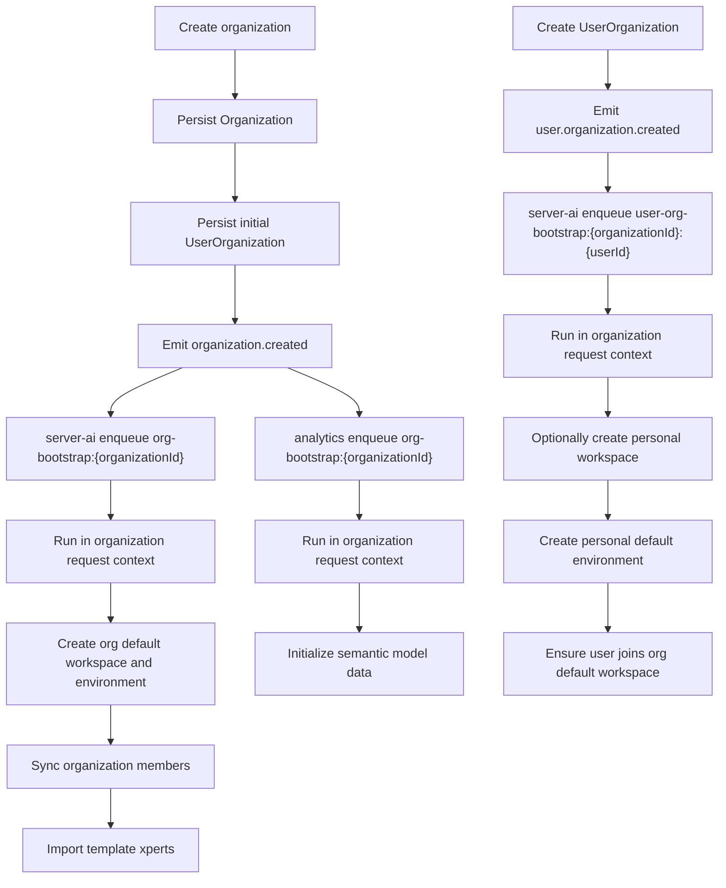

# 组织与用户初始化架构

这篇文档说明 Xpert 当前“组织创建”和“用户加入组织”两条初始化链路的触发点、异步处理方式、幂等设计和可配置项。

## 设计目标

这套初始化架构解决的是 4 个问题：

- 新建组织后，自动创建组织默认 workspace
- 新用户加入组织后，自动创建该用户在该组织下的个人 workspace
- 组织初始化时，为分析模块创建语义模型基础数据
- 整个初始化过程异步执行、可重试、可重复投递而不产生重复数据

## 核心原则

### 1. 用户初始化不挂在裸 `user.created`

系统采用“组织内每用户一个 workspace”的模型，因此 AI 侧初始化的真实触发点不是单纯的用户创建，而是用户成功加入某个组织。

这意味着：

- 仅创建 `User` 记录时，不做 workspace 初始化
- 只有 `UserOrganization` 关系真正创建成功后，才触发用户侧 bootstrap

对应内部事件为：

- `user.organization.created`

### 2. 组织初始化必须在初始成员关系落库后触发

组织初始化依赖组织 owner 和当前组织成员，因此 `organization.created` 必须在以下动作都完成后再发出：

- `Organization` 已创建
- 初始 `UserOrganization` 关系已创建

这样后续的默认 workspace 成员同步和 owner 选择才是稳定的。

### 3. 所有初始化任务都走异步队列

组织创建和用户加入组织的主流程不等待 bootstrap 完成。

事件发出后：

- `server-ai` 监听事件并入队
- `analytics` 监听组织创建事件并入队
- 后续由各自的 queue processor 在后台消费

这样主链路更短，失败也不会回滚业务主事务。

### 4. 所有组织感知写操作都必须带 request context

当前仓库里不少 service 是 organization-aware 的。

如果异步任务直接写库而不显式补齐组织上下文，`organizationId` 可能被覆盖成 `null`。

因此异步 bootstrap 中所有写库逻辑都必须包在：

```ts
runWithRequestContext(
  {
    user,
    headers: {
      'organization-id': organizationId
    }
  },
  () => {
    // bootstrap writes
  }
)
```

## 事件模型

当前引入了两个内部事件：

### `organization.created`

```ts
{
  tenantId: string
  organizationId: string
  ownerUserId?: string | null
}
```

触发时机：

- 组织创建完成
- 初始组织成员关系完成

### `user.organization.created`

```ts
{
  tenantId: string
  organizationId: string
  userId: string
  bootstrapPersonalWorkspace: boolean
}
```

触发时机：

- `UserOrganization` 关系首次创建成功后

说明：

- 该事件由统一的“加入组织”写入层发出，而不是只挂在注册流程
- 这样“已有用户后来加入另一个组织”也能触发个人 workspace 初始化
- `bootstrapPersonalWorkspace=false` 用于组织创建时给租户 super admin 建组织成员关系但不创建个人 workspace

## 总体流程



## `server-ai` 初始化职责

`server-ai` 处理两类任务：组织 bootstrap 和用户 bootstrap。

### 组织 bootstrap

组织初始化任务的职责包括：

- 幂等创建组织默认 workspace
- 为该 workspace 幂等创建默认 environment
- 把当前组织成员全部加入组织默认 workspace
- 按环境变量导入默认模板 xperts

默认命名如下：

- 组织默认 workspace：`Default Workspace`
- 默认 environment：`Default`

组织默认 workspace 通过 `workspace.settings.system.kind = 'org-default'` 标记。

### 用户 bootstrap

用户加入组织后的初始化职责包括：

- 当 `bootstrapPersonalWorkspace=true` 时，为该用户在当前组织下幂等创建个人 workspace
- 为个人 workspace 幂等创建默认 environment
- 把该用户幂等加入组织默认 workspace

个人 workspace 通过以下字段标记：

```ts
settings.system.kind = 'user-default'
settings.system.userId = userId
```

个人 workspace 名称规则为：

```ts
${displayName || email} Workspace
```

### 为什么要有 `ensureMember`

组织默认 workspace 的成员会在两处被更新：

- 组织 bootstrap 时批量同步当前成员
- 用户加入组织时增量加入该用户

如果继续使用“整表替换 members”的写法，并发下容易互相覆盖。

因此实现上新增了增量接口：

- `ensureMember(workspaceId, userId)`

它只负责“如果不存在则加入”，不重写整份成员列表。

## 模板 xpert 导入

组织默认 xpert 导入由环境变量控制：

```bash
ORG_DEFAULT_XPERT_TEMPLATE_KEYS=id1,id2,id3
```

它的行为是：

- 逐个读取模板详情
- 解析模板 YAML
- 把导入目标 workspace 改成组织默认 workspace
- 在导入结果上写入 bootstrap 元数据

用于幂等识别的字段为：

```ts
options.bootstrap = {
  source: 'template',
  templateKey: string,
  workspaceKind: 'org-default'
}
```

导入前，系统会先按以下条件查找是否已经导入过：

- `workspaceId`
- `options.bootstrap.templateKey`
- `options.bootstrap.workspaceKind = 'org-default'`
- `latest = true`
- `deletedAt IS NULL`

查到已有记录时，执行覆盖导入；否则创建新 xpert。

### 模板重名处理

当前已发布 xpert 的名称校验仍然接近全局唯一，因此组织导入时采用固定降级规则：

1. 原模板名
2. `模板名 (组织名)`
3. `模板名 (组织名 organizationId前8位)`

## `analytics` 初始化职责

`analytics` 当前只监听组织创建事件。

它会复用分析模块现有 seed 逻辑，但拆成更细粒度、可复用的组织初始化入口。

默认模式为：

- `semantic-only`

可选模式为：

- `full-demo`

对应环境变量：

```bash
ORG_ANALYTICS_BOOTSTRAP_MODE=semantic-only
```

### `semantic-only` 会做什么

该模式只初始化语义模型运行所必需的数据：

- data source
- business area
- business-area-user
- semantic model
- semantic model roles
- catalog update

### `full-demo` 会额外做什么

在 `semantic-only` 的基础上额外导入：

- demo indicators
- demo story

## 幂等与重试设计

这套初始化链路默认假设“事件可能重复投递”。

因此每层都做了幂等处理。

### 队列幂等键

- 组织 bootstrap：`org-bootstrap:${organizationId}`
- 用户 bootstrap：`user-org-bootstrap:${organizationId}:${userId}`

### 记录级幂等标记

- 组织默认 workspace：`settings.system.kind = 'org-default'`
- 用户默认 workspace：`settings.system.kind = 'user-default'` + `settings.system.userId`
- 模板导入 xpert：`options.bootstrap.templateKey` + `options.bootstrap.workspaceKind`

### 行为级幂等

- environment 创建前先查默认 environment
- workspace 成员加入使用 `ensureMember`
- analytics seed 逻辑按组织范围查重

## 失败语义

初始化失败不会回滚组织创建或用户加入组织主流程。

当前失败策略为：

- 主流程成功即可返回
- bootstrap 后台重试
- 失败记录结构化日志
- 允许后续重复投递重新收敛到目标状态

## 入口与扩展点

如果你要扩展初始化逻辑，建议按下面的边界继续演进：

### 适合放进组织 bootstrap 的能力

- 组织级默认 workspace 初始化
- 组织级默认 environment 初始化
- 组织级模板 xpert 导入
- 组织级分析语义模型初始化

### 适合放进用户 bootstrap 的能力

- 组织内个人 workspace 初始化
- 默认 environment 初始化
- 自动加入组织共享 workspace
- 后续可能的用户偏好或默认 assistant 绑定

### 暂时不要塞进这条链路的能力

- 已发布 xpert 的全局 slug 作用域改造
- 大量依赖外部系统的同步任务
- 需要强事务一致性的长链路写操作

这些能力更适合拆成独立工程，而不是和 bootstrap 链路绑死。

## 推荐部署配置

分析型组织比较适合的起步配置如下：

```bash
ORG_DEFAULT_XPERT_TEMPLATE_KEYS=af7133cb-32b3-47ff-90c1-b144c4d4887e,af7133cb-32b3-47ff-90c1-b144c4d48872
ORG_ANALYTICS_BOOTSTRAP_MODE=semantic-only
```

上面的两个模板分别对应：

- `ChatBI with Sales Analysis Expert`
- `Text2SQL-ChatDB`

## 一句话总结

当前的初始化架构本质上是：

`业务主流程发事件 -> AI/Analytics 异步入队 -> 在组织上下文中幂等收敛到目标状态`

这让系统既能自动完成组织和用户的初始化，又不会把主流程绑死在复杂的后台写操作上。
