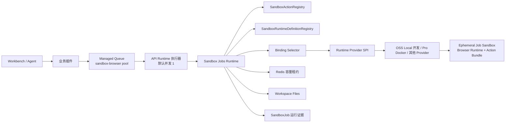
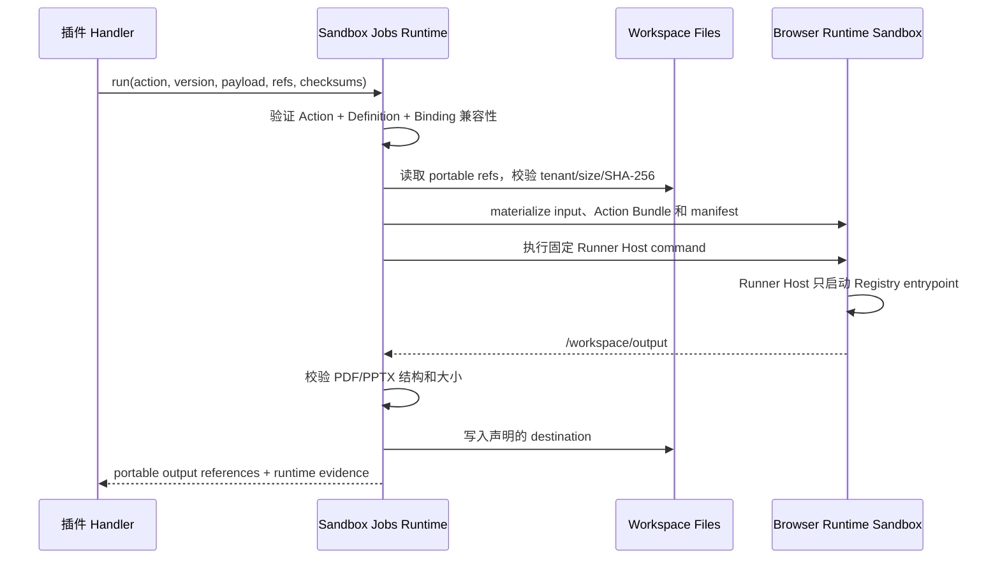

# Sandbox Runtime 与 Sandbox Jobs 技术架构

Xpert 把“任务编排”“运行时定义”“运行时实现”和“插件功能”拆成独立层：OSS Core 维护通用 Job 语义和 Provider SPI，Runtime Suite 发布提供方无关的 Definition 与 OCI artifacts，system-level 插件维护可审核的 Action Bundle，Pro 或其他发行版通过 Binding 接入生产 Provider。OSS 另外内置一个仅供开发和测试使用的弱隔离 Local Binding。

首个实现是 Browser Runtime 与 Presentation Studio 的 PDF/PPTX 导出。它不复用智能体会话 Sandbox；Workbench 没有活跃对话、后台重试或交互式 Sandbox 被关闭时，系统导出仍可运行。

## 核心概念与所有权

| 概念                  | 所有者            | 内容                                                                                                                    |
| --------------------- | ----------------- | ----------------------------------------------------------------------------------------------------------------------- |
| Sandbox Runtime Suite | Xpert 平台        | 统一版本、Catalog、镜像构建和发布工具                                                                                   |
| Browser Runtime       | Xpert 平台        | Node、`playwright-core`、匹配的 Chromium、字体和通用 Runner Host                                                        |
| Runtime Definition    | OSS Runtime Suite | 稳定 profile 名称、固定 Runner argv、contract/runtime 版本、默认资源、安全要求和 expected manifest；不含 provider/image |
| Runtime Binding       | Runtime Provider  | 把 Definition 绑定到 provider 和不可变 artifact，并声明优先级                                                           |
| Runtime Provider SPI  | OSS Plugin SDK    | 最小的 binding/health/create/destroy 与 Runtime instance 文件/执行接口                                                  |
| Sandbox Action Bundle | system-level 插件 | action 名称/版本、Runtime 兼容约束、入口和确定性 bundle hash                                                            |

Runtime Definition 不知道 Docker、Presentation、Dashi 或任何插件。Action Bundle 不包含 Chromium，也不能选择 image、provider 或 Docker 参数。

## 总体架构



API 进程同时承担 Runtime 执行器和队列消费者职责；幂等、容量、Runtime 生命周期、输入输出和清理由 `Sandbox Jobs Runtime` 完成。每个 API 默认以单并发消费浏览器池。开发/测试通过 `local-browser-runtime` 提供 Binding；OSS 生产环境刻意不提供生产 Binding；Pro 通过 Docker Runtime Provider 提供 Binding。

## 平台 Runtime Suite package

`packages/sandbox-runtime` 是私有 package `@xpert-ai/sandbox-runtime`，集中维护 Browser Runtime 资产、OCI image 构建和本地开发校验，不包含 Provider 或业务编排：

```text
packages/sandbox-runtime/
├── images/catalog.json
├── images/browser/
│   ├── image.json
│   ├── Dockerfile
│   ├── runtime/runner-host.mjs
│   ├── runtime/manifest.json
│   ├── artifact-catalog.template.json
│   └── tests/
└── scripts/
    ├── build-matrix.mjs
    ├── verify-image.mjs
    ├── render-artifact-catalog.mjs
    └── verify-catalog.mjs
```

`images/catalog.json` 是 workflow 唯一矩阵来源。未来增加 Agent Sandbox、Office、Python 或 GPU image family 时新增 Catalog entry 和 family 目录，不复制 workflow。

Browser Runtime Profile 固定为 `browser/playwright-1.61/v1`。首版镜像包含 Node.js `20.20.2`、`playwright-core@1.61.0`、匹配的 Chromium、Noto CJK、Noto Color Emoji 和通用 Runner Host。Runtime manifest 记录 suite version、image family、contract、依赖版本、browser revision 和 Runner Host SHA-256。

## Definition、Binding、Provider 与 Action Registry

平台使用两个 registry，避免把插件身份硬编码进平台配置：

### SandboxRuntimeDefinitionRegistry

OSS Core 从自身内置的 Runtime Definition Catalog 注册通用的 `browser/playwright-1.61/v1`：

- 固定 Runner Host command
- Runtime contract 与 suite version
- CPU、内存、`/dev/shm`、临时空间和 deadline
- network/security policy
- expected Runtime manifest

Definition 不包含 provider、image、宿主路径或插件标识。它在 OSS 与 Pro 中完全相同，不要求用户配置 profile 文件或环境变量。API image 不安装或携带 `@xpert-ai/sandbox-runtime`；Runtime Suite 构建和校验直接消费同一份 Core Definition 文件，避免两份契约漂移。

### SandboxRuntimeProviderRegistry 与 Binding Selector

`@SandboxRuntimeProviderStrategy()` 只允许 built-in 或 `level=system` 插件注册最小 Provider SPI；组织级插件会被拒绝。Provider 用 `listBindings()` 声明可承载的 Definition 与不可变 artifact，用 `getBindingHealth()` 验证引擎、artifact、manifest 和安全保证。Selector 按能力、版本、健康和优先级确定性选择 Binding，并支持新 attempt 在多个 Provider 之间 failover。

标记为 `developmentOnly` 的 Binding 只有在 `NODE_ENV` 精确等于 `development` 或 `test` 时，才允许放宽 Definition 的生产隔离要求；其他环境一律拒绝。OSS 的 `LocalBrowserRuntimeProvider` 只在开发/测试注册：它以子进程执行固定 Runner Host，把文件访问限制在当前 Job workspace，过滤服务端敏感环境变量，并支持超时、取消和进程树清理。它如实声明 process isolation，不能保证资源限制、禁网和只读根文件系统，因此不是生产 Sandbox。其 Binding 优先级为 `10000`，即使在 Pro 开发环境中也会优先选择健康的 Docker Binding。

交互式 Agent Sandbox 的 `ISandboxProvider/SandboxBackendProtocol` 不参与该选择；`LocalShellSandboxProvider` 也不是 Sandbox Job 候选。Workspace 映射由独立 `SandboxWorkspaceMapperRegistry` 扩展，OSS 不再对 `docker-sandbox` 做字符串分支。

### SandboxActionRegistry

它从已加载的 system-level 插件 `.xpertai-plugin/plugin.json` 解析 `sandboxActions`。v1 不执行 organization-level 插件声明的 Action。

```json
{
  "name": "presentation.export",
  "version": "1.0.0",
  "runtimeProfile": "browser/playwright-1.61/v1",
  "runtimeContractVersion": "1",
  "playwrightVersion": "1.61.0",
  "bundle": "./bundle",
  "entrypoint": "runner.mjs",
  "bundleSha256": "<tree-sha256>"
}
```

Registry 会拒绝绝对路径、路径穿越、空字节、软链接、硬链接和非普通文件；默认限制为 256 MiB 和 20,000 个文件。它逐文件校验 size/SHA-256，再校验确定性 tree hash。验证后的不可变内容按 `bundleSha256` 在 API 执行器内缓存，随后复制到每个 Job 的 `/workspace/runtime/action`。插件安装目录、宿主路径和插件 `node_modules` 从不挂载到 Sandbox。Action 自有依赖应放在 `runtime-modules` 等普通 bundle 目录，禁止嵌套 `node_modules`，因为 npm 打包时会自动删除它。发布校验必须实际执行并解压 `npm pack`，再从解压后的 Action 重算 hash，不能只校验源码 `dist` 或 dry-run 文件列表。

## Plugin SDK 契约

插件只按 Action 调用：

```ts
interface SandboxJobsApi {
  run(input: {
    action: string
    actionVersion: string
    idempotencyKey: string
    scope: SandboxJobScope
    payload: JSONValue
    files?: SandboxJobFileInput[]
    outputs: SandboxJobOutputRequest[]
    timeoutMs?: number
  }): Promise<SandboxJobRunResult>

  cancel(input: { jobId: string }): Promise<SandboxJobSnapshot>
  getJob(input: { jobId: string }): Promise<SandboxJobSnapshot | null>
  getActionHealth(input: { pluginName: string; action: string; actionVersion: string }): Promise<SandboxJobActionHealth>
}
```

调用中没有 `profile`、image、command、entrypoint、environment 或 Docker 参数。平台根据 `scope.pluginName + action + actionVersion` 找到已安装 Action，再由 Action 找到 Runtime Profile。

Health 依次检查 Action 是否存在、bundle 是否有效、Runtime contract/Playwright 是否兼容、Definition 是否存在、API 本地 Binding、不可变 artifact、Provider 和实际 Runtime manifest。`RUNTIME_UNBOUND` 表示 API 执行器没有兼容 Binding；`PROVIDER_UNAVAILABLE` 表示已注册 Provider 无法枚举 Binding。

## 关键代码契约

插件、Runtime Provider 与 Core 之间以公开契约为边界。插件和 Provider 发行物只从 `@xpert-ai/contracts` 或 `@xpert-ai/plugin-sdk` 导入这些类型，不得导入 `server-ai` 内部实现。

| 公开契约                                                     | 职责与不变量                                                                                                                  |
| ------------------------------------------------------------ | ----------------------------------------------------------------------------------------------------------------------------- |
| `XpertPluginSandboxActionDefinition`                         | 声明 Action 身份、Runtime 兼容性、bundle root、entrypoint 和确定性 tree hash；只有 system-level 插件可以注册。                |
| `SandboxJobsApi`、`SandboxJobRunInput`                       | 按 Action 启动、取消和查询 Job；`run()` 只接受结构化 payload 与 portable file references，不接受执行引擎参数。                |
| `SandboxJobSnapshot`                                         | 返回持久化的 attempt、Provider/Binding、opaque `runtimeRef`、artifact digest、错误与输出证据，不暴露实时引擎客户端。          |
| `SandboxJobRuntimeError`、`isSandboxJobRuntimeError()`       | 携带稳定错误码、`retryable` 和可选 Job id，使 Managed Queue 只重试短暂 Runtime 故障。                                         |
| `SandboxRuntimeDefinition`                                   | 定义提供方无关的固定 Runner argv、contract/version、默认资源和安全能力要求；不包含 image、Provider 或插件身份。               |
| `SandboxRuntimeBinding`、`SandboxRuntimeArtifact`            | 由 Provider 把 Definition 映射到兼容的不可变 artifact；每次真实 attempt 都持久化最终选择。                                    |
| `SandboxRuntimeInstance`、`ISandboxRuntimeProvider`          | 通过独立于交互式 Agent Sandbox 的 SPI 提供 Job workspace I/O、固定 argv 执行、终止、Binding health、创建/重新附着和幂等回收。 |
| `SandboxWorkspaceMapper`、`SandboxWorkspaceMapperStrategy()` | 把执行引擎特有的路径转换隔离在策略中，OSS Workspace/Volume 不感知 Docker 等引擎字符串。                                       |

Core 的主要 class 负责维护上述边界：

| Core class                           | 作用                                                                                            |
| ------------------------------------ | ----------------------------------------------------------------------------------------------- |
| `SandboxActionRegistry`              | 授权 system Action，并校验安全路径、文件限制、链接、checksum 和 bundle tree hash。              |
| `SandboxRuntimeDefinitionRegistry`   | 从 OSS Core 内置 Catalog 加载提供方无关的 Runtime Definition，并供 Runtime Suite 发布校验复用。 |
| `SandboxRuntimeBindingSelector`      | 过滤必需能力与不可变 artifact，执行 health 检查，再按优先级确定性选择 Binding。                 |
| `SandboxRuntimeHealthService`        | 探测 API 本地 Provider、短期缓存 readiness，并向 Redis 发布有 TTL 的可观测证据。                |
| `SandboxJobRuntimeCapabilityService` | 在 API 进程负责幂等、容量、materialize、执行、输出校验、运行证据、取消和清理。                  |
| `SandboxJobCapacityService`          | 在创建 Runtime 前原子获取全局/tenant/user 有期限租约，并幂等释放。                              |

## Job 作用域、幂等与容量

每次执行使用独立作用域：

```ts
workFor: { type: 'job', id: sandboxJobId }
```

`SandboxJob` 保存 `runtimeProfile`、`sandboxRuntimeVersion`、`action`、`actionVersion`、调用插件、tenant/organization/user、业务资源、attempt、provider、`runtimeBindingId`、artifact digest、`runtimeRef`、输出 references、时间和标准错误。`containerRef` 只保留一版兼容读取。

平台按 `(tenantId, idempotencyKey)` 保证唯一：成功任务直接返回原输出；运行中的任务重新附着；失败或丢失任务由下一 Managed Queue attempt 使用新容器。推荐 key：

```text
<plugin>:<operation>:<businessId>:<immutable-checksum>
```

Redis 有期限租约默认限制全局 20、单租户 4、单用户 2。容量满时 Job 保持 `waiting`，不创建部分容器，也不消耗业务 attempt。

## 文件与执行流



`runtime-jobs` Volume 按 tenant/jobId 隔离，Sandbox 内统一映射为 `/workspace`。当前输入和输出各限制 350 MiB；队列消息不保存 buffer/base64。输入拒绝跨租户 reference、绝对路径、空字节和 `..`。PDF 校验 header 与页数；PPTX 校验 ZIP、`[Content_Types].xml`、`ppt/presentation.xml` 和 slides。

## Browser Runtime 安全基线

- 非 root、只读根文件系统、`no-new-privileges`
- drop all Linux capabilities、无 sudo
- 仅当前 Job workspace 可写
- 默认无公网；仅 Runtime Definition 显式允许内部端点
- 2 CPU、4096 MiB 内存、1024 MiB `/dev/shm`、4096 MiB 临时空间
- action timeout 300 秒，container hard deadline 360 秒
- 成功、失败、取消后立即回收；scheduler 补偿 orphan cleanup

通用 Job 生命周期位于 OSS `server-ai`；具体容器生命周期由 Provider SPI 实现，不进入 `packages/sandbox-runtime`。Pro 专用的 Docker Job Runtime Provider、共享 engine adapter、不可变 Runtime Suite lock 与部署 overlay 放在现有 Docker Sandbox 模块中；`xpert-plugins` 不再维护第二套 Docker 实现 package。

## Presentation Studio 接入

Presentation Studio 发布 `dist/sandbox-actions/presentation-export`，而不是 Docker image：

1. esbuild 生成 `runner.mjs`、Dashi render/export entry。
2. Dashi 固定 commit 的主题、模板和静态资源复制进 bundle。
3. 除 `playwright-core` 外的 JS 依赖进入 `bundle/runtime-modules`；Playwright 由 Browser Runtime 提供。
4. 构建生成 `action.json` 和确定性 tree hash。
5. 插件 manifest 的 `sandboxActions` 指向该 Action manifest，并以实际 `npm pack` 解压产物复算 hash 后才允许发布。

导出时，插件先创建业务 Export 记录，只把业务标识放入 `sandbox-browser` 队列。Handler 读取固定 version 或 working-copy snapshot，收集持久化 asset references，然后调用 `run({ action: 'presentation.export', actionVersion: '1.0.0', ... })`。Runner 输出 PDF/PPTX，平台写回 Workspace Files，插件再更新业务状态、报告和下载信息。

HTML 继续走无浏览器路径。生产强制 `exportBackend='sandbox-job'`；`local` 与 `chromiumExecutablePath` 只保留给 development/test。PDF/PPTX 默认开启，不再提供 `sandboxExportEnabled` 开关；Action、Definition、Binding、Provider artifact 或 API browser consumer 条件不足时，通过 capability warning 明确提示并保持 HTML 可用。

## 错误与重试

| 错误码                                           | 默认重试 | 说明                                 |
| ------------------------------------------------ | -------- | ------------------------------------ |
| `SANDBOX_ACTION_UNAVAILABLE`                     | 否       | Action 不存在或插件级别不允许        |
| `SANDBOX_ACTION_INVALID`                         | 否       | manifest、路径或 bundle hash 无效    |
| `SANDBOX_PROFILE_UNAVAILABLE`                    | 否       | Runtime Definition 不存在            |
| `SANDBOX_RUNTIME_UNAVAILABLE`                    | 否       | Definition 存在但没有兼容 Binding    |
| `SANDBOX_VERSION_MISMATCH`                       | 否       | Action 与 Runtime 不兼容             |
| `SANDBOX_CAPACITY_UNAVAILABLE`                   | 是       | 容量服务暂时故障；正常配额等待不失败 |
| `SANDBOX_START_FAILED`                           | 是       | Provider 或容器异常                  |
| `BROWSER_LAUNCH_FAILED`                          | 是       | Chromium 启动失败                    |
| `EXPORT_TIMEOUT` / `EXPORT_OOM`                  | 是       | 超时或资源限制                       |
| `EXPORT_INPUT_INVALID` / `EXPORT_OUTPUT_INVALID` | 否       | 输入或产物确定性错误                 |
| `SANDBOX_CANCELLED`                              | 否       | 用户或业务取消                       |

插件维护用户可见业务状态。只有 `retryable: true` 的错误继续抛给 Managed Queue。

## API Runtime 执行器与部署

每个 API 启动后立即探测所有 Runtime Definition，随后每 15 秒刷新一次，readiness 缓存为 45 秒，并向 Redis 发布可观测证据。`getActionHealth()` 使用 API 本地探测结果；真正执行前会再次选择和验证 Binding。没有兼容 Binding 时返回 `RUNTIME_UNBOUND`；已注册 Provider 无法枚举 Binding 时返回 `PROVIDER_UNAVAILABLE`。

源码环境下，开发/测试 API 自动以单并发启动 Local Browser consumer。首次执行 `corepack pnpm --filter @xpert-ai/sandbox-runtime install:browser` 安装固定版本浏览器；artifact、版本或 Runner manifest 不满足时，capability health 会在 warning 中返回该命令，而不是静默禁用导出。该路径不使用 `CHROME_PATH`，也不会让生产 API image 依赖 Runtime Suite package。

OSS 生产 Compose 不部署生产 Sandbox Runtime Provider、不挂载 Docker socket，也不拉取 Runtime artifact。API 仍消费浏览器队列，但 health 返回 `RUNTIME_UNBOUND`，因此 Presentation Studio 不会入队 PDF/PPTX，而是显示 warning 并保持 HTML 可用。`WORKER_UNAVAILABLE` 现在表示 API 自身的浏览器队列 consumer 被关闭或不健康，而不是缺少一个独立服务。

Pro 的 Docker Sandbox 模块包含两个生命周期契约不同的策略类：`DockerSandboxProvider` 只实现交互式 Agent Sandbox contract，`DockerSandboxRuntimeProvider` 只实现更小的 Job Runtime SPI 并负责 Docker Runtime Binding。两者共享底层 Docker engine adapter 和容器工具，而不共享 Provider strategy object。模块在 API 进程同时注册两个策略，所以浏览器 Job 仍不会继承终端、setup script、缓存、可复用环境或任意命令能力。浏览器池默认并发为 1，分布式容量默认全局 20、单租户 4、单用户 2。

Pro API image 本身不含 Chromium；Chromium 只存在于短生命周期 Browser Runtime 容器。Pro Provider 实现需要 API 访问 Docker engine，OSS API 仍不挂载 Docker socket。Provider 自带由 CI 生成的 `runtime-suite.lock.json` 并选择不可变 digest；Pro 用户无需设置进程角色、image、profile、provider 或 `CHROME_PATH`。Provider 开发环境自动使用 `xpert-sandbox-browser:local`，缺失时 health warning 会给出构建提示。

开源版默认提供 Core、SPI、Definition、Action、心跳证据和仅开发可用的 Local Browser Provider，但不内置生产 Provider。即使有人在生产模式手工实例化 Local Provider，它也不会返回 Binding，`create()` 还会再次硬拒绝。社区可以通过公开 SPI 实现 Podman、Kubernetes 或 Remote Provider，并作为 system infrastructure 注册到 API 进程。`RUNTIME_UNBOUND` 表示 API 执行器无法绑定兼容 Runtime Definition。专用 Docker Job Runtime Provider、共享 engine adapter 与 immutable lock 位于 Pro 仓库现有 Docker Sandbox 模块，插件仓库不再包含第二套 Docker 实现。

## 版本与镜像发布

`@xpert-ai/sandbox-runtime` 使用独立 SemVer，作为 private package 进入 Changesets version PR，但不发布 npm。version release 从 `images/catalog.json` 动态生成矩阵：

1. 构建 `linux/amd64` 本地镜像。
2. 验证 manifest、非 root、只读根、drop capabilities、禁网、字体、Chromium 和 PDF。
3. smoke 成功后推送 GHCR、Docker Hub 和 ACR。
4. 为每个 registry 计算 digest，并生成 Runtime Artifact Catalog；同时发布 provider-neutral Runtime Definition Catalog。

Browser release tag 为 `<suite-version>-pw<playwright-version>`，例如 `1.0.0-pw1.61.0`。develop 只构建变化的 family 并发布 `develop-candidate`；Xpert git tag 只为已验证 suite 创建 `xpert-<platform-tag>` 别名，不重复构建。生产配置始终使用 `@sha256:`。

Pro Provider release CI 从 Runtime Artifact Catalog 生成自己的不可变 `runtime-suite.lock.json`，生产 lock 缺失或含 tag 时直接失败。推荐发布顺序：平台 Contracts/SDK/Core → Runtime Suite → Provider lock → 插件 Action Bundle。回滚优先恢复上一 Runtime artifact digest；Runtime 故障时平台提示 PDF/PPTX 不可用，并保持 HTML 可用。
