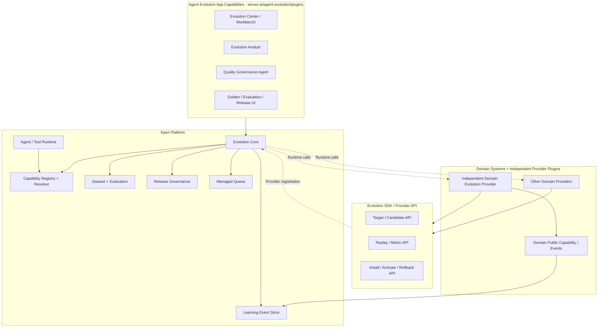
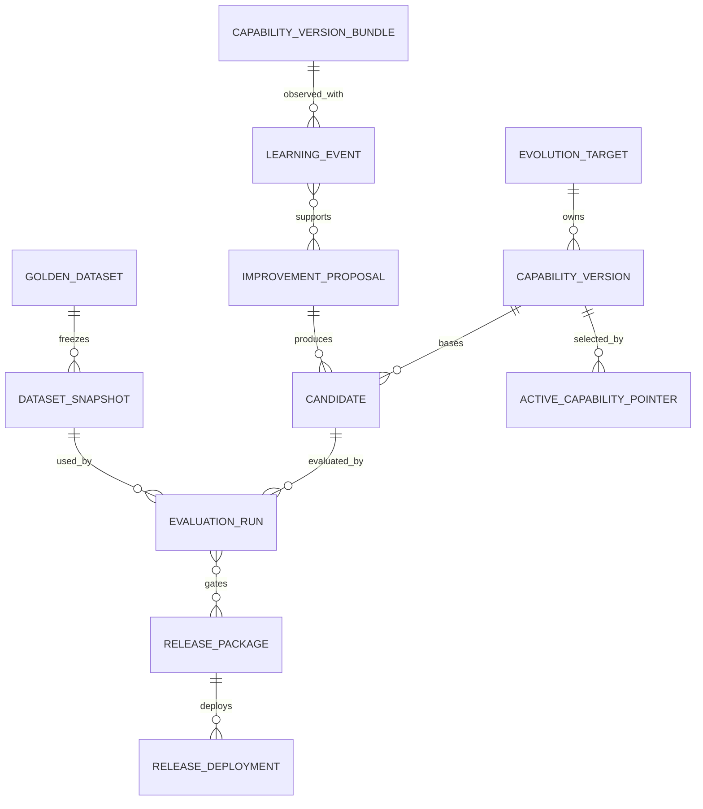
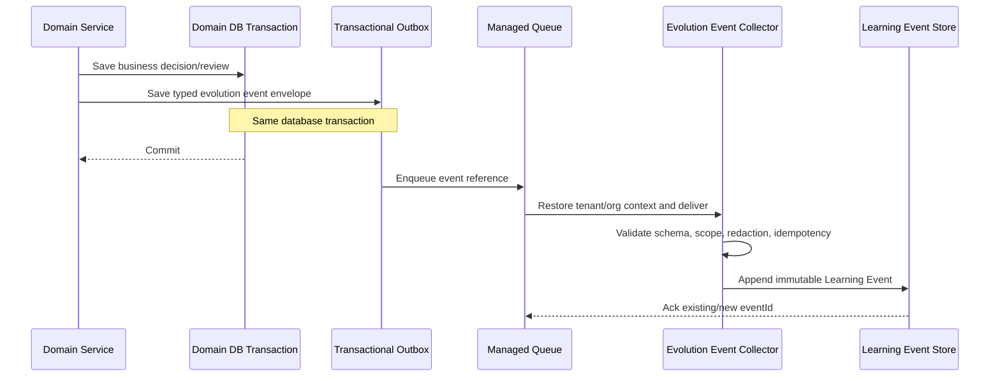

# Agent Evolution Framework 实施规划与架构基线

> 文档状态：架构基线，待评审后实施
>
> 版本：V1.3
>
> 日期：2026-08-13
>
> 适用范围：Xpert Platform、`@xpert-ai/plugin-sdk`、Agent Evolution App 能力与领域 Provider 插件
>
> 领域示例：BOM（仅用于说明 Provider 接入方式，不属于本文交付范围）

> **面向实施与编程 Agent 的范围声明：**本文出现的 BOM、`bom-lifecycle`、Feature Binding、Normalization、PBOM Matching 和示例包名都只是领域接入示例，不是 Platform Core、Evolution SDK、Agent Evolution App 或 E1-E5 路线的默认实施任务。除非另一个任务明确授权，不得因此创建或修改 BOM 仓库/包、在 Core 中加入 BOM 类型、把 BOM 指标写入通用 Gate，或把 BOM Provider 作为平台启动依赖。

## 0. 决策摘要

Agent Evolution 的最终架构固定为：

```text
Xpert Platform 内建 Evolution Core
  + Evolution SDK / Provider API
  + packages/server-ai/src/agent-evolution/plugins 应用能力
  + 独立领域插件 Evolution Provider
```

其中：

- Xpert Platform 持有跨领域统一的事件、版本、候选、评测、审批、发布、灰度、回滚、权限和审计控制面；
- Evolution SDK 提供稳定的 Provider、Target、Candidate、Replay、Metric 和 Release 契约；
- Agent Evolution App 参考 Knowledge Workbench 的模块内组织方式，直接实现在 `packages/server-ai/src/agent-evolution/plugins`，只提供 Service、Middleware、View Provider 和 Remote Component；
- 任意领域系统可以保留自身事实与公开 Capability/Event 契约，并通过独立领域 Provider 插件实现 Candidate、Replay、Metric 和 Release 适配；BOM 仅作为本文示例；
- Evolution Core、App 能力和独立领域 Provider 仍保持单向依赖与数据边界，物理同仓不等于职责合并。

本文后续统一使用 **Agent Evolution App 能力** 表示这组模块内能力。它不是 `XpertPlugin`，不声明 built-in plugin identity、plugin metadata、level、安装 scope 或插件生命周期。

本方案最重要的两条硬原则是：

1. **Evolution Agent 不得直接修改生产 Prompt、规则、代码或业务表。**
2. **Candidate 只有经过可重复评测和治理发布后，才可以作为下一 Production Capability Version 被激活。**

“审批后的 Candidate 变成下一版本能力”不是把 Candidate 内容写回生产表，而是：

```text
Candidate Artifact
  -> Golden Replay 通过
  -> Approve for Promotion
  -> Release Package
  -> Install Immutable Version
  -> Shadow
  -> Canary
  -> 原子切换 Active Pointer
  -> Production Capability Version
```

审批只是允许 Candidate 进入发布流程，不等于已经修改生产环境。

## 1. 文档目的与适用关系

本文是后续拆任务、设计数据库、定义 API、实现 Provider 和验收发布链路的技术基线，重点冻结：

- 平台 Core、App 能力、领域系统和独立 Provider 插件的职责边界；
- 核心领域模型、状态机与不可变约束；
- Candidate、Production、Shadow、Canary 的隔离方式；
- Capability Version 的解析、固定、激活和回滚机制；
- Learning Event、Transactional Outbox 和 Managed Queue 的可靠事件链路；
- 领域 Provider 的示例接入方式，以及与具体领域无关的 E1-E5 实施顺序。

相关现有文档：

- [Managed Queue 托管队列](../guides/managed-queue.mdx)：复用平台托管队列、租户上下文恢复、重试和取消契约；
- [插件](../guides/plugin.mdx)：复用插件 scope、Provider 解析顺序和 SDK 版本约束；
- `solutions/manufacturing/bom-lifecycle/docs/架构/Agent自主进化.md`：提供一个领域如何使用 Framework 的背景示例，不是本文实施依赖；
- `solutions/manufacturing/bom-lifecycle/docs/DOMAIN_MODEL.md`：提供领域聚合、Learning Event 触发点和 Outbox 的示例，不是 Platform Core 的模型来源。

若任何领域文档把通用 Candidate Registry、Golden Dataset、Release Governance 或 Canary Controller 归入领域插件，以本文的平台边界为准；具体领域指标、Artifact 语义和业务门禁仍由相应领域文档定义，但不得反向进入 Platform Core。

## 2. 为什么 Agent Evolution 属于 Xpert Platform 通用能力

### 2.1 它治理的是 Agent Runtime，而不是单个业务功能

一次 Agent Execution 的真实行为由多个能力版本共同决定：

```text
model = m6
prompt = v23
skill = v14
toolContract = v9
domainMappingPolicy = v13
domainNormalizationPolicy = v5
domainMatchingPolicy = v8
ontology = v21
```

只有 Runtime 能在执行开始时解析并固定这组版本，也只有平台能把相同版本闭包传播到子图、Tool、后台 Job、Trace 和 Learning Event。若 Evolution 完全位于领域插件，Runtime 将不得不反向理解各类业务领域版本，最终形成跨插件耦合。

### 2.2 Candidate、评测和发布治理具有跨领域同构性

例如 Feature Binding、OCR Routing、SQL Generation Policy 和 Retrieval Policy 的业务含义不同，但都需要同一组控制能力：

- 不可变 Candidate Artifact；
- Baseline/Candidate 对照回放；
- Golden Dataset Snapshot；
- 指标切片和阻断门禁；
- 风险分级与职责分离审批；
- Shadow、Canary、扩量、暂停和回滚；
- 版本注册、Active Pointer 和审计。

这些对象若由每个插件重复实现，会产生不一致的状态机、审批语义、回滚可靠性和安全边界。

### 2.3 平台已经拥有所需的公共基础设施

Evolution 需要复用平台现有的：

- Tenant/Organization Request Context；
- RBAC、审计和系统管理员边界；
- Managed Queue 与多 Pod Worker；
- Agent Execution、Trace、Tool Runtime；
- Plugin Provider Registry 与 scope 解析；
- Knowledgebase、Workspace、Artifact 和后台任务能力。

将通用 Core 放在 Platform 可以避免插件自建队列、权限、审计和运行时版本解析。

### 2.4 Evolution Core 必须与 App 能力模块解耦

Agent Evolution App 能力虽然与 Core 同在 `packages/server-ai/src/agent-evolution`，但 Core 的领域与应用服务不能依赖 Workbench、Middleware、View Provider 或 Remote Component。即使 App Providers 未注册或相关 UI 被关闭，Platform 仍应能够：

- 接收 Learning Event；
- 解析 Production Capability Version；
- 注册领域 Provider；
- 构建和评测 Candidate；
- 执行最小审批、发布和回滚 API；
- 保证生产与实验隔离。

`AgentEvolutionModule` 作为 composition root 可以注册 `AgentEvolutionProviders`；反向依赖只能止于模块装配层。高级 Workbench、Agent middleware tools、复杂分析和企业治理体验属于 App 能力，但安全内核不能因这些表面能力被禁用而消失。

## 3. 目标、非目标与强制不变量

### 3.1 目标

- 将生产反馈转为不可变、可归因、可脱敏的 Learning Event；
- 将重复问题转为有证据、有范围、有风险等级的 Improvement Proposal；
- 将 Proposal 构造成可运行、可哈希、可回放的 Candidate；
- 在相同 Dataset Snapshot 上对比 Baseline 与 Candidate；
- 通过审批、Shadow、Canary、监控和回滚发布新能力版本；
- 让任意执行都能回答“使用了哪些能力版本”；
- 让任意发布都能回答“为什么变、谁批准、影响什么、如何回退”。

### 3.2 非目标

- 首期不做基础模型在线训练或在线权重更新；
- 不让 Agent 自行提交或部署代码；
- 不让历史 Experience 覆盖当前项目 Requirement 或领域硬规则；
- 不替代领域主数据审批，例如物料、PBOM、价格或安全参数审批；
- 不用线上用户结果作为不可控实验场；
- 不让 Agent Evolution App 能力变成领域 Provider 必须依赖的“伪平台内核”。

### 3.3 强制不变量

| 不变量                    | 系统要求                                                              |
| ------------------------- | --------------------------------------------------------------------- |
| Production 只读已激活版本 | 普通生产执行不能传入 Candidate ID 或任意版本覆盖                      |
| Artifact 不可变           | 内容变化必须创建新版本和新 hash，禁止原地覆盖                         |
| 执行版本固定              | 一次 Execution 开始后不得因 Active Pointer 更新而漂移                 |
| 评测对照一致              | Baseline 与 Candidate 使用同一 Dataset Snapshot、Evaluator 和运行约束 |
| 审批不等于激活            | Approval 只产生发布授权，激活必须由 Release 流程执行                  |
| Core 不依赖领域插件       | Core 只能通过 SDK 契约解析 Provider                                   |
| Agent 不是审批人          | Agent 的建议不能满足要求人工角色的审批策略                            |
| 回滚目标先验存在          | Canary/Production 激活前必须验证上一稳定版本可解析                    |
| 缺失即阻断                | 缺少版本闭包、评测证据、权限或监控时 fail closed                      |

## 4. 最终总体架构

### 4.1 四层结构



### 4.2 编译期依赖方向

```text
@xpert-ai/contracts
        ↑                         ↑
        │                         │
Evolution Core          @xpert-ai/plugin-sdk/evolution
        ↑                         ↑
        │                         │
Agent Evolution App      Independent Domain Provider Plugins
Capabilities                       │
(same server-ai module)            └─> Domain Public Capability Contracts
```

约束：

- `@xpert-ai/contracts` 定义跨进程 DTO、枚举和可序列化契约；
- Evolution Core 依赖 contracts 与平台基础设施；
- Evolution SDK 依赖 contracts，向插件暴露 token、接口和注册辅助能力；
- Agent Evolution App 能力直接依赖 Core 的 application commands/queries，并复用平台 Middleware/View Extension 契约；
- `AgentEvolutionModule` 可以从 `./plugins` 导入 Providers 完成装配，但 `domain/application/capability-registry/evaluation/release` 不得依赖 App 的 Middleware、View Provider 或 Remote Component；
- 独立领域 Provider 插件依赖 Evolution SDK 和对应领域公开 Capability 契约；
- Evolution Core 不得 import 任何具体领域系统、领域 Provider 或领域类型；
- 领域系统不依赖对应 Evolution Provider，只负责正常业务能力和事务内事件生产；
- 领域 Provider 通过注册表被 Core 发现，运行时调用方向不改变编译期依赖倒置。

### 4.3 平台控制面与领域数据面的关系

```text
Evolution Core 决定：何时、由谁、基于什么证据、以什么范围发布
Domain Provider 决定：该能力是什么、如何构造、如何执行、如何安装
Capability Resolver 决定：本次执行最终使用哪个不可变版本
```

Core 不解析任何具体领域规则或 Artifact 内容；Provider 不绕过 Core 自行把 Candidate 激活为 Production。

## 5. 职责边界

### 5.1 Xpert Platform / Evolution Core

Platform Core 负责：

- `LearningEvent` 接收、去重、不可变存储和来源可信等级；
- `EvolutionTarget` 注册、Provider 发现和健康检查；
- `CapabilityVersion`、`CapabilityVersionBundle`、Artifact hash 和依赖闭包；
- `ActiveCapabilityPointer`、Capability Resolver 和 Execution 版本固定；
- Candidate Registry、状态机和 Production 隔离；
- Golden Dataset、Snapshot、Evaluation Run、指标和 Gate；
- Approval Policy、Release Package、Deployment、Shadow/Canary 编排；
- 原子激活、暂停、扩量、回滚和 Supersede；
- Tenant/Organization 隔离、权限、审计、数据保留和脱敏策略；
- Managed Queue Job 编排、幂等、超时、重试、取消和可观测性；
- 供 UI、Agent tools 和自动化调用的稳定应用服务/API。

Platform Core 不负责：

- 理解 Feature Binding、PBOM、OCR、SQL 等具体策略的业务语义；
- 复制领域匹配公式、归一化规则或领域状态机；
- 直接修改领域生产业务表；
- 提供所有高级分析 UI 和商业化体验。

### 5.2 Agent Evolution App 能力

Agent Evolution App 能力位于 `packages/server-ai/src/agent-evolution/plugins`，由 Service、Middleware、View Provider 和 Remote Component 组成，负责：

- Evolution Center 与跨 Target 总览；
- Learning Event 浏览、错误聚类和 Proposal Studio；
- Golden Dataset Workbench 与标注/准入协作；
- Baseline/Candidate 对比报告、切片和回归解释；
- 审批、Shadow、Canary、Release 和 Rollback 操作界面；
- 通过 Middleware 向 Evolution Orchestrator、Evolution Analyst、Quality Governance Agent 提供受控 tools；
- 只通过 Platform application commands/queries 执行的 Agent middleware tools；
- 高级告警、运营报表和企业治理体验。

它不得：

- 自建另一套 Candidate、Evaluation 或 Release 真相源；
- 直接访问领域插件表完成发布；
- 让 Agent tool 绕过 Platform 权限和状态机；
- 让 Core domain/application 依赖其 UI、Middleware 或模板；
- 成为独立领域 Provider 插件的编译期依赖。

### 5.3 领域系统

领域系统负责：

- 产生带领域上下文和证据引用的标准 Learning Event Outbox 消息；
- 暴露稳定、受租户/组织约束的领域 Application Capability 和事件契约；
- 提供按显式 versionId 执行领域生产逻辑的能力；
- 在领域服务内部继续执行业务状态机、主数据权限和不可逆动作门禁；
- 保存领域事实、Trace、证据和领域版本，不感知 Proposal、Candidate 或 Release UI；
- 在人工审核和业务决定事务中写 Outbox，保证事件不丢失。

领域系统不得：

- 依赖某个 Evolution Provider 插件才能完成正常生产执行；
- 接受 Provider 绕过领域服务直接修改私有表；
- 为评测暴露不受业务规则约束的“简化写接口”；
- 自行把未经 Core 治理的 Candidate 指向 Production。

### 5.4 独立领域 Evolution Provider 插件

独立 Provider 插件负责：

- 通过 Evolution SDK 注册 `EvolutionTargetProvider`；
- 定义 Candidate Artifact Schema、兼容性和领域校验；
- 通过领域公开 Capability 构造 Candidate，不复制生产逻辑；
- 在指定版本下运行 Replay，并返回标准化结果和领域指标；
- 安装 Artifact、预热缓存、验证激活和执行回滚适配；
- 只通过领域公开 Capability 执行操作，使领域业务状态机、主数据权限和不可逆动作门禁继续生效；
- 记录 Provider 版本、领域数据版本和可复现 Trace。

独立 Provider 插件不得：

- 直接 import 领域系统私有源码、Entity、Repository 或数据库表；
- 自行把未经 Core 治理的 Candidate 指向 Production；
- 让 Agent Evolution App 能力直接写任何领域策略或业务表；
- 为了评测通过而建立与生产实现不同的“简化算法”；
- 把领域主数据变更伪装成普通低风险策略发布。

### 5.5 边界矩阵

| 能力                              | Platform Core |      App 能力 |               领域系统 |  独立领域 Provider |
| --------------------------------- | ------------: | ------------: | ---------------------: | -----------------: |
| Learning Event 标准与真相源       |          主责 |     查看/分析 |         事务内产生事件 |       消费领域事件 |
| Candidate 状态机与 Registry       |          主责 |     操作/展示 |                 不持有 |      构造 Artifact |
| Artifact 领域语义                 |        不理解 |        不理解 |       提供业务语义契约 |               主责 |
| Golden Dataset/Snapshot           |          主责 |     Workbench |     提供证据和业务结果 | 提供领域 Case 适配 |
| Replay 调度和对照公平性           |          主责 |     发起/解释 |       提供只读执行能力 |    执行领域 Replay |
| Metric Gate                       |  主责策略引擎 |     展示/建议 |       定义业务验收约束 |   提供领域指标定义 |
| 审批和职责分离                    |          主责 |          交互 | 提供 Domain Owner 要求 |  提供风险 metadata |
| Shadow/Canary 路由                |          主责 |     监控/操作 |    按固定 version 执行 |       适配指定版本 |
| Active Pointer                    |    唯一真相源 | 只读/受控命令 |       不持有第二真相源 |   不持有第二真相源 |
| Install/Activate/Rollback Adapter |          编排 |        不实现 |    提供公开 Capability |               实现 |
| 生产业务表                        |      不直接写 |        禁止写 |   仅领域服务按状态机写 |           禁止直写 |

## 6. 核心领域模型

### 6.1 模型关系



### 6.2 `EvolutionTarget`

描述一种可进化能力，而不是某个具体版本。

关键字段：

- `targetId`：稳定 ID，例如 `example.feature_mapping`；示例 ID 不得进入生产实现；
- `targetType`：显式类型判别，不从名称猜测；
- `providerKey/providerVersion`：Provider 注册和兼容版本；
- `artifactSchemaVersion`：Artifact 契约版本；
- `supportedScopes`：允许的 tenant/org/workspace/product/customer 范围；
- `riskPolicyId`：默认风险和审批策略；
- `metricSetId`：默认评测指标集；
- `capabilities`：是否支持 replay/shadow/canary/install/rollback；
- `status`：`active/disabled/provider_unavailable`。

Target 只由具有相应 scope 的有效 Provider 注册；Provider 卸载后 Target 及历史版本保留，但新构建和发布必须 fail closed。

### 6.3 `CapabilityVersion` 与 `CapabilityVersionBundle`

`CapabilityVersion` 是单一 Target 的不可变、可执行版本：

```text
versionId
targetId
semanticVersion / sequence
artifactRef
artifactHash
artifactSchemaVersion
providerKey + providerVersion
dependencyVersionIds
sourceCandidateId
createdAt + createdBy
```

`CapabilityVersionBundle` 是一次 Execution 的版本闭包：

```text
bundleId
bundleHash
modelVersion
promptVersion
skillVersion
toolContractVersion
pluginVersions
ocrProviderVersion
featureBindingVersion
normalizationVersion
ontologyVersion
matchingPolicyVersion
retrievalPolicyVersion
experienceIndexRevision
releasePackageId
```

Bundle 必须是规范化排序后计算 hash 的不可变快照。缺少 Target 要求的关键版本时，该执行可以继续按降级策略服务用户，但相关事件不得自动成为 Golden 或发布依据。

### 6.4 `LearningEvent`

Learning Event 是某次预测、决策、人工纠正或业务结果的不可变事实。

关键字段组：

| 字段组 | 内容                                                       |
| ------ | ---------------------------------------------------------- |
| 身份   | `eventId/eventType/schemaVersion/eventTime/idempotencyKey` |
| 范围   | `tenantId/organizationId/scopeKey/workspaceId/projectId`   |
| 执行   | `executionId/threadId/toolCallId/traceId`                  |
| Target | `targetId/decisionPoint/subjectRef`                        |
| 输入   | `inputFingerprint/sourceRefs/domainRefs`                   |
| 预测   | `predictionRef/candidates/confidence/reasonCodes`          |
| 人工   | `reviewAction/finalOutcomeRef/reasonCode/reviewerRole`     |
| 结果   | `businessOutcome/severity/rework/cost/latency`             |
| 版本   | `capabilityVersionBundleId/bundleHash`                     |
| 安全   | `classification/redactionStatus/retentionPolicy`           |

原始文件、长文本、凭证和完整模型输出不直接复制到事件中，使用受权限保护的稳定引用和内容指纹。

### 6.5 `ImprovementProposal`

Proposal 表达“为什么改、建议改什么、影响哪里”，不是可运行版本。

关键内容：

- problem statement、root cause 和 change hypothesis；
- event/cluster/evidence 引用；
- baseline version 和 baseline metrics；
- target scope、affected workflows 和 failure modes；
- required Golden Dataset、metrics、blocking slices；
- risk level、approval policy 和 rollback target；
- Proposal revision 与审计记录。

同一个 Proposal 每次内容变化增加 revision；Candidate 必须指向准确 Proposal revision。

### 6.6 `Candidate`

Candidate 是 `Base Capability Version + Proposed Change` 构建出的不可变、可执行 Artifact。

关键字段：

```text
candidateId
targetId
baseVersionId
proposalId + proposalRevision
artifactRef + artifactHash
artifactSchemaVersion
providerKey + providerVersion
dependencyVersionIds
targetScope
buildInputsHash
status
createdBy + createdAt
```

Candidate 内容一旦 `ready` 不得修改。修改 Proposal、范围、Provider、依赖或 Artifact 都必须创建新 Candidate。

### 6.7 `GoldenDataset` 与 `DatasetSnapshot`

`GoldenDataset` 定义长期数据集、准入政策、切片和 Owner；`DatasetSnapshot` 冻结一次评测实际使用的 Case revisions、源文件 hash、expected outcome、Evaluator 和 Metric Definition 版本。

Golden Case 必须：

- 有可访问的 Source Evidence；
- 有明确标准答案或明确的正确拒答；
- 达到要求的审核可信等级；
- 已完成敏感数据处理；
- 可在固定依赖下复现；
- 不与 Candidate 生成样本发生不允许的数据泄漏。

### 6.8 `EvaluationRun`

Evaluation Run 固定以下对照关系：

```text
baselineBundle
candidateBundle
datasetSnapshotId
evaluatorVersion
metricDefinitionVersion
runtimeConstraints
randomSeed / repeatPolicy
```

输出包括 case result、slice metrics、regression、成本、延迟、Gate 结论、阻断原因和报告 Artifact。非确定性模型必须按策略重复运行并记录均值、方差和最差结果。

### 6.9 `ReleasePackage`

Release Package 是经过评测、准备部署的一组兼容能力版本，不等同于 Candidate。

关键字段：

- source Candidate IDs 和目标 Capability Version IDs；
- dependency DAG、Artifact hashes 和 Provider versions；
- current Production Bundle 和 rollback Bundle；
- Evaluation Run IDs、门禁摘要和已知回归；
- 批准的 scope、Shadow 时长、Canary 比例和扩量步骤；
- stop/rollback/success criteria；
- required roles、Approval Decisions 和职责分离结果；
- deployment IDs、状态和审计。

依赖有环、Artifact hash 变化、Provider 不兼容、评测过期或 rollback target 不可解析时禁止打包。

### 6.10 辅助模型

| 模型                                | 作用                                                   |
| ----------------------------------- | ------------------------------------------------------ |
| `ErrorDiagnosis/ErrorCluster`       | 归因与重复问题聚类，不修改原 Learning Event            |
| `ApprovalDecision`                  | 记录角色、决定、理由、时间和所审批的精确 revision/hash |
| `ReleaseDeployment`                 | 表示一次 Shadow/Canary/Production 范围部署             |
| `ActiveCapabilityPointer`           | 某显式 scope 当前生效的不可变版本指针                  |
| `EvaluationCaseResult/MetricResult` | 保存样本级结果和切片指标                               |
| `OnlineObservation`                 | 按 Deployment 与时间窗聚合线上指标                     |
| `ExperienceCase`                    | E5 中经批准后可进入生产检索的经验案例                  |

## 7. Candidate 到 Production 的完整生命周期

### 7.1 跨实体生命周期

Candidate 本身不会被原地改写成 Production。完整生命周期跨越 Candidate、Evaluation Run、Release Package、Deployment 和 Active Pointer：

```mermaid
flowchart LR
    EVENTS["Learning Events"] --> DIAG["Diagnosis / Cluster"]
    DIAG --> PROPOSAL["Improvement Proposal"]
    PROPOSAL --> BUILD["Build Candidate"]
    BUILD --> CANDIDATE["Immutable Candidate"]
    CANDIDATE --> REPLAY["Golden Replay"]
    REPLAY --> GATE{"Evaluation Gate"}
    GATE -->|"Fail"| REVISE["Revise Proposal"]
    GATE -->|"Pass"| APPROVAL["Approve for Promotion"]
    APPROVAL --> PACKAGE["Release Package"]
    PACKAGE --> INSTALL["Install Immutable Version"]
    INSTALL --> SHADOW["Shadow"]
    SHADOW --> SHADOW_GATE{"Shadow Gate"}
    SHADOW_GATE -->|"Fail"| PAUSE["Pause"]
    SHADOW_GATE -->|"Pass"| CANARY["Canary"]
    CANARY --> ONLINE_GATE{"Online Gate"}
    ONLINE_GATE -->|"Fail"| ROLLBACK["Rollback Pointer"]
    ONLINE_GATE -->|"Pass"| ACTIVATE["Activate Production Pointer"]
    ACTIVATE --> MONITOR["Monitor / Supersede"]
```



### 7.2 阶段定义

1. **Generate**：Analyst 或人工根据 Proposal 请求 Provider 构建 Candidate。
2. **Validate**：Core 校验 Target、scope、依赖、Schema、Provider 兼容性和 Artifact hash。
3. **Golden Replay**：Baseline 和 Candidate 在同一 Snapshot 上执行，不访问未授权生产写接口。
4. **Gate**：按总体指标、关键切片、严重错误、成本和延迟判定。
5. **Approve for Promotion**：审批精确 Candidate hash、评测报告和发布范围；内容变化使审批失效。
6. **Package**：把 Candidate 固化为 Release Package 和待安装 Capability Version。
7. **Install**：Provider 验证并安装不可变 Artifact，但不改变 Production Active Pointer。
8. **Shadow**：复制真实输入给 Candidate，只计算比较结果，不改变用户响应或业务状态。
9. **Canary**：仅对审批后的确定性 scope 真实生效，持续产生 Release Observation。
10. **Production**：门禁通过后，Core 以 compare-and-swap 原子更新 Active Pointer。
11. **Rollback/Supersede**：异常时切回上一稳定版本；后续版本激活时旧版本标记 superseded 但不删除。

### 7.3 状态机分离

Candidate 状态建议：

```text
building
  -> ready
  -> evaluating
  -> evaluation_failed | pending_approval
  -> approved | rejected
  -> packaged | expired
```

Release Package/Deployment 状态建议：

```text
draft
  -> validating
  -> pending_approval
  -> approved
  -> installed
  -> shadow
  -> canary
  -> active
  -> superseded

任一线上阶段 -> paused | rolled_back
```

禁止用一个不断变异的 `Candidate.status=production` 代替 Release、Deployment 和 Active Pointer；这些对象的审计语义不同。

## 8. Immutable Version + Active Pointer

### 8.1 数据机制

每种能力保存多个不可变版本：

```text
example.feature_mapping
  v10  sha256:...
  v11  sha256:...
  v12  sha256:...  <- previous stable
  v13  sha256:...  <- installed candidate artifact

ActiveCapabilityPointer
  targetId = example.feature_mapping
  scope = organization:org-1 + domainSegment:segment-a
  channel = production
  activeVersionId = v12
  revision = 27
```

安装 v13 不改变指针。正式激活只执行小而明确的原子变更：

```text
expected pointer revision = 27
expected active version = v12
new active version = v13
new pointer revision = 28
rollback version = v12
release package = R-13
```

若 revision 或当前版本不匹配，说明期间发生了其他发布，当前激活失败并重新评估，禁止最后写入者静默覆盖。

### 8.2 指针约束

- Active Pointer 是 Platform Core 的唯一权威真相源；
- scope 使用显式类型字段，不从名称、显示文本或 payload 组合猜测；
- Provider 可以维护按 versionId 的缓存或物化数据，但不能维护第二套权威 active alias；
- 指针更新、审计记录和 Release Deployment 状态必须在同一平台事务中提交；
- Provider 如需预热或外部准备，先幂等完成并返回 receipt，再由 Core 切换指针；
- 知识库投影等最终一致性副作用通过 Outbox 完成，失败时停止扩量或回滚；
- 旧版本在保留期内不得删除，且删除前必须证明无 Active/Canary/Rollback/Execution 引用。

### 8.3 Canary 与 scope

Canary 不通过随机的每次请求选择版本，而应对稳定 subject key 做确定性分桶，并记录 `ReleaseDeploymentId`。允许的 scope 必须是审批范围的子集，例如：

- tenant/organization/workspace；
- customer/project；
- product family/model；
- document type/language/template；
- Feature Key/risk level；
- 固定百分比分桶。

请求输入不能扩大已审批 scope。跨 scope 不存在 Candidate fallback；解析失败时 fail closed 或回到明确批准的 Production 版本。

## 9. Capability Registry、Resolver 与 Execution 版本闭包

### 9.1 Registry

Capability Registry 保存：

- Target descriptor 与 Provider health；
- Capability Version metadata、Artifact ref/hash 和依赖；
- Active/Canary/Shadow Pointer；
- Provider compatibility；
- Release、rollback 和 supersede 关系；
- 按 scope 的解析策略和审计。

Registry 不保存领域 Artifact 的可变副本，也不解释 Artifact 内容。

### 9.2 Resolver

生产执行开始时调用：

```ts
const bundle = await capabilityResolver.resolveExecutionBundle({
  tenantId,
  organizationId,
  scopeKey,
  workspaceId,
  xpertId,
  executionMode: 'production',
  subject
})
```

解析结果包含每个 Target 的精确 `versionId/artifactHash/providerVersion` 和整体 `bundleHash`。Resolver 规则：

1. 根据显式 Request Context 和 Provider scope 解析有效 Target；
2. 根据 `executionMode` 决定是否允许 Production、Shadow、Canary 或 Replay channel；
3. 校验版本依赖、Provider 健康和 Artifact 可访问性；
4. 生成不可变 Bundle 并固定到 Execution；
5. 后续子图、Tool、后台 Job 和 Trace 只继承固定 Bundle，不再次跟随 Active Pointer。

普通生产 API 不接受任意 `candidateId` 或 `versionId` 覆盖。只有带专用权限、Evaluation Run/Deployment 绑定和审计的 `replay/shadow/canary` 上下文可以解析非 Production 版本。

### 9.3 Execution 版本闭包

- Execution 创建时保存 `capabilityVersionBundleId/bundleHash`；
- 所有子执行和 Tool Call 继承父闭包，除非创建一个新的、显式的比较 Execution；
- Managed Queue Payload 只携带 `executionId/bundleId` 等稳定引用，Worker 重新加载同一闭包；
- Learning Event 必须引用实际执行闭包，而不是事件写入时的当前 Active Pointer；
- Retry/Replay 默认复用原闭包；若比较新版本，必须创建新的 Evaluation Run；
- 指针在运行中更新不影响已开始 Execution，只影响后续新 Execution。

这保证线上问题可以按原版本组合复现，也避免长任务执行到一半发生策略漂移。

## 10. Evolution SDK / Provider API

### 10.1 设计原则

- 契约放在 `@xpert-ai/contracts`，注册 token 和宿主适配放在 `@xpert-ai/plugin-sdk`；
- 输入输出只使用稳定 ID、版本、ArtifactRef 和明确 DTO，不传数据库实体；
- 大文件、完整文档和批量结果使用受控 Artifact 引用；
- 所有写命令包含 tenant/org/scope、actor、idempotencyKey 和 expected revision；
- Provider 方法必须幂等、可超时、可重试并返回稳定 failure code；
- Core 负责通用状态机和 Gate，Provider 负责领域语义；
- Provider 不获得绕过 Core 改写 Active Pointer 的能力。

### 10.2 建议拆分接口

```ts
interface EvolutionTargetProvider {
  readonly descriptor: EvolutionTargetDescriptor
  readonly candidateBuilder?: EvolutionCandidateBuilder
  readonly replayEvaluator?: EvolutionReplayEvaluator
  readonly releaseProvider?: EvolutionReleaseProvider
}

interface EvolutionCandidateBuilder {
  buildCandidate(request: BuildCandidateRequest): Promise<CandidateBuildResult>
  validateCandidate(request: ValidateCandidateRequest): Promise<CandidateValidationResult>
}

interface EvolutionReplayEvaluator {
  prepareReplay(request: PrepareReplayRequest): Promise<ReplayPlan>
  runReplayCase(request: RunReplayCaseRequest): Promise<ReplayCaseResult>
  evaluateResult(request: EvaluateReplayResultRequest): Promise<MetricObservation[]>
}

interface EvolutionReleaseProvider {
  install(request: InstallCapabilityVersionRequest): Promise<InstallReceipt>
  activate(request: ActivateCapabilityVersionRequest): Promise<ActivationReceipt>
  rollback(request: RollbackCapabilityVersionRequest): Promise<RollbackReceipt>
}
```

`activate()` 和 `rollback()` 的 Provider 语义是验证版本、准备/切换领域缓存或外部资源并返回 receipt；Platform Core 仍是 Active Pointer 的唯一提交者。若 Provider 无外部副作用，这两个方法只做兼容性验证和预热。

### 10.3 Candidate 构造契约

`BuildCandidateRequest` 至少包含：

- target、scope 和 Proposal revision；
- base Capability Version 和依赖闭包；
- change set reference 与证据引用；
- artifact schema/provider versions；
- actor、idempotency key 和构建约束。

`CandidateBuildResult` 至少返回：

- immutable artifact ref/hash；
- normalized manifest；
- dependency version IDs；
- validation summary、warnings 和 provider trace；
- build inputs hash。

相同输入和 Provider version 应返回相同 Candidate 或同内容 hash。Provider 不得在构建时读取未冻结的“最新配置”而不记录其版本。

### 10.4 Replay/Evaluation 契约

Core 为每个 Case 同时下发：

- Dataset Snapshot 和 Case revision；
- Baseline Bundle 与 Candidate Bundle；
- 相同的 Source/Requirement/Domain 引用；
- 固定 runtime constraints、seed、timeout 和 repeat index；
- `executionMode='replay'` 和只读/隔离写策略。

Provider 返回领域结果和标准化 Metric Observation。Core 聚合总体/切片指标、判断 Gate 并保存 Evaluation Run。Provider 不自行宣告 Release 通过。

评测写操作只能进入临时或 evaluation namespace；不得产生正式领域业务对象，例如 Requirement、PBOM 选择或报价。

### 10.5 Install/Activate/Rollback 契约

- `install`：校验 hash、Schema、依赖和 Provider 兼容性，写入按 versionId 隔离的 Artifact/物化数据；重复安装相同 hash 返回同一 receipt；
- `activate`：验证已安装、预热缓存、检查外部依赖并返回可提交 receipt；不得修改 Core Active Pointer；
- Core CAS：校验 pointer revision 后原子切换，并写 Release/Audit；
- `rollback`：确认旧版本可用、清理或切换领域缓存并返回 receipt；Core 原子把 pointer 切回 rollbackVersion；
- 任一步失败都保存阶段和 failure code，不能留下无法识别的半激活状态；
- 外部系统副作用采用 Saga/Outbox 补偿，不假设跨数据库分布式事务。

## 11. Learning Event + Transactional Outbox + Managed Queue

### 11.1 事件链路



### 11.2 为什么必须使用 Outbox

业务审核和 Learning Event 通知若分别提交，会出现：

- 业务已成功但学习事件丢失；
- 事件已发出但业务事务回滚；
- API 重试形成重复样本；
- 服务崩溃后无法判断是否需要补发。

领域业务状态与标准 Outbox Envelope 必须在同一事务保存。Managed Queue 是投递和执行基础设施，不是事务日志，也不是 Learning Event 真相源。

### 11.3 Outbox Envelope

Envelope 建议只包含：

- schema/event type 和 idempotency key；
- tenantId、organizationId、scopeKey；
- source aggregate ID/revision；
- execution/tool/trace/bundle references；
- typed before/after/result 摘要或受控 Artifact ref；
- classification、retention 和 redaction policy；
- occurredAt 和 producer/provider version。

禁止包含 credential、bearer token、完整文件 buffer、临时路径或无限长模型输出。

### 11.4 投递语义

- 采用 at-least-once 投递，Collector 依靠幂等键去重；
- Outbox 记录只有收到持久化确认后才标记 published；
- scope 或 Schema 校验失败属于永久错误，进入隔离/告警，不通过重试扩大权限；
- 临时数据库、模型或网络错误按 Managed Queue 策略重试；
- Job Payload 携带稳定引用，Worker 恢复 Request Context 后重新读取数据；
- Learning Event 落库后再异步触发 attribution、clustering、proposal candidate 等后续 Job；
- 投影延迟产生 `projection_lag` 指标，但不回滚已完成的人工业务审核。

### 11.5 建议逻辑队列

| Queue/Job                          | 幂等粒度                                |
| ---------------------------------- | --------------------------------------- |
| `evolution.events/ingest`          | producerEventId + schemaVersion         |
| `evolution.analysis/attribute`     | eventId + classifierVersion             |
| `evolution.analysis/cluster`       | scope + window + algorithmVersion       |
| `evolution.candidate/build`        | proposalId + revision + providerVersion |
| `evolution.evaluation/replay-case` | runId + caseRevision + repeatIndex      |
| `evolution.evaluation/aggregate`   | runId + metricDefinitionVersion         |
| `evolution.release/shadow-rollup`  | deploymentId + timeBucket               |
| `evolution.release/canary-rollup`  | deploymentId + timeBucket               |
| `evolution.experience/project`     | experienceCaseId + revision             |

## 12. Candidate 与 Production 强隔离

| 隔离面        | 强制措施                                                          |
| ------------- | ----------------------------------------------------------------- |
| 存储          | Candidate 使用独立 namespace/version key，禁止覆盖生产 Artifact   |
| Registry      | Candidate 和 Production Version 使用不同状态与 channel            |
| Resolver      | `production` 模式拒绝 Candidate 引用和未批准版本                  |
| 权限          | build/evaluate/approve/release/rollback 使用独立权限动作          |
| 执行          | Replay 使用只读或临时业务写空间；Shadow 不提交业务结果            |
| 缓存          | cache key 必须包含 targetId/versionId/scopeKey                    |
| Knowledgebase | Candidate 投影使用不可生产绑定，不进入 Production retrieval       |
| 队列          | Job 必须绑定 Evaluation Run 或 Deployment，不能只给任意 versionId |
| UI            | 始终同时显示环境、Baseline、Candidate hash 和影响 scope           |
| 审计          | 所有跨 channel 动作记录 actor、理由、来源 revision 和前后版本     |

额外约束：

- Candidate 不得持有比来源证据更大的数据访问范围；
- Candidate Artifact 中的 Prompt、规则和配置视为不可信输入，必须做 Schema、大小、引用和危险能力校验；
- 被拒绝、过期或 stale Candidate 保留审计，但不能被 Production Resolver 解析；
- Evaluation 期间发现领域代码需要变化时，转为正常代码变更和软件发布，不允许 Candidate 携带可执行补丁绕过代码评审。

## 13. Agent 角色与工具边界

### 13.1 Evolution Orchestrator

职责：

- 根据状态机选择下一合法步骤；
- 委派 Attribution、Candidate Build、Evaluation 和 Governance 任务；
- 追踪 Managed Queue Job，处理超时和恢复；
- 汇总面向用户的状态、阻断原因和下一动作。

限制：

- 不自行解释领域 Artifact；
- 不替代审批人；
- 不直接调用生产表写接口；
- 只调用 Core 暴露的受控 application commands。

### 13.2 Evolution Analyst

职责：

- 阅读脱敏 Learning Event、Trace 和业务结果；
- 生成/修正 Diagnosis 和 Error Cluster；
- 建议 Target、scope、change hypothesis 和风险；
- 创建 Proposal Draft 并请求 Provider 构建 Candidate；
- 解释证据覆盖和已知局限。

限制：

- 不把推断写成领域事实；
- 不修改 Golden expected outcome；
- 不审批或发布 Candidate；
- 不扩大原事件的 tenant/org/project 权限。

### 13.3 Quality Governance Agent

职责：

- 发起 Golden Replay，检查 Dataset、Evaluator 和版本闭包；
- 汇总总体、切片、严重错误、延迟和成本变化；
- 产生 `promote/hold/reject` 建议和解释；
- 在审批后监控 Shadow/Canary；
- 达到预授权停止条件时暂停或执行预授权回滚。

限制：

- 建议不是 Approval Decision；
- 不能修改 Gate 使当前 Candidate 通过；
- 不能跳过阻断切片；
- 自动回滚只能切回 Release Package 已批准的 rollbackVersion。

### 13.4 建议工具分组

```text
observe/read:
  list_learning_events
  get_event_trace
  get_capability_bundle

analyze/propose:
  create_diagnosis
  create_or_update_proposal
  request_candidate_build

evaluate:
  start_evaluation
  get_evaluation_job
  get_evaluation_report

govern:
  request_promotion_approval
  create_release_package
  start_shadow
  start_canary
  pause_deployment
  request_or_execute_authorized_rollback
```

Tools 只是 Platform 应用服务的严格适配层，Workbench 和 Agents 必须共用同一服务与权限检查。

## 14. BOM 接入示例（非本文交付范围）

本章只演示一个领域如何消费 Platform Framework，不规定首个实施领域，也不授权创建、修改或接入任何 BOM 代码。编程 Agent 实施 Platform Core、SDK、App 能力或 E1-E5 时应跳过本章中的具体包名、Target 和指标；只有任务明确要求 BOM 接入时，才将本章作为设计输入。

假设后续选择 BOM 作为某次独立领域项目，可以采用两个部署边界：

```text
bom-lifecycle
  -> 生产领域服务、公开 Capability/Event 契约、事务内 Outbox

@xpert-ai/plugin-bom-evolution-provider
  -> EvolutionTargetProvider、Candidate、Replay、Metric、Release Adapter
```

此示例中的 Provider 插件可以独立安装、升级和停用。未安装 Provider 时，领域正常生产能力与 Learning Event 生产仍然可用；只有对应 Target 的 Candidate 构建、回放和发布能力标记为 `provider_unavailable`。

### 14.1 示例 Target 映射

| Target ID                  | Provider                          | 示例行为                                                          |                风险 |
| -------------------------- | --------------------------------- | ----------------------------------------------------------------- | ------------------: |
| `bom.feature_binding`      | `FeatureBindingEvolutionProvider` | 从重复 miss/override 构造有范围的 Binding Candidate，回放字段映射 |                  R2 |
| `bom.normalization_policy` | `NormalizationEvolutionProvider`  | 构造单位、枚举、格式和容差 Candidate，回放标准值                  | R2；关键字段可升 R3 |
| `bom.pbom_matching_policy` | `PbomMatchingEvolutionProvider`   | 构造召回、资格、排序和正确拒答策略 Candidate，回放 PBOM 选择      |               R2/R3 |
| `bom.ocr_routing_policy`   | `OcrRoutingLearningEventAdapter`  | 仅采集路由、OCR、版面和失败事件，不生成/发布 Candidate            |            暂不发布 |

在此示例中，Feature Binding、Normalization 和 PBOM Matching 应分别注册显式 Target，不用字符串名称猜测 Artifact 类型。它们可以在同一个 Release Package 中形成依赖 DAG，但各自保留独立版本和指标。这些 Target ID 不是 Framework 的预置枚举。

### 14.2 示例 Event 来源

- Requirement/Fact 人工接受、拒绝和覆盖；
- Feature Binding miss、错误绑定和作用域错误；
- 单位、枚举、格式归一化前后差异；
- PBOM match run、候选排序、无合格候选、改选和最终锁定；
- 技术 BOM 后续返工或严重校验错误；
- OCR provider、文档路由、页面质量和证据覆盖结果；
- 相关 Execution 的完整 Capability Version Bundle。

人工审核写业务决定时，由 `bom-lifecycle` 在同一事务写出标准 Evolution Outbox Envelope，而不是等待独立 Provider 插件补采。Provider 通过公开事件和 Capability 契约工作；不得复制 BOM 匹配、Requirement 或技术 BOM 状态机。

### 14.3 示例 Golden Replay 指标

Feature Binding/Normalization：

- 字段 Precision/Recall/F1；
- Binding 覆盖率与错误绑定率；
- 值、单位和枚举准确率；
- 作用域错误率；
- 关键字段严重错误数；
- 正确转人工率。

PBOM Matching：

- Eligible Candidate Recall；
- Top-1/Top-K 命中；
- 严重误匹配数；
- 正确拒答率和强制错误匹配率；
- 人工改选率；
- 定制/新物料正确分流率；
- P95 延迟和检索成本。

### 14.4 示例领域项目边界

- 若后续任务单独授权 BOM 试点，可以选择 Feature Binding/Normalization 和 PBOM Matching 验证 Candidate + Golden Replay；
- OCR Routing 只补齐事件 Schema、版本闭包和质量切片，暂不自动形成 Candidate；
- Feature/PBOM 主数据、正式 PBOM 结构、新物料身份和价格不属于普通 Candidate 发布；
- BOM Provider 安装的是策略/绑定的不可变版本，不修改已经锁定的 Case、Requirement、PBOM Selection 或 Technical BOM；
- 新版本只影响激活后创建的新 Execution；历史业务对象保持原版本闭包。

以上边界只约束未来可能的 BOM 领域接入，不是 E1-E5 Platform 路线的退出条件。

## 15. E1-E5 分阶段路线

### E1：Learning Event -> 归因 -> Proposal -> Golden Replay

Platform 交付：

- Evolution contracts、核心实体和基础 API；
- Learning Event Store、Outbox ingest、幂等与脱敏；
- Capability Registry/Resolver 和 Execution Bundle；
- Target Registry 与 Provider SDK；
- Candidate Registry、Golden Dataset/Snapshot、Evaluation Run；
- Attribution/Proposal/Replay Managed Queue jobs；
- 最小权限、审计和 Evaluation Gate。

SDK Conformance Fixture 交付：

- 仅供测试的确定性 Domain Capability 和两个示例 Target；
- 标准 Outbox、按 versionId 执行和只读/隔离 Replay fixture；
- Candidate Build、Metric 和 Install/Activate/Rollback contract tests；
- 不注册生产 Target，不包含任何真实业务领域类型。

退出条件：Conformance Fixture 的 Baseline/Candidate 能基于相同 Snapshot 做可重复对照，所有 SDK contract tests 通过，Candidate 完全不影响生产。任何真实领域接入另行立项。

### E2：Shadow

- 建立 Shadow Deployment 和 `executionMode='shadow'`；
- 复制符合批准 scope 的真实输入给 Candidate；
- Shadow 结果只写 Online Observation，不回写用户响应和业务对象；
- 提供 Baseline/Candidate 差异、覆盖率、延迟和成本看板；
- Provider 故障不影响 Production 主链，Shadow 自动熔断。

退出条件：持续窗口内完成真实流量比较，证明零生产副作用，并能关联 Release/Candidate/Bundle。

### E3：Canary

- 引入确定性分桶和明确 Canary scope；
- 对批准范围内新 Execution 使用 Candidate Version；
- 实现在线 Gate、自动停止、人工暂停和最小回滚能力；
- 记录业务审核、改选、错误和成本的版本归因；
- 禁止输入动态扩大灰度范围。

退出条件：一个经单独批准的低风险 Pilot Target 完成小范围 Canary，并在演练中成功切回上一版本。Pilot 领域由后续实施决策指定，本文不默认选择 BOM 或其他领域。

> E3 进入真实生产流量前必须具备最小审批、审计、Active Pointer CAS 和回滚安全骨架。E4 将其产品化为完整、通用的 Release/Rollback 控制面，而不是到 E4 才首次具备安全回退。

### E4：Release / Rollback

- 完整 Release Package、依赖 DAG 和 Provider compatibility；
- 风险分级、多人审批、职责分离和审批过期；
- Install/Activate/Rollback 编排与幂等 receipt；
- Shadow -> Canary -> Expanding -> Active 自动/人工步骤；
- Pointer CAS、supersede、版本保留和回滚演练；
- 发布 SLO、告警、Runbook 和 Break-glass 审计。

退出条件：任意已注册 Target 可复用统一发布管线，且能证明无半激活状态、可观察、可回退。

### E5：Experience KB

- 从 L2-L4 可信 Learning Event 和已验证结果生成 Experience Case Candidate；
- 建立 Candidate Store 与 Approved Experience KB 强隔离；
- 增加适用范围、失效条件、版本兼容和脱敏审批；
- 生产检索先做结构化范围过滤，再做 Vector/Graph/Hybrid 召回；
- Experience 只提供历史经验，不覆盖当前 Requirement 或 Domain 硬规则；
- 反例、版本失效和线上回归触发降权、暂停或退役。

退出条件：批准 Experience 能安全提升候选解释或处理效率，且未批准经验无法进入 Production retrieval。

## 16. 安全与治理

### 16.1 权限动作

至少拆分：

```text
evolution.event.read
evolution.diagnosis.manage
evolution.proposal.manage
evolution.candidate.build
evolution.dataset.manage
evolution.evaluation.run
evolution.approval.decide
evolution.release.package
evolution.deployment.shadow
evolution.deployment.canary
evolution.deployment.activate
evolution.deployment.pause
evolution.deployment.rollback
evolution.audit.read
```

Proposal 创建者不能单独批准 R3/R4；Golden 标注者不能单独修改 Evaluator 并批准当前 Candidate；Agent 身份不计为人工审批角色；发布管理员不能绕过 Approval Policy。

### 16.2 Tenant/Organization 隔离

- 所有持久化实体包含 `tenantId/organizationId` 和必要的 `scopeKey`；
- 唯一约束、查询、队列、cache、Artifact、Provider 和反向引用均包含 scope；
- Provider 解析遵循平台现有 `organization -> tenant-global -> system-global -> builtin-global` 顺序，但 Artifact 和数据权限仍以请求 tenant/org 为硬边界；
- system-level UI/Provider 的可见性不代表可以跨租户读取事件或数据；
- Golden Dataset 的共享范围不得大于其任一 Source Case 的合法范围，跨组织共享必须生成脱敏派生 Snapshot；
- 跨租户命中是严重安全事件，立即停止 Deployment 并触发审计。

### 16.3 数据脱敏与保留

- Learning Event 默认保存指纹、结构化差异和受控引用，不复制正文；
- 客户名、合同号、价格、人员、地址和业务标识按 classification 策略脱敏；
- 外部模型评测继承源数据 `dataPolicy`；
- Debug/Queue 日志不得记录 Artifact 内容、Prompt 全文、凭证或原始文件；
- Candidate、Golden、Evaluation 和 Experience 分别定义 retention；
- 删除源数据时保留必要审计 hash，但失效不可再访问的 Case 并阻断后续评测。

### 16.4 Artifact 安全

- Artifact 使用内容寻址 hash、Schema version、大小限制和允许的引用类型；
- 可执行代码、脚本和动态模块不作为普通 Candidate Artifact；
- Prompt/规则文本按不可信内容处理，不能把其中指令提升为平台权限；
- Install 前验证 Provider version、依赖闭包、签名/来源和兼容性；
- Artifact Store、Candidate KB 和 Production Registry 使用不同访问策略。

### 16.5 评测门禁

发布门槛使用版本化策略表达，至少要求：

```text
目标指标达到最低提升
AND 关键字段 Precision 不下降
AND 严重错误数 = 0
AND 正确拒答率不下降
AND 阻断切片无回归
AND 样本覆盖达到要求
AND P95 延迟和成本未超过上限
AND Provider/Artifact/Bundle 可复现
```

总体指标不能掩盖高风险切片；LLM-as-Judge 只能作为补充，关键字段、资格门禁和严重错误使用确定性验证或人工审定标准。

### 16.6 审计

必须记录：

- 事件来源、版本闭包和去重结果；
- Proposal/Candidate 的每个 revision/hash；
- Golden Case 的准入、修改和 Snapshot；
- Evaluation 输入、原始结果 hash、Gate 和异常；
- 审批人、角色、决定、理由和所批准精确内容；
- Install/Activate/Rollback receipt；
- Active Pointer 前值、后值、revision 和 Release；
- Break-glass 原因、有效期和后续复核。

## 17. 建议代码包与模块划分

### 17.1 Xpert 主仓首期布局

首期优先在现有包中建立清晰 bounded context，避免一开始增加过多独立发布包：

```text
packages/contracts/src/ai/evolution/
  target.ts
  capability-version.ts
  learning-event.ts
  candidate.ts
  dataset.ts
  evaluation.ts
  release.ts
  provider.ts

packages/plugin-sdk/src/lib/evolution/
  tokens.ts
  provider-registry.ts
  provider-types.ts
  decorators.ts
  index.ts

packages/server-ai/src/agent-evolution/
  domain/
    models/
    policies/
    state-machines/
  entities/
  application/
    commands/
    queries/
    services/
  capability-registry/
  providers/
  evaluation/
  release/
  outbox/
  jobs/
  controllers/
  guards/
  audit/
  plugins/
    index.ts
    agent-evolution/
  agent-evolution.module.ts
```

当边界稳定且需要独立版本/复用时，再评审拆为 `@xpert-ai/agent-evolution-core`、`@xpert-ai/agent-evaluation`、`@xpert-ai/capability-registry`；首期不要让物理包拆分先于领域边界验证。

### 17.2 Agent Evolution App 能力

Agent Evolution App 参考 `packages/server-ai/src/knowledgebase/plugins/knowledge-workbench` 的目录与 Provider 聚合方式，直接作为 `AgentEvolutionModule` 内部的 plugin capabilities 实现：

```text
packages/server-ai/src/agent-evolution/plugins/
  index.ts
  agent-evolution/
    constants.ts
    index.ts
    schemas.ts
    agent-evolution-app.service.ts
    agent-evolution.middleware.ts
    agent-evolution-view.provider.ts
    remote-components/
      agent-evolution/
        src/
          main.tsx
          components/
          i18n/
        build.mjs
        app.js
        app.css
    *.spec.ts
```

能力注册方式与 Knowledge Workbench 保持一致：

- `constants.ts` 只定义稳定的 Provider key、View key、Remote Entry key 和 host event key；
- `index.ts` 导出 `AgentEvolutionProviders`，只聚合 App Service、Middleware 和 View Provider；
- `AgentEvolutionModule` 在 providers 中展开 `...AgentEvolutionProviders`；
- View Provider 通过平台 View Extension 契约提供 Evolution Center；
- Middleware 只把 Core application commands/queries 暴露为 Agent middleware tools；
- Remote Component 源码和生成资产与这些能力同目录，并通过可重复构建和测试防止漂移。

这组能力不是 built-in plugin，也不是可安装的 `XpertPlugin`：不定义 plugin identity、plugin metadata、level、artifactNamespace、安装 scope 或插件生命周期。它直接复用 Core application services，但不得直接访问 Core Entity Repository，也不得把 UI/Middleware 逻辑放入 Core domain/application。

### 17.3 独立领域 Provider 插件示例

领域接入项目可以将 Provider 实现为与领域系统分离的插件包。以下是占位结构，不是本规划要求创建的路径：

```text
<domain-plugin-repository>/<domain>-evolution-provider/
  package.json
  src/
    constants.ts
    plugin.ts
    providers/
      <target>-evolution.provider.ts
    candidates/
    replay/
    metrics/
    release/
    fixtures/
```

具体领域插件应使用稳定 `artifactNamespace=<domain>_evolution`，并将 `@xpert-ai/plugin-sdk` 声明为 peer dependency。其编译期只依赖 Evolution SDK 和该领域的公共契约，运行时通过 Capability token 调用领域 application services；不得 import 领域私有源码、Entity/Repository，也不得复制领域算法或业务状态机。

事务内 Learning Event Outbox Adapter 仍属于领域系统，因为它必须与业务决定同事务；不要把该 Adapter 移入独立 Provider 插件。

若后续任务选择 BOM，上述占位符可以映射为 `domain=bom`、`@xpert-ai/plugin-bom-evolution-provider` 和 `bom_evolution`；该映射只是命名示例，当前任务不得据此创建包或修改 BOM 代码。

### 17.4 数据库与命名建议

- 平台表统一使用稳定 `agent_evolution_*` 前缀；
- 领域 Artifact 表/对象由 Provider namespace 管理，例如 `<domain>_evolution_*` 或 Artifact Store key；
- `targetId/providerKey/jobName/permission` 使用稳定机器标识，不使用本地化展示名；
- JSON/JSONB 字段必须有共享契约、Schema version 和边界解析器；能结构化索引的 scope、status、version、hash、revision 不放进无约束 JSON；
- 所有 TypeORM union/alias/object/array 字段显式声明列类型，遵循仓库实体约束。

## 18. 后续实施顺序

### 18.1 基础契约优先

1. 冻结 Target ID、scope discriminator、状态枚举、reason codes 和权限动作；
2. 在 contracts 定义 DTO，在 plugin-sdk 定义 Provider token/注册；
3. 建立 Core module、实体、迁移、审计和租户/组织查询约束；
4. 用契约测试证明 Core 不 import 任何具体领域类型，且 Core domain/application 不依赖 `./plugins`。

### 18.2 先完成版本可解释性

5. 实现 Capability Registry、不可变 Version、Active Pointer 和 CAS；
6. 把 Resolver 接入 Agent Execution 创建点，固定 Version Bundle；
7. 将 Bundle 传播到子图、Tools、Managed Queue 和 Trace；
8. 增加 Production 模式拒绝 Candidate 的安全测试。

### 18.3 再建立学习链路

9. 定义标准 Outbox Envelope 和 Collector；
10. 使用领域无关的事务 fixture 验证业务状态与 Outbox 同成同败；
11. 实现 Managed Queue ingest、去重、脱敏、失败隔离和投影延迟指标；
12. 回填只做显式、可审计迁移，不从历史显示文本猜测事件类型。

### 18.4 打通 E1 垂直切片

13. 实现仅供测试的 SDK Conformance Provider 和两个领域无关 Target fixture；
14. 使用 fixture 建立 Golden Dataset、Snapshot、Candidate Build 和 Replay；
15. 使用确定性指标验证总体门槛、阻断切片和正确拒答语义；
16. 验证事件型 Target 可以只采集 Learning Event 而不开放 Candidate/Release；
17. 在 `packages/server-ai/src/agent-evolution/plugins/agent-evolution` 实现最小 Evolution Center/Agent tools，并按 `AgentEvolutionProviders` 注册 Service、Middleware 和 View Provider。

### 18.5 按风险逐步上线

18. E2 实现 Shadow，只观察不影响用户；
19. 完成 Canary 最小安全骨架和回滚演练后进入 E3；
20. E4 通用化 Release Package、职责分离、扩量和运维 Runbook；
21. E5 才允许 Approved Experience 进入生产检索；
22. Framework 验证稳定后，由独立任务选择和接入真实 Domain Provider；不得在本路线中默认指定 BOM、OCR、ChatBI 或其他领域。

## 19. 测试与验收基线

### 19.1 契约与单元测试

- Provider descriptor、Artifact Schema 和 SDK compatibility；
- `AgentEvolutionProviders` 注册、View key、Remote Entry key 和 Remote Asset 路径；
- Candidate hash、Bundle hash 和依赖 DAG；
- 状态机非法转换、审批失效和 risk routing；
- Pointer CAS 冲突、幂等 install 和重复 rollback；
- scope discriminator、Provider fallback 和跨租户拒绝。

### 19.2 集成测试

- 业务事务与 Outbox 同成同败；
- at-least-once 重复投递只生成一个 Learning Event；
- Worker 恢复正确 tenant/org/user context；
- Production Resolver 不能解析 Candidate；
- Replay/Shadow 不产生生产业务写入；
- Execution 固定 Bundle 后，指针变更不影响运行中任务；
- Provider 缺失、版本不兼容、Artifact hash 不符时 fail closed；
- Active Pointer、Release 状态和审计不存在半提交。

### 19.3 Conformance 与领域评测

- Conformance Target 的确定性 Baseline/Candidate 结果；
- 总体指标、阻断切片、严重错误和正确拒答语义；
- scope、版本、Provider 不可用和依赖不兼容场景；
- 真实领域接入时，由对应领域项目补充领域指标和分布外切片；
- 非确定执行的重复性、方差和最差结果。

### 19.4 安全与发布演练

- 跨 tenant/org/workspace/project 读取和发布均被拒绝；
- Agent 无法伪造人工 Approval Decision；
- 输入无法扩大 Canary scope；
- 监控缺失、严重错误、Provider 故障会停止扩量；
- v13 激活后能原子切回 v12；
- 回滚不删除 v13 产生的事件和审计，相关业务对象进入复核；
- Break-glass 有时限、理由和后续复核记录。

### 19.5 首期完成定义

E1-E4 技术基线完成至少满足：

1. 每个关键执行有可查询的 Capability Version Bundle；
2. Learning Event 不可变、幂等、可脱敏、可追溯；
3. 至少两个领域无关的 Conformance Target 能生成隔离 Candidate；
4. Production/Candidate 能在同一 Dataset Snapshot 上公平回放；
5. 阻断切片和严重错误不能被总体指标掩盖；
6. Approval 精确绑定 Candidate hash、报告和 scope；
7. Candidate 不直接修改 Prompt、规则、代码或业务表；
8. Shadow 零生产副作用；
9. Canary 只能命中批准范围；
10. Install 不改变 Production Pointer；
11. Activate 使用 CAS 且不存在静默覆盖；
12. Rollback 目标预先验证并完成演练；
13. Core 不依赖任何具体领域代码，Core domain/application 不依赖 App 能力的 Middleware/View；
14. Workbench 和 Agent tools 共用同一应用服务与权限；
15. 审计能完整回答变更原因、证据、审批、影响和回退路径。

## 20. 需要在 E1 开工前冻结的参数

以下是实现参数，不改变本文架构决策，但必须在 E1 设计评审中给出明确默认值：

- Capability scope 的精确结构与继承优先级；
- Artifact Store 的物理实现、大小限制和保留期；
- Active Pointer 与现有 Xpert/Plugin scope 的映射；
- Approval Policy 与现有权限/审批能力的集成方式；
- Learning Event reason codes、可信等级和数据保留周期；
- Conformance Dataset 的样本、阻断切片和指标阈值；真实领域参数由独立接入项目确定；
- 非确定模型的 repeat 次数、seed 和成本上限；
- Shadow/Canary 的最小样本量、观察窗口和自动停止阈值；
- Provider health、超时、重试和熔断默认值；
- 回滚后由新版本创建的业务对象进入复核的统一标记方式。

在这些参数未冻结前，可以实现 contracts、Registry、Outbox 和隔离骨架，但不得宣称具备可上线的自动进化能力。
