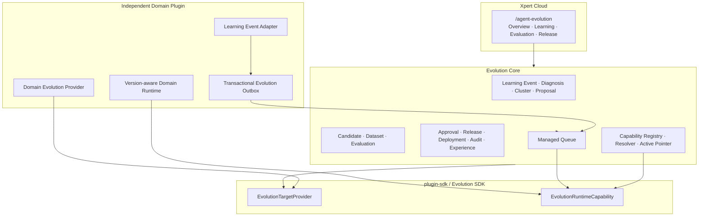
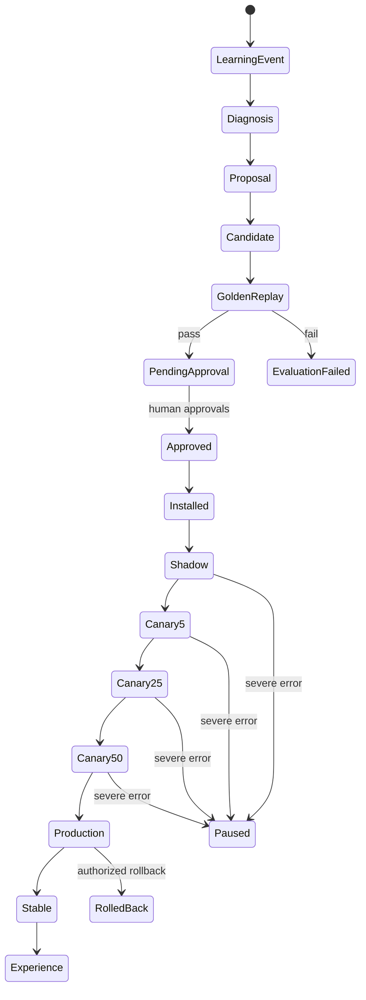

# Agent Evolution Framework 实施基线

> 文档状态：已落地的架构与后续演进基线
> 版本：V2.0
> 更新日期：2026-08-14
> 适用范围：Xpert Platform、`@xpert-ai/contracts`、`@xpert-ai/plugin-sdk`、Xpert Cloud 与领域 Evolution Provider

## 0. 最终决策

Agent Evolution 是 Xpert Platform 的通用治理与运行时能力，最终结构为：

```text
Xpert Platform
├── Evolution Core                         通用控制面、治理与运行时
├── plugin-sdk / Evolution Provider API    领域插件接入协议
├── Xpert Cloud /agent-evolution           唯一管理界面
└── Managed Queue                          评测、安装与部署异步任务
                    ▲
                    │ Evolution Provider
                    │
              Independent Domain Plugins
```

原生 Cloud 已提供 `/agent-evolution` 一级菜单，以及 Overview、Learning、Evaluation、Release 四个 Tab。旧的 `packages/server-ai/src/agent-evolution/plugins/agent-evolution` App、Middleware、View Provider、Workbench View 与 Remote Component 已废弃并删除，后续不得恢复或扩展。

领域 Provider 可以随领域插件独立交付。本文提到 BOM 只用于说明一种已经验证的接入方式；BOM 类型、指标、Artifact Schema 与发布限制不得进入 Platform Core，也不得成为其他领域接入的默认模板。

两条不可突破的原则：

1. Evolution Agent 不直接修改生产 Prompt、规则、代码或业务表。
2. Candidate 只有经过 Golden Replay、治理审批和受控发布后，才可以成为新的不可变 Production Capability Version。

审批不等于上线：

```text
Candidate
→ Golden Replay
→ 人工审批
→ Release Package
→ Install Immutable Version
→ Shadow
→ Canary 5% → 25% → 50%
→ CAS 切换 Active Pointer
→ Production
```

## 1. 为什么属于 Platform 通用能力

Agent 的一次生产执行不是由单一 Prompt 决定，而是由一组版本闭包共同决定：

```text
model + prompt + skill + tool contract
+ routing policy + extraction policy + domain policy + ontology
```

只有平台 Runtime 能在执行开始时解析并固定这组版本，并把相同闭包传播到子图、Tool、后台 Job、Trace 和 Learning Event。Candidate Registry、Golden Dataset、审批、Shadow/Canary、Active Pointer、权限、队列和审计也具有跨领域同构性；若每个插件各自实现，会产生不兼容的状态机和不可验证的回滚语义。

因此：

- Platform 决定何时、由谁、基于什么证据、以什么范围发布；
- Provider 决定能力 Artifact 是什么、如何构造、如何回放、如何安装；
- Resolver 决定本次执行使用哪个不可变版本；
- 领域业务服务继续持有业务事实和业务权限。

## 2. 分层、职责与依赖方向

### 2.1 分层



### 2.2 Platform Core

负责：

- Learning Event 去重、脱敏校验、归因、聚类和 Proposal；
- Target/Provider Registry 与健康状态；
- 不可变 Capability Version、Bundle 与 Active Pointer；
- Candidate、Golden Dataset Snapshot、Evaluation Run 和通用门禁；
- 人工审批、Release Package、Shadow/Canary、暂停、激活、回滚和审计；
- Managed Queue Job、幂等重试与状态查询；
- Tenant/Organization 隔离、RBAC、职责分离与安全自动暂停；
- Experience 的稳定性门禁和只读分析用途。

Core 不解析具体领域 Artifact，不 import 领域类型，不修改领域业务表。

### 2.3 Xpert Cloud

`/agent-evolution` 是唯一管理界面：

- Overview：目标、事件、Candidate、评测、部署、指针和风险摘要；
- Learning：Learning Event、Diagnosis、Cluster、Proposal 和 Golden 标记；
- Evaluation：Dataset Snapshot、Replay、切片指标、回归和门禁；
- Release：审批、安装、Shadow、Canary、Production、暂停、回滚和 Experience；
- Target/Candidate/Evaluation/Deployment 详情使用子路由，四个主 Tab 不变。

Cloud 只调用 `/api/agent-evolution/*`，不依赖领域 Remote Component。Conformance Simulation 仅允许开发/测试环境显式启用，不参与生产流程。

### 2.4 plugin-sdk 与领域插件

`plugin-sdk` 只提供稳定契约、Provider 注册装饰器、运行时 Capability Token 和 Managed Queue 契约，不授予治理权限。

领域插件负责：

- 声明 Target 能力和首期限制；
- 导出当前不可变 Baseline Artifact；
- 从确切 `baseArtifact` 构建 Candidate；
- 执行同输入的 Baseline/Candidate Replay；
- 安装不可变版本，并在 Core 调用下执行 activate/rollback 适配；
- 在业务事务中写独立 Evolution Outbox；
- 执行开始时固定 Capability Bundle，并仅运行 Resolver 返回的版本。

依赖方向固定为：

```text
@xpert-ai/contracts
       ↑
@xpert-ai/plugin-sdk/evolution
       ↑
Independent Domain Plugin

Evolution Core → SDK interface → Provider
Evolution Core -X-> Domain implementation
Domain Plugin -X-> Cloud UI
```

## 3. 核心领域模型

| 模型                                | 作用与不可变性                                                                                |
| ----------------------------------- | --------------------------------------------------------------------------------------------- |
| `LearningEvent`                     | 脱敏后的生产反馈；包含 target、scope、bundle、执行、原因码和输入指纹                          |
| `EvolutionDiagnosis`                | 对一组事件的根因与 correction signature；不得改写原事件                                       |
| `EvolutionEventCluster`             | 按 target、decision point、reason code 聚类；满足证据门槛后可生成 Proposal                    |
| `EvolutionTarget`                   | Provider、Schema、风险等级、Scope 与 candidate/replay/shadow/canary/install/rollback 能力声明 |
| `CapabilityVersion`                 | Artifact hash、Provider 版本、依赖闭包和序号；发布后不可变                                    |
| `CapabilityVersionBundle`           | 一次执行所需的完整版本集合和 bundle hash                                                      |
| `ActiveCapabilityPointer`           | scope + channel 到 activeVersion 的原子指针，带 revision 与 rollbackVersion                   |
| `ImprovementProposal`               | 问题、根因、变更假设、证据事件、基线版本和风险等级                                            |
| `Candidate`                         | `baseVersion + structuredChangeSet` 生成的不可变可运行 Artifact                               |
| `GoldenDataset` / `DatasetSnapshot` | Dataset 可演进，Snapshot 冻结 case revision、evaluator 和 metric definition                   |
| `EvaluationRun`                     | Baseline/Candidate 对照结果、切片指标、严重错误和 Gate                                        |
| `ApprovalDecision`                  | Candidate hash、Evaluation、角色、理由和决定时间的不可变签名                                  |
| `ReleasePackage`                    | Candidate、目标版本、回滚版本、审批集与部署门槛的发布封装                                     |
| `ReleaseDeployment`                 | Shadow/Canary/Production 的确定性分配与运行观测                                               |
| `EvolutionExperience`               | 生产稳定后生成，只供后续分析/Proposal 检索，不直接参与运行时决策                              |

## 4. Immutable Version + Active Pointer

Artifact 内容变化必须产生新 hash、新 Candidate 和新 Capability Version。禁止：

- 覆盖已有 Artifact；
- 修改已批准 Candidate；
- 把 Candidate 写入生产业务表；
- 让生产请求传任意 Candidate ID 覆盖 Resolver；
- 删除历史版本以“实现回滚”。

生产切换使用 Compare-And-Set：

```text
expected pointer revision = 7
expected active version    = v12
new active version         = v13
rollback version           = v12

CAS success → revision 8
CAS conflict → 发布失败并重新评审，不覆盖他人变更
```

回滚同样只修改指针。旧版本、Candidate、评测、审批和历史执行引用均保留。

## 5. Capability Resolver 与执行版本闭包

领域执行开始时调用：

```ts
interface EvolutionRuntimeApi {
  ingestLearningEvent(input): Promise<LearningEvent>
  resolveExecutionPlan(request): Promise<CapabilityExecutionPlan>
  getCapabilityBundle(input): Promise<CapabilityVersionBundle>
  getCapabilityVersion(input): Promise<CapabilityVersion>
  recordRuntimeObservation(input): Promise<EvolutionRuntimeObservation>
}
```

Resolver 对每个 Target：

1. 读取当前 scope 的 Production Pointer；
2. 查找有效 Shadow/Canary/Production Deployment；
3. 以 `SHA256(deploymentId + subjectKey)` 做确定性 Canary 分流；
4. 生成 Production Bundle 和可选 Shadow Bundle；
5. 把 Bundle 固定到 Execution Context；
6. 执行中不再重新解析 Active Pointer。

结果保证同一执行不混用版本，历史可完整回放，回滚只影响新请求。

## 6. Evolution Provider API

稳定接口位于 `@xpert-ai/contracts`，注册与运行时 Token 位于 `@xpert-ai/plugin-sdk`：

```ts
interface EvolutionTargetProvider {
  readonly descriptor: EvolutionTargetDescriptor
  readonly baselineExporter?: EvolutionBaselineExporter
  readonly candidateBuilder?: EvolutionCandidateBuilder
  readonly replayEvaluator?: EvolutionReplayEvaluator
  readonly releaseProvider?: EvolutionReleaseProvider
}

interface EvolutionCandidateBuilder {
  buildCandidate(request: {
    context: EvolutionProviderContext
    baseVersionId: string
    baseArtifact: EvolutionArtifactRef
    changeSet: Record<string, string | number | boolean | string[]>
    evidenceEventIds: string[]
  }): Promise<CandidateBuildResult>
  validateCandidate(request): Promise<CandidateValidationResult>
}

interface EvolutionReleaseProvider {
  install(request): Promise<ReleaseProviderReceipt>
  activate(request): Promise<ReleaseProviderReceipt>
  rollback(request): Promise<ReleaseProviderReceipt>
}
```

Provider Context 统一携带 tenant、organization、target、scope、correlation、execution 和 actor。Artifact Ref 必须包含 URI、SHA-256、Schema Version 和 media type。

`approve`、`packageRelease`、`activateProduction`、`expandCanary` 不属于 Provider API。Provider 不能修改 Active Pointer。

## 7. Learning Event、Outbox 与 Managed Queue

领域反馈链路必须与业务写入同事务：

```text
业务事务
├── 保存业务结果/人工决定
└── 写入领域专用 EvolutionOutbox
             ↓
      Outbox Dispatcher
             ↓
        Managed Queue
             ↓
   Evolution Outbox Consumer
             ↓
 EvolutionRuntimeCapability.ingestLearningEvent
             ↓
 LearningEvent → Diagnosis → Cluster → Proposal
```

要求：

- 不复用命令幂等 Receipt Outbox；
- 队列 Payload 只带 outboxId，不带客户正文或附件；
- Outbox 采用确定性 jobId、至少一次投递和事件 idempotencyKey；
- Consumer 恢复 tenant/org/scope 后调用受限 Runtime Capability；
- 机密事件必须在写入前 redacted；
- 真实客户名、合同正文、附件内容和密钥不得进入 Learning Event；
- 归因、评测、安装、Shadow、Canary 和回滚长任务均使用 Managed Queue。

## 8. Candidate 与 Production 强隔离

隔离同时发生在四层：

| 层     | 约束                                                                    |
| ------ | ----------------------------------------------------------------------- |
| 存储   | Candidate Artifact 进入独立版本存储，不写生产业务表                     |
| 权限   | Agent/Provider 无 approve、activate、expand 权限                        |
| 运行时 | Production 只接受 Resolver 生成的 Bundle，不接受任意 Candidate override |
| 发布   | Install 只创建不可变版本；只有 Core 通过 CAS 修改 Active Pointer        |

Shadow 同时执行 Candidate，但不得改变返回值、业务副作用或生产表。Candidate 调整必须构建新 Candidate，不能原地修改后复用旧审批。

## 9. 生命周期与门禁



默认门禁：

- Proposal：90 天内至少 3 个 L2+ 事件，覆盖至少 2 个业务主体；
- Golden：至少 50 cases、20 affected、10 high-risk；严重错误新增数为 0；总体关键指标不退化且 Candidate 必须改善；
- 审批：R1/R2 至少 2 个不同人工审批人，R3/R4 至少 3 个；Agent 不计入审批；
- Shadow：至少 3 天、100 个有效观测、严重错误为 0；
- Canary：只允许 5% → 25% → 50%，每档至少 24 小时、30 个观测、严重错误为 0，扩量必须人工确认；
- Production：50% Canary 门禁满足后由人工触发，Provider activate 成功后 CAS 切换；
- 安全：严重运行错误自动暂停 Shadow/Canary，新执行立即回到稳定 Production；
- Experience：Production 稳定至少 7 天、100 个有效观测且无严重错误。

## 10. 受控智能体/服务职责

- **Evolution Orchestrator**：由 Core Governance + Managed Queue 状态机承担，编排归因、Candidate、评测和部署；没有人工审批身份。
- **Evolution Analyst**：对脱敏事件生成 correction signature、Diagnosis 和 Cluster，并为 Proposal 提供可解释根因；不构建或发布生产版本。
- **Quality Governance Agent/Service**：审查切片、严重错误、数据泄漏、回归和风险，输出 Gate 与建议；不代替人工审批。

领域 Agent 只产生领域事件、执行固定版本并记录观测，不获得 Candidate 发布和指针切换工具。

## 11. 安全、权限、审计与隔离

- 所有表和 API 以 tenant 为第一隔离边界，organization/scope 作为第二边界；
- Provider 查询必须使用 Provider Context 的 tenant/org，禁止使用客户端自报 scope；
- View 使用 `EVOLUTION_VIEW`，变更使用 `EVOLUTION_MANAGE`，并叠加平台 Xpert 权限；
- Production 激活、Canary 扩量和审批只允许人工 actor；系统仅能自动暂停或执行明确授权的回滚；
- 审计记录 Candidate hash、Evaluation、审批人、Release、指针 revision、部署与回滚；
- Golden Dataset 不得跨租户混合；Snapshot 创建后不可变；
- Provider 必须校验 Artifact Schema、hash、Target 和依赖版本；
- Learning Event 使用摘要、类型、原因码和指纹，不保存原始客户正文；
- Conformance Simulation 在生产默认关闭。

## 12. 当前代码基线

| 能力                                   | 代码位置                                                |
| -------------------------------------- | ------------------------------------------------------- |
| contracts 模型                         | `packages/contracts/src/ai/evolution`                   |
| Provider Registry / Runtime Capability | `packages/plugin-sdk/src/lib/evolution`                 |
| Core 服务与状态机                      | `packages/server-ai/src/agent-evolution/application`    |
| Core 实体                              | `packages/server-ai/src/agent-evolution/entities`       |
| REST API                               | `packages/server-ai/src/agent-evolution/controllers`    |
| 原生 Cloud 页面                        | `apps/cloud/src/app/features/agent-evolution`           |
| 路由                                   | `apps/cloud/src/app/features/agent-evolution/routes.ts` |

已删除且不得恢复：

```text
packages/server-ai/src/agent-evolution/plugins/agent-evolution
```

领域参考实现可以位于其自身插件内，例如：

```text
domain-plugin/src/lib/evolution/
├── evolution.entities.ts
├── artifact.schemas.ts
├── artifact.service.ts
├── target.providers.ts
├── runtime.service.ts
├── event.service.ts
├── outbox.service.ts
└── outbox.processor.ts
```

该目录示例不是 Platform 包结构要求，也不表示 Core 需要认识某个领域。

## 13. E1-E5 路线与验收

### E1：Learning → Proposal → Golden Replay

- Target/Baseline 注册、独立 Outbox、事件去重和脱敏；
- Diagnosis/Cluster/Proposal；
- Candidate 从确切 baseArtifact 构建；
- Dataset Snapshot、Replay 和通用 Gate。

### E2：Shadow

- Resolver 返回独立 Shadow Bundle；
- Candidate 无副作用运行；
- Runtime Observation、3 天/100 样本门禁和安全自动暂停。

### E3：Canary

- 基于 deploymentId + subjectKey 的确定性分流；
- 5/25/50 人工扩量；
- 每档 24 小时/30 样本门禁和异常暂停。

### E4：Release / Rollback

- 多角色审批、Release Package、不可变 Install；
- Provider activate 后 CAS 指针切换；
- 历史版本保留和原子回滚。

### E5：Experience KB

- 7 天/100 Production 观测后生成 Experience；
- 仅供 Analyst 检索和后续 Proposal 参考；
- 不直接改变 Resolver、Production Artifact 或业务决策。

端到端验收必须证明：Agent 构建 Candidate 后，生产结果与 Active Pointer 均不变化；只有 Golden Replay 通过、人工审批、安装、Shadow、Canary 和 Production 激活全部完成后，新请求才解析到新的 Production Capability Version。

## 14. 后续实施顺序

1. 补充真实数据库迁移、API DTO 校验、i18n 和分页/过滤契约测试；
2. 增加 Provider Conformance Test Kit，覆盖 Artifact 不可变、基线一致、Replay 确定性和发布幂等；
3. 增加 Active Pointer 并发、Queue 重放、跨租户污染和恶意 Artifact 安全测试；
4. 把 Cloud 中尚存的示例文案全部迁入 i18n，并完善 Diagnosis/Cluster/Experience 详情；
5. 对每个领域 Provider 单独定义 Target 能力矩阵、Golden Schema、领域门禁和上线验收；
6. 发布包含 Evolution SDK 的新 `contracts` / `plugin-sdk` 版本后，再对外发布依赖该接口的领域插件。
