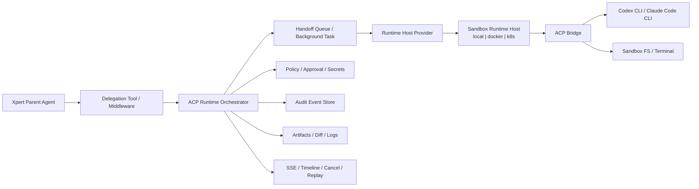
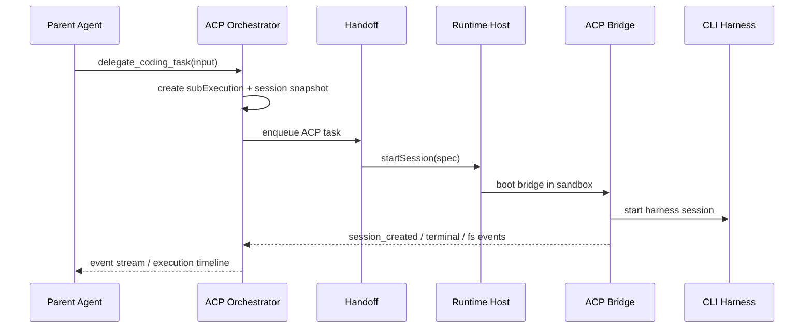
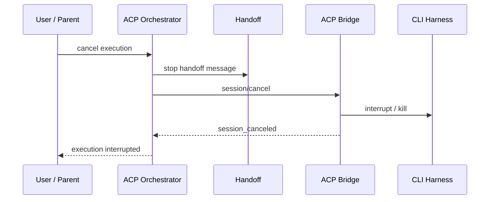

# 1. 方案定位

本文给出一套面向 Xpert 平台的 ACP 运行时方案，用于让 Xpert Agent 通过子 Agent 机制，在 sandbox 中异步调用 `codex cli`、`claude code cli` 等命令行工具执行复杂后端任务，并由平台统一管理执行过程、审计日志、取消控制与后续容器化部署。

这套方案的重点，不是“让主 Agent 直接拼 shell 命令调用 CLI”，而是把外部 CLI harness 升级成一种平台可治理的子运行时：

* 主 Agent 负责“委派”
* ACP 运行时负责“会话控制”
* sandbox 负责“隔离执行”
* handoff 负责“异步调度”
* 审计平面负责“留痕、回放、检索、合规”

一句话理解：

`Xpert Parent Agent -> ACP 子运行时 -> Sandbox 内 CLI Harness -> 平台统一审计与控制`

---

# 2. 目标与非目标

## 2.1 目标

* 支持 Xpert Agent 把编码、构建、测试、重构等任务委派给 `codex cli`、`claude code cli` 一类外部 coding agent。
* 支持子 Agent 在 sandbox 中异步执行，不阻塞主请求线程。
* 支持平台级审计，包括：
  * 谁发起了任务
  * 任务在哪个租户、组织、环境、项目、会话中运行
  * 执行了哪些终端命令
  * 改写了哪些文件
  * 是否触发了敏感操作或审批
  * 最终产物、diff、日志、错误、取消原因
* 支持统一取消、超时、重试、恢复、回放。
* 支持后续从本地 sandbox 平滑演进到 `docker container` 型 sandbox，而不重写上层编排逻辑。
* 支持未来接入更多 ACP-compatible harness，而不把平台绑定到单一 CLI。

## 2.2 非目标

* 不把 ACP 会话本身塞进普通 tool call 的一次性生命周期中。
* 不让主 Agent 自由拼接任意 shell 命令去“模拟”子 Agent。
* 不把 CLI harness 的权限控制完全外包给 harness 自己的 `approval mode` 或 `sandbox mode`。
* 不在第一期直接做强耦合的 Kubernetes 专用方案。

---

# 3. 外部参考与设计启发

## 3.1 OpenClaw 的可借鉴点

OpenClaw 在 ACP 场景上的设计有两个值得直接吸收的原则：

* 把 `ACP agent` 和平台原生 `sub-agent` 明确区分。
* 把会话、终端、文件系统和取消能力放在一个结构化协议层，而不是依赖 PTY 文本 scraping。

这意味着：

* 平台原生子 Agent 适合承载内部 Agent 协作。
* ACP 更适合承载外部 coding harness，如 Codex CLI、Claude Code CLI。

## 3.2 不能直接照抄 OpenClaw 的部分

OpenClaw 当前 ACP 更偏向 host-side runtime，重点是让 ACP client 与外部 harness 对接。

而 Xpert 的目标更强：

* 要求执行必须进入 sandbox
* 要求平台统一治理审计
* 要求未来支持 Docker container 版 sandbox

因此 Xpert 不能只在 API host 上起一个 ACP client，再远程调 CLI。更合理的方式是：

* 把 ACP bridge 放进 sandbox runtime host
* 把会话控制、权限、审计、取消放在 Xpert 的 control plane

换句话说，OpenClaw 给我们的是“协议与会话建模方式”，Xpert 需要补齐的是“平台治理与隔离执行层”。

---

# 4. 当前 Xpert 已有能力基础

Xpert 不是从零开始构建这套方案，当前代码里已经具备了非常好的底座。

## 4.1 异步 handoff 管道

当前 `handoff` 已经提供：

* 异步入队与消费
* `enqueueAndWait`
* 基于 `AbortSignal` 的协作式取消
* 跨实例 cancel
* queue lane / routing
* pending waiter 回调

这非常适合承载 ACP 子任务的后台执行。

## 4.2 Sandbox backend 抽象

当前 sandbox 协议已经抽象出：

* `execute(command, options)`
* `streamExecute(command, onLine, options)`
* 终端 session
* workspace binding
* `environmentId`
* provider registry

这意味着：

* 命令执行后端已经存在
* 文件与工作目录映射已经存在
* provider 扩展点已经存在
* Docker 化时可以保持上层协议不变

## 4.3 Agent 执行与子执行模型

当前 `XpertAgentExecution` 已经支持：

* `threadId`
* `checkpointNs`
* `checkpointId`
* `status`
* `parentId`
* `subExecutions`

这使得 ACP 子运行时可以自然映射为一种新的 `subExecution`，而不需要另起完全独立的任务模型。

## 4.4 前端流式与终端回放能力

当前平台已经有：

* `run stream` / SSE
* 终端组件
* sandbox terminal socket
* tool message timeline

因此用户侧查看执行过程、终端输出、回放结果的基础设施也已经具备。

---

# 5. 核心结论

最优架构不是：

* “给 Agent 一个 `sandbox_shell`，再让它自己调用 `codex` / `claude`”

而是：

* “把 `codex cli` / `claude code cli` 视为一种 ACP 子运行时，由平台托管其会话、异步任务、权限、审计和 sandbox 执行”

这套方案可以概括为：

* Control Plane：ACP Runtime Orchestrator
* Data Plane：Sandbox Runtime Host
* Audit Plane：事件日志、工件、检索、合规

---

# 6. 总体架构



## 6.1 Control Plane

负责：

* 创建 ACP 子执行
* 创建 / 恢复 / steering / 取消 ACP session
* 权限策略校验
* 审计事件归档
* 对前端暴露查询、流式订阅、回放能力

## 6.2 Data Plane

负责：

* 真正运行 sandbox
* 提供工作目录与 volume mount
* 提供文件系统、终端、命令执行能力
* 在 sandbox 中启动 ACP bridge 和具体 harness

## 6.3 Audit Plane

负责：

* 记录每一次会话和事件
* 存储文件变更、产物、diff、终端输出
* 提供可检索的审计日志
* 为后续审批、风控、计费、追责提供基础数据

---

# 7. 分层设计

## 7.1 第 1 层：Delegation Tool

主 Agent 不应直接获得“自由调用 Codex CLI”的能力，而应获得一个强类型的委派工具，例如：

```ts
type DelegateCodingTaskInput = {
  harnessType: 'codex' | 'claude_code' | 'custom_acp'
  sessionMode?: 'oneshot' | 'persistent'
  workspaceScope: 'xpert' | 'project' | 'environment'
  permissionProfile: 'read_only' | 'workspace_write' | 'full_exec'
  taskTitle: string
  prompt: string
  timeoutMs?: number
  metadata?: {
    targetPaths?: string[]
    expectedOutputs?: string[]
  }
}
```

这个工具只负责“发起子任务”，不直接暴露底层 shell。

这样有三个好处：

* 主 Agent 的调用意图是结构化的
* 平台可以在创建会话前做策略校验
* 后续更换 harness 或 host，不需要改模型提示和 tool schema

## 7.2 第 2 层：ACP Runtime Orchestrator

这是整个方案的中枢，建议放在 `packages/server-ai`。

它的职责包括：

* 将一次委派请求创建为 `runtimeKind=acp_session` 的子执行
* 分配 `sessionId`
* 关联 `threadId / parentExecutionId / environmentId / workspaceBinding`
* 将任务投递到 `handoff`
* 控制 ACP session 生命周期
* 把 bridge 输出转换为统一的执行事件

建议新增模块：

* `packages/server-ai/src/acp-runtime`

建议内部组成：

* `AcpRuntimeService`
* `AcpSessionService`
* `AcpAuditService`
* `AcpArtifactService`
* `AcpExecutionMapper`
* `AcpRuntimeController`
* `AcpRuntimeProcessor`

## 7.3 第 3 层：Runtime Host Provider

这里建议新增一个比 `SandboxProvider` 更高一层的抽象：

```ts
export interface IRuntimeHostProvider {
  type: 'local' | 'docker' | 'k8s'

  startSession(spec: AcpSessionStartSpec): Promise<RuntimeHostSession>
  resumeSession(sessionId: string): Promise<RuntimeHostSession | null>
  cancelSession(sessionId: string, reason?: string): Promise<void>
  destroySession(sessionId: string): Promise<void>
}
```

这个抽象的职责不是文件操作，而是：

* 在哪里放这个 runtime
* 用什么方式启动 bridge
* 如何管理生命周期

建议不要把它和 `SandboxProvider` 合并，原因是两者职责不同：

* `SandboxProvider` 管隔离环境与文件 / 命令接口
* `RuntimeHostProvider` 管会话宿主与进程生命周期

## 7.4 第 4 层：ACP Bridge

ACP bridge 是运行在 sandbox 内部的适配层。

它负责：

* 与平台控制面通信
* 执行 ACP `session/*`、`fs/*`、`terminal/*` 等调用
* 启动 / 驱动 `codex cli`、`claude code cli`
* 生成结构化事件流

建议短期和长期分两步：

### 短期

采用 `acpx` 风格 bridge/wrapper，先快速验证：

* session create
* prompt append
* fs and terminal proxy
* cancel
* event streaming

### 长期

沉淀为 `xpert-acp-bridge` 常驻守护进程，支持：

* 会话恢复
* 配置热更新
* 更稳定的多命令 / 多轮 steering
* 标准化审计事件

## 7.5 第 5 层：Harness Adapter

桥接层下面接不同 harness adapter：

* `CodexCliAdapter`
* `ClaudeCodeCliAdapter`
* `CustomAcpAdapter`

统一接口建议如下：

```ts
export interface IHarnessAdapter {
  type: 'codex' | 'claude_code' | 'custom_acp'

  start(spec: HarnessStartSpec): Promise<HarnessHandle>
  appendPrompt(handle: HarnessHandle, prompt: string): Promise<void>
  cancel(handle: HarnessHandle): Promise<void>
  collectResult(handle: HarnessHandle): Promise<HarnessResult>
}
```

这层只解决“怎么和具体 CLI 说话”，不解决平台侧的队列、审计和权限。

---

# 8. 子 Agent 机制设计

## 8.1 为什么需要显式子 Agent

这里的“子 Agent”不是指 LLM 在提示词里说一句“我让另一个助手来做”，而是平台运行时上的正式子执行对象。

只有这样，平台才能正确管理：

* 父子关系
* 审计归属
* 取消传播
* UI 展示
* 资源配额
* 计费和风控

## 8.2 建议的运行时分类

建议在 shared contract 里新增显式字段：

```ts
export type TRuntimeKind = 'native_agent' | 'acp_session' | 'workflow'

export type THarnessType = 'codex' | 'claude_code' | 'custom_acp'

export type TSessionMode = 'oneshot' | 'persistent'

export type TPermissionProfile = 'read_only' | 'workspace_write' | 'full_exec'

export type TRuntimeHostKind = 'local' | 'docker' | 'k8s'
```

这样后续做筛选、展示、统计、路由时，不需要从标题、名称或文案猜含义。

## 8.3 与 `XpertAgentExecution` 的映射

建议把 ACP 子运行时作为一类新的 `subExecution`：

```ts
type TAcpRuntimeExecutionMetadata = {
  runtimeKind: 'acp_session'
  harnessType: THarnessType
  sessionMode: TSessionMode
  permissionProfile: TPermissionProfile
  runtimeHostKind: TRuntimeHostKind
  sessionId: string
  workspacePath?: string
  environmentId?: string | null
}
```

执行关系：

* 父执行：主 Xpert Agent
* 子执行：ACP session
* 子执行下继续产生 timeline events / terminal events / artifact records

状态传播规则：

* 父执行取消时，自动传播到子 ACP session
* 子执行失败时，父执行可根据策略决定：
  * 继续
  * 回退
  * 请求用户确认
  * 终止当前主流程

---

# 9. 数据模型建议

## 9.1 会话表

建议新增 `acp_session` 实体，承载会话快照。

建议字段：

* `id`
* `tenantId`
* `organizationId`
* `userId`
* `parentExecutionId`
* `executionId`
* `threadId`
* `harnessType`
* `sessionMode`
* `permissionProfile`
* `runtimeHostKind`
* `sandboxProvider`
* `environmentId`
* `workspaceRoot`
* `workingDirectory`
* `status`
* `startedAt`
* `endedAt`
* `canceledAt`
* `cancelReason`
* `summary`
* `error`

这张表存“当前状态快照”，用于：

* 查询当前 session 状态
* 列表展示
* 运行恢复
* 运营与审计概览

## 9.2 事件表

建议新增 append-only 事件表 `acp_session_event`。

```ts
type TAcpSessionEventType =
  | 'session_created'
  | 'session_resumed'
  | 'prompt_appended'
  | 'tool_call'
  | 'tool_result'
  | 'terminal_created'
  | 'terminal_output'
  | 'terminal_exit'
  | 'fs_read'
  | 'fs_write'
  | 'fs_delete'
  | 'diff_generated'
  | 'artifact_created'
  | 'approval_requested'
  | 'approval_resolved'
  | 'session_canceled'
  | 'session_completed'
  | 'session_failed'
```

建议字段：

* `id`
* `sessionId`
* `executionId`
* `parentExecutionId`
* `eventType`
* `occurredAt`
* `actorType`
* `actorId`
* `sequence`
* `payload`
* `redactedPayload`

这张表承担：

* 审计日志
* 回放
* 问题排查
* 统计分析

## 9.3 工件表

建议新增 `acp_artifact`：

* `diff`
* `patch`
* `stdout`
* `stderr`
* `file_snapshot`
* `test_report`
* `build_report`
* `generated_file`

建议字段：

* `id`
* `sessionId`
* `executionId`
* `kind`
* `path`
* `contentType`
* `storageUri`
* `size`
* `checksum`
* `metadata`

工件不要全塞在执行表里，否则会影响查询性能和归档策略。

---

# 10. 审计模型

## 10.1 审计原则

平台审计必须是“平台主导”，不能只信任 harness 自报。

需要同时记录三类信息：

* 意图层：是谁发起、为什么发起、请求了什么任务
* 执行层：会话做了什么、调用了什么 terminal / fs / tool
* 结果层：产物是什么、改了什么、是否成功、为什么失败

## 10.2 审计粒度建议

至少记录：

* 委派请求内容摘要
* session 创建参数
* permissionProfile
* sandbox provider / runtime host
* 每次 prompt append
* 每次 terminal create / close / kill
* 每次文件写入、删除、重命名
* 每次 diff / patch 生成
* 每次审批请求与审批结果
* 最终 summary、退出码、失败原因、取消原因

## 10.3 敏感信息处理

审计要做双轨：

* 原始 payload：仅高权限可见，支持合规取证
* 脱敏 payload：默认展示

需要平台统一脱敏的字段包括：

* token
* secret
* private key
* cookie
* authorization header
* 用户输入中的凭据片段

## 10.4 检索与可观测性

建议未来把审计事件同步到可检索存储，例如：

* ClickHouse
* Elasticsearch / OpenSearch

典型查询维度：

* 按租户 / 组织 / 用户
* 按 harnessType
* 按 session status
* 按 environmentId
* 按触发了哪些文件写入
* 按审批和敏感操作

---

# 11. 权限与安全

## 11.1 平台权限优先于 harness 权限

不能把权限控制完全交给 Codex 或 Claude 自己。

平台必须先在控制面判断：

* 当前用户是否允许发起 ACP 子 Agent
* 当前 Xpert 是否允许使用指定 harness
* 当前环境是否允许写文件 / 执行命令 / 联网
* 当前任务是否需要审批

平台通过后，才允许 bridge 创建 session。

## 11.2 Permission Profile

建议统一成平台可识别的权限画像：

* `read_only`
  * 允许读文件
  * 允许有限终端命令
  * 禁止文件写入
* `workspace_write`
  * 允许在 workspace 内写文件
  * 允许测试、构建、格式化
  * 禁止越界路径
* `full_exec`
  * 用于管理员或受控环境
  * 允许更完整的命令能力
  * 仍然受 sandbox 网络和 volume 策略约束

## 11.3 审批点

建议平台级审批点包括：

* 写入受保护路径
* 删除大量文件
* 执行 package install
* 网络访问外部源
* 提交代码、推送分支
* 读取或注入敏感 secret

审批必须作为平台事件进入审计链，而不是只存在 harness 终端提示中。

## 11.4 Secret 注入

不要把所有 secret 直接注入到 CLI 进程环境中。

建议采用：

* 按 environment / project / tenant 分层管理 secret
* 只给 session 注入明确声明的 secret
* 注入行为记审计事件
* 会话结束自动销毁临时 token 或临时文件

---

# 12. 与 Sandbox 的职责边界

## 12.1 Sandbox Provider 继续负责什么

继续负责：

* 工作目录
* 文件访问
* 命令执行
* 终端交互
* volume mount
* workspace binding

## 12.2 ACP Runtime 不负责什么

不直接负责：

* volume 目录解析
* 宿主文件系统实现
* 容器生命周期的底层细节

它只关心：

* 会话语义
* harness 语义
* 平台治理

## 12.3 为什么这层边界很重要

未来从本地 shell 迁移到 Docker container 时：

* sandbox provider 可以换
* runtime host provider 可以换
* ACP orchestration 和审计模型不必跟着重写

这是整个方案保持灵活扩展的关键。

---

# 13. Runtime Host 设计

## 13.1 Local Host

第一期建议先支持 `local`：

* 复用现有 `LocalShellSandboxProvider`
* bridge 进程与 CLI harness 运行在本地 sandbox workspace
* 快速验证 ACP session、事件流、审计模型

优点：

* 实现快
* 与现有代码耦合最小
* 便于联调

局限：

* 隔离强度有限
* 资源治理较弱

## 13.2 Docker Host

第二期引入 `docker` 型 `RuntimeHostProvider`。

每个 session/container 建议具备：

* 固定镜像版本
* 只读基础镜像层
* 映射的 workspace volume
* 网络出口策略
* CPU / memory 限制
* idle TTL
* 自动 GC
* sidecar 或 stdout shipper

建议镜像内包含：

* ACP bridge
* 对应 harness adapter
* 必要的 runtime 依赖

## 13.3 K8s Host

第三期如果需要更高规模和隔离，可以引入 `k8s`：

* 一个 session 对应一个 job / pod
* 通过持久卷或对象存储保存工件
* 仍保持上层 ACP orchestration 不变

---

# 14. 典型时序

## 14.1 发起子任务



## 14.2 取消任务



---

# 15. API 设计建议

## 15.1 对主 Agent 暴露的委派接口

这是内部能力，不一定直接暴露给外部 REST，但需要稳定 command / DTO。

```ts
class CreateAcpSubExecutionCommand {
  parentExecutionId: string
  parentThreadId: string
  xpertId: string
  harnessType: THarnessType
  sessionMode: TSessionMode
  permissionProfile: TPermissionProfile
  environmentId?: string
  projectId?: string
  prompt: string
  taskTitle: string
}
```

## 15.2 平台对外 REST

建议新增：

* `POST /api/acp/sessions`
  * 创建 session
* `GET /api/acp/sessions/:id`
  * 查询 session 快照
* `GET /api/acp/sessions/:id/events`
  * 查询事件流
* `POST /api/acp/sessions/:id/prompts`
  * 追加 prompt / steering
* `POST /api/acp/sessions/:id/cancel`
  * 取消 session
* `GET /api/acp/sessions/:id/artifacts`
  * 查询产物
* `GET /api/acp/sessions/:id/audit`
  * 查询审计日志

## 15.3 与现有 `/api/ai/thread/.../runs/...` 的关系

建议不要另起一套完全平行的运行时世界。

更合理的方式是：

* ACP session 作为 `run` 的一种子执行类型
* 主 run 仍然是现有 `thread / run / execution` 体系
* ACP 只补充专属查询接口，用于 session 级控制和审计明细

---

# 16. 前端展示建议

## 16.1 在主执行时间线中展示子执行

建议在现有 execution panel 中新增一类节点：

* `ACP Session`

显示内容：

* harness 名称
* 当前状态
* 权限画像
* 所在 sandbox / environment
* 开始时间 / 耗时
* summary

## 16.2 终端与文件改动回放

建议 session 详情页提供三个主视图：

* Timeline
* Terminal Replay
* File Changes / Artifacts

其中：

* Timeline 展示结构化事件
* Terminal Replay 展示终端输出
* File Changes 展示 diff、patch、文件快照

## 16.3 审计视图

面向管理员增加：

* 按租户 / 组织 / 用户检索
* 按 harness / 环境 / 权限画像筛选
* 按敏感操作和审批状态筛选

---

# 17. 实施路径

## 17.1 Phase 1：最小可用版本

目标：

* 打通 `delegate_coding_task -> subExecution -> handoff -> local sandbox -> bridge -> CLI`
* 支持单次 `oneshot` 任务
* 支持取消
* 支持审计事件落表
* 支持终端输出回放

范围建议：

* `runtimeHostKind=local`
* `harnessType=codex | claude_code`
* `sessionMode=oneshot`
* `permissionProfile=workspace_write`

## 17.2 Phase 2：持久会话与 steering

目标：

* 支持 `persistent session`
* 支持追加 prompt
* 支持恢复和重新加入 session
* 支持更多结构化事件

## 17.3 Phase 3：Docker Host

目标：

* 引入 `RuntimeHostProvider(docker)`
* 容器级资源与网络策略
* secret 注入规范化
* 更强隔离与可移植性

## 17.4 Phase 4：平台治理完善

目标：

* 审批流
* 风险规则
* 审计检索
* 使用量与成本统计
* 多 harness 策略路由

---

# 18. 为什么这套方案是“灵活扩展”的

它的扩展性来自四个维度的解耦：

## 18.1 harness 可替换

接入 `codex cli` 还是 `claude code cli`，只影响 adapter，不影响控制面。

## 18.2 宿主可替换

从 `local` 到 `docker` 到 `k8s`，只影响 runtime host provider，不影响 ACP 会话模型。

## 18.3 sandbox 可替换

本地 volume、容器 volume、远程安全沙箱都可以继续走现有 sandbox provider 思路。

## 18.4 UI 可演进

因为底层是结构化事件和工件，而不是 PTY 原始字符流，所以：

* 可以做审计页
* 可以做执行回放
* 可以做 diff 视图
* 可以做审批面板

---

# 19. 建议新增的共享契约

建议在 `packages/contracts` 中新增或扩展以下模型：

* `TAcpSession`
* `TAcpSessionEvent`
* `TAcpArtifact`
* `TRuntimeKind`
* `THarnessType`
* `TSessionMode`
* `TPermissionProfile`
* `TRuntimeHostKind`

建议在 `packages/server-ai` 中新增以下模块：

* `acp-runtime`
* `acp-audit`
* `acp-artifact`
* `runtime-host`

建议在 `packages/plugin-sdk` 中新增以下协议：

* `IRuntimeHostProvider`
* `IHarnessAdapter`

---

# 20. 一句话结论

对 Xpert 来说，最佳方案不是把 `codex cli`、`claude code cli` 当成普通 shell 命令，而是把它们抽象成平台可治理的 ACP 子运行时：由 handoff 管异步，由 sandbox 管隔离，由 runtime host 管宿主，由审计平面统一留痕与合规，这样才能同时满足扩展性、可运维性和未来 Docker 化演进。
