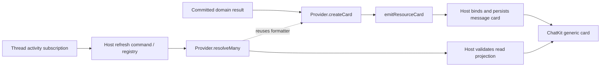

# Conversation Resource Cards

A Resource Card is a persisted receipt for a business resource. File Artifacts remain the content/version/sharing model. Creating a scheduler or Project does not create an empty Artifact. A card may include `resource.artifactId` when it represents an existing file Artifact.

## Ownership and lifecycle

| Layer                        | Responsibility                                                                                                                |
| ---------------------------- | ----------------------------------------------------------------------------------------------------------------------------- |
| Domain service / Runtime     | Commit business changes and execution facts; own authorization, decisions and revisions.                                      |
| Plugin ResourceCard Provider | Construct the initial card and resolve its current, authorized presentation using the same formatter.                         |
| Tool / middleware            | Emit the card after the business commit, using the active RunnableConfig.                                                     |
| Host                         | Persist and bind the card to the actual reply; discover providers, batch refreshes, validate identities and isolate failures. |
| ChatKit / Workbench          | Render and reconcile generic cards; authorize navigation through the registered View.                                         |

`createCard()` is a plugin-owned typed method, not an additional SDK interface or
registry operation. Only `resolveMany()` is standardized, and registering a
Provider remains optional. A static card does not need a Provider. Providers
format and read facts; they do not become the owner of business state.



## Emit after a successful tool mutation

```ts
import { emitResourceCard } from '@xpert-ai/plugin-sdk'

const task = await tasks.create(input)
try {
  await emitResourceCard(
    {
      resource: { namespace: 'platform', type: 'scheduled-task', id: task.id },
      title: task.name,
      description: `${task.scheduleDescription} · ${task.timeZone || 'UTC'}`,
      icon: { type: 'emoji', value: '◷' },
      open: {
        target: 'workbench.view',
        viewKey: 'platform.scheduler__detail',
        selectionId: task.id
      }
    },
    runnableConfig
  )
} catch (error) {
  logger.warn('Task created; resource receipt delivery failed', error)
}
return task
```

Tools, middleware and plugin code can use the same helper inside an active Agent run. Pass its RunnableConfig to preserve callback context. The helper dispatches `ON_CHAT_EVENT`; the host binds the actual reply and execution, normalizes to a `MESSAGE` event and persists `type: 'resource_card'` content before forwarding. Emitters cannot choose message ownership. A presentation failure must not report a committed business mutation as failed or trigger another creation.

`resource.namespace + resource.type + resource.id` identifies the receipt **within a single reply**. Re-emitting replaces its snapshot at the same position. Other replies keep their own snapshots. The canonical part ID is produced by `resourceCardId`; callers should not concatenate an ID themselves. Text extraction and model history exclude these parts. Branches retain the content with their owning messages, and history loading never triggers navigation.

Targets are an allowlisted JSON protocol:

- `workbench.view`: required `viewKey`, optional `selectionId`, optional `parameters` containing scalars or scalar arrays.
- `assistant.project`: additionally requires the **platform Project ID** in `projectId`, and a `viewKey`.

Targets cannot contain URLs, scripts or arbitrary client commands. Icons use the existing sanitized SVG, emoji or font renderer. Navigation and resource queries still pass through the host's View availability and access checks. An unavailable Workbench, missing View or denied/deleted resource produces feedback instead of an automatic fallback.

By default the card title/description is a snapshot. Opening loads current business state. Types that register the optional ResourceCard Provider below opt in to live refresh while a conversation is observed. Explicit scheduler-card navigation remembers the selected task per conversation and supports browser refresh/back/forward.

## Optional live resource state

Plugins can opt exact resource types into live refresh with `ResourceCardProvider`
and `IResourceCardProvider`. Existing emitters need no change. Register the class
in the plugin module's `providers`; the host discovers it through the existing
StrategyBus lifecycle. Do not register a CQRS handler or a registry in the plugin.

```ts
import { Injectable } from '@nestjs/common'
import type { ConversationResourceCard } from '@xpert-ai/contracts'
import {
  ResourceCardProvider,
  type IResourceCardProvider,
  type ResourceCardContext,
  type ResourceCardReadRequest,
  type ResourceCardResolution
} from '@xpert-ai/plugin-sdk'

@Injectable()
@ResourceCardProvider({ namespace: 'my-plugin', type: 'report' })
export class ReportCardProvider implements IResourceCardProvider {
  constructor(private readonly reports: ReportsService) {}

  createCard(report: { id: string; title: string; description: string }): ConversationResourceCard {
    return {
      resource: { namespace: 'my-plugin', type: 'report', id: report.id },
      title: report.title,
      description: report.description,
      open: { target: 'workbench.view', viewKey: 'my-plugin__reports', selectionId: report.id }
    }
  }

  async resolveMany(
    context: ResourceCardContext,
    requests: readonly ResourceCardReadRequest[]
  ): Promise<ResourceCardResolution[]> {
    // ReportsService is the plugin's domain service. This read must enforce
    // tenant, organization, user and resource access and honor context.signal.
    const summaries = await this.reports.readAuthorizedSummaries(context, [
      ...new Set(requests.map(({ card }) => card.resource.id))
    ])
    return requests.map(({ key, card }) => {
      const summary = summaries.get(card.resource.id)
      return summary === undefined
        ? { key, status: 'unavailable', reason: 'forbidden' }
        : {
            key,
            status: 'resolved',
            card: this.createCard({ id: card.resource.id, title: card.title, description: summary })
          }
    })
  }
}
```

The decorator accepts multiple `{ namespace, type }` arguments. Each pair belongs
to one provider owner across installation scopes; another plugin cannot shadow
it. Same-plugin instances follow the existing organization, tenant, system and
builtin scope resolution. Refresh/uninstall removes that installation's routes.

Keep initial card construction in the same provider (for example, a typed
`createCard()` method), and reuse it from both tool receipts and `resolveMany()`.
Creation inputs belong to the plugin; the SDK only standardizes the optional
refresh contract. Tools remain responsible for emitting the returned card with
`emitResourceCard(provider.createCard(committedResult), runnableConfig)` after
the business commit, and isolating emission failures as in the first example.

The host calls `resolveMany` once per matched provider per snapshot, only for
cards already present in the authorized conversation. Context identity comes
from the host; `projectId` is optional. Requests include persisted message and
execution bindings for resources that require those association checks. Echo
`key` unchanged and return one result per request, including repeated resources
in different messages. Missing resources return `not_found`; denied resources
return `forbidden`. Do not return private diagnostics in presentation data.

Providers only read durable business state. Do not start jobs, decide acceptance,
write message history or poll a Computer CLI for each viewer. Use batched reads.
The host applies a two-second deadline and abort signal per provider, validates
returned card/resource identities, and supplies the original message bindings.
Invalid, missing, duplicated or failed responses receive a generic refresh
failure description; unavailable results receive a localized unavailable
message. Other providers and run discovery continue. Ignore late results and
honor the abort signal in cancellable I/O; the host cannot forcibly stop plugin
code or an uncancellable database call.

Live projections are viewer-specific and do not rewrite stored receipts or
create new cards. Removing the provider falls back to the saved receipt; clicking
still uses the View's access checks. Card navigation and result payloads keep the
existing ChatKit protocol. The updated ChatKit UI displays all committed cards
during streaming, without business-namespace-specific presentation branches.

The host has one `RefreshConversationResourceCardsCommand` handler in the message
module. `ThreadActivityService` supplies references; the handler dispatches
through `ResourceCardProviderRegistry`. The built-in Project Task Provider uses
this same path and retains its task, invocation and pinned-review checks.

## Implemented scope and release boundary

The optional Provider path covers creation, persisted message binding, scoped
registration/replacement/removal, authorized batched refresh, failure isolation
and generic ChatKit display/navigation. `ProjectTaskCardProvider` is the built-in
implementation: delegation and refresh both call its `createCard()`; task
creation emits only a tool step, and each implementation/review attempt emits
its own execution card. Runtime success is distinct from business acceptance.

This is not a custom React/component extension API. A plugin supplies the shared
card data and a registered View target. Independent execution viewers remain
separate features. Activity currently polls full snapshots; there is no generic
card outbox, pagination or reconstruction of missing historical receipts.
Transactional first-conversation Project receipts below have their own durable
attachment mechanism; ordinary `emitResourceCard` does not inherit it.

Deploy the updated host/plugin SDK and matching ChatKit app assets together.
Local builds or copied app assets do not publish npm packages. After deployment,
reload the host once, then test a fresh delegation without refreshing during
execution: one card appears, its status updates, and the resumed Agent reply
streams automatically. Test Provider registration/refresh/removal with a
non-project fixture separately; a Project Task run alone does not prove an
external plugin's installation lifecycle.

## Transactional first-conversation Project receipts

Implement the public `IProjectTypeProvider.createForConversation` interface and return optional `resourceCards` along with the managed state:

```ts
async createForConversation(context, input) {
  const bid = await input.transaction.save(makeBid({
    platformProjectId: input.projectId,
    title: input.name
  }))
  return {
    name: bid.title,
    status: 'active',
    viewKey: 'bid__projects', // Existing business entry remains independent.
    selectionId: bid.id,
    resourceCards: [{
      resource: { namespace: 'platform', type: 'project', id: input.projectId },
      title: bid.title,
      open: {
        target: 'assistant.project',
        projectId: input.projectId,
        viewKey: 'platform.project-tasks__timeline'
      }
    }]
  }
}
```

The host validates the target against `input.projectId`. It stores pending receipts in `Project.settings.conversationBootstrap` in the same transaction as the business write and conversation binding. `ProjectResourceCardService` locks the Project, then atomically updates the first Assistant message and `resourceCardMessageId`. Streaming begins after commit. A failed attachment leaves a pending receipt; competing first sends claim it once. Manual Project creation has no conversation receipt.

Do not emit directly inside the creation transaction: an event would escape a rollback. Plugins returning no receipts keep existing behavior.

## Scheduler example

`SchedulerAgentMiddleware` declares the `scheduler` Feature. `SchedulerDetailViewProvider` contributes the on-demand `platform.scheduler__detail` View using the built Remote Component assets. Its selection is the stable task ID. Data/actions call existing task access, update, pause and resume services; execution navigation verifies the conversation belongs to that task. Existing cron parsing and other scheduler tools are unchanged.

While the detail View stays open, switching tasks retains each unsaved form draft in memory. Saving commits through the existing service; drafts are not background-saved or polled.

Build assets with:

```sh
corepack pnpm exec tsc -p packages/server-ai/src/xpert-task/remote-components/scheduler-detail/tsconfig.json --noEmit
node packages/server-ai/src/xpert-task/remote-components/scheduler-detail/build.mjs
node packages/server-ai/src/xpert-task/remote-components/scheduler-detail/build.mjs --check
corepack pnpm remote-view:preview --config packages/server-ai/src/xpert-task/remote-components/scheduler-detail/preview.config.mjs --port 4325
```

The preview explicitly uses fixture data, not a live scheduler.

## Coordinated dependency rollout

1. Build/release ChatKit types and Xpert SDK message contracts.
2. Build/release ChatKit UI and wrappers together. Verify the iframe assets contain `resource_card` handling.
3. Build/release platform contracts and plugin-sdk, then update the platform's single ChatKit catalog and SDK dependency/lockfile to those actual published versions.
4. Build Bid against that public plugin-sdk (no local decorator/interface shim), run `verify:dist`, then deploy the matching host and plugin.

This change prepares changesets; it does not publish packages or deploy production. Platform contracts re-export the shared ChatKit resource-card protocol; keep the deployed types and UI compatible. Local Bid workspace overrides resolve the sibling built contracts/plugin-sdk. Do not describe a source alias or preview as a deployed package upgrade.

Existing message JSON is additive and needs no migration, new Artifact table or historical backfill.

## Agent task results

Browser views import result schemas and types from `@xpert-ai/plugin-sdk/agent-results`.
This public entry only exports portable result contracts and Zod validation; the SDK root also exports server dependencies.
Do not reach into another package's `src` directory or import the server SDK root from a browser bundle.

`emitResourceCard(card, runnableConfig)` emits the existing ChatKit `resource_card` contract. It does not create an Artifact or grant access to one. Emit after the referenced business object has been committed.

```ts
await emitResourceCard(
  {
    resource: { namespace: 'my-plugin', type: 'report', id: report.id },
    title: report.title,
    open: { target: 'workbench.view', viewKey: 'my-plugin__reports', selectionId: report.id }
  },
  config
)
```

Use stable namespace/type/id values. Repeated observations update the same card in the current reply. The host supplies `messageId` and `executionId`, persists the card, and excludes it from model/transcript text. Callers cannot choose another reply. The registered View must recheck authorization on every read and file download. Do not put credentials, arbitrary URLs, commands, or private paths in navigation parameters.

Task results use the provider-neutral `AgentResultItem` union: analysis, changes, tests, and explicitly declared file deliverables. File delivery defaults to `none`; `files` exports only the declared files and `archive` packages only an explicit selection. Export failure is recorded separately from task execution. A card for an exported artifact refers to the committed artifact and opens the authorized task results View.

New artifact references must include the committed `versionId`. The task-results View will not download older references without a pinned version: falling back to the current artifact version could deliver unrelated later content. Such task results remain readable.

Middleware using the host task-results View declares `AGENT_TASK_RESULTS_FEATURE` in `meta.features`. The View uses `AGENT_WORKBENCH_SLOT`, opens on demand, and declares support for selection and parameter queries. Other plugins should register their own governed View and feature; emitting a card alone does not activate a View.

Local rollout requires the matching ChatKit types/UI with resource-card support, then host contracts/SDK/server, then consuming plugins. Building a local SDK does not publish a new registry package.

`api:build` builds the task-results browser bundle before copying its assets. For a source-run API, first run `corepack pnpm nx run api:build-agent-results`. Generated `app.js` and `app.css` are ignored; commit the source and build configuration only.

## Coding invocation cards and activity

The built-in `platform.agent-invocation/execution` provider owns direct Coding invocation card creation and refresh. Runtime middleware requests the card through the optional `AgentInvocationApi.getResourceCard()` after start. Project dispatch keeps its existing `platform.project-tasks/execution` identity and does not emit a second generic card.

The card opens `platform.coding-execution__execution` with the exact invocation ID. Public CLI activity is written through the optional Runtime `context.activity` recorder and queried by the View provider. Resource-card refresh contains only presentation/state/target updates; it does not transport command output or invoke a CLI. Final summary cards are suppressed only when a Coding execution card already covers the run; independently delivered files retain their own cards.

See [Coding Execution View](../server-ai/src/agent-invocation/execution-view/README.md) for the capability, authorization, storage, retention and navigation contract.
