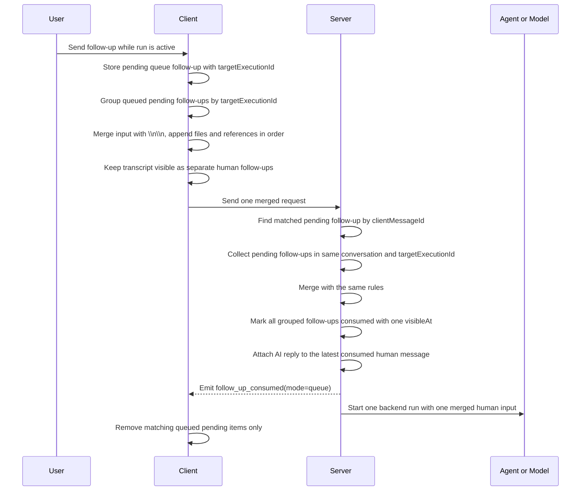
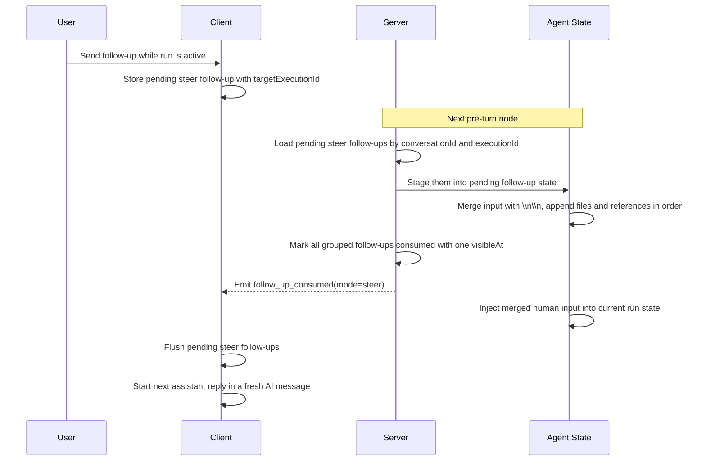

# Chat

`ChatMessageTypeEnum` 定义了所有的消息类型，主要分为以下几类：

- `ChatMessageTypeEnum.MESSAGE`：消息，需要持久化在对话消息列表中的消息。
- `ChatMessageTypeEnum.EVENT`：事件，临时事件消息，不需要持久化在对话消息列表中。

## Step message

每个步骤消息的类型定义为 `TChatMessageStep`。

- 第一级分类是 `type` 类型为 `ChatMessageStepType`： 是对消息隶属于哪种 Canvas 类型，包括 `ComputerUse` `File` 和 `Notice`。
- 第二级分类是 `category` 类型为 `ChatMessageStepCategory`： 是觉得消息以何种组件的形式展示，大概有 `WebSearch` `Files` `Program` 和 `Memory` 等类型。

剩下的就是消息的详细信息，如：

- toolset 工具集名称
- tool 工具名称
- title 标题
- message 消息
- created_date 创建日期
- data 具体消息的数据，格式跟随工具类型。

工具内发出的消息要对应这些分类，这些分类最终对应到前端展示的组件，如果有未能满足的类型则需要添加。


### How to add step messages ?

如果需要在工具执行内发出执行步骤消息，可以通过 `dispatchCustomEvent` 来发出步骤消息事件。此事件会被截获保存到消息里，同时实时传递到前端展示。

在工具中发出自定义事件如下代码：

```javascript
// Tool message event
dispatchCustomEvent(ChatMessageEventTypeEnum.ON_TOOL_MESSAGE, {
    type: ChatMessageStepType.ComputerUse,
    toolset: 'planning',
    tool: 'create_plan',
    title: `Creating tasks`, // Short title
    message: _.tasks.map((_) => _.name).join('\n\n'), // Details message
    data: {
        title: 'Tasks',
        steps: _.tasks.map((_) => ({..._, content: _.name,}))
    }
}).catch((err) => {
    console.error(err)
})
```

## Component message

组件消息，需要在 AI 消息中展示为复杂组件的消息类型，可以表达结构化的信息。

组件消息的类型定义为 `TMessageContentComponent`， 具体的组件定义为 `TMessageComponent` 其

- 一级分类为 `category`: 'Dashboard' | 'Computer' | 'Tool'
- 二级分类为 `type`: string

目前组件消息是通过 `configurable` 中的 `subscriber` 发出去的。首先需要在工具中通过 `config` 参数获得 `configurable` 然后拿到 `subscriber` 对象，
调用 `next` 方法发出具体消息。

```typescript
async function tool(_, config) => {
    const { configurable } = config ?? {}
    const { subscriber } = configurable ?? {}

    subscriber?.next({
        data: {
            type: ChatMessageTypeEnum.MESSAGE,
            data: {
                id: shortuuid(),
                type: 'component',
                data: {
                    category: 'Computer',
                    type: 'iframe',
                    url: indexFile
                } as TMessageComponent<TMessageComponentIframe>
            }
        }
    } as MessageEvent)
}
```

## Event Message

当消息类型为 **Event** 时，需要设置 event 类型为 `ChatMessageEventTypeEnum`，并且需要设置代表具体数据的 `data` 字段。

使用如下代码片段发出类型为 `ON_CHAT_EVENT` 的事件消息：

```typescript
// Rxjs 的方式
subscriber.next({
    data: {
        type: ChatMessageTypeEnum.EVENT,
        event: ChatMessageEventTypeEnum.ON_CHAT_EVENT,
        data: {
            ...data,
            agentKey: rest.metadata.agentKey
        }
    }
} as MessageEvent)

// CustomEvent 的方式
await dispatchCustomEvent(ChatMessageEventTypeEnum.ON_CHAT_EVENT, {
    id: `sandbox-ready-${userId || RequestContext.currentUserId()}`,
    title: t('server-ai:Sandbox.Starting'),
    status: 'running',
    created_date: new Date().toISOString(),
} as TChatEventMessage)
await new Promise((resolve) => setTimeout(resolve, 2000))
await dispatchCustomEvent(ChatMessageEventTypeEnum.ON_CHAT_EVENT, {
    id: `sandbox-ready-${userId || RequestContext.currentUserId()}`,
    title: t('server-ai:Sandbox.Ready'),
    status: 'success',
    end_date: new Date().toISOString(),
} as TChatEventMessage)
```

## Follow-up merge and consumed event

`follow_up_consumed` 事件现在区分 `queue` 和 `steer` 两种模式：

- `mode: 'queue'`：表示 queued follow-up 已经在发送阶段被成组消费，客户端只需要移除对应的 pending follow-up。
- `mode: 'steer'`：表示 steer follow-up 已经在 pre-turn 阶段被注入当前运行的 state，客户端除了移除 pending follow-up，还需要让下一段 assistant 回复开启新的 AI message。

之所以从只支持 `steer` 扩展为 `mode: 'queue' | 'steer'`，是因为 queue 路径现在也支持“同一运行内的 follow-up 合并消费”，服务端会发出同一个 `follow_up_consumed` 事件。

### Queue follow-up merged send



### Steer follow-up pre-turn consume



### Merge rules

- Merge boundary: same conversation and same active `targetExecutionId`.
- Keep created-time order stable.
- `input`: join non-empty strings with `\n\n`.
- `files`: concatenate in order.
- `references`: concatenate in order.
- Other human-input fields: later values override earlier values.
- Visible transcript stays as individual follow-up messages; only backend run creation and model input are merged.

### What will not merge

- Follow-ups from different `targetExecutionId` values.
- Follow-ups from different conversations.
- Follow-ups with different modes (`queue` and `steer` never merge with each other).
- Messages that are not in `pending` status.
- Queued follow-ups without a usable `targetExecutionId`; these are sent individually by default.
